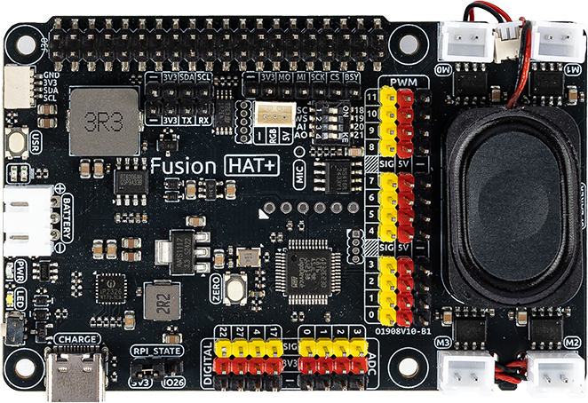

Fusion HAT+
=====================================

   

Der Fusion HAT+ ist ein leistungsstarkes und vielseitiges Erweiterungsboard, das einen Raspberry Pi mit minimalem Aufwand in einen voll funktionsfähigen Roboter verwandelt. Gleichzeitig eignet es sich hervorragend für anspruchsvolle Automatisierungsprojekte.  

Im Zentrum des Fusion HAT+ befindet sich ein integrierter Mikrocontroller (MCU), der die native Funktionalität des Raspberry Pi erheblich erweitert. Er stellt zusätzliche PWM-Ausgänge sowie ADC-Eingänge bereit – Funktionen, die standardmäßig auf den meisten Raspberry-Pi-Modellen fehlen. Dadurch können Entwickler Motoren präziser steuern und Sensoren nahtlos einbinden.  

Kompakt in den Abmessungen, aber reich an Funktionen, integriert der Fusion HAT+ vier Motortreiber-Chips, die die unabhängige Ansteuerung von bis zu vier Gleichstrommotoren ermöglichen. Zudem verfügt er über ein digitales I2S-Audiomodul sowie einen integrierten Mono-Lautsprecher, wodurch hochwertige Audiowiedergabe und interaktive Soundeffekte direkt vom Board möglich sind.  

Die Spannungsversorgung erfolgt über einen 3-poligen XH2.54-Anschluss mit einer Eingangsleistung von 6,0 V bis 8,4 V. Darüber hinaus bietet das Board zwei Power-LEDs zur Überwachung des Systemstatus, eine benutzerprogrammierbare LED für individuelle Signalisierungen sowie praktische Onboard-Tasten zur sofortigen Funktionsprüfung oder zur Simulation von Eingaben – was die Entwicklung und Fehlersuche deutlich effizienter und anwenderfreundlicher macht.  

Ausführliche Anleitungen findest du unter: |link_fusion_hat|.
