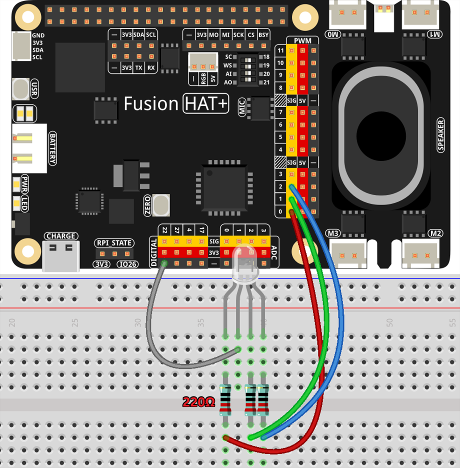

Voice-Activated Smart Lamp Control
======================================

In this example, we combine speech recognition, text-to-speech synthesis, and IoT device control to create a voice-interactive smart lamp. Users can change the color of an RGB lamp using voice commands while receiving friendly audio feedback.

This project is not only fun but also demonstrates the potential of GPT models in smart home applications.

----------------------------------------------

**Features**

The project includes the following features:

* **Voice Input**: Capture user voice commands via a microphone and convert them to text.
* **GPT Response Generation**: Use GPT to interpret user intent and return both lamp color and audio feedback.
* **RGB Lamp Control**: Adjust the color of an RGB lamp based on the RGB values returned by GPT.
* **Audio Feedback**: Convert GPT’s text response into speech and play it for the user.

----------------------------------------------

**What You’ll Need**

The following components are required for this project:

.. list-table::
    :widths: 30 20
    :header-rows: 1

    *   - COMPONENT
        - PURCHASE LINK

    *   - :ref:`cpn_breadboard`
        - |link_breadboard_buy|
    *   - :ref:`cpn_wires`
        - |link_wires_buy|
    *   - :ref:`cpn_resistor`
        - |link_resistor_buy|
    *   - :ref:`cpn_rgb_led`
        - |link_rgb_led_buy|
    *   - :ref:`cpn_fusion_hat`
        - 
    *   - Raspberry Pi
        -

----------------------------------------------

**Diagram**

----------------------------------------------

**Running the Example**

All example code used in this tutorial is available in the ``ai-lab-kit`` directory. 
Follow these steps to run the example:

.. raw:: html

   <run></run>

.. raw:: html

   <run></run>
   
.. code-block:: shell
   
   cd ~/ai-lab-kit/gpt_example/
   sudo ~/gpt_env/bin/python3 gpt_fun_emotion_lamp.py 

----------------------------------------------

**Code**

.. raw:: html

   <run></run>
   
.. code-block:: python
         
   import openai
   from keys import OPENAI_API_KEY
   from pathlib import Path

   import readline # optimize keyboard input, only need to import
   import sys
   import os
   import subprocess

   import speech_recognition as sr
   from fusion_hat import RGB_LED, PWM

   # gets API Key from environment variable OPENAI_API_KEY
   client = openai.OpenAI(api_key=OPENAI_API_KEY)

   os.system("fusion_hat enable_speaker")

   TTS_OUTPUT_FILE = 'tts_output.mp3'

   instructions_text = '''
   You are a smart lamp assistant. Your role is to respond to user commands by providing two outputs: 
   1. A color in RGB format to control the lamp.
   2. A textual response to the user.

   **Input Format**:
   The user will provide a command describing their mood or desired lighting condition in plain text (e.g., "I feel happy" or "Set a relaxing light").

   **Output Requirements**:
   1. Return a JSON output with no extraneous text or wrappers:
   - `color`: A list of three floating-point values representing the RGB color components (each between 0 and 1).
   - `message`: A textual response to the user.

   **Example JSON Output**:
   {
   "color": [0.5, 0.4, 0.2],
   "message": "Setting a warm and relaxing light for you."
   }
   '''

   # assistant=client.beta.assistants.retrieve(OPENAI_ASSISTANT_ID)
   assistant = client.beta.assistants.create(
      name="BOT",
      instructions=instructions_text,
      model="gpt-4-1106-preview",
   )

   thread = client.beta.threads.create()
   recognizer = sr.Recognizer()

   # Initialize an RGB LED.
   rgb_led = RGB_LED(PWM('P0'), PWM('P1'), PWM('P2'),common=RGB_LED.CATHODE)

   recognizer.dynamic_energy_adjustment_damping = 0.15
   recognizer.dynamic_energy_ratio = 1
   recognizer.operation_timeout = None  # seconds after an internal operation (e.g., an API request) starts before it times out, or ``None`` for no timeout
   recognizer.pause_threshold = 1

   def speech_to_text(audio_file):
      from io import BytesIO

      wav_data = BytesIO(audio_file.get_wav_data())
      wav_data.name = "record.wav"

      transcription = client.audio.transcriptions.create(
         model="whisper-1", 
         file=wav_data,
         language=['zh','en']
      )
      return transcription.text

   def redirect_error_2_null():
      # https://github.com/spatialaudio/python-sounddevice/issues/11

      devnull = os.open(os.devnull, os.O_WRONLY)
      old_stderr = os.dup(2)
      sys.stderr.flush()
      os.dup2(devnull, 2)
      os.close(devnull)
      return old_stderr

   def cancel_redirect_error(old_stderr):
      os.dup2(old_stderr, 2)
      os.close(old_stderr)

   def text_to_speech(text):
      speech_file_path = Path(__file__).parent / "speech.mp3"
      with client.audio.speech.with_streaming_response.create(
         model="tts-1",
         voice="alloy",
         input=text
      ) as response:
         response.stream_to_file(speech_file_path)
      p=subprocess.Popen("mplayer speech.mp3", shell=True, stdout=subprocess.PIPE, stderr=subprocess.STDOUT)
      p.wait()

   try:
      rgb_led.color(0xFF00FF)  # light up the LED to indicate that the program is running
      while True:
         msg = ""
         # msg = input(f'\033[1;30m{"intput: "}\033[0m').encode(sys.stdin.encoding).decode('utf-8')

         print(f'\033[1;30m{"listening... "}\033[0m')
         _stderr_back = redirect_error_2_null() # ignore error print to ignore ALSA errors
         with sr.Microphone(chunk_size=8192) as source:
               cancel_redirect_error(_stderr_back) # restore error print
               recognizer.adjust_for_ambient_noise(source)
               audio = recognizer.listen(source)
         
         print(f'\033[1;30m{"stop listening... "}\033[0m')
         # with open("stt-rec.wav", "wb") as f:
         #     f.write(audio.get_wav_data())
         # os.system('play stt-rec.wav')

         msg = speech_to_text(audio)

         if msg == False or msg == "":
               print() # new line
               continue

         message = client.beta.threads.messages.create(
               thread_id=thread.id,
               role="user",
               content=msg,
         )

         run = client.beta.threads.runs.create_and_poll(
               thread_id=thread.id,
               assistant_id=assistant.id,
         )

         if run.status == "completed":
               messages = client.beta.threads.messages.list(thread_id=thread.id)

               for message in messages.data:
                  if message.role == 'user':
                     for block in message.content:
                           if block.type == 'text':
                              label = message.role 
                              value = block.text.value
                              print(f'{label:>10} >>> {value}')
                     break # only last reply

               for message in messages.data:
                  if message.role == 'assistant':
                     for block in message.content:
                           if block.type == 'text':
                              label = assistant.name
                              value = block.text.value
                              #print(f'value: {value}')
                              try:
                                 value = eval(value)
                              except Exception as e:
                                 value = str(value)
                              if isinstance(value, dict):
                                 if 'color' in value:
                                       color = list(value['color'])
                                 else:
                                       color = [0,0,0]
                                 if 'message' in value:
                                       text = value['message']
                                 else :
                                       text = ''
                              else:
                                 color = [0,0,0]
                                 text = value

                              print(f'{label:>10} >>> {text} {color}')
                              rgb_led.color = color
                              text_to_speech(text)
                     break # only last reply

   finally:
      rgb_led.color(0x000000)  
      client.beta.assistants.delete(assistant.id)

----------------------------------------------

**Code Explanation**

1. **Import Libraries**

.. code-block:: python

   import openai
   from keys import OPENAI_API_KEY
   from pathlib import Path
   import readline # optimize keyboard input, only need to import
   import sys
   import os
   import subprocess
   import speech_recognition as sr
   from fusion_hat import RGB_LED, PWM

* **openai**: For interacting with the OpenAI API.
* **speech_recognition**: To capture and convert user voice inputs to text.
* **fusion_hat**: For controlling the physical RGB LED hardware.
* **subprocess**: To execute system commands like audio playback.
* **sys**, **os**: For handling file paths, standard input/output, and other system-level operations.

2. **Initialize OpenAI Client**

.. code-block:: python

   client = openai.OpenAI(api_key=OPENAI_API_KEY)

Uses the OpenAI API key (``OPENAI_API_KEY``) to create a client instance for GPT model interactions, text-to-speech synthesis, and transcription tasks.

3. **Create a GPT Assistant**

.. code-block:: python

   instructions_text = '''
   You are a smart lamp assistant. Your role is to respond to user commands by providing two outputs:
   1. A color in RGB format to control the lamp.
   2. A textual response to the user.

   **Input Format**:
   The user will provide a command describing their mood or desired lighting condition in plain text (e.g., "I feel happy" or "Set a relaxing light").

   **Output Requirements**:
   1. Return a JSON output with no extraneous text or wrappers:
   - `color`: A list of three floating-point values representing the RGB color components (each between 0 and 1).
   - `message`: A textual response to the user.

   **Example JSON Output**:
   {
   "color": [0.5, 0.4, 0.2],
   "message": "Setting a warm and relaxing light for you."
   }
   '''
   assistant = client.beta.assistants.create(
      name="BOT",
      instructions=instructions_text,
      model="gpt-4-1106-preview",
   )

Defines the assistant's behavior:

   * **instructions_text**: Specifies the input format and expected output.
   * **create**: Creates a GPT assistant tailored to handle smart lamp-related queries.

4. **Initialize Core Components**

.. code-block:: python

   thread = client.beta.threads.create()
   recognizer = sr.Recognizer()
   rgb_led = RGB_LED(PWM('P0'), PWM('P1'), PWM('P2'),common=RGB_LED.CATHODE)
   os.system("fusion_hat enable_speaker")

* **Thread**: Maintains conversational context with the assistant.
* **Speech Recognizer**: Captures and processes user voice inputs.
* **RGB LED**: Controls the physical lamp using GPIO pins.
* **Speaker**: Enables audio output for the assistant's responses.

5. **Configure Speech Recognizer**

.. code-block:: python

   recognizer.dynamic_energy_adjustment_damping = 0.15
   recognizer.dynamic_energy_ratio = 1
   recognizer.operation_timeout = None
   recognizer.pause_threshold = 1

* **Dynamic Energy Threshold**: Adjusts to ambient noise for better accuracy.
* **Pause Threshold**: Defines the silence duration that ends a voice input.

6. **Convert Speech to Text**

.. code-block:: python

   def speech_to_text(audio_file):
      from io import BytesIO
      wav_data = BytesIO(audio_file.get_wav_data())
      wav_data.name = "record.wav"
      transcription = client.audio.transcriptions.create(
         model="whisper-1",
         file=wav_data,
         language=['zh', 'en']
      )
      return transcription.text

* **Functionality**: Uses OpenAI Whisper to transcribe recorded audio into text.

* **Implementation**:

  * Converts audio data into an in-memory file object.
  * Supports multi-language transcription (e.g., English and Chinese).

7. **Convert Text to Speech**

.. code-block:: python

   def text_to_speech(text):
      speech_file_path = Path(__file__).parent / "speech.mp3"
      with client.audio.speech.with_streaming_response.create(
         model="tts-1",
         voice="alloy",
         input=text
      ) as response:
         response.stream_to_file(speech_file_path)

* **Functionality**: Generates an MP3 audio file from the assistant’s text response.

* **Details**:

  * Uses the ``tts-1`` model for real-time audio generation.
  * Saves the audio file in the current directory.

8. **Capture User Voice Input**

.. code-block:: python

   try:
      while True:
         ...
         with sr.Microphone(chunk_size=8192) as source:
               ...
               recognizer.adjust_for_ambient_noise(source)
               audio = recognizer.listen(source)

* Uses a microphone as the audio input source.
* Dynamically adjusts to background noise for better quality.
* Captures the user's voice input and saves it as an ``audio`` object.

9. **Send Transcribed Text to GPT**

.. code-block:: python

   if msg == False or msg == "":
      print() # new line
      continue

   message = client.beta.threads.messages.create(
      thread_id=thread.id,
      role="user",
      content=msg,
   )

* Converts the user's speech into text (``msg``).
* Sends the transcribed message to the GPT assistant.

10. **Retrieve GPT Response**

.. code-block:: python

   run = client.beta.threads.runs.create_and_poll(
      thread_id=thread.id,
      assistant_id=assistant.id,
   )
   if run.status == "completed":
      ...
      for message in messages.data:
         if message.role == 'assistant':
               ...

* Executes the assistant's logic and retrieves its response.
* Parses the response to extract the assistant's output.

11. **Parse GPT JSON Response**

.. code-block:: python

   try:
      value = eval(value)
      if isinstance(value, dict):
         color = value.get('color', [0, 0, 0])
         text = value.get('message', '')

* Converts the assistant’s JSON response into a Python dictionary using ``eval``.
* Extracts ``color`` (RGB values) and ``message`` (text response).

12. **Control Lamp and Play Audio**

.. code-block:: python

   rgb_led.color = color
   text_to_speech(text)
   p = subprocess.Popen("mplayer speech.mp3", shell=True, stdout=subprocess.PIPE, stderr=subprocess.STDOUT)
   p.wait()

* **Lamp Control**: Adjusts the lamp’s color using RGB values.
* **Audio Playback**: Converts text into speech and plays it via ``mplayer``.

13. **Clean Up Resources**

.. code-block:: python

   finally:
      client.beta.assistants.delete(assistant.id)

Ensures proper cleanup by deleting the assistant instance to free up resources.

----------------------------------------------

**Debugging Tips**

1. **RGB LED Issues**:

   * Check GPIO pin connections.

2. **Speech Recognition Issues**:

   * Minimize background noise.
   * Ensure microphone functionality.

3. **GPT Response Errors**:

   * Verify assistant instructions explicitly define the expected JSON format.
   * Use ``print`` to debug raw responses.

4. **TTS Playback Issues**:

   * Confirm ``mplayer`` is installed and functioning.
   * Ensure the generated MP3 file is valid.
   * Ensure the ``fusion_hat enable_speaker`` command is executed.
