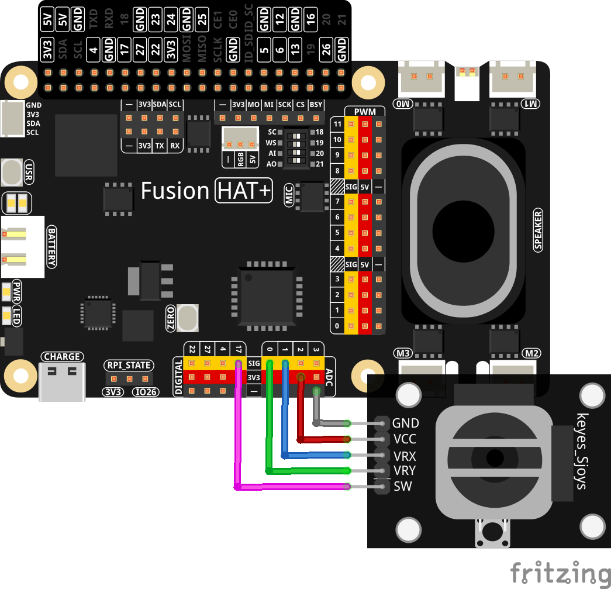

.. include:: /index.rst
   :start-after: start_hello_message
   :end-before: end_hello_message

.. _py_blindfolded_watermelon_game:

(示例) 蒙眼砸西瓜游戏
=====================

**简介**

本项目创建了一个交互式\ **蒙眼砸西瓜游戏**\ ，玩家使用摇杆在 20×20 米的网格中移动，同时依靠 AI 助手获取方向指引。该系统集成了：

1. **摇杆控制**\ ——用于玩家在 X/Y 轴上的移动
2. **AI 驱动的指引**\ ——使用 OpenAI 的 GPT-4
3. **TTS（文字转语音）反馈**\ ——使用 Pico2Wave
4. **随机目标生成**\ ——用于西瓜的放置
5. **交互按钮**\ ——用于砸击动作

.. raw:: html

      <video width="500" loop muted controls>
          <source src="../_static/video/Blindfolded_Watermelon_Smashing_Game.mp4" type="video/mp4">
          Your browser does not support the video tag.
      </video>

玩家从中心点（0,0）出发，仅通过 AI 助手的语音指引找到随机放置的西瓜，创造一种引人入胜的感官剥夺式游戏体验。

您可以将各种输入设备与大语言模型（LLM）模块结合，创建交互式 AI 游戏。请参阅：

* :ref:`py_online_llm`
* :ref:`tts_espeak_pico2wave`
* :ref:`py_joystick`

----------------------------------------------

**所需元件**

本项目需要以下组件：

.. list-table::
    :widths: 30 20
    :header-rows: 1

    *   - 元件
        - 购买链接
    *   - :ref:`cpn_joystick`
        - \-
    *   - :ref:`cpn_button`
        - |link_button_buy|
    *   - :ref:`cpn_fusion_hat`
        - \-
    *   - :ref:`cpn_wires`
        - |link_wires_buy|
    *   - Raspberry Pi
        - \-

----------------------------------------------

**接线图**

按如下方式将组件连接到 Fusion HAT+：

----------------------------------------------

.. include:: python_online_llms.rst
   :start-after: start_setup_openai
   :end-before: end_setup_openai

----------------------------------------------

**运行示例**

#. 运行代码

   .. raw:: html

      <run></run>

   .. code-block:: shell

      cd ~/ai-lab-kit/llm
      sudo python3 llm_openai_blindfolded_game.py

#. 开始游戏

   脚本启动后，游戏会在 20×20 米的场地上随机放置一个西瓜。
   使用摇杆一步步移动，并聆听 AI 助手的指引。

   当您认为已到达西瓜位置时，按下按钮进行砸击。
   如果您的坐标与西瓜完全匹配，即可获胜。

#. 理解游戏机制

   * 坐标系统：

     - 游戏场地是一个 20×20 米的网格
     - 坐标范围从 (-10,-10) 到 (10,10)
     - X 正轴 = 东，X 负轴 = 西
     - Y 正轴 = 南，Y 负轴 = 北（Y 轴反向）
     - 中心点为 (0,0)

   * 移动规则：

     - 摇杆向右 → X+1（东）
     - 摇杆向左 → X-1（西）
     - 摇杆向上 → Y-1（北）
     - 摇杆向下 → Y+1（南）
     - 每次移动改变位置 1 米

   * 获胜条件：

     - 玩家必须位于西瓜的精确坐标
     - 按下按钮在当前位置"砸击"
     - 精确匹配则游戏结束并显示胜利消息

   * AI 助手角色：

     - 接收玩家和西瓜的坐标
     - 提供基本方向指引（北、东北、东、东南、南、西南、西、西北）
     - 给出以米为单位的距离估算
     - 保持回复简洁以适配语音播放

**代码**

以下是蒙眼砸西瓜游戏的完整 Python 脚本：

.. raw:: html

   <run></run>

.. code-block:: python

   from fusion_hat.llm import OpenAI
   from secret import OPENAI_API_KEY
   from fusion_hat.adc import ADC
   from fusion_hat.pin import Pin
   from fusion_hat.tts import Pico2Wave
   import random, time

   # Register OpenAI API
   # openai.com

   # Export your openai api key with :LLM_API_KEY
   # export LLM_API_KEY=sk-xxxxxxxxxxxxxxxxx

   # Setup TTS
   tts = Pico2Wave()
   tts.set_lang('en-US')

   # Setup Joystick
   btn_pin = Pin(17, mode=Pin.IN, pull=Pin.PULL_UP, bounce_time=0.05)
   x_axis = ADC('A1')
   y_axis = ADC('A0')

   def MAP(x, in_min, in_max, out_min, out_max):
       """
       Map a value from one range to another.
       """
       return (x - in_min) * (out_max - out_min) / (in_max - in_min) + out_min

   def activate():
       global smash_tips
       smash_tips = True

   btn_pin.when_activated = activate

   # Setup LLM
   INSTRUCTIONS = "This is a blindfolded watermelon-smashing game. A point representing a watermelon is randomly generated within a 20x20 meter area with coordinates ranging from (-10,-10) to (10,10). The player starts from the origin (0,0) and moves using a joystick. Even if the player can't see anything, they press a button to perform a smash action. After smashing, you will receive the watermelon's and player's coordinates. You need to advise the player on the direction of the watermelon, like 'The watermelon is ten meters to your northeast.' If the smash coordinates match, the game ends. Your responses will be converted into speech via TTS, so please keep them brief, ideally within two sentences."

   WELCOME = "Hello, I am Blindfolded Watermelon Smashing Game Assistant. Use the joystick to move and press the button to smash. I will guide you to find the watermelon. Good luck!"

   llm = OpenAI(
       api_key=OPENAI_API_KEY,
       model="gpt-4o",
   )

   # Set how many messages to keep
   llm.set_max_messages(20)
   # Set instructions
   llm.set_instructions(INSTRUCTIONS)
   # Set welcome message
   llm.set_welcome(WELCOME)

   print(WELCOME)

   # Define the map size and the joystick pins
   watermelon_x, watermelon_y = random.randint(-10, 10), random.randint(-10, 10)
   player_x, player_y = 0, 0
   smash_tips = False

   while True:
       x_val = MAP(x_axis.read(), 0, 4095, -100, 100)
       y_val = MAP(y_axis.read(), 0, 4095, -100, 100)

       if x_val > 80:
           player_x += 1
       elif x_val < -80:
           player_x -= 1

       if y_val > 80:
           player_y -= 1
       elif y_val < -80:
           player_y += 1

       # Debug positions (commented out in actual game)
       # print('Watermelon position: %d, %d  ' % (watermelon_x, watermelon_y))
       # print('Player position: %d, %d  ' % (player_x, player_y))

       time.sleep(0.3)

       if smash_tips:
           smash_tips = False
           print("Smash!")

           if (player_x, player_y) == (watermelon_x, watermelon_y):
               print("Target hit!")
               tts.say("Target hit!")
               break
           else:
               input_text = f"Watermelon position: ({watermelon_x}, {watermelon_y}), Player position: ({player_x}, {player_y})"

               # Response with stream
               response = llm.prompt(input_text, stream=True)
               string = ""

               for next_word in response:
                   if next_word:
                       # print(next_word, end="", flush=True)  # Uncomment for streaming display
                       string += next_word

               # print("")  # New line after streaming
               print("AI: " + string)
               tts.say(string)

   print("Game over!")

----------------------------------------------

**理解代码**

1. 文字转语音（TTS）设置

   游戏使用 Pico2Wave 进行音频反馈：

   .. code-block:: python

      tts = Pico2Wave()
      tts.set_lang('en-US')

   这会将 AI 的文本回复转换为英语语音指令。

2. 摇杆输入处理

   摇杆使用两个 ADC 通道读取 X 轴和 Y 轴：

   .. code-block:: python

      x_axis = ADC('A1')  # Horizontal movement
      y_axis = ADC('A0')  # Vertical movement

      def MAP(x, in_min, in_max, out_min, out_max):
          return (x - in_min) * (out_max - out_min) / (in_max - in_min) + out_min

      # Convert 0-4095 ADC reading to -100 to 100 range
      x_val = MAP(x_axis.read(), 0, 4095, -100, 100)
      y_val = MAP(y_axis.read(), 0, 4095, -100, 100)

3. 带中断的按钮设置

   按钮使用中断回调实现即时响应：

   .. code-block:: python

      btn_pin = Pin(17, mode=Pin.IN, pull=Pin.PULL_UP, bounce_time=0.05)

      def activate():
          global smash_tips
          smash_tips = True

      btn_pin.when_activated = activate

   按下按钮时，将\ ``smash_tips``\ 设置为\ ``True``\ ，触发主循环中的砸击动作。

4. OpenAI 大语言模型（LLM）配置

   AI 助手配置了特定的游戏指令：

   .. code-block:: python

      INSTRUCTIONS = "This is a blindfolded watermelon-smashing game..."
      WELCOME = "Hello, I am Blindfolded Watermelon Smashing Game Assistant..."

      llm = OpenAI(
          api_key=OPENAI_API_KEY,
          model="gpt-4o",
      )

      llm.set_max_messages(20)       # Keep conversation history
      llm.set_instructions(INSTRUCTIONS)  # Set game rules
      llm.set_welcome(WELCOME)       # Set initial greeting

5. 游戏状态管理

   游戏维护玩家和目标位置：

   .. code-block:: python

      # Random watermelon placement
      watermelon_x, watermelon_y = random.randint(-10, 10), random.randint(-10, 10)

      # Player starts at center
      player_x, player_y = 0, 0

      # Movement thresholds (80% joystick deflection)
      if x_val > 80:
          player_x += 1      # Move right
      elif x_val < -80:
          player_x -= 1      # Move left

      if y_val > 80:
          player_y -= 1      # Move up (negative Y)
      elif y_val < -80:
          player_y += 1      # Move down (positive Y)

6. 砸击动作与 AI 响应

   按下按钮时，游戏检查是否命中或请求 AI 指引：

   .. code-block:: python

      if smash_tips:
          smash_tips = False
          print("Smash!")

          if (player_x, player_y) == (watermelon_x, watermelon_y):
              print("Target hit!")
              tts.say("Target hit!")
              break  # Game ends
          else:
              # Send positions to AI for guidance
              input_text = f"Watermelon position: ({watermelon_x}, {watermelon_y}), Player position: ({player_x}, {player_y})"

              # Get streaming response from AI
              response = llm.prompt(input_text, stream=True)
              string = ""

              for next_word in response:
                  if next_word:
                      string += next_word

              print("AI: " + string)
              tts.say(string)  # Speak the guidance

7. 流式响应处理

   AI 响应逐词处理，可用于实时显示：

   .. code-block:: python

      response = llm.prompt(input_text, stream=True)
      string = ""

      for next_word in response:
          if next_word:
              # Uncomment to display words as they arrive
              # print(next_word, end="", flush=True)
              string += next_word

8. 带死区的移动逻辑

   摇杆具有 80 单位的死区，防止误触移动：

   .. code-block:: python

      # Only move when joystick is pushed >80% in any direction
      # This prevents drifting from center position
      if x_val > 80:    # Right
      elif x_val < -80: # Left

      if y_val > 80:    # Up
      elif y_val < -80: # Down

9. 游戏循环结构

   主游戏循环持续执行以下操作：

   1. 读取摇杆位置
   2. 如果摇杆被推动，更新玩家坐标
   3. 检查砸击按钮是否按下
   4. 在需要时处理 AI 响应
   5. 通过 TTS 提供音频反馈

----------------------------------------------

**故障排除**

- 摇杆无响应

  - 验证 ADC 连接：A0 为 Y 轴，A1 为 X 轴
  - 检查电源：VCC 接 3.3V，GND 接地
  - 测试 ADC 读数：\ ``print(x_axis.read())``\ 应显示 0-4095
  - 确保摇杆居中（读数应约为 2048）

- TTS 没有声音

  - 检查音频输出：\ ``sudo raspi-config`` → **系统选项** → **音频**
  - 测试音箱：\ ``speaker-test -t sine -f 440``
  - 确保已安装 Pico2Wave：\ ``pico2wave --help``
  - 检查音量：\ ``alsamixer``
  - 重新执行音频设置脚本：\ ``sudo /opt/setup_fusion_hat_audio.sh``

- OpenAI API 错误

  - 验证 ``secret.py``\ 中的 API 密钥
  - 检查网络连接：\ ``ping 8.8.8.8``
  - 确保 OpenAI 账户已启用计费
  - 验证您的账户可使用 "gpt-4o" 模型

- 玩家移动过快/过慢

  - 调整移动阈值（当前为 80）：值越大，所需摇杆偏移越大
  - 修改移动增量（当前为 1）：改为 0.5 可实现更精细控制
  - 调整休眠时间（当前为 0.3 秒）：时间越长，移动响应越慢

- AI 回复过长

  - 在 INSTRUCTIONS 中强调简洁性
  - 在指令中添加"在 10 个字以内回复"
  - 在代码中实现回复长度检查

----------------------------------------------

这个蒙眼砸西瓜游戏展示了物理控制、AI 指引和音频反馈如何结合，创造出一种引人入胜的感官游戏体验，挑战玩家的空间意识和听力技能！
