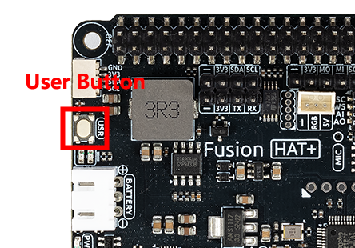

.. _py_book_cover_analyzer:

(Example) Book Expert
===========================

**Introduction**

In this project, you'll build an **AI-powered book cover analyzer** that uses computer vision and natural language processing to identify books from their covers. The system captures images of book covers using a Raspberry Pi camera, sends them to LLM model (here we use OpenAI's GPT-4o vision model) for analysis, and provides audio feedback about the book's title, author, summary, and reception using text-to-speech technology.

The project combines multiple technologies:

- Camera capture with Picamera2
- Image analysis with GPT-4o vision capabilities
- Text-to-speech conversion for audio responses
- RGB LED for visual status feedback
- Physical button for intuitive interaction

To use the other llm model, please refer to :ref:`py_online_llm` .

----------------------------------------------

**What You'll Need**

The following components are required for this project:

.. list-table::
    :widths: 30 20
    :header-rows: 1

    *   - COMPONENT
        - PURCHASE LINK
    *   - Raspberry Pi Camera Module
        - |link_camera_buy|
    *   - :ref:`cpn_fusion_hat`
        - \-
    *   - :ref:`cpn_rgb_led`
        - |link_rgb_led_buy|
    *   - :ref:`cpn_resistor`
        - |link_resistor_buy|
    *   - :ref:`cpn_wires`
        - |link_wires_buy|
    *   - Book (for testing)
        - \-

----------------------------------------------

**Wiring Diagram**

Connect the components to the Fusion HAT+ as follows:

.. image:: img/fzz/llm_book_bb.png
   :width: 80%
   :align: center

**Camera Connection:**

- Connect the camera to the Raspberry Pi
- :ref:`assemble_fusion_hat_pan_tilt`

**RGB LED Connection:**

- **Red pin** → Fusion HAT+ PWM port 0
- **Green pin** → Fusion HAT+ PWM port 1  
- **Blue pin** → Fusion HAT+ PWM port 2
- **Common cathode** → Ground (GND)

*Note: The User Button is already integrated into the Fusion HAT+ and doesn't require additional wiring. It is near by the BATTERY port.*

----------------------------------------------

**Get and Save your API Key**

#. Go to |link_openai_platform| and log in. On the **API keys** page, click **Create new secret key**.

   .. image:: img/llm_openai_create.png

#. Fill in the details (Owner, Name, Project, and permissions if needed), then click **Create secret key**.

   .. image:: img/llm_openai_create_confirm.png

#. Once the key is created, copy it right away — you won't be able to see it again. If you lose it, you'll need to generate a new one.

   .. image:: img/llm_openai_copy.png

#. In your project folder (for example: ``/``), create a file called ``secret.py``:

   .. code-block:: bash
   
       cd ~/ai-lab-kit/llm
       sudo nano secret.py

#. Paste your key into the file like this:

   .. code-block:: python
   
       # secret.py
       # Store secrets here. Never commit this file to Git.
       OPENAI_API_KEY = "sk-xxx"

**Enable billing and check models**

#. Before using the key, go to the **Billing** page in your OpenAI account, add your payment details, and top up a small amount of credits.  

   .. image:: img/llm_openai_billing.png

#. Then go to the **Limits** page to check which models are available for your account and copy the exact model ID to use in your code.  

   .. image:: img/llm_openai_models.png

-----------------------------------------------------------

**Access the Raspberry Pi desktop**

You are using a display. Otherwise, please install Raspberry Pi Connect (|link_rpi_connect|) or RealVNC (:ref:`remote_desktop`) and make sure you can access the Raspberry Pi desktop through one of them;

**Run the Code**
   
   .. raw:: html
   
      <run></run>
   
   .. code-block:: shell

      cd ~/ai-lab-kit/llm   
      sudo python3 llm_openai_bookexpert.py

**When the script runs:**
   
   * A camera preview window will open
   * The RGB LED will glow blue, indicating ready state
   * Place a book cover in front of the camera
   * Press the USR Button on the Fusion HAT+ (which is near the BATTERY port)
   * The system will:

     1. Capture a photo (LED turns yellow 🟡)
     2. Analyze with AI (LED turns purple 🟣)
     3. Speak the analysis (LED turns green 🟢)
     4. Return to ready state (LED turns blue 🔵)
     5. If error occurs, the LED will turn red 🔴

   * Photos are saved to `~/Pictures/book_covers/`
   * Press Ctrl+C to exit

----------------------------------------------

**Code**

Here is the full Python script for the AI Book Cover Analyzer:

.. code-block:: python

   #!/usr/bin/env python3
   import os
   import time
   import re
   import base64
   import threading
   from pathlib import Path
   from picamera2 import Picamera2, Preview
   from fusion_hat.user_button import UserButton
   from fusion_hat.modules import RGB_LED
   from fusion_hat.pwm import PWM
   from fusion_hat.llm import OpenAI
   from fusion_hat.tts import OpenAI_TTS
   from secret import OPENAI_API_KEY

   class BookCoverAnalyzer:
       def __init__(self):
           # Initialize LED for status feedback
           self.rgb_led = RGB_LED(PWM(0), PWM(1), PWM(2), common=RGB_LED.CATHODE)
           self.set_led_color("blue")  # Ready state
           
           # Initialize OpenAI LLM for image analysis
           self.llm = OpenAI(
               api_key=OPENAI_API_KEY,
               model="gpt-4o",  # GPT-4o supports image input
           )
           
           # Initialize TTS for audio responses
           self.tts = OpenAI_TTS(api_key=OPENAI_API_KEY)
           self.tts.set_voice(self.tts.Voice.ALLOY)
           
           # Initialize camera
           self.camera = Picamera2()
           self.camera.configure(self.camera.create_preview_configuration(main={"size": (800, 600)}))
           
           # Initialize button
           self.btn = UserButton()
           
           # Set up directories
           self.real_user = os.getenv("SUDO_USER") or os.getlogin()
           self.user_home = f"/home/{self.real_user}"
           self.pictures_dir = Path(self.user_home) / "Pictures" / "book_covers"
           self.pictures_dir.mkdir(parents=True, exist_ok=True)
           
           # Threading locks
           self.photo_lock = threading.Lock()
           self.photo_index = 1
           
           # Set LLM instructions
           self.instructions = """You are a book expert. Analyze book covers that are sent to you.
           
           When you receive a book cover image, provide:
           1. Book title (if identifiable from cover)
           2. Author (if identifiable from cover)
           3. Brief summary of what the book is about (50 words)
           4. Overall rating/reception (e.g., "Highly acclaimed", "Classic", "Popular", etc.)
           
           Keep your response under 100 words total.
           Speak in a friendly, informative tone suitable for an audio response.
           
           If the image is not a book cover or is unclear, politely say you can't identify it and ask for another photo."""
           
           self.llm.set_max_messages(10)
           self.llm.set_instructions(self.instructions)
           
       def set_led_color(self, color_name):
           """Set RGB LED color for status feedback"""
           color_map = {
               "red": (255, 0, 0),
               "green": (0, 255, 0),
               "blue": (0, 0, 255),
               "yellow": (255, 255, 0),
               "purple": (255, 0, 255),
               "white": (255, 255, 255),
               "off": (0, 0, 0),
           }
           
           if color_name in color_map:
               self.rgb_led.color(color_map[color_name])
       
       def capture_photo(self):
           """Capture a photo and return the filepath"""
           with self.photo_lock:
               filepath = self.pictures_dir / f"book_cover_{self.photo_index:03d}.jpg"
               print(f"\n📸 Capturing photo: {filepath}")
               
               # LED feedback: yellow for capturing
               self.set_led_color("yellow")
               
               # Capture image
               self.camera.capture_file(str(filepath))
               
               # Increment counter for next photo
               self.photo_index += 1
               
               print("Photo captured successfully")
               return str(filepath)
       
       def analyze_book_cover(self, image_path):
           """Send book cover image to OpenAI for analysis"""
           print("\n Analyzing book cover...")
           
           # LED feedback: purple for processing
           self.set_led_color("purple")
           
           try:
               # use fusion_hat.llm's prompt method to process the image
               prompt_text = "Please analyze this book cover and tell me about the book. Provide: 1) Book title if identifiable, 2) Author if identifiable, 3) Brief summary, 4) Overall rating/reception. Keep under 100 words."
               
               print("Sending to AI for analysis...")
               
               # method1: non-streaming response
               response = self.llm.prompt(prompt_text, image_path=image_path)
               
               # if the response is a string, use it directly
               if isinstance(response, str):
                   analysis = response
               else:
                   # if response is not a string, try to convert it to a string
                   analysis = str(response)
               
               print(f"\n Analysis:\n{analysis}")
               
               # LED feedback: green for success
               self.set_led_color("green")
               
               return analysis
               
           except Exception as e:
               print(f"Error analyzing image: {e}")
               print(f"Error type: {type(e)}")
               
               # method2: streaming response
               try:
                   print("Trying stream method...")
                   stream_response = self.llm.prompt(prompt_text, stream=True, image_path=image_path)
                   
                   # receive the stream response
                   analysis_parts = []
                   for next_word in stream_response:
                       if next_word:
                           analysis_parts.append(next_word)
                   
                   analysis = ''.join(analysis_parts)
                   print(f"\n Analysis (stream):\n{analysis}")
                   
                   # LED feedback: green for success
                   self.set_led_color("green")
                   return analysis
                   
               except Exception as e2:
                   print(f"Stream method also failed: {e2}")
                   
                   # LED feedback: red for error
                   self.set_led_color("red")
                   return "Sorry, I couldn't analyze the book cover. Please make sure the book cover is clearly visible and try again."
       
       def speak_response(self, text):
           """Convert text to speech"""
           print("\nSpeaking response...")
           
           # Clean up text for TTS (remove markdown, etc.)
           clean_text = re.sub(r'[*_\[\]()#]', '', text)
           
           # Speak with friendly instructions
           self.tts.say(clean_text, instructions="speak clearly and warmly")
           print("Response spoken")
           
           # Return to ready state
           self.set_led_color("blue")
       
       def button_handler(self):
           """Handle button press: capture photo, analyze, and speak"""
           print("\n" + "="*50)
           print("Processing request...")
           
           # Step 1: Capture photo
           try:
               image_path = self.capture_photo()
           except Exception as e:
               print(f"Failed to capture photo: {e}")
               self.set_led_color("red")
               self.tts.say("Sorry, I couldn't take a photo. Please try again.")
               self.set_led_color("blue")
               return
           
           # Step 2: Analyze with AI
           analysis = self.analyze_book_cover(image_path)
           
           # Step 3: Speak the analysis
           self.speak_response(analysis)
           
           print(f"Complete! Photo saved at: {image_path}")
           print("="*50 + "\n")
       
       def run(self):
           """Main program loop"""
           # Set button callback
           self.btn.set_on_click(self.button_handler)
           
           # Start camera preview
           print("Starting camera preview...")
           self.camera.start_preview(Preview.QT)
           self.camera.start()
           
           # LED feedback: blue for ready
           self.set_led_color("blue")
           
           print("\n" + "="*50)
           print("BOOK COVER ANALYZER")
           print("="*50)
           print("\nReady to analyze book covers!")
           print("Press the USR button to capture and analyze a book cover")
           print("I will speak the analysis aloud")
           print("LED colors:")
           print("   Blue: Ready")
           print("   Yellow: Capturing photo")
           print("   Purple: Analyzing with AI")
           print("   Green: Analysis successful")
           print("   Red: Error occurred")
           print(f"Photos saved to: {self.pictures_dir}")
           print("Press Ctrl+C to exit")
           print("="*50 + "\n")
           
           try:
               # Keep program running
               while True:
                   time.sleep(0.1)
                   
           except KeyboardInterrupt:
               print("\nExiting...")
               
           finally:
               # Cleanup
               self.camera.stop_preview()
               self.camera.close()
               self.set_led_color("off")
               print("Cleanup complete")

   if __name__ == "__main__":
       analyzer = BookCoverAnalyzer()
       analyzer.run()

----------------------------------------------

**Understanding the Code**

1. **Camera Initialization**

   The Picamera2 library provides a modern interface for Raspberry Pi camera control, supporting both image capture and preview.

   .. code-block:: python

      self.camera = Picamera2()
      self.camera.configure(self.camera.create_preview_configuration(main={"size": (800, 600)}))
      
      # Start preview and camera
      self.camera.start_preview(Preview.QT)
      self.camera.start()

2. **Image Capture with Thread Safety**

   The capture_photo method uses threading locks to prevent multiple simultaneous captures and ensures proper file naming.

   .. code-block:: python

      def capture_photo(self):
          with self.photo_lock:
              filepath = self.pictures_dir / f"book_cover_{self.photo_index:03d}.jpg"
              self.camera.capture_file(str(filepath))
              self.photo_index += 1
              return str(filepath)

3. **Vision AI Analysis**

   The system uses GPT-4o's vision capabilities to analyze book covers. Two methods (streaming and non-streaming) are implemented for robustness.

   .. code-block:: python

      def analyze_book_cover(self, image_path):
          prompt_text = "Please analyze this book cover..."
          
          # Method 1: Non-streaming response
          response = self.llm.prompt(prompt_text, image_path=image_path)
          
          # Method 2: Fallback to streaming if needed
          stream_response = self.llm.prompt(prompt_text, stream=True, image_path=image_path)

4. **Text-to-Speech Conversion**

   OpenAI's TTS API converts the AI's analysis into natural-sounding speech with configurable voice options.

   .. code-block:: python

      self.tts = OpenAI_TTS(api_key=OPENAI_API_KEY)
      self.tts.set_voice(self.tts.Voice.ALLOY)
      
      def speak_response(self, text):
          clean_text = re.sub(r'[*_\[\]()#]', '', text)  # Remove markdown
          self.tts.say(clean_text, instructions="speak clearly and warmly")

5. **Status Feedback System**

   The RGB LED provides visual feedback throughout the process using color coding:

   .. code-block:: python

      def set_led_color(self, color_name):
          color_map = {
              "red": (255, 0, 0),      # Error
              "green": (0, 255, 0),    # Success
              "blue": (0, 0, 255),     # Ready
              "yellow": (255, 255, 0), # Capturing
              "purple": (255, 0, 255), # Processing
          }
          self.rgb_led.color(color_map[color_name])

6. **Button Event Handling**

   The User Button triggers the entire analysis workflow through an event callback.

   .. code-block:: python

      def button_handler(self):
          # 1. Capture photo
          image_path = self.capture_photo()
          # 2. Analyze with AI
          analysis = self.analyze_book_cover(image_path)
          # 3. Speak the analysis
          self.speak_response(analysis)
      
      # Set callback
      self.btn.set_on_click(self.button_handler)

7. **File Management**

   Photos are automatically organized in dated folders with sequential numbering.

   .. code-block:: python

      self.real_user = os.getenv("SUDO_USER") or os.getlogin()
      self.user_home = f"/home/{self.real_user}"
      self.pictures_dir = Path(self.user_home) / "Pictures" / "book_covers"
      self.pictures_dir.mkdir(parents=True, exist_ok=True)

----------------------------------------------

**Troubleshooting**

- **"Camera not detected" error**

  - Ensure the camera ribbon cable is properly inserted (gold contacts facing the correct direction)
  - Run ``sudo raspi-config`` and enable the camera interface
  - Reboot after enabling the camera

- **"No preview window appears"**

  - Ensure you're running on a Raspberry Pi with a desktop environment
  - For headless operation, remove or modify the preview code
  - Check if you have sufficient GPU memory allocated

- **"OpenAI API error"**

  - Verify your API key in ``secret.py`` is correct and has sufficient credits
  - Check internet connectivity: ``ping 8.8.8.8``
  - Ensure your account has access to GPT-4o and the TTS API

- **"TTS audio not playing"**

  - Check if audio output is configured: ``sudo raspi-config`` → **System Options** → **Audio**
  - Test audio with: ``speaker-test -t sine -f 440``
  - Ensure your speaker/headphones are connected to the correct audio jack

- **"Button press not detected"**

  - Check if the User Button LED lights up when pressed
  - Ensure the Fusion HAT+ is properly seated on the GPIO pins
  - Verify the button callback is set correctly

- **"Image analysis returns generic responses"**

  - Ensure good lighting when capturing book covers
  - Position the book cover squarely in the camera frame
  - Try with well-known books first for better recognition
  - Clean the camera lens if blurry

----------------------------------------------

**Try It Yourself**

1. **Multi-Language Support**  

   Modify the system to detect and respond in different languages based on the book's language or user preference.

2. **Database Integration**  

   Connect to a book database (like Google Books API or Open Library) to fetch additional details like reviews, publication dates, and similar books.

3. **Barcode/ISBN Scanning**  

   Add barcode detection to scan ISBN numbers for more accurate book identification.

4. **Reading Recommendations**  

   After analyzing a book, suggest similar books or authors the user might enjoy.

5. **Batch Processing Mode**  

   Create a mode to scan multiple books sequentially and generate a reading list summary.

6. **Accessibility Features**  

   Add voice command recognition for hands-free operation or Braille output support.

7. **Book Club Assistant**  

   Expand to analyze multiple books and compare themes, genres, or difficulty levels for book club selection.

8. **Educational Mode**  

   Add quizzes or discussion questions based on the analyzed book's content.

9. **Augmented Reality**  

   Use AR to overlay book information directly onto the camera view when pointing at books.

10. **Personal Library Catalog**  

   Create a complete catalog system that organizes analyzed books into a searchable digital library.

11. **Book Condition Assessment**  

   Add analysis of book condition (new, used, damaged) for collectors or resellers.

12. **Genre Classification**  

   Implement automatic genre detection and categorization of books.

13. **Reading Level Analysis**  

   Estimate the reading difficulty level appropriate for different age groups.

14. **Thematic Analysis**  

   Identify common themes, motifs, or symbols present in the book's cover design.

15. **Historical Context**  

   Provide historical context about when the book was published and its cultural significance.

This project demonstrates the powerful combination of computer vision, natural language processing, and physical computing to create an intelligent book analysis system. It showcases how AI can enhance everyday interactions with physical objects like books, making information more accessible and engaging!