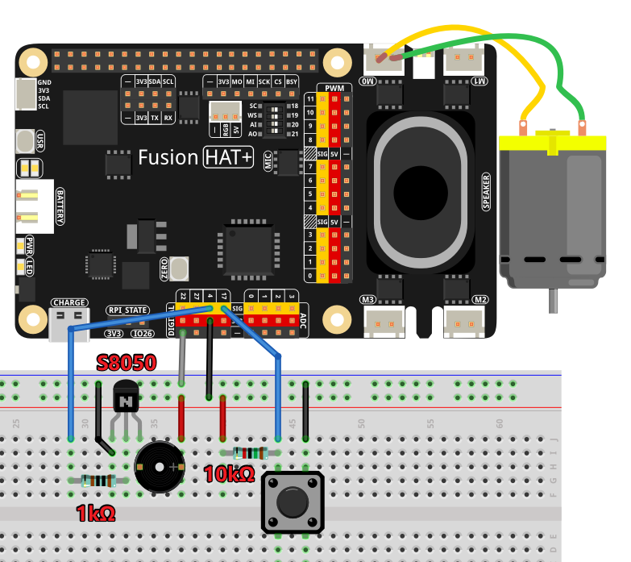

.. include:: /index.rst
   :start-after: start_hello_message
   :end-before: end_hello_message

.. _py_voice_controlled_fan:

(Exemple) Ventilateur intelligent commande par la voix
==================================================

**Introduction**

Ce projet cree un **Ventilateur intelligent commande par la voix** qui combine la reconnaissance vocale, le traitement IA et le controle moteur. Le systeme permet aux utilisateurs de controler la vitesse du ventilateur en utilisant des commandes vocales naturelles et offre plusieurs methodes de controle :

1. **Commandes vocales** utilisant la reconnaissance vocale pour un fonctionnement mains libres
2. **Bouton physique** pour le reglage manuel de la vitesse
3. **Interpretation IA** utilisant OpenAI GPT pour comprendre le langage naturel
4. **Retour sonore** avec un buzzer pour les pressions de bouton
5. **Interface de controle double** prenant en charge l'interaction vocale et physique

.. raw:: html

      <video width="500" loop muted controls>
          <source src="../_static/video/Voice_Controlled_Smart_Fan.mp4" type="video/mp4">
          Your browser does not support the video tag.
      </video>

Le ventilateur intelligent comprend des commandes comme "make it faster", "slow down please" ou "turn off the fan" et repond avec des actions appropriees et une confirmation verbale.

Vous pouvez combiner divers modules d'entree et de sortie pour creer des appareils intelligents commandes par la voix. Voir :

* :ref:`py_online_llm`
* :ref:`py_stt_whisper`
* :ref:`py_motor`

----------------------------------------------

**Ce dont vous aurez besoin**

Les composants suivants sont necessaires pour ce projet :

.. list-table::
    :widths: 30 20
    :header-rows: 1

    *   - COMPOSANT
        - LIEN D'ACHAT
    *   - :ref:`cpn_motor`
        - |link_motor_buy|
    *   - :ref:`cpn_button`
        - |link_button_buy|
    *   - :ref:`cpn_buzzer`
        - \-
    *   - :ref:`cpn_fusion_hat`
        - \-
    *   - :ref:`cpn_wires`
        - |link_wires_buy|
    *   - Raspberry Pi
        - \-

----------------------------------------------

**Schema de cablage**

Connectez les composants au Fusion HAT+ comme suit :

----------------------------------------------

.. include:: python_online_llms.rst
   :start-after: start_setup_openai
   :end-before: end_setup_openai

----------------------------------------------

**Executer l'exemple**

#. Executez le code

   .. raw:: html

      <run></run>

   .. code-block:: shell

      cd ~/ai-lab-kit/llm
      sudo python3 llm_openai_fan.py

#. Controler le ventilateur

   Vous pouvez controler le ventilateur en utilisant des commandes vocales, le bouton ou le langage naturel.

   * Commandes vocales :

     - "Make it faster" / "Increase speed" → Regle au maximum (100%)
     - "Slow down" / "Reduce speed" → Regle au minimum (25%)
     - "Medium speed please" → Regle a moyen (50%)
     - "Turn off" / "Stop" → Arrete le moteur (0%)
     - "What's the current speed?" → Signale la vitesse actuelle
     - "Make it cooler" → Interprete comme une demande de vitesse plus elevee

   * Controle par bouton :

     - Chaque pression augmente la vitesse de 10%
     - A 100%, la pression suivante revient a 0%
     - Un bip sonore confirme chaque pression
     - Le pourcentage de vitesse actuelle est affiche a l'ecran

   * Comprehension du langage naturel :

     L'IA peut egalement comprendre des variations telles que :

     - "I'm feeling hot, can you make it faster?"
     - "Could you please turn the fan down a bit?"
     - "It's too windy in here!"
     - "Set it to half speed"

--------

**Code**

Voici le script Python complet pour le Ventilateur intelligent commande par la voix :

.. raw:: html

   <run></run>

.. code-block:: python

   from fusion_hat.llm import OpenAI
   from secret import OPENAI_API_KEY
   from fusion_hat.motor import Motor
   from fusion_hat.modules import Buzzer
   from fusion_hat.pin import Pin
   import random, time
   from fusion_hat.stt import STT

   # Initialize Speech-to-Text with English language
   stt = STT(language="en-us")

   # Initialize motor on port M0
   motor = Motor('M0')

   # Initialize button on GPIO 17 with pull-up and debounce
   button = Pin(17, mode=Pin.IN, pull=Pin.PULL_UP, bounce_time=0.05)

   # Initialize buzzer on GPIO 4
   buzzer = Buzzer(Pin(4))

   # Global speed variable (0-100%)
   speed = 0

   # Function for auditory feedback
   def beep():
       buzzer.on()
       time.sleep(0.1)
       buzzer.off()

   # Debounce variables for button
   last_triggered = 0

   # Button callback function
   def speed_up():
       global speed, last_triggered

       # Debounce: ignore if pressed within 500ms
       if time.time() - last_triggered < 0.5:
           return

       last_triggered = time.time()

       # Increase speed by 10%
       speed += 10

       # Wrap around at 100% (go back to 0)
       if speed > 100:
           motor.stop()
           speed = 0
       else:
           motor.power(speed)

       # Auditory feedback
       beep()

       # Print current speed
       print(f"Speed set to: {speed}%")

   # Attach callback to button
   button.when_activated = speed_up

   # Function to parse natural language response and set appropriate speed
   def parse_response_for_speed(text_response):
       """
       Parse the LLM's natural language response to determine speed setting.
       Looks for keywords related to different speed levels.
       Returns the speed level to set (100, 50, 25, or 0)
       """
       text_lower = text_response.lower()

       # Check for "stop" or "off" keywords - highest priority
       if any(word in text_lower for word in ['stop', 'off', 'zero', '0%', 'turn off', 'shut off', 'halt']):
           return 0

       # Check for "slow" or "low" keywords
       if any(word in text_lower for word in ['slow', 'low', '25%', 'quarter', 'minimum', 'gentle']):
           return 25

       # Check for "medium" or "half" keywords
       if any(word in text_lower for word in ['medium', 'half', '50%', 'moderate', 'normal']):
           return 50

       # Check for "fast" or "high" or "full" keywords
       if any(word in text_lower for word in ['fast', 'high', 'full', '100%', 'maximum', 'top']):
           return 100

       # If no specific keywords found, return -1 to indicate no speed change
       return -1

   # Setup LLM with specific instructions for fan control
   INSTRUCTIONS = '''
   You are a fan control assistant. Your task is to interpret the user's speech input and respond with natural language.

   ### Input Format:
   The user will speak their command for fan control.

   ### CRITICAL RULES:
   1. **BE DECISIVE**: Always take clear action based on user requests. Do NOT ask follow-up questions.
   2. **NO CLARIFICATION QUESTIONS**: Never ask "Would you like me to..." or "Should I..." questions.
   3. **ASSUME INTENT**: If the user's request is ambiguous, make a reasonable assumption and take action.
   4. **CONFIRM ACTION**: Always state what action you are taking in your response.

   ### Response Guidelines:
   1. Respond naturally and conversationally to the user's request.
   2. Acknowledge what the user asked for.
   3. Use clear language about what action you're taking.
   4. Use keywords in your response that indicate speed levels:
      - For maximum speed: use words like "fast", "high", "full speed", "maximum"
      - For medium speed: use words like "medium", "half speed", "50%"
      - For low speed: use words like "slow", "low", "quarter speed", "25%"
      - For stopping: use words like "stop", "off", "zero", "turning off"
   5. If the user asks about current status, respond with helpful information.

   ### Example Responses:

   **When asked to go fast:**
   "I'll set the fan to maximum speed for you. Full speed activated!"

   **When asked to slow down:**
   "Reducing the fan speed to low. Enjoy the gentle breeze."

   **When asked for medium speed:**
   "Setting the fan to medium speed. This should be comfortable."

   **When asked to stop:**
   "Stopping the fan now. The motor is turned off."

   **When asked about status:**
   "Your fan is currently at 50% speed. Would you like me to adjust it?"

   '''

   WELCOME = "Hello, I am a fan control assistant. You can ask me to set the fan to fast, medium, slow, or stop it completely. You can also press the button to increase the speed by 10% or decrease it by 10%. If you ask about the current status, I will tell you the current speed. If you don't know what to do, you can ask me for instructions. Good luck!"

   # Initialize OpenAI LLM
   llm = OpenAI(
       api_key=OPENAI_API_KEY,
       model="gpt-4o",
   )

   # Set how many messages to keep
   llm.set_max_messages(20)

   # Set instructions
   llm.set_instructions(INSTRUCTIONS)

   # Set welcome message
   llm.set_welcome(WELCOME)

   print(WELCOME)

   # Main loop for voice control
   while True:
       print("Say something")

       # Listen for speech input
       for result in stt.listen(stream=True):
           if result["done"]:
               # Print final recognized text
               print(f"\r\x1b[Kfinal: {result['final']}")

               # Get the recognized speech
               input_text = result['final']

               # Add current speed context to the input
               contextual_input = f"Current speed is {speed}%. User says: {input_text}"

               # Get response from LLM
               response = llm.prompt(contextual_input, stream=True)

               # Collect the full response
               full_response = ""
               for next_word in response:
                   if next_word:
                       print(next_word, end="", flush=True)
                       full_response += next_word

               print("\n")  # Add newline after response

               # Parse the response to determine speed setting
               new_speed = parse_response_for_speed(full_response)

               # Apply speed change if detected
               if new_speed >= 0:
                   speed = new_speed
                   motor.power(speed)
                   print(f"Speed set to: {speed}%")
               else:
                   print("No speed change detected in response")

           else:
               # Print partial recognition results
               print(f"\r\x1b[Kpartial: {result['partial']}", end="", flush=True)

----------------------------------------------

**Comprendre le code**

1. Initialisation de la reconnaissance vocale

   Le systeme utilise STT (Speech-to-Text) pour la reconnaissance vocale :

   .. code-block:: python

      stt = STT(language="en-us")

      for result in stt.listen(stream=True):
          if result["done"]:
              input_text = result['final']
          else:
              print(f"partial: {result['partial']}")

   Ceci fournit une reconnaissance vocale en temps reel avec des resultats partiels pendant que vous parlez.

2. Configuration du controle moteur

   Le moteur du ventilateur est controle via PWM sur le port M0 :

   .. code-block:: python

      motor = Motor('M0')

      # Set speed as percentage (0-100)
      motor.power(speed)

      # Stop the motor completely
      motor.stop()

3. Bouton avec anti-rebond

   Le bouton inclut un anti-rebond pour empecher les declenchements multiples :

   .. code-block:: python

      button = Pin(17, mode=Pin.IN, pull=Pin.PULL_UP, bounce_time=0.05)
      last_triggered = 0

      def speed_up():
          global speed, last_triggered
          if time.time() - last_triggered < 0.5:  # 500ms debounce
              return
          last_triggered = time.time()

4. Retour sonore

   Un buzzer fournit une confirmation sonore :

   .. code-block:: python

      buzzer = Buzzer(Pin(4))

      def beep():
          buzzer.on()
          time.sleep(0.1)
          buzzer.off()

5. Fonction d'analyse de mots-cles

   Le systeme analyse les reponses de l'IA pour les commandes de vitesse :

   .. code-block:: python

      def parse_response_for_speed(text_response):
          text_lower = text_response.lower()

          # Check for "stop" or "off" keywords
          if any(word in text_lower for word in ['stop', 'off', 'zero']):
              return 0

          # Check for "slow" or "low" keywords
          if any(word in text_lower for word in ['slow', 'low', '25%']):
              return 25

          # Similar checks for medium and fast

          return -1  # No speed change

6. Entree contextuelle pour l'IA

   La vitesse actuelle est incluse dans l'invite pour des reponses contextuelles :

   .. code-block:: python

      contextual_input = f"Current speed is {speed}%. User says: {input_text}"
      response = llm.prompt(contextual_input, stream=True)

7. Traitement de la reponse en continu

   Les reponses de l'IA sont traitees mot par mot :

   .. code-block:: python

      full_response = ""
      for next_word in response:
          if next_word:
              print(next_word, end="", flush=True)
              full_response += next_word

8. Logique de controle double

   Le systeme prend en charge le controle vocal et par bouton :

   .. code-block:: python

      # Voice control in main loop
      new_speed = parse_response_for_speed(full_response)
      if new_speed >= 0:
          speed = new_speed
          motor.power(speed)

      # Button control via callback
      def speed_up():
          speed += 10
          if speed > 100:
              speed = 0
          motor.power(speed)

9. Affichage terminal clair

   Utilise les codes d'echappement ANSI pour un affichage console propre :

   .. code-block:: python

      print(f"\r\x1b[Kpartial: {result['partial']}", end="", flush=True)

   - ``\r`` : Retour chariot (aller au debut de la ligne)
   - ``\x1b[K`` : Effacer du curseur a la fin de la ligne
   - ``end=""`` : Pas de nouvelle ligne
   - ``flush=True`` : Affichage immediat

10. Instructions IA intelligentes

    L'IA est specifiquement instruite d'etre decisive et d'eviter les questions de clarification :

    .. code-block:: python

        INSTRUCTIONS = '''
        CRITICAL RULES:
        1. BE DECISIVE: Always take clear action based on user requests.
        2. NO CLARIFICATION QUESTIONS: Never ask "Would you like me to..." questions.
        3. ASSUME INTENT: If ambiguous, make reasonable assumption and take action.
        4. CONFIRM ACTION: Always state what action you are taking.
        '''

----------------------------------------------

**Depannage**

- Le moteur ne tourne pas

  - Verifiez les connexions du moteur : port M0, polarite correcte
  - Testez le moteur directement : ``motor.power(50)`` devrait tourner a 50%
  - Assurez-vous que la variable de vitesse est definie (plage 0-100)

- Le bouton ne repond pas

  - Verifiez le cablage : GPIO 17 au bouton, autre cote au 3.3V
  - Verifiez la configuration du pull-up
  - Testez avec un script simple : afficher lorsque l'etat du bouton change
  - Verifiez le temps d'anti-rebond (0,5 seconde peut etre trop long)

- Pas de son du buzzer

  - Testez le buzzer directement : ``buzzer.on()`` devrait produire un son continu
  - Verifiez si le buzzer est piezoelectrique (necessite PWM) ou actif (fonctionne avec DC)

- L'IA ne comprend pas les commandes

  - Verifiez la cle API dans ``secret.py``
  - Verifiez la connexion Internet
  - Examinez les instructions de l'IA : assurez-vous qu'elles sont correctement formatees
  - Testez d'abord avec des commandes plus simples

- Les changements de vitesse sont inattendus

  - Verifiez l'anti-rebond du bouton : peut se declencher plusieurs fois
  - Verifiez l'analyse des mots-cles : certaines phrases peuvent declencher des vitesses non desirees
  - Ajoutez des instructions d'affichage pour tracer les changements de vitesse

- Mauvaise precision de la reconnaissance vocale

  - Reduisez le bruit de fond
  - Parlez clairement et a un rythme modere
  - Envisagez d'utiliser un microphone USB externe pour une meilleure qualite
  - Ajustez les parametres STT si disponibles

- Le moteur fait du bruit mais ne tourne pas

  - Verifiez si le moteur est bloque ou obstrue
  - Verifiez que la tension d'alimentation correspond aux besoins du moteur
  - Certains moteurs necessitent un condensateur aux bornes pour un fonctionnement fluide

----------------------------------------------

Ce ventilateur commande par la voix demontre comment le traitement du langage naturel, les controles physiques et les systemes intelligents peuvent creer des appareils domestiques intelligents intuitifs et accessibles qui repondent aux besoins et preferences humaines !