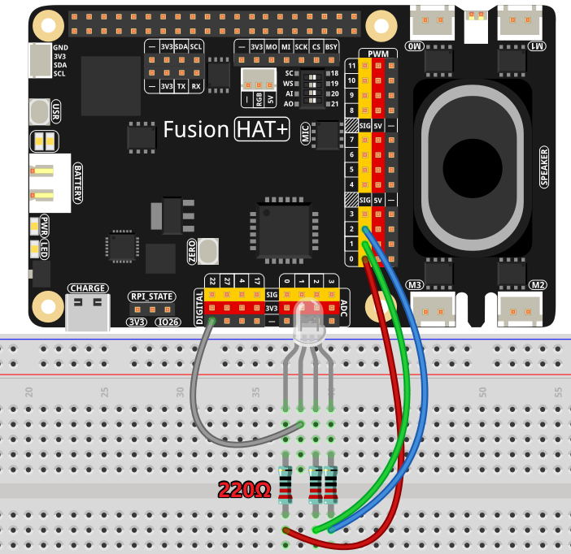

.. _py_ai_led_controller:

(Example) AI-powered LED Controller
======================================

**Introduction**

In this project, you'll build an **AI-powered LED controller** that combines an LLM Model (here we use OpenAI's GPT-4o language model) with an RGB LED. The system interprets natural language commands to control LED colors, allowing you to verbally request specific colors using color names, HEX values, or RGB tuples. This demonstrates the integration of artificial intelligence with physical hardware through natural language processing.

When you say commands like "turn on red light" or "show warm yellow light," the AI parses your request and generates appropriate control signals to adjust the LED accordingly.

To use the other llm model, please refer to :ref:`py_online_llm` .

----------------------------------------------

**What You'll Need**

The following components are required for this project:

.. list-table::
    :widths: 30 20
    :header-rows: 1

    *   - COMPONENT
        - PURCHASE LINK
    *   - :ref:`cpn_fusion_hat`
        - \-
    *   - :ref:`cpn_rgb_led`
        - |link_rgb_led_buy|
    *   - :ref:`cpn_wires`
        - |link_wires_buy|
    *   - :ref:`cpn_resistor`
        - |link_resistor_buy|
    *   - Raspberry Pi
        - \-

----------------------------------------------

**Wiring Diagram**

Connect the RGB LED to the Fusion HAT+ as follows:

**RGB LED Connection Guide:**

- **Red pin** → Fusion HAT+ PWM port 0
- **Green pin** → Fusion HAT+ PWM port 1  
- **Blue pin** → Fusion HAT+ PWM port 2
- **Common cathode** → Ground (GND)

*Note: Add appropriate current-limiting resistors (220Ω recommended) in series with each LED color channel.*

----------------------------------------------

**Get and Save your API Key**

#. Go to |link_openai_platform| and log in. On the **API keys** page, click **Create new secret key**.

   .. image:: img/llm_openai_create.png

#. Fill in the details (Owner, Name, Project, and permissions if needed), then click **Create secret key**.

   .. image:: img/llm_openai_create_confirm.png

#. Once the key is created, copy it right away — you won't be able to see it again. If you lose it, you'll need to generate a new one.

   .. image:: img/llm_openai_copy.png

#. In your project folder (for example: ``/``), create a file called ``secret.py``:

   .. code-block:: bash
   
       cd ~/ai-lab-kit/llm
       sudo nano secret.py

#. Paste your key into the file like this:

   .. code-block:: python
   
       # secret.py
       # Store secrets here. Never commit this file to Git.
       OPENAI_API_KEY = "sk-xxx"

**Enable billing and check models**

#. Before using the key, go to the **Billing** page in your OpenAI account, add your payment details, and top up a small amount of credits.  

   .. image:: img/llm_openai_billing.png

#. Then go to the **Limits** page to check which models are available for your account and copy the exact model ID to use in your code.  

   .. image:: img/llm_openai_models.png

----------------------------------------------------------

**Run the Code**

#. Run the AI LED controller:

   .. raw:: html

      <run></run>

   .. code-block:: shell

      cd ~/ai-lab-kit/llm
      sudo python3 llm_openai_lamp.py

#. When the script runs:

   * You'll see a welcome message: "Smart Lighting Assistant started!"
   * Type natural language commands like:

     - "turn on red light"
     - "show blue color"  
     - "set to warm white"
     - "turn off the light"

   * The AI will respond and control the LED accordingly
   * Type 'quit' or 'exit' to end the program

----------------------------------------------

**Code**

Here is the full Python script for the AI LED Controller:

.. code-block:: python

   #!/usr/bin/env python3
   import re
   from fusion_hat.llm import OpenAI
   from fusion_hat.modules import RGB_LED
   from fusion_hat.pwm import PWM
   from secret import OPENAI_API_KEY

   class AILEDController:
       def __init__(self):
           # Initialize LED
           self.rgb_led = RGB_LED(PWM(0), PWM(1), PWM(2), common=RGB_LED.CATHODE)
           
           # Initialize AI assistant
           self.llm = OpenAI(
               api_key=OPENAI_API_KEY,
               model="gpt-4o",
           )
           
           # Enhanced instructions for LED control
           self.instructions = """You are an AI assistant that can control an RGB LED.
           When the user mentions colors, you need to respond with a specific format to control the LED.

           Response format:
           1. Normal conversation part
           2. End with [LED:color] where color can be:
              - Color names: red, green, blue, yellow, purple, etc.
              - HEX values: #FF0000, #00FF00, etc.
              - RGB tuples: (255,0,0), (0,255,0), etc.
              - Numbers: 0xFF0000, etc.

           Examples:
           User: Turn the light red
           You: OK, set to red. [LED:red]
           
           User: Show warm yellow light
           You: Set to warm yellow light. [LED:#FFD700]
           
           User: Turn off the light
           You: Light turned off. [LED:black] or [LED:(0,0,0)]
           
           If the user doesn't mention anything color-related, don't include the [LED:...] tag."""
           
           # Color name to RGB mapping
           self.color_map = {
               'red': (255, 0, 0),
               'green': (0, 255, 0),
               'blue': (0, 0, 255),
               'yellow': (255, 255, 0),
               'purple': (255, 0, 255),
               'cyan': (0, 255, 255),
               'white': (255, 255, 255),
               'black': (0, 0, 0),
               'orange': (255, 165, 0),
               'pink': (255, 192, 203),
               'brown': (165, 42, 42),
               'grey': (128, 128, 128),
               'warmwhite': (255, 197, 143),
           }
           
           self.llm.set_max_messages(20)
           self.llm.set_instructions(self.instructions)
           self.llm.set_welcome("Hello! I'm your smart lighting assistant. I can control RGB LED colors.")
           
           # Initial state: light off
           self.rgb_led.color((0, 0, 0))
       
       def parse_led_command(self, text):
           """Parse LED control command from AI response"""
           pattern = r'\[LED:(.*?)\]'
           match = re.search(pattern, text)
           
           if not match:
               return None, text
               
           led_command = match.group(1).strip()
           display_text = re.sub(pattern, '', text).strip()
           
           return led_command, display_text
       
       def apply_color(self, color_spec):
           """Convert color specification to RGB and apply to LED"""
           color_spec = color_spec.lower().strip()
           
           try:
               # 1. Process color names
               if color_spec in self.color_map:
                   rgb = self.color_map[color_spec]
                   self.rgb_led.color(rgb)
                   return True
               
               # 2. Process hex strings (e.g., #FF0000)
               elif color_spec.startswith('#'):
                   hex_color = color_spec.lstrip('#')
                   if len(hex_color) == 6:
                       rgb = tuple(int(hex_color[i:i+2], 16) for i in (0, 2, 4))
                       self.rgb_led.color(rgb)
                       return True
               
               # 3. Process RGB tuple strings (e.g., (255,0,0))
               elif color_spec.startswith('(') and color_spec.endswith(')'):
                   numbers = color_spec[1:-1].split(',')
                   if len(numbers) == 3:
                       rgb = tuple(int(num.strip()) for num in numbers)
                       if all(0 <= val <= 255 for val in rgb):
                           self.rgb_led.color(rgb)
                           return True
               
               # 4. Process hex number strings (e.g., 0xFF0000)
               elif color_spec.startswith('0x'):
                   hex_num = int(color_spec, 16)
                   self.rgb_led.color(hex_num)
                   return True
               
               # 5. Try direct integer conversion
               else:
                   try:
                       num = int(color_spec)
                       if 0 <= num <= 0xFFFFFF:
                           self.rgb_led.color(num)
                           return True
                   except ValueError:
                       pass
               
               return False
               
           except Exception as e:
               print(f"Color setting error: {e}")
               return False
       
       def run(self):
           """Main run loop"""
           print("Smart Lighting Assistant started!")
           print("You can say: 'turn on red light', 'show blue', 'set to purple', 'turn off light', etc.")
           print("Type 'quit' or 'exit' to end the program\n")
           
           while True:
               try:
                   user_input = input(">>> ").strip()
                   
                   if user_input.lower() in ['quit', 'exit', 'bye']:
                       print("Goodbye!")
                       self.rgb_led.color((0, 0, 0))
                       break
                   
                   response = self.llm.prompt(user_input, stream=True)
                   
                   full_response = ""
                   for word in response:
                       if word:
                           print(word, end="", flush=True)
                           full_response += word
                   print()
                   
                   led_command, display_only = self.parse_led_command(full_response)
                   
                   if led_command:
                       print(f"Detected LED command: {led_command}")
                       if self.apply_color(led_command):
                           print(f"✓ Applied color: {led_command}")
                       else:
                           print(f"✗ Unrecognized color format: {led_command}")
                           
               except KeyboardInterrupt:
                   print("\nProgram interrupted")
                   self.rgb_led.color((0, 0, 0))
                   break
               except Exception as e:
                   print(f"Error: {e}")
                   continue

   # Enhanced version with direct command support
   class AILEDControllerPro(AILEDController):
       def __init__(self):
           super().__init__()
           
           self.instructions = """You control an RGB LED light. When user mentions colors, add [LED:color_value] at the end.
           
           Color values can be:
           1. English color names: red, green, blue, yellow, purple, cyan, white, black, orange, pink
           2. HEX values: #FF0000
           3. RGB tuples: (255,0,0)
           
           Examples:
           User: Turn on red light
           Response: Red light activated. [LED:red]
           
           User: Turn off the light
           Response: Light turned off. [LED:black]
           
           User: How is the weather today?
           Response: I can't check real-time weather, but I can adjust your lighting! [LED:#FFFFFF]"""
           
           self.llm.set_instructions(self.instructions)
       
       def process_user_input(self, text):
           """Preprocess user input for direct commands"""
           text_lower = text.lower()
           
           direct_commands = {
               'turn on light': 'white',
               'turn off light': 'black',
               'red light': 'red',
               'green light': 'green',
               'blue light': 'blue',
               'yellow light': 'yellow',
               'purple light': 'purple',
               'white light': 'white',
           }
           
           for cmd, color in direct_commands.items():
               if cmd in text_lower:
                   self.apply_color(color)
                   return f"Set to {color}. [LED:{color}]"
           
           return None

   if __name__ == "__main__":
       # Create an instance of the controller
       controller = AILEDControllerPro()
       controller.run()

----------------------------------------------

**Understanding the Code**

1. **AI Assistant Initialization**

   The system uses OpenAI's GPT-4o model with custom instructions to ensure it generates LED control commands in a specific format.

   .. code-block:: python

      self.llm = OpenAI(
          api_key=OPENAI_API_KEY,
          model="gpt-4o",
      )
      
      self.instructions = """You are an AI assistant that can control an RGB LED...
         ...End with [LED:color] where color can be:...
      """
      
      self.llm.set_instructions(self.instructions)

2. **RGB LED Control**

   The RGB_LED class from fusion_hat.modules provides an interface to control the three color channels via PWM.

   .. code-block:: python

      self.rgb_led = RGB_LED(PWM(0), PWM(1), PWM(2), common=RGB_LED.CATHODE)
      
      # Set color using RGB tuple
      self.rgb_led.color((255, 0, 0))  # Red
      
      # Set color using hex value
      self.rgb_led.color(0xFF0000)  # Also red

3. **Command Parsing with Regular Expressions**

   The system uses regex to extract LED control commands from the AI's response.

   .. code-block:: python

      def parse_led_command(self, text):
          """Parse LED control command from AI response"""
          pattern = r'\[LED:(.*?)\]'
          match = re.search(pattern, text)
          
          if not match:
              return None, text
              
          led_command = match.group(1).strip()
          display_text = re.sub(pattern, '', text).strip()
          
          return led_command, display_text

4. **Multiple Color Format Support**

   The controller accepts various color specification formats for maximum flexibility.

   .. code-block:: python

      def apply_color(self, color_spec):
          """Convert color specification to RGB and apply to LED"""
          color_spec = color_spec.lower().strip()
          
          # 1. Color names (red, green, blue, etc.)
          # 2. HEX strings (#FF0000)
          # 3. RGB tuples ((255,0,0))
          # 4. Hex numbers (0xFF0000)
          # 5. Direct integers (16711680)

5. **Streaming Response**

   The AI's response is streamed word by word for a more natural conversation experience.

   .. code-block:: python

      response = self.llm.prompt(user_input, stream=True)
      
      full_response = ""
      for word in response:
          if word:
              print(word, end="", flush=True)
              full_response += word

6. **Enhanced Pro Version**

   The AILEDControllerPro class adds direct command preprocessing for faster response to common requests.

   .. code-block:: python

      direct_commands = {
          'turn on light': 'white',
          'turn off light': 'black',
          'red light': 'red',
          'green light': 'green',
          # ... etc
      }

----------------------------------------------

**Troubleshooting**

- **"No module named 'openai'" error**

   Ensure the fusion-hat package is installed:  

   .. code-block::

      curl -sSL https://raw.githubusercontent.com/sunfounder/sunfounder-installer-scripts/main/install-fusion-hat.sh | sudo bash

- **"Invalid API key" error**

  Verify your API key in ``secret.py`` is correct and hasn't expired.  
  Check your OpenAI account for active API keys.

- **LED doesn't light up**

  - Verify wiring connections (RGB pins to correct PWM ports)  
  - Check if common cathode is connected to ground  
  - Ensure current-limiting resistors are properly installed  
  - Test each color channel individually using simple test code

- **AI doesn't respond with [LED:...] tags**

  - Check the system instructions are being set correctly  
  - Try more explicit color commands  
  - Ensure the AI model (gpt-4o) is available on your account

- **Streaming response appears choppy**

  - Check internet connection stability  
  - Reduce stream delay by adjusting network timeouts  
  - Consider using non-streaming mode for testing

----------------------------------------------

**Try It Yourself**

1. **Extended Color Palette**  

   Add more color names to the ``color_map`` dictionary like 'teal', 'lavender', 'magenta', or 'gold'.

2. **Color Transitions**  

   Implement smooth color transitions when changing between colors instead of instant changes.

3. **Multiple LEDs**  

   Expand the system to control multiple RGB LEDs independently based on positional commands like "left light blue, right light red".

4. **Voice Input**  

   Integrate speech recognition so you can control the LED with voice commands instead of typing.

5. **Preset Scenes**  

   Create preset lighting scenes (reading, relaxing, party) that can be activated with single commands.

6. **Schedule Automation**  

   Add scheduling functionality: "turn red at 6 PM", "dim lights at 10 PM", etc.

7. **Color Temperature Control**  

   Implement warm-to-cool white temperature adjustment based on commands like "warmer light" or "cooler light".

8. **API Endpoint**  

   Create a web API endpoint to control the LED remotely via HTTP requests.

9. **Emotion-Based Lighting**  

   Make the LED respond to emotional language: "I'm feeling calm" → soft blue, "I'm excited" → bright orange.

10. **Integration with Other Sensors**  

   Combine with light sensors to create adaptive lighting that adjusts based on ambient light levels.

This project demonstrates how AI can bridge natural language understanding with physical hardware control, opening possibilities for intuitive human-machine interfaces!