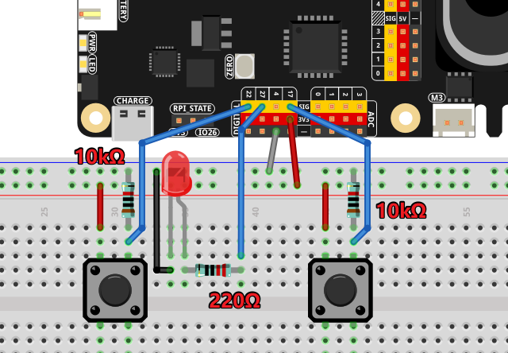

.. _py_morse_code_decoder:

(Example) AI-Powered Morse Code Decoder
========================================

**Introduction**

This project creates an intelligent **Morse Code Decoder** that uses AI to interpret timing patterns of button presses. The system captures precise timing data and leverages OpenAI's GPT to decode Morse code messages in real-time. The decoder features:

1. **Timing-based Input** capturing precise press and release times
2. **AI-powered Decoding** using GPT to interpret dot/dash patterns
3. **Visual Indicator** with LED showing active decoding state
4. **Dual-button Interface** separate input and control buttons
5. **Real-time Feedback** displaying timing data as you input

The system records button press durations, sends the timing data to AI for interpretation, and accurately decodes Morse code sequences like the universal distress signal "SOS."

You can combine timing-sensitive inputs with AI interpretation for various coding systems. See:

* :ref:`py_online_llm` 

----------------------------------------------

**What You'll Need**

The following components are required for this project:

.. list-table::
    :widths: 30 20
    :header-rows: 1

    *   - COMPONENT
        - PURCHASE LINK
    *   - :ref:`cpn_button`
        - |link_button_buy| (x2)
    *   - :ref:`cpn_led`
        - |link_led_buy|
    *   - :ref:`cpn_resistor`
        - |link_resistor_buy|
    *   - :ref:`cpn_fusion_hat`
        - \-
    *   - :ref:`cpn_wires`
        - |link_wires_buy|
    *   - Raspberry Pi
        - \-

----------------------------------------------

**Wiring Diagram**

Connect the components to the Raspberry Pi as follows:

**Component Connections:**

- **Morse Input Button (GPIO 22):**

  - One side to GPIO 22
  - Other side to Ground (pull-down configuration)

- **Start/Stop Button (GPIO 17):**

  - One side to GPIO 17
  - Other side to Ground (pull-down configuration)

- **LED Indicator (GPIO 27):**

  - Anode (long leg) to GPIO 27 through 220Ω resistor
  - Cathode (short leg) to Ground

*Note: Both buttons use pull-down configuration, meaning they read HIGH when pressed. The LED requires a current-limiting resistor.*

----------------------------------------------

.. include:: python_online_llms.rst
   :start-after: start_setup_openai
   :end-before: end_setup_openai

----------------------------------------------

**Run the Code**
   
   .. raw:: html
   
      <run></run>
   
   .. code-block:: shell

      cd ~/ai-lab-kit/llm   
      sudo python3 llm_openai_morse_decoder.py

----------------------------------------------

**Code**

Here is the full Python script for the AI-Powered Morse Code Decoder:

.. code-block:: python
   :linenos:
   
   from fusion_hat.llm import OpenAI
   from secret import OPENAI_API_KEY
   from fusion_hat.pin import Pin
   import random, time
   
   # Register OpenAI API
   # openai.com
   
   # Export your openai api key with :LLM_API_KEY
   # export LLM_API_KEY=sk-xxxxxxxxxxxxxxxxx
   
   # Setup GPIO pins
   morse_input = Pin(22, mode=Pin.IN, pull=Pin.PULL_DOWN, bounce_time=0.05)
   start_stop_button = Pin(17, mode=Pin.IN, pull=Pin.PULL_DOWN, bounce_time=0.05)
   led = Pin(27, Pin.OUT)  # Indicator LED on GPIO 27
   
   # Store the morse code events with timing data
   morse_events = []
   input_active = False  # Flag to indicate if input is active
   
   # Setup LLM with Morse code decoding instructions
   INSTRUCTIONS = "You are a Morse code decoder. Decode based on the button press time, interpreting short presses as dots and long presses as dashes. The message you receive may be a word or a sentence, please decode it and output it."
   
   WELCOME = "Hello, I am a Morse code decoder. Please press the button to start decoding. When you are done, press the button again to stop."
   
   llm = OpenAI(
       api_key=OPENAI_API_KEY,
       model="gpt-4o",
   )
   
   # Set how many messages to keep
   llm.set_max_messages(20)
   # Set instructions
   llm.set_instructions(INSTRUCTIONS)
   # Set welcome message
   llm.set_welcome(WELCOME)
   
   print(WELCOME)
   
   # Send the morse code timing data to the AI for decoding
   def decode_and_print():
       global morse_events
       
       # Convert timing events to string for AI processing
       input_text = str(morse_events)
       
       # Get response from AI with streaming
       response = llm.prompt(input_text, stream=True)
       
       # Print streaming response
       for next_word in response:
           if next_word:
               print(next_word, end="", flush=True)
       
       print("")  # New line after complete response
       
       morse_events = []  # Clear the morse code events for next message
   
   # Morse code input handling variables
   start_time = 0
   
   # Function called when morse input button is pressed
   def morse_input_pressed():
       global start_time
       start_time = time.time()  
       morse_events.append(('pressed', start_time))
       print(f" Pressed at {start_time} -", end="")
   
   # Function called when morse input button is released
   def morse_input_released():
       global morse_events, start_time
       release_time = time.time()  
       
       # Debounce: ignore releases within 0.1 seconds
       if release_time - start_time < 0.1:
           return
       
       morse_events.append(('released', release_time))
       print(f" {release_time}")
   
   # Start/stop button handler
   def handle_start_stop():
       global input_active, morse_events
       
       if input_active:
           # Stop recording and decode
           led.off()
           print("Input stopped and decoded.")
           decode_and_print()
           input_active = False
       else:
           # Start recording new message
           input_active = True
           morse_events.clear()  # Clear previous events
           led.on()
           print("Input started.")
   
   # Add event listeners to buttons
   start_stop_button.when_activated = handle_start_stop
   morse_input.when_activated = morse_input_pressed
   morse_input.when_deactivated = morse_input_released
   
   # Main program loop
   try:
       while True:
           time.sleep(0.1)
   except KeyboardInterrupt:
       pass

----------------------------------------------

**Running Example**

**Typical Console Output when Inputting "SOS":**

.. code-block:: text

   To decode the Morse code message based on the button press times provided, we need to interpret the duration of each press. Typically, a short press (dot) is around 0.2 to 0.3 seconds, while a long press (dash) is about 0.5 seconds or longer. Let's analyze the press durations:
   
   1. `1767773542.1257536` to `1767773542.285196` - Duration: ~0.16 seconds - Dot (.)
   2. `1767773542.4936137` to `1767773542.6315389` - Duration: ~0.14 seconds - Dot (.)
   3. `1767773542.9092748` to `1767773543.0543947` - Duration: ~0.15 seconds - Dot (.)
   4. `1767773544.2299025` to `1767773544.5774245` - Duration: ~0.35 seconds - Dash (-)
   5. `1767773545.1017563` to `1767773545.4954002` - Duration: ~0.39 seconds - Dash (-)
   6. `1767773546.11932` to `1767773546.5881057` - Duration: ~0.47 seconds - Dash (-)
   7. `1767773547.824543` to `1767773547.9534554` - Duration: ~0.13 seconds - Dot (.)
   8. `1767773548.1879761` to `1767773548.2895174` - Duration: ~0.10 seconds - Dot (.)
   9. `1767773548.5281847` to `1767773548.6453152` - Duration: ~0.12 seconds - Dot (.)
   
   Now let's decode the sequence into letters using Morse code:
   
   - `...` (Dot Dot Dot) = S
   - `---` (Dash Dash Dash) = O
   - `...` (Dot Dot Dot) = S
   
   Putting it all together, the decoded message is "SOS".

**Workflow Demonstration:**

1. **Start Recording:** Press start/stop button (GPIO 17) - LED turns ON
2. **Input Morse Code:** Use morse button (GPIO 22) to input dots (short presses) and dashes (long presses)
3. **Real-time Display:** Console shows precise press/release timestamps
4. **Stop and Decode:** Press start/stop button again - LED turns OFF
5. **AI Analysis:** System sends timing data to OpenAI GPT for interpretation
6. **Decoded Output:** AI provides detailed analysis and final decoded message

----------------------------------------------

**Understanding the Code**

1. **GPIO Pin Configuration**

   Three GPIO pins are configured for different purposes:
   
   .. code-block:: python
   
      morse_input = Pin(22, mode=Pin.IN, pull=Pin.PULL_DOWN, bounce_time=0.05)
      start_stop_button = Pin(17, mode=Pin.IN, pull=Pin.PULL_DOWN, bounce_time=0.05)
      led = Pin(27, Pin.OUT)
   
   - **Bounce time (0.05s):** Prevents multiple detections from mechanical switch bouncing
   - **Pull-down:** Ensures clean LOW signal when button is not pressed
   - **Separate functions:** Input vs. control buttons prevent accidental inputs

2. **Timing Data Storage**

   Press/release events are stored with precise timestamps:
   
   .. code-block:: python
   
      morse_events = []  # Empty list to store events
      
      # Each event stored as tuple: ('pressed'/'released', timestamp)
      morse_events.append(('pressed', 1767773542.1257536))
      morse_events.append(('released', 1767773542.285196))

3. **Debounce Mechanism**

   Prevents false triggers from switch bouncing:
   
   .. code-block:: python
   
      def morse_input_released():
          if release_time - start_time < 0.1:  # 100ms debounce
              return  # Ignore very short releases
          
          morse_events.append(('released', release_time))

4. **State Management**

   The system uses a flag to track recording state:
   
   .. code-block:: python
   
      input_active = False  # Initially not recording
      
      def handle_start_stop():
          if input_active:
              # Stop recording and decode
              input_active = False
          else:
              # Start recording
              input_active = True
              morse_events.clear()  # Clear previous data

5. **Visual Indicator**

   LED provides visual feedback of recording state:
   
   .. code-block:: python
   
      def handle_start_stop():
          if input_active:
              led.off()  # LED OFF when not recording
          else:
              led.on()   # LED ON when recording

6. **AI Prompt Construction**

   Timing data is converted to string for AI processing:
   
   .. code-block:: python
   
      input_text = str(morse_events)
      
      # Example format sent to AI:
      # "[('pressed', 1767773542.1257536), ('released', 1767773542.285196), ...]"

7. **Streaming Response**

   AI response is processed and displayed in real-time:
   
   .. code-block:: python
   
      response = llm.prompt(input_text, stream=True)
      
      for next_word in response:
          if next_word:
              print(next_word, end="", flush=True)

8. **Event-driven Architecture**

   Button events trigger immediate callbacks:
   
   .. code-block:: python
   
      # Assign callback functions to button events
      start_stop_button.when_activated = handle_start_stop
      morse_input.when_activated = morse_input_pressed
      morse_input.when_deactivated = morse_input_released

9. **Timing Precision**

   Uses ``time.time()`` for microsecond-precise timing:
   
   .. code-block:: python
   
      start_time = time.time()  # Current time in seconds since epoch
      
      # Calculate press duration:
      duration = release_time - start_time

10. **Data Clearing**

    After decoding, the event list is cleared for next message:
    
    .. code-block:: python
    
        def decode_and_print():
            # ... process events ...
            morse_events = []  # Clear for next message

----------------------------------------------

**Morse Code Timing Standards**

**Standard Timing (based on word PARIS):**

- **Dot:** 1 unit
- **Dash:** 3 units
- **Intra-character gap (between dots/dashes):** 1 unit
- **Inter-character gap (between letters):** 3 units
- **Word gap (between words):** 7 units

**Practical Implementation:**

- **Dot:** < 0.3 seconds (short press)
- **Dash:** > 0.5 seconds (long press)
- **Between elements:** < 0.5 seconds pause
- **Between letters:** 0.5-1.5 seconds pause
- **Between words:** > 1.5 seconds pause

**Common Morse Code Letters:**

- A: • — (dot-dash)
- B: — • • • (dash-dot-dot-dot)
- C: — • — • (dash-dot-dash-dot)
- S: • • • (dot-dot-dot)
- O: — — — (dash-dash-dash)

----------------------------------------------

**How It Works - Step by Step**

1. **Initialization:**

   - System prints welcome message
   - LED is OFF (not recording)
   - Event list is empty

2. **Starting Recording:**

   - User presses start/stop button (GPIO 17)
   - LED turns ON (visual indicator)
   - ``input_active`` flag set to ``True``
   - Previous events cleared

3. **Inputting Morse Code:**

   - User presses morse button (GPIO 22) for dots/short presses
   - User holds morse button for dashes/long presses
   - Each press/release pair recorded with timestamps
   - Real-time display shows timing data

4. **Stopping Recording:**

   - User presses start/stop button again
   - LED turns OFF
   - Event list sent to AI for decoding

5. **AI Decoding Process:**

   - GPT analyzes timing patterns
   - Calculates press durations
   - Classifies as dots (<0.3s) or dashes (>0.5s)
   - Groups into letters based on timing gaps
   - Maps to alphabet using Morse code

6. **Output Display:**

   - AI explains reasoning step by step
   - Shows duration calculations
   - Displays dot/dash classification
   - Groups into letters
   - Provides final decoded message

----------------------------------------------

**Troubleshooting**

- **"Button presses not registering"**

  - Check wiring: GPIO 22/17 to button, other side to Ground
  - Verify pull-down configuration
  - Test with simple script: ``print(Pin(22, mode=Pin.IN, pull=Pin.PULL_DOWN).read())``
  - Check bounce time setting (0.05s may be too high)

- **"LED not lighting up"**

  - Verify LED polarity: anode (long leg) to GPIO 27 through resistor
  - Check resistor value (220Ω recommended)
  - Test LED directly: ``Pin(27, Pin.OUT).on()`` should light LED
  - Ensure ground connection is complete

- **"Timing data seems wrong"**

  - Check system clock: ``date`` command
  - Reduce debounce time if too sensitive
  - Add print statements to verify callback execution
  - Test with consistent press durations

- **"AI not decoding correctly"**

  - Check API key and internet connection
  - Examine timing data sent to AI (print ``morse_events``)
  - Ensure consistent press durations (dots short, dashes long)
  - Add clearer pauses between letters

- **"Multiple triggers from single press"**

  - Increase bounce_time parameter (try 0.1s)
  - Check for mechanical switch bouncing
  - Add hardware debounce with capacitor
  - Verify button is properly wired

- **"System doesn't respond to start/stop"**

  - Check if other callback is interfering
  - Verify ``input_active`` flag logic
  - Add debug prints to ``handle_start_stop()``
  - Ensure no other process using GPIO

- **"AI response too slow"**

  - Check internet connection speed
  - Reduce number of events (shorter messages)
  - Consider using local decoding as fallback
  - Implement timeout for AI responses

- **"Can't distinguish dots from dashes"**

  - Practice consistent timing
  - Adjust threshold in AI instructions
  - Add local preprocessing before sending to AI
  - Use visual feedback during input

----------------------------------------------

**Try It Yourself**

1. **Audible Feedback**  

   Add buzzer that beeps during button presses for auditory Morse code practice.

2. **Visual Morse Display**  

   Add LED that blinks dots/dashes during playback of recorded messages.

3. **Timing Calibration Mode**  

   Add calibration routine to learn user's specific dot/dash timing.

4. **Two-way Translation**  

   Add text-to-Morse mode that converts typed text to blinking LED pattern.

5. **Morse Code Tutor**  

   Create learning mode that generates random letters for practice.

6. **Historical Messages**  

   Store and replay famous Morse code messages (SOS, Titanic distress call).

7. **Multiple Encoding Standards**  

   Support different Morse variants (American, Continental, etc.).

8. **Speed Challenge Mode**  

   Game that tests how fast you can accurately input Morse code.

9. **Error Correction**  

   Add AI that suggests corrections for poorly timed inputs.

10. **Encryption Layer**  

    Add simple cipher (Caesar, substitution) on top of Morse code.

11. **Multi-language Support**  

    Extend to International Morse with accented characters.

12. **Prosign Recognition**  

    Recognize and process procedural signals (BT, AR, SK, etc.).

13. **Signal Strength Simulation**  

    Add "fading" effect that makes decoding more challenging.

14. **Competitive Multiplayer**  

    Two players compete to decode messages fastest.

15. **Morse Keyboard**  

    Use as alternative input method for typing text.

16. **Weather Morse**  

    Connect to weather API and display conditions in Morse code.

17. **Secret Messaging**  

    Add password protection and encryption for private messages.

18. **Morse Clock**  

    Display current time in Morse code via LED blinks.

19. **Learning Progress Tracking**  

    Track accuracy and speed improvements over time.

20. **Integration with Radio**  

    Connect to software-defined radio for real Morse transmission.

This AI-powered Morse code decoder demonstrates how precise timing data combined with intelligent pattern recognition can revive and modernize historical communication methods, making them accessible and educational for new generations!