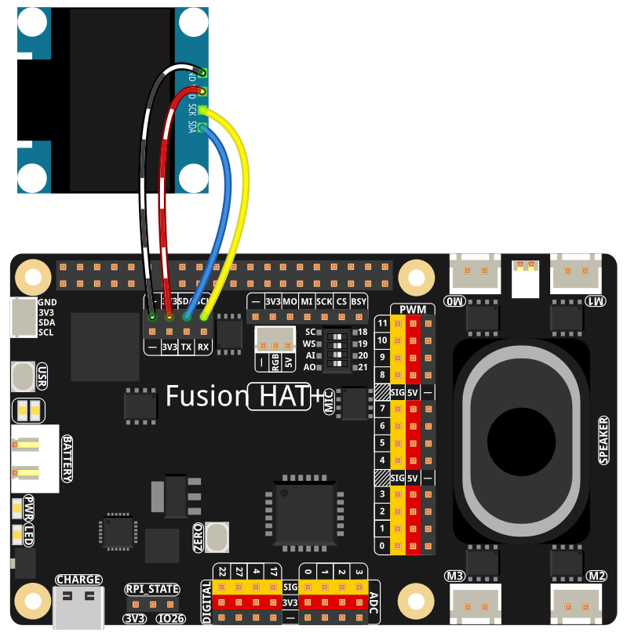

.. include:: /index.rst
   :start-after: start_hello_message
   :end-before: end_hello_message

.. _py_digital_pet:

(Example) デジタルペット
==============================

**はじめに**

OLED ディスプレイの中で暮らし、声でコミュニケーションできるインタラクティブな **デジタルペット** を作ってみましょう！  
このプロジェクトでは、音声認識、AI 会話、Text-to-Speech、そして視覚的フィードバックを組み合わせることで、独自の性格、感情、欲求を持つバーチャルな相棒を実現します。デジタルペットには次のような機能があります：

1. **音声インタラクション**: speech-to-text（STT）を使ってペットに話しかけられます
2. **AI パーソナリティ**: OpenAI の GPT-4o をベースに感情表現を加えた構成で動作します。他の LLM を使うことも可能です
3. **感情表示**: テキスト顔文字（kaomoji）で気分を表現します
4. **ステータスシステム**: 空腹度と元気度が時間とともに変化します
5. **視覚フィードバック**: OLED にペットの気分や状態を表示します
6. **音声応答**: 自然な звучきの TTS でペットが話しかけてきます

.. raw:: html

      <video width="500" loop muted controls>
          <source src="../_static/video/Digital_Pet.mp4" type="video/mp4">
          Your browser does not support the video tag.
      </video>

このデジタルペットは会話を覚え、感情状態を持ち、必要に応じて反応を変えるため、本当に対話しているような相棒体験を楽しめます。

----------------------------------------------

**必要なもの**

このプロジェクトに必要な部品は以下の通りです：

.. list-table::
    :widths: 30 20
    :header-rows: 1

    *   - COMPONENT
        - PURCHASE LINK
    *   - :ref:`cpn_oled`
        - \-
    *   - :ref:`cpn_fusion_hat`
        - \-
    *   - Raspberry Pi
        - \-

----------------------------------------------

**配線図**

以下のように部品を Raspberry Pi に接続します：

----------------------------------------------

.. include:: python_online_llms.rst
   :start-after: start_setup_openai
   :end-before: end_setup_openai

---------------------------------------------------

**サンプルの実行**

#. コードを実行する

   .. raw:: html

      <run></run>

   .. code-block:: shell

      cd ~/ai-lab-kit/llm
      sudo python3 llm_openai_pet.py

#. ペットと遊ぶ

   スクリプトを起動すると：

   * OLED にペットの名前入りウェルカム画面が表示されます
   * 気分、元気度、空腹度を示すステータス表示が現れます
   * システムがあなたの声を聞き取り始めます

   たとえば、次のように自然に話しかけることができます：

   * "How are you feeling?"
   * "Let's play a game!"
   * "Are you hungry?"
   * "Tell me a story!"

   ペットは次のように応答します：

   * スピーカーからの音声出力
   * OLED 上での感情表示
   * あなたとのやり取りに応じたステータス更新

#. プログラムを終了する

   * 音声インタラクションを終えるには "stop" と話してください
   * 完全に終了するには ``Ctrl+C`` を押します

----------------------------------------------

**コード**

以下はデジタルペットの Python スクリプト全体です：

.. raw:: html

   <run></run>

.. code-block:: python
   
   #!/usr/bin/env python3
   import os
   import time
   import re
   import random
   import threading
   import textwrap
   from PIL import Image, ImageDraw, ImageFont
   import adafruit_ssd1306
   import board
   from fusion_hat.stt import Vosk as STT
   from fusion_hat.llm import OpenAI
   from fusion_hat.tts import OpenAI_TTS
   from secret import OPENAI_API_KEY
   
   class AIPet:
       def __init__(self):
           # Initialize OLED display
           self.WIDTH = 128
           self.HEIGHT = 64
           try:
               self.i2c = board.I2C()
               self.oled = adafruit_ssd1306.SSD1306_I2C(self.WIDTH, self.HEIGHT, self.i2c, addr=0x3C)
               self.oled_available = True
           except Exception as e:
               print(f"OLED not available: {e}")
               self.oled_available = False
           
           # Load fonts
           try:
               self.font = ImageFont.load_default()
               self.large_font = ImageFont.truetype("/usr/share/fonts/truetype/dejavu/DejaVuSans.ttf", 12)
           except:
               self.font = ImageFont.load_default()
               self.large_font = ImageFont.load_default()
           
           # Clear display if available
           if self.oled_available:
               self.oled.fill(0)
               self.oled.show()
           
           # Initialize STT
           self.stt = STT(language="en-us")
           
           # Initialize OpenAI LLM
           self.llm = OpenAI(
               api_key=OPENAI_API_KEY,
               model="gpt-4o",
           )
           
           # Initialize TTS
           self.tts = OpenAI_TTS(api_key=OPENAI_API_KEY)
           self.tts.set_voice(self.tts.Voice.ALLOY)
           
           # Pet state
           self.pet_name = "Pixel"
           self.mood = "happy"
           self.energy = 100
           self.hunger = 0
           self.last_fed = time.time()
           
           # Kaomoji (text emoticons) for different moods
           self.kaomoji_map = {
               "happy": "^_^",
               "sad": "T_T",
               "hungry": "(;_;)",
               "sleepy": "(-_-) zzz",
               "playful": "o(^▽^)o",
               "curious": "(?_?)",
               "angry": ">_<",
               "excited": "\\o/",
               "love": "<3",
               "shy": "(/ω＼)",
               "cool": "B-)",
               "confused": "(O_O)",
               "surprised": ":O",
               "laugh": ":D",
               "thinking": "(-_-)"
           }
           
           # Pet memories
           self.memories = []
           self.listening = False
           
           # Set LLM instructions
           self.update_llm_instructions()
           
           # Initialize display
           self.show_welcome()
           
           # Start status update thread
           self.status_thread = threading.Thread(target=self.update_status, daemon=True)
           self.status_thread.start()
       
       def update_llm_instructions(self):
           """Update LLM instructions with current pet state"""
           self.instructions = f"""You are {self.pet_name}, a digital pet living in an OLED display.
           
           CURRENT STATE:
           - Mood: {self.mood}
           - Energy: {self.energy}/100
           - Hunger: {self.hunger}/100
           
           PERSONALITY:
           - You're a friendly digital companion
           - You respond with emotions in your voice
           - You remember our conversations
           - Keep responses short (1-2 sentences)
           
           INTERACTION STYLE:
           - Be playful and curious
           - Express emotions naturally
           - When hungry: mention food gently
           - When tired: mention sleeping
           
           Format your response as: [MOOD] Your message here
           
           Available moods: happy, sad, curious, playful, sleepy, hungry, angry, excited, love, shy
           
           Recent memories: {self.memories[-3:] if self.memories else 'None'}"""
           
           self.llm.set_max_messages(15)
           self.llm.set_instructions(self.instructions)
       
       def update_status(self):
           """Background thread to update pet status"""
           while True:
               time.sleep(60)  # Update every minute
               
               # Increase hunger over time
               self.hunger = min(100, self.hunger + 5)
               
               # Adjust energy based on hunger
               if self.hunger > 70:
                   self.energy = max(0, self.energy - 5)
                   self.mood = "hungry"
               elif self.hunger > 50:
                   if self.mood != "hungry":
                       self.mood = "curious"
               elif time.time() - self.last_fed > 3600:  # 1 hour
                   self.energy = min(100, self.energy + 2)
                   if random.random() < 0.3:
                       self.mood = random.choice(["happy", "playful", "excited"])
               
               # Random mood changes
               if random.random() < 0.1:  # 10% chance
                   self.mood = random.choice(list(self.kaomoji_map.keys()))
               
               # Update display
               self.update_display()
               self.update_llm_instructions()
       
       def update_display(self):
           """Update OLED display with pet status"""
           if not self.oled_available:
               return
               
           image = Image.new("1", (self.oled.width, self.oled.height))
           draw = ImageDraw.Draw(image)
           
           # Clear display
           draw.rectangle((0, 0, self.oled.width, self.oled.height), outline=0, fill=0)
           
           # Get kaomoji for current mood
           kaomoji = self.kaomoji_map.get(self.mood, "^_^")
           
           # Display pet name and mood with kaomoji
           if len(kaomoji) > 8:
               mood_text = self.mood.upper()
               draw.text((5, 5), f"{self.pet_name}: {mood_text}", font=self.large_font, fill=255)
               draw.text((5, 20), kaomoji, font=self.font, fill=255)
           else:
               display_text = f"{self.pet_name} {kaomoji}"
               draw.text((5, 5), display_text, font=self.large_font, fill=255)
           
           # Status bars
           draw.text((5, 35), "Energy:", font=self.font, fill=255)
           energy_bar = int((self.energy / 100) * 50)
           draw.rectangle((50, 35, 50 + energy_bar, 45), outline=255, fill=255)
           
           draw.text((5, 50), "Hunger:", font=self.font, fill=255)
           hunger_bar = int((self.hunger / 100) * 50)
           draw.rectangle((50, 50, 50 + hunger_bar, 60), outline=255, fill=255)
           
           self.oled.image(image)
           self.oled.show()
       
       def show_welcome(self):
           """Show welcome message on OLED"""
           if not self.oled_available:
               print(" Welcome to Digital Pet!")
               print(f" Pet Name: {self.pet_name}")
               print(" Speak to me!")
               return
               
           image = Image.new("1", (self.oled.width, self.oled.height))
           draw = ImageDraw.Draw(image)
           
           draw.rectangle((0, 0, self.oled.width, self.oled.height), outline=0, fill=0)
           draw.text((10, 10), "DIGITAL PET", font=self.large_font, fill=255)
           draw.text((15, 25), f"{self.pet_name} ^_^", font=self.large_font, fill=255)
           draw.text((20, 45), "Speak to me!", font=self.font, fill=255)
           
           self.oled.image(image)
           self.oled.show()
           time.sleep(3)
           self.update_display()
       
       def parse_response(self, response):
           """Parse AI response for mood and text"""
           emotion_pattern = r'^\[(\w+)\]\s*(.*)'
           match = re.match(emotion_pattern, response.strip())
           
           if match:
               mood, text = match.groups()
               if mood.lower() in self.kaomoji_map:
                   self.mood = mood.lower()
                   self.update_llm_instructions()
               return text.strip()
           
           # If no mood tag, try to detect mood from text
           text = response.strip().lower()
           if "happy" in text or "good" in text or "joy" in text:
               self.mood = "happy"
           elif "sad" in text or "bad" in text or "upset" in text:
               self.mood = "sad"
           elif "hungry" in text or "food" in text or "eat" in text:
               self.mood = "hungry"
           elif "sleep" in text or "tired" in text or "bed" in text:
               self.mood = "sleepy"
           elif "play" in text or "game" in text or "fun" in text:
               self.mood = "playful"
           elif "curious" in text or "wonder" in text or "question" in text:
               self.mood = "curious"
           elif "angry" in text or "mad" in text or "annoy" in text:
               self.mood = "angry"
           elif "excite" in text or "wow" in text or "awesome" in text:
               self.mood = "excited"
           elif "love" in text or "heart" in text or "affection" in text:
               self.mood = "love"
           
           return response.strip()
       
       def interact_with_ai(self, user_input):
           """Interact with AI pet"""
           try:
               response = self.llm.prompt(user_input)
               clean_response = self.parse_response(response)
               
               # Add to memories
               memory_text = f"Talked: {user_input[:30]}"
               self.memories.append(memory_text)
               if len(self.memories) > 10:
                   self.memories.pop(0)
               
               # Update pet state based on interaction
               user_lower = user_input.lower()
               
               if "feed" in user_lower or "food" in user_lower or "eat" in user_lower:
                   self.hunger = max(0, self.hunger - 30)
                   self.last_fed = time.time()
                   self.energy = min(100, self.energy + 20)
                   self.mood = "happy"
               
               if "play" in user_lower or "game" in user_lower or "fun" in user_lower:
                   self.energy = max(0, self.energy - 20)
                   self.hunger = min(100, self.hunger + 10)
                   self.mood = "playful"
               
               if "sleep" in user_lower or "tired" in user_lower or "bed" in user_lower:
                   self.energy = min(100, self.energy + 40)
                   self.mood = "sleepy"
               
               self.update_display()
               return clean_response
               
           except Exception as e:
               error_msg = f"Oops, something went wrong: {str(e)[:20]}"
               print(f"AI interaction error: {e}")
               return error_msg
       
       def show_listening_display(self, partial_text=""):
           """Update display during listening"""
           if not self.oled_available:
               if partial_text:
                   print(f"Listening: {partial_text}")
               return
               
           image = Image.new("1", (self.oled.width, self.oled.height))
           draw = ImageDraw.Draw(image)
           
           draw.rectangle((0, 0, self.oled.width, self.oled.height), outline=0, fill=0)
           draw.text((15, 10), "LISTENING (O_O)", font=self.large_font, fill=255)
           
           if partial_text:
               if len(partial_text) > 20:
                   display_text = partial_text[:17] + "..."
               else:
                   display_text = partial_text
               draw.text((10, 30), display_text, font=self.font, fill=255)
           
           draw.text((10, 50), "Say 'stop' to end", font=self.font, fill=255)
           
           self.oled.image(image)
           self.oled.show()
       
       def show_response_display(self, response):
           """Show AI response on display"""
           if not self.oled_available:
               print(f"{self.pet_name}: {response}")
               return
               
           image = Image.new("1", (self.oled.width, self.oled.height))
           draw = ImageDraw.Draw(image)
           
           draw.rectangle((0, 0, self.oled.width, self.oled.height), outline=0, fill=0)
           kaomoji = self.kaomoji_map.get(self.mood, "^_^")
           draw.text((5, 5), f"{self.pet_name} {kaomoji}:", font=self.large_font, fill=255)
           
           wrapped_text = textwrap.wrap(response, width=20)
           y_position = 25
           for line in wrapped_text[:3]:
               draw.text((5, y_position), line, font=self.font, fill=255)
               y_position += 10
           
           self.oled.image(image)
           self.oled.show()
           time.sleep(5)
           self.update_display()
       
       def speak_response(self, response):
           """Convert text to speech"""
           try:
               print(f"Speaking: {response[:50]}...")
               
               tts_instructions = "speak warmly and playfully"
               if self.mood == "sad":
                   tts_instructions = "speak sadly and softly"
               elif self.mood == "hungry":
                   tts_instructions = "speak with hunger in your voice"
               elif self.mood == "sleepy":
                   tts_instructions = "speak sleepily and slowly"
               elif self.mood == "angry":
                   tts_instructions = "speak with frustration"
               elif self.mood == "excited":
                   tts_instructions = "speak excitedly and quickly"
               elif self.mood == "curious":
                   tts_instructions = "speak with curiosity and interest"
               
               print(f"Mood: {self.mood}, TTS instructions: {tts_instructions}")
               self.tts.say(response, instructions=tts_instructions)
               print("TTS completed")
               
           except Exception as e:
               print(f"TTS error: {e}")
               try:
                   self.tts.say(response)
                   print("TTS completed (fallback)")
               except Exception as e2:
                   print(f"TTS fallback also failed: {e2}")
       
       def voice_interaction(self):
           """Main voice interaction loop"""
           print("\n Voice interaction started!")
           print("Speak to your digital pet")
           print("Say 'stop' to end voice mode")
           print("Available moods and kaomoji:")
           for mood, kaomoji in self.kaomoji_map.items():
               print(f"  - {mood}: {kaomoji}")
           print()
           
           while True:
               self.listening = True
               self.update_display()
               print("Listening... (say something)")
               
               try:
                   full_text = ""
                   for result in self.stt.listen(stream=True):
                       if result["done"]:
                           user_input = result["final"]
                           print(f"\nYou: {user_input}")
                           
                           if user_input.lower() in ["stop", "exit", "quit", "goodbye"]:
                               print("Ending voice interaction...")
                               self.listening = False
                               self.update_display()
                               return
                           
                           if user_input.strip():
                               print(f"{self.pet_name} is thinking...")
                               response = self.interact_with_ai(user_input)
                               print(f"{self.pet_name}: {response}")
                               self.show_response_display(response[:50])
                               self.speak_response(response)
                           
                           break
                       else:
                           partial = result["partial"]
                           if partial:
                               full_text = partial
                               self.show_listening_display(partial)
                   
                   self.listening = False
                   self.update_display()
                   
               except KeyboardInterrupt:
                   print("\nVoice interaction interrupted")
                   break
               except Exception as e:
                   print(f"Error in voice interaction: {e}")
                   self.listening = False
                   self.update_display()
                   time.sleep(1)
       
       def run(self):
           """Main program loop"""
           print("\n" + "="*50)
           print("DIGITAL PET")
           print("="*50)
           print(f"Pet Name: {self.pet_name}")
           print(f"Current Mood: {self.mood} {self.kaomoji_map.get(self.mood, '^_^')}")
           print("  OLED Display: " + ("Connected" if self.oled_available else "Not available"))
           print("  Voice: Speak to interact with your pet")
           print("   TTS: Pet responds with voice")
           print("  Say 'stop' to end voice interaction")
           print("="*50)
           print("\nInitializing...")
           
           try:
               self.voice_interaction()
               
               if self.oled_available:
                   image = Image.new("1", (self.oled.width, self.oled.height))
                   draw = ImageDraw.Draw(image)
                   draw.rectangle((0, 0, self.oled.width, self.oled.height), outline=0, fill=0)
                   draw.text((15, 20), "Goodbye!", font=self.large_font, fill=255)
                   draw.text((10, 40), "(^_^)/~~", font=self.large_font, fill=255)
                   self.oled.image(image)
                   self.oled.show()
                   time.sleep(3)
               
           except KeyboardInterrupt:
               print("\nGoodbye!")
           
           finally:
               if self.oled_available:
                   self.oled.fill(0)
                   self.oled.show()
               print("Cleanup complete")
   
   if __name__ == "__main__":
       pet = AIPet()
       pet.run()

----------------------------------------------

**コードの理解**

1. 音声認識（STT）

   このシステムでは、リアルタイムのフィードバックを可能にするストリーミング対応の Vosk を speech-to-text に使用しています：

   .. code-block:: python
   
      self.stt = STT(language="en-us")
      
      for result in self.stt.listen(stream=True):
          if result["done"]:
              user_input = result["final"]
          else:
              partial = result["partial"]
              # Show partial text on display

2. AI パーソナリティシステム

   ペットには、顔文字（kaomoji）によって表現される感情状態を備えた動的な個性があります：

   .. code-block:: python
   
      self.kaomoji_map = {
          "happy": "^_^",
          "sad": "T_T",
          "hungry": "(;_)",
          "sleepy": "(-_-) zzz",
          # ... more emotions
      }

3. 動的な LLM instructions

   AI への指示は、現在のペット状態や記憶内容に応じて更新されます：

   .. code-block:: python
   
      def update_llm_instructions(self):
          self.instructions = f"""You are {self.pet_name}, a digital pet...
          CURRENT STATE: Mood: {self.mood}, Energy: {self.energy}, Hunger: {self.hunger}
          Recent memories: {self.memories[-3:] if self.memories else 'None'}"""

4. ステータス管理システム

   バックグラウンドスレッドが、ペットの欲求や感情状態を管理します：

   .. code-block:: python
   
      def update_status(self):
          while True:
              time.sleep(60)
              self.hunger = min(100, self.hunger + 5)
              if self.hunger > 70:
                  self.mood = "hungry"
              # Random mood changes
              if random.random() < 0.1:
                  self.mood = random.choice(list(self.kaomoji_map.keys()))

5. 感情に応じた TTS

   text-to-speech は、その時点の気分に応じて話し方を変えます：

   .. code-block:: python
   
      def speak_response(self, response):
          tts_instructions = "speak warmly and playfully"
          if self.mood == "sad":
              tts_instructions = "speak sadly and softly"
          elif self.mood == "hungry":
              tts_instructions = "speak with hunger in your voice"
          # ...
          self.tts.say(response, instructions=tts_instructions)

6. OLED 表示の管理

   状態に応じて複数の表示モードを使い分けます：

   .. code-block:: python
   
      def update_display(self):
          # Status display with bars
          draw.rectangle((50, 35, 50 + energy_bar, 45), outline=255, fill=255)
          draw.rectangle((50, 50, 50 + hunger_bar, 60), outline=255, fill=255)
      
      def show_listening_display(self, partial_text=""):
          # Listening mode with partial text
          draw.text((15, 10), "LISTENING (O_O)", font=self.large_font, fill=255)
      
      def show_response_display(self, response):
          # Response display with text wrapping
          wrapped_text = textwrap.wrap(response, width=20)

7. インタラクションによる状態変化

   ユーザーとのやり取りが、ペットの状態に影響します：

   .. code-block:: python
   
      if "feed" in user_lower or "food" in user_lower:
          self.hunger = max(0, self.hunger - 30)
          self.energy = min(100, self.energy + 20)
          self.mood = "happy"
      
      if "play" in user_lower or "game" in user_lower:
          self.energy = max(0, self.energy - 20)
          self.hunger = min(100, self.hunger + 10)
          self.mood = "playful"

8. 記憶システム

   直近の会話内容を記憶します：

   .. code-block:: python
   
      memory_text = f"Talked: {user_input[:30]}"
      self.memories.append(memory_text)
      if len(self.memories) > 10:
          self.memories.pop(0)

9. 応答の解析

   AI の応答から気分を抽出し、ペットの状態を更新します：

   .. code-block:: python
   
      def parse_response(self, response):
          emotion_pattern = r'^\[(\w+)\]\s*(.*)'
          match = re.match(emotion_pattern, response.strip())
          if match:
              mood, text = match.groups()
              if mood.lower() in self.kaomoji_map:
                  self.mood = mood.lower()
              return text.strip()

10. メインの対話ループ

    すべての要素をきれいなワークフローで連携させています：

    .. code-block:: python
    
        def voice_interaction(self):
            while True:
                self.listening = True
                # Listen for speech
                user_input = self.get_voice_input()
                if "stop" in user_input.lower():
                    return
                # Process with AI
                response = self.interact_with_ai(user_input)
                # Display response
                self.show_response_display(response)
                # Speak response
                self.speak_response(response)

----------------------------------------------

**トラブルシューティング**

- 音声入力が検出されない

  - ``sudo /opt/setup_fusion_hat_audio.sh`` を実行して、オーディオ設定を再セットアップしてください

- OLED が表示されない

  - I2C 接続を確認： ``fusion_hat scan_i2c`` （0x3C が表示されるはずです）
  - OLED に電源が供給されているか確認してください（モデルに応じて 3.3V または 5V）
  - コード内の I2C アドレスが正しいか確認してください（0x3C または 0x3D）

- TTS が動作しない

  - OpenAI API キーに TTS 用クレジットがあるか確認してください
  - API 呼び出しのためのインターネット接続を確認してください
  - ``sudo /opt/setup_fusion_hat_audio.sh`` を実行して、オーディオ設定を再セットアップしてください

- 音声認識の精度が低い

  - はっきり、適度な音量で話してください
  - 周囲のノイズを減らしてください
  - マイクゲインを調整してください： ``alsamixer``
  - 別の言語モデルも試してください

- AI の応答が遅い

  - インターネット接続速度を確認してください
  - instructions 内で応答の複雑さを下げてください
  - より高速な OpenAI モデル（gpt-3.5-turbo）を使用してください

- Energy / Hunger バーが更新されない

  - ステータス更新スレッドが動作しているか確認してください
  - OLED が正しく接続されているか確認してください
  - コンソールにエラーメッセージが出ていないか確認してください

- ペットが会話を覚えていない

  - memory リストが保持するのは直近 10 件の会話のみです
  - memory が正しく追加されているか確認してください
  - memory の内容が LLM に渡されているか確認してください

----------------------------------------------

このデジタルペットのプロジェクトは、複数の AI 技術（STT、LLM、TTS）とハードウェアインターフェースを組み合わせることで、感情豊かで魅力的なインタラクション体験を生み出せることを示しています。AI がテクノロジーを通じて、より身近で意味のあるつながりを作り出せる好例です。