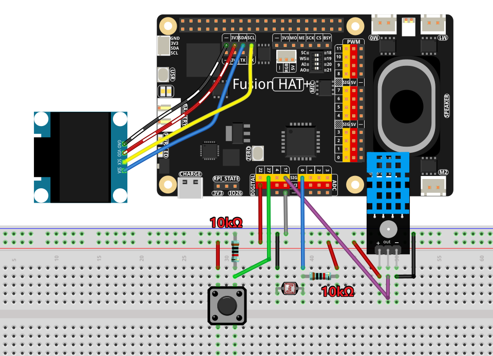

.. include:: /index.rst
   :start-after: start_hello_message
   :end-before: end_hello_message

.. _py_smart_weather_station:

(示例) 智能气象站
=================

**简介**

本项目创建一个全面的\ **智能气象站**\ ，将本地环境传感器与全球天气数据和 AI 分析相结合。该系统集成了：

1. **本地传感器数据**：来自 DHT11（温度/湿度）和 LDR（光线传感器）
2. **全球天气预报**：来自 OpenWeather API
3. **AI 驱动的语音分析**：使用 OpenAI 的 GPT 和 TTS 功能
4. **视觉显示**：在 128x64 OLED 屏幕上显示
5. **交互式按键**：一键获取 AI 天气洞察

.. raw:: html

      <video width="500" loop muted controls>
          <source src="../_static/video/Smart_Weather_Station.mp4" type="video/mp4">
          Your browser does not support the video tag.
      </video>

气象站自动比对本地条件与预报数据，并通过语音输出提供智能建议，打造完整的环境监测解决方案。

您可以使用其他 LLM 模块和 TTS 模块构建自己的智能设备。
请参阅：

* :ref:`py_online_llm`
* :ref:`tts_espeak_pico2wave`
* :ref:`tts_piper_openai`

----------------------------------------------

**所需材料**

本项目需要以下元器件：

.. list-table::
    :widths: 30 20
    :header-rows: 1

    *   - 元器件
        - 购买链接
    *   - :ref:`cpn_humiture_sensor`
        - |link_humiture_buy|
    *   - :ref:`cpn_photoresistor`
        - |link_photoresistor_buy|
    *   - :ref:`cpn_button`
        - |link_button_buy|
    *   - :ref:`cpn_oled`
        - \-
    *   - :ref:`cpn_fusion_hat`
        - \-
    *   - :ref:`cpn_wires`
        - |link_wires_buy|
    *   - :ref:`cpn_resistor`
        - |link_resistor_buy|
    *   - Raspberry Pi
        - \-

----------------------------------------------

**接线图**

按如下方式将元器件连接到 Fusion HAT+：

----------------------------------------------

.. include:: python_online_llms.rst
   :start-after: start_setup_openai
   :end-before: end_setup_openai

---------------------------------------------

**获取 OpenWeather API 密钥**

|link_openweather| 是一项在线服务，由 OpenWeather Ltd 拥有，通过 API 提供全球天气数据，包括当前位置的当前天气数据、预报、临近预报和历史天气数据。

#. 访问 |link_openweather| 登录/创建账户。

    .. image:: img/OWM-1.png

#. 从导航栏进入 API 页面。

    .. image:: img/OWM-2.png

#. 找到\ **当前天气数据**\ 并点击订阅。

    .. image:: img/OWM-3.png

#. 在\ **当前天气与预报集合**\ 下，订阅适合的服务。在我们的项目中，Free 套餐已足够。

   .. image:: img/OWM-4.png

#. 从 **API keys** 页面复制密钥。

   .. image:: img/OWM-5.png

#. 使用以下命令打开 ``secret.py`` 文件：

   .. raw:: html

      <run></run>

   .. code-block:: bash

       cd ~/ai-lab-kit/llm
       sudo nano secret.py

#. 添加复制的 API 密钥：

   .. code-block:: shell
      :emphasize-lines: 1

      OPENWEATHER_API_KEY = "732exxxxxxxxxxxxxxxxxxxxx919b"

#. 按 ``Ctrl + X``\ ，然后按 ``Y``\ ，最后按 ``Enter`` 保存文件并退出。

---------------------------------------------

**运行示例**

#. 运行代码

   .. raw:: html

      <run></run>

   .. code-block:: shell

      cd ~/ai-lab-kit/llm
      sudo python3 llm_openai_weather.py

#. 脚本启动后的显示效果

   * OLED 亮起并开始显示天气信息。
   * 程序在终端中打印启动信息，包括目标城市和按键引脚。
   * OLED 每 10 秒自动切换页面（共 3 页）：

     - **第 1 页：本地传感器** （DHT11 + LDR）
       显示本地温度、湿度和光照强度（带小型光条）。

     - **第 2 页：天气预报** （OpenWeather）
       显示当前温度、天气描述和上次更新时间。

     - **第 3 页：AI 洞察**
       显示本地传感器读数与 OpenWeather 数据的差异，以及简单的舒适度状态（例如：舒适 / 温暖 / 凉爽 / 潮湿 / 干燥）。

#. 触发 AI 语音分析

   按下 **GPIO 27** 上的按键，让 AI 生成一段简短的"天气播报员"风格分析。

   * 终端将打印 **AI Analysis** 部分，包括：

     - 本地读数（温度 / 湿度 / 光照）
     - 远程天气（OpenWeather 温度 + 描述）
     - AI 生成的简短文字总结

   * OLED 将暂时显示 **SPEAKING...**
   * 分析结果将通过扬声器使用 OpenAI TTS 朗读

#. 数据更新行为

   * 本地传感器大约每 **2 秒** 更新一次。
   * OpenWeather 数据大约每 **5 分钟** 更新一次。
   * 光照读数会自动平滑处理，减少闪烁。

#. 停止程序

   * 在终端中按 ``Ctrl+C`` 退出。
   * OLED 将清除显示，程序安全停止。

----------------------------------------------

**代码**

以下是智能气象站的完整 Python 脚本：

.. raw:: html

   <run></run>

.. code-block:: python

   #!/usr/bin/env python3
   # -*- coding: utf-8 -*-

   """
   Smart Weather Station with AI Assistant
   - Reads local temperature & humidity from DHT11 on GPIO 17
   - Reads light level from LDR on ADC A0 (0..4095)
   - Fetches weather forecast from OpenWeather API
   - Provides AI voice analysis using OpenAI (triggered by button)
   - Displays all information on 128x64 SSD1306 OLED
   """

   import time
   import requests
   from datetime import datetime
   from statistics import mean
   from fusion_hat.modules import DHT11
   from fusion_hat.adc import ADC
   from fusion_hat.pin import Pin, Mode, Pull
   from PIL import Image, ImageDraw, ImageFont
   import adafruit_ssd1306
   import board
   from sunfounder_voice_assistant.tts import OpenAI_TTS
   from secret import OPENAI_API_KEY, OPENWEATHER_API_KEY
   from signal import pause

   # Configuration
   DHT_PIN = 17          # DHT11 uses GPIO 17
   LDR_CH = 0
   I2C_ADDR = 0x3C

   # OpenWeather API Configuration
   CITY_NAME = "Shanghai"
   COUNTRY_CODE = "CN"
   LATITUDE = 31.2304
   LONGITUDE = 121.4737
   UNITS = "metric"

   # Update intervals in seconds
   WEATHER_UPDATE_INTERVAL = 300
   SENSOR_UPDATE_INTERVAL = 2

   # GPIO Pins
   BUTTON_PIN = 27  # Button uses GPIO 27

   # OLED Setup
   WIDTH, HEIGHT = 128, 64
   i2c = board.I2C()
   oled = adafruit_ssd1306.SSD1306_I2C(WIDTH, HEIGHT, i2c, addr=I2C_ADDR)
   oled.fill(0)
   oled.show()

   # Load fonts
   try:
       font_small = ImageFont.truetype("/usr/share/fonts/truetype/dejavu/DejaVuSans.ttf", 10)
       font_medium = ImageFont.truetype("/usr/share/fonts/truetype/dejavu/DejaVuSans.ttf", 12)
       font_large = ImageFont.truetype("/usr/share/fonts/truetype/dejavu/DejaVuSans.ttf", 14)
   except:
       print("Warning: Using default font")
       font_small = ImageFont.load_default()
       font_medium = ImageFont.load_default()
       font_large = ImageFont.load_default()

   image = Image.new("1", (WIDTH, HEIGHT))
   draw = ImageDraw.Draw(image)

   # Sensors
   dht = DHT11(pin=DHT_PIN)
   ldr = ADC(LDR_CH)

   # Button for triggering AI analysis
   button = Pin(BUTTON_PIN, mode=Mode.IN, pull=Pull.DOWN)

   # OpenWeather API Class
   class WeatherAPI:
       def __init__(self, api_key, city, country_code, lat=None, lon=None):
           self.api_key = api_key
           self.city = city
           self.country_code = country_code
           self.lat = lat
           self.lon = lon
           self.current_weather = None
           self.forecast = None
           self.last_update = 0

       def get_weather_url(self):
           if self.lat and self.lon:
               return f"https://api.openweathermap.org/data/2.5/weather?lat={self.lat}&lon={self.lon}&appid={self.api_key}&units={UNITS}"
           else:
               return f"https://api.openweathermap.org/data/2.5/weather?q={self.city},{self.country_code}&appid={self.api_key}&units={UNITS}"

       def get_forecast_url(self):
           if self.lat and self.lon:
               return f"https://api.openweathermap.org/data/2.5/forecast?lat={self.lat}&lon={self.lon}&appid={self.api_key}&units={UNITS}"
           else:
               return f"https://api.openweathermap.org/data/2.5/forecast?q={self.city},{self.country_code}&appid={self.api_key}&units={UNITS}"

       def update_weather(self):
           try:
               # Current weather
               response = requests.get(self.get_weather_url(), timeout=10)
               if response.status_code == 200:
                   self.current_weather = response.json()
                   print(f"Weather API success: {self.current_weather['weather'][0]['description']}")
               else:
                   print(f"Weather API error: {response.status_code}")
                   return False

               # Forecast
               response = requests.get(self.get_forecast_url(), timeout=10)
               if response.status_code == 200:
                   self.forecast = response.json()

               self.last_update = time.time()
               return True

           except Exception as e:
               print(f"Weather API error: {e}")
               return False

       def get_temperature(self):
           if self.current_weather:
               return self.current_weather['main']['temp']
           return None

       def get_humidity(self):
           if self.current_weather:
               return self.current_weather['main']['humidity']
           return None

       def get_weather_description(self):
           if self.current_weather:
               return self.current_weather['weather'][0]['description'].title()
           return None

       def get_weather_condition(self):
           if self.current_weather:
               weather_id = self.current_weather['weather'][0]['id']
               if weather_id < 300:
                   return "TSTORM"
               elif weather_id < 600:
                   return "RAIN"
               elif weather_id < 700:
                   return "SNOW"
               elif weather_id == 800:
                   return "CLEAR"
               elif weather_id < 900:
                   return "CLOUDS"
               else:
                   return "OTHER"
           return "N/A"

       def get_forecast_summary(self):
           if not self.forecast or 'list' not in self.forecast:
               return "No forecast"

           forecasts = self.forecast['list'][:8]
           temps = [f['main']['temp'] for f in forecasts]
           min_temp = min(temps)
           max_temp = max(temps)

           conditions = {}
           for f in forecasts:
               condition = f['weather'][0]['main']
               conditions[condition] = conditions.get(condition, 0) + 1

           most_common = max(conditions, key=conditions.get)

           return f"{min_temp:.0f}-{max_temp:.0f}C {most_common}"

   # AI Weather Analyst Class
   class WeatherAI:
       def __init__(self, api_key):
           self.api_key = api_key
           self.tts = OpenAI_TTS(api_key=api_key)
           self.tts.set_voice(self.tts.Voice.ALLOY)
           self.is_speaking = False

       def analyze_weather(self, local_temp, local_hum, local_light, weather_data):
           temp_diff = abs(local_temp - weather_data.get('current_temp', local_temp)) if weather_data.get('current_temp') else 0

           if temp_diff > 3:
               accuracy = "significantly different from"
           elif temp_diff > 1:
               accuracy = "slightly different from"
           else:
               accuracy = "very close to"

           recommendations = []
           if local_hum > 80:
               recommendations.append("It's quite humid")
           elif local_hum < 30:
               recommendations.append("The air is dry")

           if local_light > 80:
               recommendations.append("It's bright here")
           elif local_light < 20:
               recommendations.append("It's quite dark")

           weather_desc = weather_data.get('weather_desc', '').lower()
           if 'rain' in weather_desc or 'drizzle' in weather_desc or 'thunderstorm' in weather_desc:
               recommendations.append("Don't forget an umbrella")
           elif 'clear' in weather_desc:
               recommendations.append("Great day to go outside")
           elif 'cloud' in weather_desc:
               recommendations.append("Partly cloudy today")

           rec_text = ". ".join(recommendations) + "." if recommendations else "Conditions are normal."

           analysis = f"Local sensors show {local_temp:.1f}C, which is {accuracy} the forecast. {rec_text}"
           return analysis

       def speak_analysis(self, analysis_text):
           if self.is_speaking:
               print("Already speaking, please wait...")
               return False

           try:
               self.is_speaking = True
               print(f"Speaking analysis: {analysis_text}")
               self.tts.say(analysis_text, instructions="speak clearly and professionally like a weather reporter")
               self.is_speaking = False
               return True
           except Exception as e:
               print(f"TTS error: {e}")
               self.is_speaking = False
               return False

   # Light sensor helper
   _light_window = []

   def light_percent(raw, min_val=0, max_val=4095):
       global _light_window

       _light_window.append(raw)
       if len(_light_window) > 5:
           _light_window.pop(0)

       smooth_raw = int(mean(_light_window))
       pct = (smooth_raw - min_val) / (max_val - min_val) * 100 if max_val > min_val else 50
       pct = max(0, min(100, pct))

       return int(pct), smooth_raw

   # Display Manager Class
   class DisplayManager:
       def __init__(self):
           self.current_page = 0
           self.num_pages = 3
           self.last_page_change = 0
           self.page_cycle_interval = 10

       def next_page(self):
           self.current_page = (self.current_page + 1) % self.num_pages
           self.last_page_change = time.time()

       def should_change_page(self):
           return time.time() - self.last_page_change > self.page_cycle_interval

       def draw_page(self, page_num, local_temp, local_hum, light_pct, weather_api, weather_ai):
           draw.rectangle((0, 0, WIDTH, HEIGHT), outline=0, fill=0)

           if page_num == 0:
               self._draw_local_sensors(local_temp, local_hum, light_pct)
           elif page_num == 1:
               self._draw_weather_forecast(weather_api)
           elif page_num == 2:
               self._draw_ai_insights(local_temp, local_hum, light_pct, weather_api)

           # Page indicator at bottom right
           indicator = f"{page_num+1}/{self.num_pages}"
           indicator_width = len(indicator) * 6
           draw.text((WIDTH - indicator_width - 2, HEIGHT - 10), indicator, font=font_small, fill=255)

       def _draw_local_sensors(self, temp, hum, light):
           # Title at top
           draw.text((2, 2), "LOCAL SENSORS", font=font_medium, fill=255)

           # Temperature - larger font on first line
           temp_text = f"Temp: {temp:.1f} C"
           draw.text((10, 18), temp_text, font=font_large, fill=255)

           # Humidity - second line
           hum_text = f"Humidity: {hum:.1f}%"
           draw.text((10, 38), hum_text, font=font_medium, fill=255)

           # Light with bar on same line
           light_text = f"Light: {light}%"
           draw.text((10, 53), light_text, font=font_small, fill=255)

           # Light bar positioned next to text, not overlapping
           bar_x = 60  # Position after "Light: XX%"
           bar_y = 55
           bar_width = 50
           bar_height = 4

           # Draw background bar
           draw.rectangle((bar_x, bar_y, bar_x + bar_width, bar_y + bar_height), outline=255, fill=0)

           # Draw filled portion
           fill_width = int(bar_width * light / 100)
           if fill_width > 0:
               draw.rectangle((bar_x, bar_y, bar_x + fill_width, bar_y + bar_height), outline=0, fill=255)

       def _draw_weather_forecast(self, weather_api):
           draw.text((2, 2), "WEATHER", font=font_medium, fill=255)

           if not weather_api.current_weather:
               draw.text((10, 25), "No weather data", font=font_medium, fill=255)
               draw.text((10, 45), "Check connection", font=font_small, fill=255)
               return

           current_temp = weather_api.get_temperature()
           weather_desc = weather_api.get_weather_description()
           weather_cond = weather_api.get_weather_condition()

           # Temperature - large font
           if current_temp is not None:
               draw.text((10, 18), f"{current_temp:.0f} C", font=font_large, fill=255)

           # Weather description
           if weather_desc:
               desc_text = weather_desc[:15]
               draw.text((10, 38), desc_text, font=font_medium, fill=255)

           # Weather condition
           if weather_cond:
               draw.text((10, 53), weather_cond, font=font_small, fill=255)

           # Update time at top right
           if weather_api.last_update > 0:
               update_time = datetime.fromtimestamp(weather_api.last_update).strftime("%H:%M")
               update_text = f"Up: {update_time}"
               update_width = len(update_text) * 6
               draw.text((WIDTH - update_width - 2, 2), update_text, font=font_small, fill=255)

       def _draw_ai_insights(self, local_temp, local_hum, light_pct, weather_api):
           draw.text((2, 2), "AI INSIGHTS", font=font_medium, fill=255)

           api_temp = weather_api.get_temperature() if weather_api.current_weather else None
           api_hum = weather_api.get_humidity() if weather_api.current_weather else None

           line_y = 18

           # Temperature difference
           if api_temp is not None:
               temp_diff = local_temp - api_temp
               temp_symbol = "+" if temp_diff > 0 else "" if temp_diff == 0 else ""
               diff_text = f"Temp: {temp_symbol}{temp_diff:.1f}C"
               draw.text((10, line_y), diff_text, font=font_medium, fill=255)
               line_y += 15

           # Humidity difference
           if api_hum is not None:
               hum_diff = local_hum - api_hum
               hum_symbol = "+" if hum_diff > 0 else "" if hum_diff == 0 else ""
               diff_text = f"Hum: {hum_symbol}{hum_diff:.1f}%"
               draw.text((10, line_y), diff_text, font=font_medium, fill=255)
               line_y += 15

           # Comfort level
           comfort = "Normal"
           comfort_color = 255

           if 20 <= local_temp <= 25 and 40 <= local_hum <= 60:
               comfort = "Comfortable"
               comfort_color = 255
           elif local_temp > 28:
               comfort = "Warm"
               comfort_color = 255
           elif local_temp < 16:
               comfort = "Cool"
               comfort_color = 255
           elif local_hum > 70:
               comfort = "Humid"
               comfort_color = 255
           elif local_hum < 30:
               comfort = "Dry"
               comfort_color = 255

           draw.text((10, line_y), f"Feel: {comfort}", font=font_small, fill=comfort_color)

           # Button hint at bottom left
           draw.text((2, HEIGHT - 10), "Press BTN for AI", font=font_small, fill=255)

   # Main Application Class
   class SmartWeatherStation:
       def __init__(self):
           print("Initializing Smart Weather Station...")

           self.weather_api = WeatherAPI(OPENWEATHER_API_KEY, CITY_NAME, COUNTRY_CODE, LATITUDE, LONGITUDE)
           self.weather_ai = WeatherAI(OPENAI_API_KEY)
           self.display = DisplayManager()

           self.local_temp = 0.0
           self.local_hum = 0.0
           self.light_pct = 0
           self.raw_adc = 0

           self.last_weather_update = 0
           self.last_sensor_update = 0

           # Setup button callback
           button.when_activated = self._button_pressed

           # Initial readings
           self._update_sensors()
           self.weather_api.update_weather()

           print("Smart Weather Station ready!")
           print(f"City: {CITY_NAME}")
           print(f"Temperature unit: {UNITS}")
           print(f"Button on GPIO {BUTTON_PIN} for AI analysis")
           print("="*50)

       def _update_sensors(self):
           try:
               result = dht.read()
               if result:
                   hum, temp = result
                   self.local_hum = float(hum)
                   self.local_temp = float(temp)

               raw = ldr.read()
               self.light_pct, self.raw_adc = light_percent(raw)

               self.last_sensor_update = time.time()
               return True

           except Exception as e:
               print(f"Sensor error: {e}")
               return False

       def _update_weather(self):
           if time.time() - self.last_weather_update > WEATHER_UPDATE_INTERVAL:
               print("Updating weather data...")
               if self.weather_api.update_weather():
                   self.last_weather_update = time.time()
                   return True
           return False

       def _button_pressed(self):
           """Called when button is pressed"""
           print("\n" + "="*50)
           print("Button pressed! Triggering AI analysis...")
           print("="*50)

           # Update sensors first to get latest data
           self._update_sensors()

           # Get weather data
           api_temp = self.weather_api.get_temperature()

           if api_temp is None:
               print("No weather data available. Please wait for update.")
               return

           # Prepare weather data for analysis
           weather_data = {
               'current_temp': api_temp,
               'weather_desc': self.weather_api.get_weather_description(),
               'forecast_summary': self.weather_api.get_forecast_summary()
           }

           # Generate analysis
           analysis = self.weather_ai.analyze_weather(
               self.local_temp,
               self.local_hum,
               self.light_pct,
               weather_data
           )

           print(f"\nAI Analysis:")
           print(f"Local: {self.local_temp:.1f}C, {self.local_hum:.1f}%, Light: {self.light_pct}%")
           print(f"Remote: {api_temp}C, {self.weather_api.get_weather_description()}")
           print(f"Analysis: {analysis}")

           # Show "Speaking..." on display
           self._show_speaking_message()

           # Speak the analysis
           success = self.weather_ai.speak_analysis(analysis)

           if success:
               print("Analysis completed successfully!")
           else:
               print("Analysis failed or interrupted.")

           print("="*50)

       def _show_speaking_message(self):
           """Display a temporary "Speaking..." message"""
           draw.rectangle((0, 0, WIDTH, HEIGHT), outline=0, fill=0)
           draw.text((WIDTH//2 - 40, HEIGHT//2 - 10), "SPEAKING...", font=font_medium, fill=255)
           oled.image(image)
           oled.show()

       def run(self):
           print("\n" + "="*50)
           print("SMART WEATHER STATION")
           print("="*50)
           print("Display Pages:")
           print("1. Local Sensors (DHT11 + LDR)")
           print("2. Weather Forecast (OpenWeather)")
           print("3. AI Insights (Comparisons)")
           print("")
           print(f"Press button on GPIO {BUTTON_PIN} for AI voice analysis")
           print("Press Ctrl+C to exit")
           print("="*50 + "\n")

           try:
               while True:
                   current_time = time.time()

                   # Update sensors periodically
                   if current_time - self.last_sensor_update > SENSOR_UPDATE_INTERVAL:
                       self._update_sensors()

                   # Update weather data periodically
                   self._update_weather()

                   # Auto-cycle display pages
                   if self.display.should_change_page():
                       self.display.next_page()

                   # Draw current page
                   self.display.draw_page(
                       self.display.current_page,
                       self.local_temp,
                       self.local_hum,
                       self.light_pct,
                       self.weather_api,
                       self.weather_ai
                   )

                   # Update OLED display
                   oled.image(image)
                   oled.show()

                   # Small delay to prevent CPU overload
                   time.sleep(0.1)

           except KeyboardInterrupt:
               print("\nShutting down...")

           finally:
               # Cleanup
               oled.fill(0)
               oled.show()
               print("Smart Weather Station stopped.")

   # Main Entry Point
   if __name__ == "__main__":
       if not OPENAI_API_KEY or OPENAI_API_KEY == "your-openai-api-key-here":
           print("ERROR: Please set your OpenAI API key in secret.py")
           exit(1)

       if not OPENWEATHER_API_KEY or OPENWEATHER_API_KEY == "your-openweather-api-key-here":
           print("ERROR: Please set your OpenWeather API key in secret.py")
           print("Get one at: https://openweathermap.org/api")
           exit(1)

       station = SmartWeatherStation()
       station.run()

----------------------------------------------

**理解代码**

1. 传感器集成

   系统从两个本地传感器读取数据：

   .. code-block:: python

      # DHT11 for temperature and humidity
      dht = DHT11(pin=DHT_PIN)
      result = dht.read()  # Returns (humidity, temperature)

      # LDR (Light Dependent Resistor) through ADC
      ldr = ADC(LDR_CH)
      raw = ldr.read()  # Returns 0-4095 value

2. OpenWeather API 集成

   WeatherAPI 类管理与 OpenWeather 的连接，获取当前天气和预报：

   .. code-block:: python

      class WeatherAPI:
          def update_weather(self):
              # Current weather endpoint
              response = requests.get(self.get_weather_url(), timeout=10)
              self.current_weather = response.json()

              # Forecast endpoint
              response = requests.get(self.get_forecast_url(), timeout=10)
              self.forecast = response.json()

3. AI 分析引擎

   WeatherAI 类生成智能天气洞察并将其转换为语音：

   .. code-block:: python

      class WeatherAI:
          def analyze_weather(self, local_temp, local_hum, local_light, weather_data):
              # Calculate temperature difference
              temp_diff = abs(local_temp - weather_data.get('current_temp', local_temp))

              # Generate recommendations based on conditions
              recommendations = []
              if local_hum > 80:
                  recommendations.append("It's quite humid")

              # Combine into analysis text
              analysis = f"Local sensors show {local_temp:.1f}C..."
              return analysis

          def speak_analysis(self, analysis_text):
              self.tts.say(analysis_text, instructions="speak clearly...")

4. 多页面显示系统

   DisplayManager 处理三个自动轮播的信息页面：

   .. code-block:: python

      class DisplayManager:
          def draw_page(self, page_num, ...):
              if page_num == 0:
                  self._draw_local_sensors(...)
              elif page_num == 1:
                  self._draw_weather_forecast(...)
              elif page_num == 2:
                  self._draw_ai_insights(...)

          def _draw_local_sensors(self, temp, hum, light):
              # Draw temperature, humidity, and light level with progress bar

5. 按键事件处理

   按下按键触发 AI 语音分析：

   .. code-block:: python

      button = Pin(BUTTON_PIN, mode=Mode.IN, pull=Pull.DOWN)
      button.when_activated = self._button_pressed

      def _button_pressed(self):
          # Update sensors, generate analysis, and speak
          analysis = self.weather_ai.analyze_weather(...)
          self.weather_ai.speak_analysis(analysis)

6. 光线传感器数据平滑

   光线传感器使用移动平均平滑以获得稳定读数：

   .. code-block:: python

      def light_percent(raw, min_val=0, max_val=4095):
          _light_window.append(raw)
          if len(_light_window) > 5:
              _light_window.pop(0)

          smooth_raw = int(mean(_light_window))  # Moving average
          pct = (smooth_raw - min_val) / (max_val - min_val) * 100

7. 主应用程序循环

   SmartWeatherStation 类按适当的时间间隔协调所有组件：

   .. code-block:: python

      def run(self):
          while True:
              # Update sensors every 2 seconds
              if time.time() - self.last_sensor_update > SENSOR_UPDATE_INTERVAL:
                  self._update_sensors()

              # Update weather every 5 minutes
              self._update_weather()

              # Auto-cycle pages every 10 seconds
              if self.display.should_change_page():
                  self.display.next_page()

              # Draw current page
              self.display.draw_page(...)

----------------------------------------------

**故障排除**

- "DHT11 read failed" 错误

  - 确保接线正确：VCC（3.3V）、DATA（GPIO 17）、GND
  - 在 DATA 和 VCC 之间添加一个 10kΩ 上拉电阻
  - 让传感器远离热源（Raspberry Pi 本身会发热）
  - 尝试在两次读数之间添加小延迟：\ ``time.sleep(2)``

- OpenWeather API 错误

  - 确认您的 API 密钥正确且未过期
  - 检查网络连接：\ ``ping 8.8.8.8``
  - 确保使用了正确的城市名称和国家代码
  - 免费套餐有速率限制（每分钟 60 次调用，每月 1,000,000 次调用）

- OLED 显示屏不显示

  - 检查 I2C 连接：\ ``sudo i2cdetect -y 1`` （应显示 0x3C）
  - 确认 OLED 已通电（根据型号为 3.3V 或 5V）
  - 确保 I2C 地址正确（0x3C 或 0x3D）

- TTS 没有声音

  - 检查音频输出配置：\ ``sudo raspi-config`` → **System Options** → **Audio**
  - 测试音频：\ ``speaker-test -t sine -f 440``
  - 确认 OpenAI TTS API 密钥有足够额度
  - 检查 API 调用的网络连接

- 按键无响应

  - 检查接线：按键连接在 GPIO 27 和 GND 之间
  - 检查代码中是否配置了下拉电阻
  - 使用简单脚本测试按键功能

- 光照读数不准确

  - 通过调整 ``light_percent()`` 中的 ``min_val`` 和 ``max_val`` 来校准 LDR
  - 完全遮住 LDR 读取最小值
  - 暴露在强光下读取最大值
  - 确保 LDR 未被其他元器件遮挡

- 天气数据过时

  - 减小 ``WEATHER_UPDATE_INTERVAL`` 以更频繁地更新
  - 检查 API 调用是否成功（查看错误信息）
  - 确认系统时间正确：\ ``date``

----------------------------------------------

这款智能气象站展示了如何将本地传感器数据、云服务与 AI 相结合，创建一个提供可操作洞察和智能建议的精密环境监测系统！
