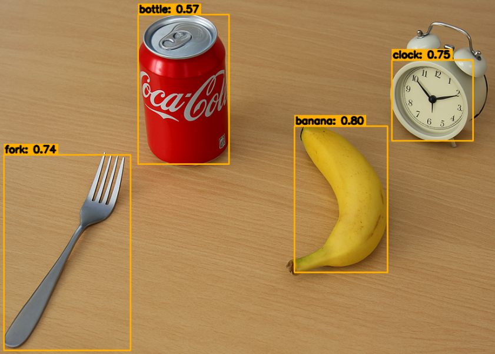

.. include:: /index.rst
   :start-after: start_hello_message
   :end-before: end_hello_message

.. _mp_object:

10. Detección de Objetos
==================================

------------------------------------------------------------
1. Descripción General
------------------------------------------------------------

Además de los modelos especializados para rostro, manos y pose,
MediaPipe también proporciona un **Detector de Objetos** de propósito general
basado en TensorFlow Lite.

Este capítulo demuestra cómo usar el
modelo ``efficientdet_lite0.tflite`` en Raspberry Pi
para realizar detección de objetos en tiempo real y visualizar los resultados
en la transmisión de la cámara.

Este módulo se puede usar para:

- Demostraciones de reconocimiento de objetos en tiempo real
- Percepción para hogar inteligente / robótica
- Monitoreo de seguridad simple
- Proyectos de visión embebida

------------------------------------------------------------
2. Cómo Funciona
------------------------------------------------------------

El programa realiza los siguientes pasos:

1. Inicializar **ObjectDetector** de MediaPipe Tasks
   y cargar el modelo ``efficientdet_lite0.tflite``.
2. Capturar fotogramas del flujo de video de Picamera2.
3. Convertir cada fotograma a un objeto ``mp.Image`` de MediaPipe.
4. Llamar a ``detect_for_video`` para ejecutar la detección de objetos en tiempo real.
5. Dibujar rectángulos delimitadores y etiquetas usando OpenCV.
6. Limitar el número de detecciones mostradas para mantener la salida clara
   y un rendimiento estable en Raspberry Pi.

-----------------------------
3. Preparación del Modelo
-----------------------------

Este ejemplo utiliza el modelo **EfficientDet Lite0**
en formato TensorFlow Lite (TFLite).

EfficientDet Lite0 es ligero y está optimizado para
dispositivos embebidos como Raspberry Pi.
Proporciona un buen equilibrio entre velocidad y precisión.

El archivo ``efficientdet_lite0.tflite`` está incluido en el directorio del proyecto
y se puede usar directamente.

* `Página oficial de descarga del modelo <https://ai.google.dev/edge/mediapipe/solutions/vision/object_detector#efficientdet-lite0_model_recommended>`_

Si se requiere mayor precisión y el rendimiento del hardware lo permite,
puedes cambiarte a:

- EfficientDet Lite1
- EfficientDet Lite2

También puedes reemplazar el modelo con tu propio modelo de detección de objetos
TFLite entrenado, siempre que siga los requisitos de formato de MediaPipe Tasks Object Detector.

------------------------
4. Ejecutar el Código
------------------------

.. important::

   Antes de comenzar, asegúrate de:

   * Tener el soporte para cámara ensamblado
   * Poder acceder al escritorio de Raspberry Pi
   * Tener el paquete de código instalado
   * Tener Fusion HAT+ instalado y configurado
   * Tener OpenCV instalado

   Para obtener instrucciones detalladas, consulta :ref:`opencv_install`.

#. Abre la terminal e ingresa el siguiente comando:

   .. code-block:: bash

      sudo python3 ~/ai-lab-kit/mediapipe/mp_object.py

#. Después de ejecutar el programa, se abre una ventana titulada "Show Video" y muestra la transmisión de la cámara en vivo.

   .. raw:: html

         <video width="500" loop muted controls>
             <source src="../_static/video/Media_10.mp4" type="video/mp4">
             Your browser does not support the video tag.
         </video>

   Para cada fotograma de video, el modelo Object Detector (``efficientdet_lite0.tflite``) se ejecuta en tiempo real y busca objetos reconocibles en la escena.

   Cuando se detectan objetos:

   - Se dibuja un rectángulo delimitador alrededor de cada objeto.
   - Se muestra una etiqueta y una puntuación de confianza sobre el rectángulo en el formato ``nombre: puntuación`` (por ejemplo, ``person: 0.87``).
   - Solo se muestran las detecciones por encima de ``SCORE_THRESHOLD`` (por defecto 0.5).
   - Para mantener la visualización clara y el rendimiento, el programa dibuja hasta ``MAX_DRAW`` detecciones (por defecto 20) por fotograma.

   A medida que la vista de la cámara cambia, los rectángulos delimitadores y las etiquetas se actualizan continuamente en tiempo real.

   Presiona ``q`` para salir del programa.
   La cámara se detiene y la ventana de OpenCV se cierra automáticamente.

-----------------------------
5. Código Completo
-----------------------------

.. code-block:: python

   # STEP 1: Import the necessary modules.
   from picamera2 import Picamera2, Preview
   import cv2
   import numpy as np
   import time
   from pathlib import Path

   import mediapipe as mp
   from mediapipe.tasks import python
   from mediapipe.tasks.python import vision

   # -------------------- Paths & basic settings --------------------
   BASE_DIR = Path(__file__).resolve().parent
   TFLITE_MODEL_PATH = str(BASE_DIR / "efficientdet_lite0.tflite")  # Model path
   SCORE_THRESHOLD = 0.5
   MAX_DRAW = 20  # Limit the number of drawn detections

   # -------------------- Helper: visualization --------------------
   def visualize(bgr_image: np.ndarray, detection_result) -> np.ndarray:
       img = bgr_image.copy()
       h, w = img.shape[:2]
       drawn = 0

       for det in detection_result.detections:
           bbox = det.bounding_box
           x1 = max(0, min(int(bbox.origin_x), w - 1))
           y1 = max(0, min(int(bbox.origin_y), h - 1))
           x2 = max(0, min(int(bbox.origin_x + bbox.width), w - 1))
           y2 = max(0, min(int(bbox.origin_y + bbox.height), h - 1))

           # top-1 category
           if det.categories:
               c = det.categories[0]
               name = c.category_name if c.category_name else "object"
               score = c.score if c.score is not None else 0.0
               caption = f"{name}: {score:.2f}"
           else:
               caption = "object"

           # Draw bounding box
           cv2.rectangle(img, (x1, y1), (x2, y2), (0, 175, 255), 2)
           (tw, th), _ = cv2.getTextSize(caption, cv2.FONT_HERSHEY_SIMPLEX, 0.6, 2)
           cv2.rectangle(img, (x1, y1 - th - 6), (x1 + tw + 4, y1), (0, 175, 255), -1)
           cv2.putText(img, caption, (x1 + 2, y1 - 4),
                       cv2.FONT_HERSHEY_SIMPLEX, 0.6, (0, 0, 0), 2, cv2.LINE_AA)

           drawn += 1
           if drawn >= MAX_DRAW:
               break
       return img

   # STEP 2: Initialize the detector
   BaseOptions = python.BaseOptions
   ObjectDetectorOptions = vision.ObjectDetectorOptions
   RunningMode = vision.RunningMode

   base_options = BaseOptions(model_asset_path=TFLITE_MODEL_PATH)
   options = ObjectDetectorOptions(
       base_options=base_options,
       score_threshold=SCORE_THRESHOLD,
       running_mode=RunningMode.VIDEO,
   )
   detector = vision.ObjectDetector.create_from_options(options)

   # STEP 3: Camera
   picam2 = Picamera2()
   config = picam2.create_preview_configuration(
       main={"size": (640, 480), "format": "XRGB8888"},
   )
   picam2.configure(config)
   picam2.start()
   print("Streaming... press 'q' to quit")

   while True:
       frame_bgra = picam2.capture_array()
       frame_bgr = cv2.cvtColor(frame_bgra, cv2.COLOR_BGRA2BGR)

       # Convert to RGB and wrap as mp.Image
       frame_rgb = cv2.cvtColor(frame_bgr, cv2.COLOR_BGR2RGB)
       mp_image = mp.Image(image_format=mp.ImageFormat.SRGB, data=frame_rgb)

       # STEP 4: Detect
       ts_ms = int(time.time() * 1000)
       detection_result = detector.detect_for_video(mp_image, ts_ms)

       # STEP 5: Visualize
       annotated = visualize(frame_bgr, detection_result)

       cv2.imshow("Show Video", annotated)
       if cv2.waitKey(1) & 0xFF == ord('q'):
           break

   try:
       picam2.stop_preview()
   except Exception:
       pass
   picam2.stop()
   cv2.destroyAllWindows()

Después de ejecutar el script, la transmisión de la cámara mostrará:

- Rectángulos delimitadores alrededor de los objetos detectados
- Etiquetas de clasificación y puntuaciones de confianza
- Detección en tiempo real (puede lograr aproximadamente 10~20 FPS en Raspberry Pi)

-----------------------------
6. Explicación del Código
-----------------------------

**Configuración**

.. code-block:: python

   BASE_DIR = Path(__file__).resolve().parent
   TFLITE_MODEL_PATH = str(BASE_DIR / "efficientdet_lite0.tflite")
   SCORE_THRESHOLD = 0.5
   MAX_DRAW = 20

- ``SCORE_THRESHOLD`` controla la confianza mínima para mostrar detecciones (aplicado dentro del runtime de Tasks).
- ``MAX_DRAW`` es una comodidad de la interfaz de usuario para limitar cuántos rectángulos renderizamos por fotograma.

**Importaciones**

.. code-block:: python

   from picamera2 import Picamera2, Preview
   import cv2, numpy as np, time
   from pathlib import Path
   import mediapipe as mp
   from mediapipe.tasks import python
   from mediapipe.tasks.python import vision

- ``mediapipe.tasks.python.vision`` alberga la API de Tasks de **ObjectDetector**.
- Todavía usamos OpenCV clásico para ventanas y dibujo.

**Funcion de ayuda para visualización**

.. code-block:: python

   def visualize(bgr_image: np.ndarray, detection_result) -> np.ndarray:
       """
       Draw bounding boxes and category labels on a BGR image.
       Compatible with MediaPipe Tasks ObjectDetector's detection_result.
       """
       img = bgr_image.copy()
       h, w = img.shape[:2]

       drawn = 0
       for det in detection_result.detections:
           bbox = det.bounding_box  # (origin_x, origin_y, width, height) in pixels
           x1 = int(bbox.origin_x); y1 = int(bbox.origin_y)
           x2 = int(bbox.origin_x + bbox.width); y2 = int(bbox.origin_y + bbox.height)

           # Clamp to frame bounds (defensive)
           x1 = max(0, min(x1, w - 1)); y1 = max(0, min(y1, h - 1))
           x2 = max(0, min(x2, w - 1)); y2 = max(0, min(y2, h - 1))

           # Top-1 category
           if det.categories:
               c = det.categories[0]
               name = c.category_name if c.category_name else "object"
               score = c.score if c.score is not None else 0.0
               caption = f"{name}: {score:.2f}"
           else:
               caption = "object"

           # Draw rectangle and caption
           cv2.rectangle(img, (x1, y1), (x2, y2), (0, 175, 255), 2)
           (tw, th), _ = cv2.getTextSize(caption, cv2.FONT_HERSHEY_SIMPLEX, 0.6, 2)
           cv2.rectangle(img, (x1, y1 - th - 6), (x1 + tw + 4, y1), (0, 175, 255), -1)
           cv2.putText(img, caption, (x1 + 2, y1 - 4),
                       cv2.FONT_HERSHEY_SIMPLEX, 0.6, (0, 0, 0), 2, cv2.LINE_AA)

           drawn += 1
           if drawn >= MAX_DRAW:
               break

       return img

- Mantiene limpio el bucle principal.
- Evita depender de utilidades de "visualización" inexistentes; funciona directamente con las salidas de Tasks.

**Crear el ObjectDetector**

.. code-block:: python

   BaseOptions = python.BaseOptions
   ObjectDetectorOptions = vision.ObjectDetectorOptions
   RunningMode = vision.RunningMode

   base_options = BaseOptions(model_asset_path=TFLITE_MODEL_PATH)
   options = ObjectDetectorOptions(
       base_options=base_options,
       score_threshold=SCORE_THRESHOLD,
       running_mode=RunningMode.VIDEO,  # VIDEO mode for streaming input
   )
   detector = vision.ObjectDetector.create_from_options(options)

- ``RunningMode.VIDEO`` está optimizado para flujos y **requiere marcas de tiempo**.
- El runtime de Tasks maneja internamente el redimensionamiento/normalización de imágenes por ti.

**Configuración de la cámara (Fuente de streaming)**

.. code-block:: python

   picam2 = Picamera2()
   config = picam2.create_preview_configuration(
       main={"size": (640, 480), "format": "XRGB8888"},
   )
   picam2.configure(config)
   picam2.start()

- 640×480 es un buen equilibrio entre FPS y precisión en Raspberry Pi.
- Picamera2 devuelve BGRA (``XRGB8888``); lo convertiremos a BGR/RGB.

**Detección por fotograma**

.. code-block:: python

   frame_bgra = picam2.capture_array()
   frame_bgr  = cv2.cvtColor(frame_bgra, cv2.COLOR_BGRA2BGR)
   frame_rgb  = cv2.cvtColor(frame_bgr,  cv2.COLOR_BGR2RGB)

   mp_image = mp.Image(image_format=mp.ImageFormat.SRGB, data=frame_rgb)

   ts_ms = int(time.time() * 1000)  # monotonically increasing timestamp
   detection_result = detector.detect_for_video(mp_image, ts_ms)

- MediaPipe espera buffers **RGB**.
- La marca de tiempo debe **aumentar cada fotograma**; usar ``time.time()*1000`` es suficiente para esta demostración.

**Renderizar y mostrar**

.. code-block:: python

   annotated = visualize(frame_bgr, detection_result)
   cv2.imshow("Show Video", annotated)
   if cv2.waitKey(1) & 0xFF == ord('q'):
       break

- La función auxiliar devuelve una imagen BGR lista para mostrar en OpenCV.
- Presiona ``q`` para salir del bucle.

**Limpieza**

.. code-block:: python

   try:
       picam2.stop_preview()
   except Exception:
       pass
   picam2.stop()
   cv2.destroyAllWindows()

Siempre libera la cámara y destruye las ventanas para evitar bloquear el dispositivo.

------------------------------------------------------
7. Rendimiento y Aplicaciones
------------------------------------------------------

.. list-table::
   :header-rows: 1

   * - Dirección de optimización
     - Efecto
     - Sugerencia
   * - Resolución
     - Mayor resolución da imagen más clara pero velocidad más lenta
     - 640x480 es suficiente
   * - Selección del modelo
     - Lite0 ~ Lite2
     - Lite0 es más rápido, Lite2 es más preciso
   * - Dibujo de múltiples objetos
     - Demasiados objetos causan latencia
     - Usa ``MAX_DRAW`` para limitar

------------------------------------------------------
8. Solución de Problemas
------------------------------------------------------

- Sin resultados de detección

  Si no se detecta nada, el umbral de confianza puede ser demasiado alto.

  Intenta reducir ``SCORE_THRESHOLD`` (por ejemplo, de 0.5 a 0.3) y prueba de nuevo.

- Baja tasa de fotogramas

  Si el video se siente lento, el modelo o la resolución pueden ser demasiado pesados para Raspberry Pi.

  Usa un modelo más ligero (``efficientdet_lite0.tflite``) y reduce la resolución (por ejemplo, 640×480 o 320×240). Cerrar otros procesos de fondo también puede mejorar el rendimiento.

- Desplazamiento del cuadro de detección

  Si los rectángulos delimitadores se ven desplazados o salen del fotograma, generalmente es causado por problemas de conversión de coordenadas.

  Asegúrate de que las coordenadas del rectángulo delimitador estén limitadas a los límites de la imagen. Este ejemplo ya limita ``x1, y1, x2, y2`` para evitar dibujos fuera de rango.

- La detección se ve caótica

  Si se detectan demasiados objetos y la pantalla se vuelve desordenada, puede ser difícil leer los resultados.

  Limita el número de detecciones dibujadas usando ``MAX_DRAW`` (por ejemplo, 10–20) para mantener la visualización clara y estable.

-----------------------------
9. Resumen
-----------------------------

- Este capítulo implementó la detección de objetos de propósito general basada en MediaPipe Tasks;
- Utilizó el modelo EfficientDet Lite0, equilibrando precisión y rendimiento;
- Se dominó el método para visualizar los resultados de detección;
- Se puede extender a modelos personalizados (por ejemplo, frutas, vehículos, escenarios de detección de artículos peligrosos).
