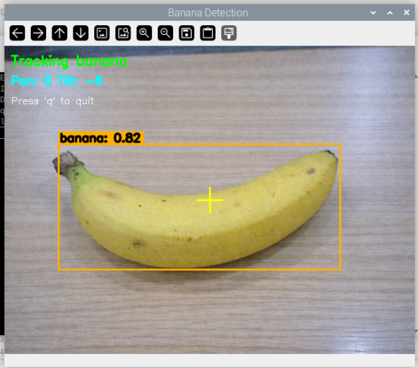

.. include:: /index.rst
   :start-after: start_hello_message
   :end-before: end_hello_message

.. _mp_tracking:

11. Objektverfolgung mit Pan-Tilt-Kamera
=============================================

------------------------------------------------------------
1. Überblick
------------------------------------------------------------

In diesem Kapitel erweitern wir die MediaPipe-Objekterkennung,
um ein einfaches **Objektverfolgungssystem**
mit einer Pan-Tilt-Servoplattform zu erstellen.

Das System erkennt ein bestimmtes Zielobjekt
(zum Beispiel eine „banana“)
und passt automatisch zwei Servomotoren an,
um das Objekt im Kamerabild zentriert zu halten.

Dieses Projekt kombiniert:

- Echtzeit-Objekterkennung
- Servomotorsteuerung
- Proportionale Tracking-Logik
- Visuelle Feedback-Overlays

Es zeigt, wie Computer Vision direkt
physische Hardware in Echtzeit steuern kann.

------------------------------------------------------------
2. Funktionsweise
------------------------------------------------------------

Das Tracking-System arbeitet nach folgenden Schritten:

1. Initialisieren der Pan- und Tilt-Servos in der Mittelposition.
2. Konfigurieren der Raspberry-Pi-Kamera für Videostreaming.
3. Laden des EfficientDet-Lite0-Modells für die Objekterkennung.
4. Erkennen von Objekten in jedem Frame mit MediaPipe Tasks.
5. Identifizieren des Zielobjekts (z. B. „banana“).
6. Berechnen der Objektverschiebung relativ zur Bildmitte.
7. Anpassen der Servo-Winkel mit proportionaler Regelung.
8. Anzeigen von Tracking-Hilfslinien und Statusinformationen auf dem Bildschirm.

Dieses Beispiel zeigt, wie visuelles Feedback
zur dynamischen Steuerung von Hardwarebewegungen genutzt werden kann.

------------------------
3. Code ausführen
------------------------

.. important::

   Stellen Sie vor dem Start sicher, dass:

   * das Pan-Tilt-Modul montiert ist
   * Sie Zugriff auf den Raspberry-Pi-Desktop haben
   * das Codepaket installiert ist
   * das Fusion HAT+ installiert und konfiguriert ist
   * OpenCV installiert ist

   Detaillierte Anweisungen finden Sie unter :ref:`opencv_install`.

#. Öffnen Sie das Terminal und geben Sie den folgenden Befehl ein:

   .. code-block:: bash

       sudo python3 ~/ai-lab-kit/mediapipe/mp_track_object.py

#. Nach dem Start des Programms öffnet sich das Kamerafenster und beginnt mit der Echtzeit-Objekterkennung.

   .. raw:: html
   
         <video width="300" loop muted controls>
             <source src="../_static/video/object_tracking.mp4" type="video/mp4">
             Your browser does not support the video tag.
         </video>
   
   Das System sucht nach dem angegebenen Zielobjekt (Standard: ``banana``).
   Ein gelbes Fadenkreuz wird in der Bildschirmmitte als Referenzpunkt angezeigt.
   
   Wenn das Zielobjekt im Bild erscheint:
   
   - MediaPipe erkennt das Objekt mit dem EfficientDet-Lite0-Modell.
   - Das Zentrum der erkannten Bounding-Box wird berechnet.
   - Befindet sich das Objekt außerhalb der zentralen Deadzone, bewegen sich die Pan- und Tilt-Servos schrittweise.
   - Die Kamera dreht sich physisch, um das Objekt nahe der Bildmitte zu halten.
   - Eine grüne Tracking-Box wird um das Objekt gezeichnet.
   - Auf dem Bildschirm werden folgende Informationen angezeigt:
   
     - ``Tracking banana`` (Status)
     - Aktuelle Servo-Winkel (Pan / Tilt)
   
   Wenn das Objekt nicht erkannt wird:
   
   - Die Servos bewegen sich nicht weiter.
   - Der Statustext wechselt zu ``No banana found`` (rot angezeigt).
   
   Die Tracking-Logik verwendet eine einfache 4-Richtungs-Deadzone-Steuerung:
   Die Servos bewegen sich nur, wenn sich das Objekt ausreichend weit von der Mitte entfernt befindet,
   wodurch Zittern vermieden wird.
   
   Drücken Sie ``q``, um das Programm zu beenden.
   
   Beim Beenden:
   
   - Beide Servos kehren in die Mittelposition zurück.
   - Die Kamera stoppt.
   - Das Anzeigefenster wird geschlossen.
   - Eine Meldung wird ausgegeben: ``Tracking stopped. Servos centered.``

-----------------------------
4. Vollständiger Code
-----------------------------

.. code-block:: python

   #!/usr/bin/env python3

   import cv2
   import time
   from fusion_hat.servo import Servo
   from picamera2 import Picamera2
   from pathlib import Path

   # MediaPipe imports
   import mediapipe as mp
   from mediapipe.tasks import python
   from mediapipe.tasks.python import vision

   # -------------------- Configuration --------------------
   TARGET = "banana"      # Object to track
   W, H = 640, 480           # Camera resolution
   CX, CY = W // 2, H // 2   # Center coordinates
   SCORE_THRESHOLD = 0.3     # Detection confidence threshold
   DEADZONE = 50             # Pixels from center before moving

   print(f"Tracking: {TARGET}")

   # -------------------- Servo Initialization --------------------
   pan = Servo(2)    # Channel 2 for pan (horizontal)
   tilt = Servo(3)   # Channel 3 for tilt (vertical)
   pan.angle(0)      # Center position
   tilt.angle(0)     # Center position
   time.sleep(1)     # Allow servos to reach position

   # -------------------- Camera Initialization --------------------
   cam = Picamera2()
   cam.configure(cam.create_preview_configuration(
       main={"size": (W, H), "format": "XRGB8888"}
   ))
   cam.start()
   time.sleep(2)     # Allow camera to stabilize

   # -------------------- MediaPipe Detector Setup --------------------
   model_path = str(Path(__file__).parent / "efficientdet_lite0.tflite")

   options = vision.ObjectDetectorOptions(
       base_options=python.BaseOptions(model_asset_path=model_path),
       score_threshold=SCORE_THRESHOLD,
       running_mode=vision.RunningMode.VIDEO
   )

   detector = vision.ObjectDetector.create_from_options(options)

   print("Ready. Press 'q' to quit")

   # -------------------- Tracking Logic --------------------
   def simple_track(x, y):
       """Basic 4-direction tracking with deadzone"""
       if x is None:
           return 0, 0
       
       pan_move = 0
       tilt_move = 0
       
       # Left/right movement decision
       if x < CX - DEADZONE:
           pan_move = 1          # Move right
       elif x > CX + DEADZONE:
           pan_move = -1         # Move left
       
       # Up/down movement decision  
       if y < CY - DEADZONE:
           tilt_move = -1        # Move down
       elif y > CY + DEADZONE:
           tilt_move = 1         # Move up
       
       return pan_move, tilt_move

   # -------------------- Main Tracking Loop --------------------
   pan_pos = 0   # Current pan angle (-90° to +90°)
   tilt_pos = 0  # Current tilt angle (-45° to +45°)

   try:
       while True:
           # Capture frame from camera
           frame = cam.capture_array()
           frame = cv2.cvtColor(frame, cv2.COLOR_BGRA2BGR)
           
           # Convert to RGB for MediaPipe
           rgb = cv2.cvtColor(frame, cv2.COLOR_BGR2RGB)
           mp_image = mp.Image(image_format=mp.ImageFormat.SRGB, data=rgb)
           
           # Detect objects in frame
           detections = detector.detect_for_video(mp_image, int(time.time() * 1000))
           
           # Search for target object
           obj_x = obj_y = None
           for detection in detections.detections:
               for category in detection.categories:
                   # Case-insensitive search for target
                   if TARGET.lower() in str(category.category_name).lower():
                       bbox = detection.bounding_box
                       # Calculate object center
                       obj_x = bbox.origin_x + bbox.width // 2
                       obj_y = bbox.origin_y + bbox.height // 2
                       break
           
           # Process tracking if object found
           if obj_x is not None:
               pan_move, tilt_move = simple_track(obj_x, obj_y)
               pan_pos += pan_move
               tilt_pos += tilt_move
               
               # Limit servo angles to safe ranges
               pan_pos = max(-90, min(90, pan_pos))
               tilt_pos = max(-45, min(45, tilt_pos))
               
               # Send commands to servos
               pan.angle(pan_pos)
               tilt.angle(tilt_pos)
               
               # Draw tracking box around object
               cv2.rectangle(frame, 
                            (obj_x - 30, obj_y - 30), 
                            (obj_x + 30, obj_y + 30), 
                            (0, 255, 0), 2)
               status = f"Tracking {TARGET}"
               color = (0, 255, 0)  # Green for tracking
           else:
               status = f"No {TARGET} found"
               color = (0, 0, 255)  # Red for not found
           
           # Draw center crosshair for reference
           cv2.line(frame, (CX - 20, CY), (CX + 20, CY), (0, 255, 255), 2)
           cv2.line(frame, (CX, CY - 20), (CX, CY + 20), (0, 255, 255), 2)
           
           # Display status information
           cv2.putText(frame, status, (10, 30), 
                      cv2.FONT_HERSHEY_SIMPLEX, 0.7, color, 2)
           cv2.putText(frame, f"Pan: {pan_pos:.0f} Tilt: {tilt_pos:.0f}", 
                      (10, 60), cv2.FONT_HERSHEY_SIMPLEX, 0.6, (255, 255, 0), 2)
           cv2.putText(frame, "Press 'q' to quit", (10, 90), 
                      cv2.FONT_HERSHEY_SIMPLEX, 0.5, (255, 255, 255), 1)
           
           # Show video window
           cv2.imshow(f"Track: {TARGET}", frame)
           
           # Exit on 'q' key press
           if cv2.waitKey(1) & 0xFF == ord('q'):
               break

   finally:
       # -------------------- Cleanup --------------------
       pan.angle(0)      # Return to center
       tilt.angle(0)     # Return to center
       time.sleep(0.5)   # Allow movement
       cam.stop()        # Stop camera
       cv2.destroyAllWindows()  # Close display
       print("Tracking stopped. Servos centered.")

-----------------------------
5. Code-Erklärung
-----------------------------

**Konfigurationsabschnitt**

.. code-block:: python

   TARGET = "banana"
   W, H = 640, 480
   CX, CY = W // 2, H // 2
   SCORE_THRESHOLD = 0.3
   DEADZONE = 50

- ``TARGET``: Objektkategorie, die verfolgt werden soll (muss in den COCO-Datensatzklassen enthalten sein);
- ``W, H``: Kameraauflösung – ausgewogen zwischen Geschwindigkeit und Detailgrad;
- ``CX, CY``: Koordinaten der Bildmitte als Referenz für das Tracking;
- ``SCORE_THRESHOLD``: Minimale Konfidenz für eine gültige Erkennung;
- ``DEADZONE``: Abstand vom Zentrum, bevor sich die Servos bewegen (reduziert Zittern).

**Servo-Initialisierung**

.. code-block:: python

   from fusion_hat.servo import Servo
   pan = Servo(2)
   tilt = Servo(3)
   pan.angle(0)
   tilt.angle(0)

- ``Servo(2)`` und ``Servo(3)`` entsprechen den Kanälen auf dem Fusion HAT;
- ``.angle(0)`` setzt die Servos auf die Mittelposition (0°);
- ``time.sleep(1)`` stellt sicher, dass die Servos ihre Position erreichen, bevor das Programm fortfährt.

**Kameraeinrichtung**

.. code-block:: python

   cam = Picamera2()
   cam.configure(cam.create_preview_configuration(
       main={"size": (W, H), "format": "XRGB8888"}
   ))

- Verwendet die Picamera2-Bibliothek für die moderne Kamera-API;
- Das Format ``XRGB8888`` stellt 8-Bit-Farbkanäle bereit;
- ``time.sleep(2)`` ermöglicht es dem Kamerasensor, sich zu stabilisieren.

**MediaPipe-Detektor**

.. code-block:: python

   model_path = str(Path(__file__).parent / "efficientdet_lite0.tflite")
   options = vision.ObjectDetectorOptions(
       base_options=python.BaseOptions(model_asset_path=model_path),
       score_threshold=SCORE_THRESHOLD,
       running_mode=vision.RunningMode.VIDEO
   )

- Lädt das EfficientDet-Lite0-Modell aus demselben Verzeichnis;
- ``RunningMode.VIDEO`` ist für kontinuierliche Frame-Verarbeitung optimiert;
- ``detect_for_video()`` benötigt für jedes Frame einen Zeitstempel.

**Tracking-Funktion**

.. code-block:: python

   def simple_track(x, y):
       if x < CX - DEADZONE:
           pan_move = 1      # Object left → move right
       elif x > CX + DEADZONE:
           pan_move = -1     # Object right → move left
       
       if y < CY - DEADZONE:
           tilt_move = -1    # Object up → move down
       elif y > CY + DEADZONE:
           tilt_move = 1     # Object down → move up

- Einfache proportionale Steuerung (kein echtes PID-System);
- Die Deadzone verhindert Servo-Zittern bei kleinen Bewegungen;
- Gibt Bewegungswerte von -1, 0 oder 1 für jede Achse zurück.

**Hauptschleifen-Verarbeitung**

.. code-block:: python

   # Object detection
   detections = detector.detect_for_video(mp_image, int(time.time() * 1000))
   
   # Find target object
   for detection in detections.detections:
       for category in detection.categories:
           if TARGET.lower() in str(category.category_name).lower():
               bbox = detection.bounding_box
               obj_x = bbox.origin_x + bbox.width // 2
               obj_y = bbox.origin_y + bbox.height // 2

1. Frame in das MediaPipe-Bildformat konvertieren;
2. Objekterkennung mit aktuellem Zeitstempel ausführen;
3. Die Erkennungsliste nach dem Zielobjekt durchsuchen (Groß-/Kleinschreibung ignoriert);
4. Die Mittelpunktkoordinaten des Objekts berechnen.

**Servo-Steuerlogik**

.. code-block:: python

   if obj_x is not None:
       pan_move, tilt_move = simple_track(obj_x, obj_y)
       pan_pos += pan_move
       tilt_pos += tilt_move
       
       # Enforce safe angle limits
       pan_pos = max(-90, min(90, pan_pos))
       tilt_pos = max(-45, min(45, tilt_pos))
       
       pan.angle(pan_pos)
       tilt.angle(tilt_pos)

1. Bewegungsbefehle von der Tracking-Funktion erhalten;
2. Positionswerte aktualisieren;
3. Positionen auf mechanische Grenzwerte begrenzen;
4. Neue Winkel an die Servos senden.

**Visuelles Feedback**

.. code-block:: python

   # Tracking box (green when tracking)
   cv2.rectangle(frame, (obj_x-30, obj_y-30), (obj_x+30, obj_y+30), (0,255,0), 2)
   
   # Center crosshair (yellow)
   cv2.line(frame, (CX-20, CY), (CX+20, CY), (0,255,255), 2)
   cv2.line(frame, (CX, CY-20), (CX, CY+20), (0,255,255), 2)
   
   # Status text
   cv2.putText(frame, status, (10,30), cv2.FONT_HERSHEY_SIMPLEX, 0.7, color, 2)

- Grünes Rechteck: aktuell verfolgtes Objekt;
- Gelbes Fadenkreuz: Referenzpunkt in der Bildmitte;
- Status-Text: Tracking-Zustand und Servo-Winkel.

**Aufräumroutine**

.. code-block:: python

   finally:
       pan.angle(0)
       tilt.angle(0)
       time.sleep(0.5)
       cam.stop()
       cv2.destroyAllWindows()

- Setzt die Servos zurück in die Mittelposition;
- Stoppt die Kameraaufnahme;
- Schließt alle OpenCV-Fenster;
- Wird auch bei Fehlern ausgeführt (``try...finally``).

------------------------------------------------------
6. Konfigurationsoptionen
------------------------------------------------------

**Zielobjekt ändern**

.. code-block:: python

   # Track different objects
   TARGET = "person"      # People tracking
   TARGET = "cup"         # Cup/glass tracking  
   TARGET = "book"        # Book tracking
   TARGET = "bottle"      # Bottle tracking

**Tracking-Parameter anpassen**

.. code-block:: python

   # Slower, smoother tracking
   DEADZONE = 75          # Larger deadzone = less sensitive
   
   # Faster, more responsive tracking  
   DEADZONE = 30          # Smaller deadzone = more sensitive
   pan_move = 2           # Larger movement steps

**Servo-Bewegungsbereich begrenzen**

.. code-block:: python

   # Restrict movement range
   pan_pos = max(-60, min(60, pan_pos))    # ±60° pan limit
   tilt_pos = max(-30, min(30, tilt_pos))  # ±30° tilt limit

**Leistungsoptimierung**

.. code-block:: python

   # Lower resolution for speed
   W, H = 320, 240       # Faster processing
   
   # Higher threshold for reliability
   SCORE_THRESHOLD = 0.5  # Fewer false positives

------------------------------------------------------
7. Leistungsaspekte
------------------------------------------------------

.. list-table:: Leistungsfaktoren
   :header-rows: 1

   * - Faktor
     - Einfluss auf die Leistung
     - Empfehlung
   * - Kameraauflösung
     - Höher = langsamere Erkennung
     - 640x480 bietet eine gute Balance
   * - Erkennungsschwelle
     - Niedriger = mehr Erkennungen, aber mehr Fehlalarme
     - 0.3–0.5 optimal
   * - Deadzone-Größe
     - Größer = ruhiger, aber weniger reaktionsschnell
     - 40–60 Pixel
   * - Servo-Geschwindigkeit
     - Schneller = reaktionsschneller, kann aber überschwingen
     - Beschleunigungssteuerung in Betracht ziehen
   * - Modellgröße
     - Lite0 am schnellsten, Lite2 am genauesten
     - Lite0 für Echtzeit-Tracking

**Erwartete Leistung:**

- **Raspberry Pi 4:** 8–15 FPS bei 640x480
- **Erkennungsverzögerung:** 100–200 ms
- **Servo-Reaktionszeit:** 50–100 ms pro Grad
- **Gesamtsystemlatenz:** 200–400 ms

------------------------------------------------------
8. Fehlerbehebung
------------------------------------------------------

.. list-table:: Häufige Probleme und Lösungen
   :header-rows: 1

   * - Problem
     - Mögliche Ursache
     - Lösung
   * - Keine Objekterkennung
     - Objekt nicht in COCO-Klassen enthalten
     - Unterstützte Objektnamen verwenden
   * - Ruckartige Servo-Bewegung
     - Deadzone zu klein
     - DEADZONE auf 60–80 erhöhen
   * - Servo überschwingt
     - Bewegungsschritt zu groß
     - pan_move von 1 auf 0.5 ändern
   * - Niedrige Bildrate
     - Auflösung zu hoch
     - Auf 320x240 reduzieren
   * - Kamera funktioniert nicht
     - Kamera nicht aktiviert
     - ``sudo raspi-config`` ausführen
   * - Servos bewegen sich nicht
     - Falsche Verkabelung oder Stromversorgung
     - Verbindungen und Stromversorgung prüfen
   * - Objekt wird häufig verloren
     - Schwellenwert zu hoch
     - SCORE_THRESHOLD auf 0.2 reduzieren
   * - Falsche Tracking-Richtung
     - Servoausrichtung vertauscht
     - Vorzeichen von pan_move tauschen

**Debugging-Tipps:**

1. **Servos separat testen:**
   
   .. code-block:: python

      pan.angle(45)   # Should move right
      time.sleep(1)
      pan.angle(-45)  # Should move left

2. **Objekterkennung überprüfen:**
   
   .. code-block:: python

      print(f"Found: {category.category_name} {c.score:.2f}")

3. **Objektkoordinaten prüfen:**
   
   .. code-block:: python

      print(f"Object at: ({obj_x}, {obj_y}), Center: ({CX}, {CY})")

4. **Bildrate überwachen:**
   
   .. code-block:: python

      import time
      start = time.time()
      # ... processing ...
      fps = 1 / (time.time() - start)
      print(f"FPS: {fps:.1f}")

------------------------------------------------------
9. Erweiterte Modifikationen
------------------------------------------------------

**1. PID-Regelung implementieren**

.. code-block:: python

   class PIDController:
       def __init__(self, kp=0.1, ki=0.01, kd=0.05):
           self.kp, self.ki, self.kd = kp, ki, kd
           self.prev_error = 0
           self.integral = 0
       
       def update(self, error, dt=1.0):
           self.integral += error * dt
           derivative = (error - self.prev_error) / dt
           output = self.kp*error + self.ki*self.integral + self.kd*derivative
           self.prev_error = error
           return output

**2. Mehrfach-Objektverfolgung**

.. code-block:: python

   # Track closest object
   best_dist = float('inf')
   best_obj = None
   for detection in detections.detections:
       bbox = detection.bounding_box
       obj_x = bbox.origin_x + bbox.width // 2
       obj_y = bbox.origin_y + bbox.height // 2
       dist = ((obj_x - CX)**2 + (obj_y - CY)**2)**0.5
       if dist < best_dist:
           best_dist = dist
           best_obj = (obj_x, obj_y)

**3. Geschwindigkeit proportional zur Entfernung**

.. code-block:: python

   def adaptive_track(x, y):
       if x is None:
           return 0, 0
       
       # Calculate distance from center
       dx = x - CX
       dy = y - CY
       
       # Speed proportional to distance (with deadzone)
       pan_move = 0
       tilt_move = 0
       
       if abs(dx) > DEADZONE:
           pan_move = dx * 0.02  # 2% of distance per frame
           
       if abs(dy) > DEADZONE:
           tilt_move = dy * 0.02
           
       return pan_move, tilt_move

**4. Objektgedächtnis (Trägheits-Tracking)**

.. code-block:: python

   # Keep tracking briefly when object lost
   OBJECT_TIMEOUT = 10  # frames
   lost_counter = 0
   
   if obj_x is not None:
       last_x, last_y = obj_x, obj_y
       lost_counter = 0
   elif lost_counter < OBJECT_TIMEOUT:
       obj_x, obj_y = last_x, last_y  # Use last known position
       lost_counter += 1

------------------------------------------------------
10. Anwendungen und Erweiterungen
------------------------------------------------------

**Bildungsanwendungen:**

- Prinzipien von Robotik und Automatisierung
- Grundlagen der Computer Vision
- Regelungssysteme (P vs. PID)
- Echtzeit-Systemdesign

**Praktische Anwendungen:**

- Automatisches Tracking für Sicherheitskameras
- Kamerasteuerung für Videokonferenzen
- Beobachtung von Wildtieren
- Assistive Technologien zur Objektverfolgung

**Erweiterungsprojekte:**

1. **Webschnittstelle:** Fernsteuerung über den Browser
2. **Voreinstellungen:** Häufige Tracking-Positionen speichern/laden
3. **Objektlernen:** Training auf benutzerdefinierte Objekte
4. **Multi-Kamera:** Koordination mehrerer Tracking-Einheiten
5. **Cloud-Integration:** Tracking-Daten zur Analyse hochladen
6. **Audio-Feedback:** Tracking-Status ansagen
7. **Gestensteuerung:** Handgesten zur Steuerung des Trackings verwenden

-----------------------------

11. Sicherheit und Best Practices
----------------------------------------------

1. **Mechanische Sicherheit:**

   - Alle beweglichen Teile sicher befestigen
   - Kabelmanagement verwenden
   - Quetschstellen vermeiden
   - Angemessene Winkelbegrenzungen festlegen

2. **Elektrische Sicherheit:**

   - Externe Stromversorgung für Servos verwenden
   - Für ordnungsgemäße Erdung sorgen
   - Überlastung der Stromversorgung vermeiden
   - Leitungen mit geeignetem Querschnitt verwenden

3. **Software-Sicherheit:**

   - Servos beim Beenden immer in Mittelposition zurücksetzen
   - Not-Stopp-Mechanismus implementieren
   - Fehler zur Fehlersuche protokollieren
   - Eingaben und Grenzwerte validieren

4. **Betriebssicherheit:**

   - Abstand zu beweglichen Mechanismen halten
   - Überhitzung überwachen
   - Regelmäßige Wartung durchführen
   - Manuelle Übersteuerungsmöglichkeit vorsehen

-----------------------------
12. Zusammenfassung
-----------------------------

Dieses Kapitel demonstrierte ein vollständiges Objektverfolgungssystem mit:

1. **MediaPipe Tasks** für zuverlässige Objekterkennung
2. **Pan-Tilt-Servos** für physisches Tracking
3. **Einfacher proportionaler Steuerung** für die Bewegungslogik
4. **OpenCV** für visuelles Feedback und Anzeige

Das System bildet eine Grundlage für fortgeschrittene Tracking-Anwendungen und veranschaulicht zentrale Konzepte der Echtzeit-Computer-Vision, der Regelungstechnik und der eingebetteten Python-Programmierung.

Durch Anpassung des Zielobjekts, der Parameter und der Steuerlogik kann dieses System für verschiedenste Anwendungen eingesetzt werden – von Demonstrationen im Bildungsbereich bis hin zu praktischen Automatisierungslösungen.

**Nächste Schritte:**

- PID-Regelung für sanfteres Tracking implementieren
- Objektgedächtnis für temporäre Verdeckungen hinzufügen
- Weboberfläche für Fernüberwachung erstellen
- Integration in Heimautomationssysteme
- Eigene Objekterkennungsmodelle trainieren