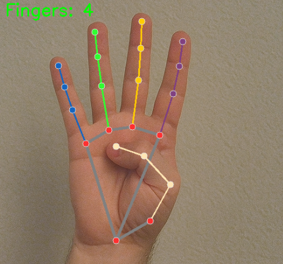

.. include:: /index.rst
   :start-after: start_hello_message
   :end-before: end_hello_message

.. _mp_hand_count_tts:

12. 为 MediaPipe 项目添加 TTS 语音播报
===========================================================

-----------------------------------------------------------------
1. 概述
-----------------------------------------------------------------

在 :ref:`mp_hand_count`\ （第 5 节）中，我们构建了一个手势计数程序，
在屏幕上显示抬起的手指数量。

在本节中，我们将更进一步：
**添加文本转语音（TTS）语音播报**\ 功能，
让 Raspberry Pi 可以*说出*检测到的手指数量——
使项目更具交互性和可访问性。

本课不仅是关于手指计数——
它还教授了一种向*任何* MediaPipe 或 OpenCV 项目
添加 TTS 的**通用模式**。

学完本课后，您将知道如何：

- 初始化并配置 Fusion HAT+ TTS 引擎
- 通过按键触发 TTS 并带有防抖保护
- 在系统播报时添加视觉反馈
- 将此模式应用到您自己的计算机视觉项目中

-----------------------------------------------------------------
2. 工作原理
-----------------------------------------------------------------

程序在手势计数流水线的基础上添加了一个 TTS 层，
通过按键触发：

1. 初始化 **MediaPipe Hands** 进行实时手部检测。
2. 初始化 **Fusion HAT+ TTS 引擎**\ （Espeak）。
3. 捕获视频帧并检测手指（与之前相同）。
4. 等待用户按下 ``t`` 键。
5. 按键时将当前手指数量转换为语音消息。
6. 使用**防抖逻辑**防止重复快速触发。
7. TTS 播报时在屏幕上显示**视觉闪烁**效果。
8. 语音通过 Fusion HAT+ 扬声器播放。

关键设计思路：

    *TTS 以非阻塞层的形式添加——*
    检测持续运行，语音仅在用户请求时触发。

这种模式使视频流水线保持流畅，同时
按需提供语音输出。

-----------------------------------------------------------------
3. Fusion HAT+ TTS 模块
-----------------------------------------------------------------

``fusion_hat`` 库为多种 TTS 引擎提供了简单统一的接口。
在本项目中，我们使用 **Espeak**——
一个轻量级的离线引擎，在 Raspberry Pi 上运行良好。

**基本用法：**

.. code-block:: python

    from fusion_hat.tts import Espeak

    # Create TTS instance
    tts = Espeak()

    # Configure voice
    tts.set_amp(200)       # volume: 0-200 (default 100)
    tts.set_speed(150)     # speed: 80-260 (default 150)
    tts.set_pitch(80)      # pitch: 0-99 (default 80)

    # Speak
    tts.say("Hello!")

三个参数可让您自定义语音：

- **amp**\ （amplitude）—— 控制音量。数值越大越响。
- **speed** —— 语速，以每分钟单词数计。150 为正常速度。
- **pitch** —— 音调。80 为默认值；较低的值听起来更低沉。

.. note::

   Fusion HAT+ 还支持 **Piper**\ （神经网路离线引擎）
   和 **OpenAI TTS**\ （在线引擎，自然语音）。
   更多高级选项请参见 :ref:`tts_piper_openai`。

-----------------------------------------------------------------
4. 关键设计：为视频循环添加 TTS
-----------------------------------------------------------------

在向实时视频流水线添加 TTS 时，有几个
重要的设计考量。让我们逐一分析。

--------------------------------------------------
4.1 按键触发
--------------------------------------------------

我们不是每帧都播报（那样会一片混乱），
而是使用键盘按键作为触发器：

.. code-block:: python

    key = cv2.waitKey(1) & 0xff
    if key == ord('t'):
        tts.say(message)

选择 ``t`` 键是因为它容易记忆
（*t* 代表 *talk*）。您可以使用任何按键——``space`` 用于
免提控制，或 GPIO 按钮用于物理输入。

--------------------------------------------------
4.2 防抖保护
--------------------------------------------------

不加保护的话，按住 ``t`` 键会每秒触发 TTS 数十次，
导致语音重叠，无法听清。

**解决方案：基于时间的防抖。**

.. code-block:: python

    DEBOUNCE_INTERVAL = 1.5  # seconds
    last_tts_time = 0

    # In the loop:
    if key == ord('t'):
        now = time.time()
        if now - last_tts_time > DEBOUNCE_INTERVAL:
            last_tts_time = now
            tts.say(message)

每次 TTS 触发后，后续触发在 1.5 秒内
被忽略。这给了语音足够的时间完成，
然后才开始下一次播报。

--------------------------------------------------
4.3 构建消息
--------------------------------------------------

手指数量（整数）需要转换为
听起来自然的句子：

.. code-block:: python

    if total_fingers == 0:
        message = "no fingers detected"
    elif total_fingers == 1:
        message = "one finger detected"
    else:
        message = f"{total_fingers} fingers detected"

使用 ``"one"`` 而不是 ``"1"`` 可以确保 Espeak
自然地发音。对于大于一的数字，
使用数字形式在 Espeak 中可以正常工作。

--------------------------------------------------
4.4 视觉反馈（绿色边框闪烁）
--------------------------------------------------

在系统播报时，我们添加一个视觉指示器，
让用户知道语音正在播放：

.. code-block:: python

    tts_flash_until = now + 1.0   # flash for 1 second

    # Later in the loop:
    if tts_triggered and time.time() < tts_flash_until:
        cv2.rectangle(frame, (0, 0), (w-1, h-1), (0, 255, 0), 8)
        cv2.putText(frame, "Speaking...", (10, 75),
                    cv2.FONT_HERSHEY_SIMPLEX, 0.8, (0, 255, 255), 2)

画面周围出现一个**绿色边框**，并显示
**"Speaking..."** 标签。两者在 1 秒后
自动消失。

这个反馈循环很重要，因为：

- TTS 需要一点时间完成——用户需要知道
  系统已收到他们的指令。
- 边框在完成后消失，不会干扰
  正常使用。

-----------------------------------------------------------------
5. 运行代码
-----------------------------------------------------------------

.. important::

   开始之前，请确保：

   * Fusion HAT+ 已组装，扬声器已连接
   * 可以访问 Raspberry Pi 桌面
   * 代码包已安装
   * MediaPipe 和 OpenCV 已安装

   详细说明请参见 :ref:`mediapipe_install` 和 :ref:`opencv_install`。

#. 打开终端并输入以下命令：

   .. code-block:: bash

      sudo python3 ~/ai-lab-kit/mediapipe/mp_hand_count_tts.py

#. 运行程序后：

   - 一个标题为"MediaPipe Hand Count + TTS"的窗口会打开，
     显示实时摄像头画面。
   - 将手举到摄像头前——手指数量会显示在
     左上角。
   - *按下* ``t`` *键* —— 系统会通过 Fusion HAT+ 扬声器
     播报当前的手指数量。
   - 播报时屏幕上会闪烁绿色边框。

   .. hint::

      试试展示不同数量的手指，每次按下 ``t`` 键。
      您应该会听到："one finger detected"、
      "three fingers detected" 等。

   按 ``q`` 键退出程序。

--------------------------------------------------
6. 完整代码
--------------------------------------------------

.. code-block:: python

   """
   MediaPipe Hand Detection + TTS Demo
   ====================================
   Detects fingers via webcam in real time. Press the 't' key to speak the
   current finger count using TTS.

   Usage:
       python mp_hand_count_tts.py

   Controls:
       't'  - speak the detected finger count via TTS
       'q'  - quit
   """

   from picamera2 import Picamera2
   import cv2
   import mediapipe.python.solutions.hands as mp_hands
   import mediapipe.python.solutions.drawing_utils as drawing
   import mediapipe.python.solutions.drawing_styles as drawing_styles
   from fusion_hat.tts import Espeak
   import time

   # ======================== Init TTS ========================
   tts = Espeak()
   tts.set_amp(200)       # volume 0-200, default 100
   tts.set_speed(150)     # speed 80-260, default 150
   tts.set_pitch(80)      # pitch 0-99, default 80

   # ======================== Init MediaPipe Hands ========================
   hands = mp_hands.Hands(
       static_image_mode=False,
       max_num_hands=2,
       min_detection_confidence=0.5
   )

   # ======================== Init Camera ========================
   picam2 = Picamera2()
   config = picam2.create_preview_configuration(
       main={"size": (640, 480), "format": "XRGB8888"},
   )
   picam2.configure(config)
   picam2.start()

   # ======================== Constants ========================
   # Finger tip and dip landmark indices
   FINGER_TIPS = [4, 8, 12, 16, 20]   # thumb, index, middle, ring, pinky tips
   FINGER_DIPS = [2, 6, 10, 14, 18]   # corresponding middle joints

   # Minimum interval (seconds) between TTS triggers to avoid spamming
   DEBOUNCE_INTERVAL = 1.5

   print("=" * 55)
   print("  MediaPipe Hand Count + TTS")
   print("  Press 't' to speak count | 'q' to quit")
   print("=" * 55)

   # ======================== Main Loop ========================
   last_tts_time = 0          # timestamp of last TTS trigger
   tts_triggered = False      # whether TTS was just fired (for visual flash)
   tts_flash_until = 0        # how long the flash should last

   while True:
       # ---- 1. Capture frame ----
       frame_bgra = picam2.capture_array()
       frame_bgr = cv2.cvtColor(frame_bgra, cv2.COLOR_BGRA2BGR)

       # ---- 2. Convert to RGB for MediaPipe ----
       frame_rgb = cv2.cvtColor(frame_bgr, cv2.COLOR_BGR2RGB)
       hands_detected = hands.process(frame_rgb)

       # ---- 3. Convert back to BGR for OpenCV display ----
       frame = cv2.cvtColor(frame_rgb, cv2.COLOR_RGB2BGR)

       # ---- 4. Count fingers (right hand only) ----
       total_fingers = 0

       if hands_detected.multi_hand_landmarks:
           for hand_landmarks in hands_detected.multi_hand_landmarks:
               # Draw hand skeleton
               drawing.draw_landmarks(
                   frame,
                   hand_landmarks,
                   mp_hands.HAND_CONNECTIONS,
                   drawing_styles.get_default_hand_landmarks_style(),
                   drawing_styles.get_default_hand_connections_style(),
               )

               landmarks = hand_landmarks.landmark
               finger_count = 0

               # Thumb: extended when x_tip > x_dip (right hand)
               if landmarks[FINGER_TIPS[0]].x > landmarks[FINGER_DIPS[0]].x:
                   finger_count += 1

               # Other four fingers: tip is above dip when extended (smaller y)
               for i in range(1, 5):
                   if landmarks[FINGER_TIPS[i]].y < landmarks[FINGER_DIPS[i]].y:
                       finger_count += 1

               total_fingers += finger_count

       # ---- 5. Display finger count on screen ----
       display_text = f"Fingers: {total_fingers}"
       cv2.putText(frame, display_text, (10, 40),
                   cv2.FONT_HERSHEY_SIMPLEX, 1.2, (0, 255, 0), 2)

       # ---- 6. Key handling ----
       key = cv2.waitKey(1) & 0xff

       # 't' key: trigger TTS (with debounce)
       if key == ord('t'):
           now = time.time()
           if now - last_tts_time > DEBOUNCE_INTERVAL:
               last_tts_time = now
               tts_triggered = True
               tts_flash_until = now + 1.0  # flash for 1 second

               if total_fingers == 0:
                   message = "no fingers detected"
               elif total_fingers == 1:
                   message = "one finger detected"
               else:
                   message = f"{total_fingers} fingers detected"

               print(f"[TTS] {message}")
               tts.say(message)

       # 'q' key: quit
       if key == ord('q'):
           break

       # ---- 7. Visual feedback while speaking (green border flash) ----
       if tts_triggered and time.time() < tts_flash_until:
           h, w = frame.shape[:2]
           thickness = 8
           cv2.rectangle(frame, (0, 0), (w - 1, h - 1), (0, 255, 0), thickness)
           cv2.putText(frame, "Speaking...", (10, 75),
                       cv2.FONT_HERSHEY_SIMPLEX, 0.8, (0, 255, 255), 2)
       else:
           tts_triggered = False

       # ---- 8. Show controls hint at bottom ----
       cv2.putText(frame, "Press 't' to speak count | 'q' to quit",
                   (10, frame.shape[0] - 15),
                   cv2.FONT_HERSHEY_SIMPLEX, 0.5, (180, 180, 180), 1)

       # ---- 9. Show frame ----
       cv2.imshow("MediaPipe Hand Count + TTS", frame)

   # ======================== Cleanup ========================
   picam2.stop_preview()
   picam2.stop()
   cv2.destroyAllWindows()
   print("Exited.")

--------------------------------------------------
7. 代码说明
--------------------------------------------------

让我们逐段分析代码，重点介绍
与基本手势计数程序相比新增的部分。

--------------------------------------------------
7.1 导入与初始化
--------------------------------------------------

.. code-block:: python

   from fusion_hat.tts import Espeak
   import time

   tts = Espeak()
   tts.set_amp(200)
   tts.set_speed(150)
   tts.set_pitch(80)

两个新的导入和一个 TTS 初始化块是
首要的添加内容。``Espeak()`` 创建 TTS 引擎，三个
``set_*`` 调用配置语音。

``import time`` 用于防抖计时。

--------------------------------------------------
7.2 防抖常量与状态变量
--------------------------------------------------

.. code-block:: python

   DEBOUNCE_INTERVAL = 1.5

   last_tts_time = 0
   tts_triggered = False
   tts_flash_until = 0

引入了四个新变量：

- ``DEBOUNCE_INTERVAL`` — 防止 TTS 频繁触发（秒）。
- ``last_tts_time`` — 记录上次 TTS 触发的时间。
- ``tts_triggered`` — 视觉闪烁效果的标志。
- ``tts_flash_until`` — 闪烁结束的时间戳。

--------------------------------------------------
7.3 带防抖的按键处理
--------------------------------------------------

.. code-block:: python

   key = cv2.waitKey(1) & 0xff

   if key == ord('t'):
       now = time.time()
       if now - last_tts_time > DEBOUNCE_INTERVAL:
           last_tts_time = now
           tts_triggered = True
           tts_flash_until = now + 1.0

           if total_fingers == 0:
               message = "no fingers detected"
           elif total_fingers == 1:
               message = "one finger detected"
           else:
               message = f"{total_fingers} fingers detected"

           tts.say(message)

这是核心的 TTS 添加部分。我们来分解一下：

1. **按键检测** — ``ord('t')`` 检查是否按下了 ``t`` 键。

2. **防抖门控** — ``time.time() - last_tts_time > DEBOUNCE_INTERVAL``
   确保距离上次触发至少过去了 1.5 秒。
   如果时间不够，按键被忽略。

3. **更新状态** — 当门控通过时，我们记录当前
   时间并设置闪烁计时器。

4. **构建消息** — 将手指数量转换为
   人类可读的句子。

5. **播报** — ``tts.say(message)`` 将文本发送到扬声器。

.. note::

   ``tts.say()`` 是**非阻塞**的——程序在语音后台播放时
   继续处理视频帧。

--------------------------------------------------
7.4 视觉反馈
--------------------------------------------------

.. code-block:: python

   if tts_triggered and time.time() < tts_flash_until:
       h, w = frame.shape[:2]
       thickness = 8
       cv2.rectangle(frame, (0, 0), (w - 1, h - 1), (0, 255, 0), thickness)
       cv2.putText(frame, "Speaking...", (10, 75),
                   cv2.FONT_HERSHEY_SIMPLEX, 0.8, (0, 255, 255), 2)
   else:
       tts_triggered = False

- 在整个画面周围绘制一个绿色边框（8 像素粗）。
- 在手指计数下方显示一个黄色的"Speaking..."标签。
- 两者持续 1 秒，然后自动消失。
- 当闪烁计时器到期时，``tts_triggered`` 重置为 ``False``，
  为下一次触发做好准备。

这种模式是可重用的——您可以为任何触发 TTS 的项目
添加同样的反馈。

-----------------------------------------------------------------
8. 扩展思路：将此模式应用于其他项目
-----------------------------------------------------------------

您在这里学到的 TTS 集成模式是**通用的**。
您可以通过以下步骤为任何 MediaPipe、OpenCV 或 YOLO 项目
添加语音播报：

**步骤 1：导入并初始化 TTS**

.. code-block:: python

   from fusion_hat.tts import Espeak
   tts = Espeak()
   tts.set_amp(200)

**步骤 2：添加防抖变量（循环之前）**

.. code-block:: python

   DEBOUNCE_INTERVAL = 1.5
   last_tts_time = 0

**步骤 3：添加按键触发 TTS（循环内部）**

.. code-block:: python

   if key == ord('t'):
       now = time.time()
       if now - last_tts_time > DEBOUNCE_INTERVAL:
           last_tts_time = now
           # Build your message from detection results
           tts.say(your_message)

以下是一些应用此模式的思路：

- **MediaPipe 人脸检测** （:ref:`mp_face`）
  → "Face detected at center of frame"

- **MediaPipe 姿态估计** （:ref:`mp_pose`）
  → "Both arms raised" 或 "Squat detected — good form!"

- **OpenCV 颜色追踪** （:ref:`play_with_opencv`）
  → "Red object moving left" 或 "Target locked"

- **YOLO 物体检测** （:ref:`play_with_yolo`）
  → "Person detected" 或 "Two cars in view"

- **硬件集成**
  → 通过 ``fusion_hat`` 将 ``t`` 键替换为 GPIO 按钮按下，
  实现完全免提体验。

-----------------------------------------------------------------
9. 故障排除
-----------------------------------------------------------------

- **扬声器没有声音**

  确保 Fusion HAT+ 扬声器已正确连接，
  音量未被静音。尝试运行一个简单的 TTS 测试：

  .. code-block:: bash

     sudo python3 -c "from fusion_hat.tts import Espeak; Espeak().say('test')"

  如果您听到"test"，说明 TTS 引擎正常工作。

- **按住按键时 TTS 触发太多次**

  将 ``DEBOUNCE_INTERVAL`` 增大到更大的值，
  例如 ``2.0`` 或 ``2.5`` 秒。

  如果您希望每次按键只触发一次
  （按住时不重复），请跨帧追踪按键状态，
  只在*上升沿*（按键从未按下到按下的转换）触发。

- **语音太快或听不清**

  降低语速：``tts.set_speed(120)``。

  调整音调以提高清晰度：``tts.set_pitch(70)``。

- **语音与之前的语音重叠**

  Fusion HAT+ 上的 Espeak 默认会将语音排队。
  如果您想在开始新语音前取消正在进行的语音，
  可以添加一个小延迟或使用不同的 TTS 引擎。

- **视觉闪烁不出现**

  检查 ``tts_triggered`` 是否在防抖块内
  设置为 ``True``，并且 ``tts_flash_until`` 是否设置为
  ``time.time() + 1.0``。

-----------------------------------------------------------------
10. 总结
-----------------------------------------------------------------

- 本节课演示了如何**向 MediaPipe 计算机视觉项目添加 TTS 语音播报**。
- Fusion HAT+ 的 ``Espeak`` 引擎在 Raspberry Pi 上
  提供了简单、离线的 TTS 解决方案。
- **涉及的关键设计模式：**

  - 通过按键触发 TTS（而不是每帧都触发）
  - **防抖保护** 防止语音重叠
  - **视觉反馈**\ （绿色边框闪烁）用于用户感知
  - 将检测结果转换为自然的语音消息

- 这些模式是**项目无关的**——您可以将它们应用到
  任何 OpenCV、MediaPipe 或 YOLO 项目中，以添加语音输出。
- 添加语音使您的项目更具可访问性和
  免提操作性，为辅助技术应用
  和交互式安装开辟了道路。
