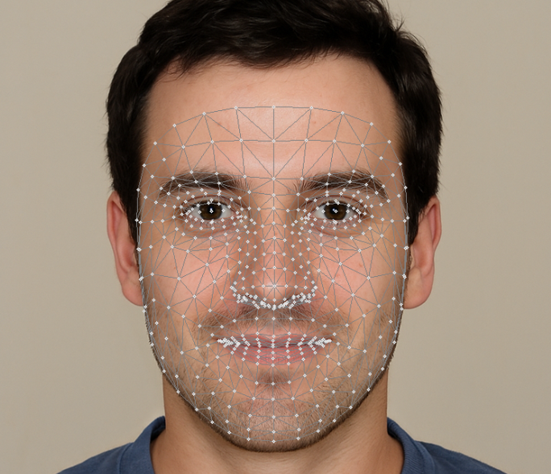

.. include:: /index.rst
   :start-after: start_hello_message
   :end-before: end_hello_message

.. _mp_face:

1. Face Detection
===========================

This section introduces how to use the **MediaPipe Face Mesh** module on a **Raspberry Pi** for real-time face detection and facial landmark mesh drawing.

MediaPipe is a cross-platform machine learning pipeline framework developed by Google, supporting real-time processing of video streams and images. The Face Mesh module is a model provided by MediaPipe for real-time face detection and landmark tracking, which can be used to build various facial recognition and interaction applications.

Compared to OpenCV's Haar detection, MediaPipe uses a deep learning model for detection, offering:

-  Higher accuracy
-  Better robustness to lighting and angles
-  Supports facial landmark tracking (468 points)
-  Seamless integration with OpenCV, allowing direct drawing of detection results on video streams.

------------------------
1. Run the Code
------------------------

.. important::

   Before you start, make sure:

   * The pan-tilt is assembled
   * You can access the Raspberry Pi desktop
   * The code package is installed
   * Fusion HAT+ is installed and configured
   * OpenCV is installed

   For detailed instructions, see :ref:`opencv_install`.

#. Open the terminal and enter the following command:

   .. code-block:: bash
   
      sudo python3 ~/ai-lab-kit/mediapipe/mp_face.py

#. After running the script, OpenCV opens a window titled “Show Video” and displays the live video stream captured from the Raspberry Pi camera.

   .. raw:: html
   
         <video width="500" loop muted controls>
             <source src="../_static/video/media_1.mp4" type="video/mp4">
             Your browser does not support the video tag.
         </video>

   * If a face appears in front of the camera, the program detects it and draws a detailed facial landmark mesh on the face in real time. The mesh tracks facial movements smoothly as the person moves, blinks, or changes expressions.
   * If no face is detected, the window continues displaying the normal camera feed without any landmarks.
   
   The video stream keeps running continuously until the user quits the program.
   To exit the program, press q on the keyboard.
   The camera will stop and all OpenCV resources will be released automatically.

------------------------
2. Code Example
------------------------

The complete code is shown below:

.. code-block:: python

   from picamera2 import Picamera2
   import cv2
   import mediapipe.python.solutions.face_mesh as mp_face_mesh
   import mediapipe.python.solutions.drawing_utils as drawing
   import mediapipe.python.solutions.drawing_styles as drawing_styles

   # Initialize the mp_face_mesh model
   face = mp_face_mesh.FaceMesh(
       static_image_mode=False,          # Set to False for video streams
       max_num_faces=1,                  # Maximum number of faces to detect
       refine_landmarks=True,           # Whether to refine landmarks
       min_detection_confidence=0.5     # Detection confidence threshold
   )

   # Open Raspberry Pi camera
   picam2 = Picamera2()
   config = picam2.create_preview_configuration(
       main={"size": (640, 480), "format": "XRGB8888"},
   )
   picam2.configure(config)
   picam2.start()

   print("Streaming... press 'q' to quit")

   while True:
       frame_bgra = picam2.capture_array()               # XRGB8888 → BGRA
       frame_bgr  = cv2.cvtColor(frame_bgra, cv2.COLOR_BGRA2BGR)

       # Convert BGR to RGB (MediaPipe requires RGB)
       frame = cv2.cvtColor(frame_bgr, cv2.COLOR_BGR2RGB)

       # Face detection and landmark tracking
       results = face.process(frame)

       # Convert RGB back to BGR (for OpenCV display)
       frame = cv2.cvtColor(frame, cv2.COLOR_RGB2BGR)

       # Draw detected facial landmarks
       if results.multi_face_landmarks:
           for face_landmarks in results.multi_face_landmarks:
               drawing.draw_landmarks(
                   image=frame,
                   landmark_list=face_landmarks,
                   connections=mp_face_mesh.FACEMESH_TESSELATION,
                   landmark_drawing_spec=drawing.DrawingSpec(thickness=1, circle_radius=1),
                   connection_drawing_spec=drawing_styles.get_default_face_mesh_tesselation_style()
               )

       cv2.imshow("Show Video", frame)
       if cv2.waitKey(1) & 0xff == ord('q'):
           break

   picam2.stop_preview()
   picam2.stop()
   cv2.destroyAllWindows()

After running the program, you will see the live camera feed, and a facial mesh will be automatically drawn when a face is detected.

-----------------------------
3. Key Steps Explanation
-----------------------------

#. Import libraries

   .. code-block:: python

      from picamera2 import Picamera2
      import cv2
      import mediapipe.python.solutions.face_mesh as mp_face_mesh
      import mediapipe.python.solutions.drawing_utils as drawing
      import mediapipe.python.solutions.drawing_styles as drawing_styles

   These libraries are used to:

   - Control the Raspberry Pi camera
   - Process and display images
   - Detect facial landmarks

#. Initialize FaceMesh

   .. code-block:: python

      face = mp_face_mesh.FaceMesh(
          static_image_mode=False,
          max_num_faces=1,
          refine_landmarks=True,
          min_detection_confidence=0.5
      )

   This creates the face detection model.
   It tracks one face continuously in video mode.

#. Start the camera

   .. code-block:: python

      picam2 = Picamera2()
      config = picam2.create_preview_configuration(
          main={"size": (640, 480), "format": "XRGB8888"},
      )
      picam2.configure(config)
      picam2.start()

   The camera starts streaming at 640×480 resolution.

#. Capture frames in a loop

   .. code-block:: python

      while True:
          frame_bgra = picam2.capture_array()
          frame_bgr  = cv2.cvtColor(frame_bgra, cv2.COLOR_BGRA2BGR)

   Each loop captures one frame and converts the format for OpenCV.

#. Detect face landmarks

   .. code-block:: python

      frame = cv2.cvtColor(frame_bgr, cv2.COLOR_BGR2RGB)
      results = face.process(frame)

   The frame is converted to RGB.
   MediaPipe analyzes the image and detects facial landmarks.

#. Draw the face mesh

   .. code-block:: python

      if results.multi_face_landmarks:
          drawing.draw_landmarks(
              image=frame,
              landmark_list=results.multi_face_landmarks[0],
              connections=mp_face_mesh.FACEMESH_TESSELATION
          )

   If a face is detected, a mesh is drawn on it.

#. Display the result and exit

   .. code-block:: python

      cv2.imshow("Show Video", frame)
      if cv2.waitKey(1) & 0xff == ord('q'):
          break

   Press ``q`` to stop the program.
   The camera will close automatically.

---------------------------------------------
4. Common Issues and Troubleshooting
---------------------------------------------

* Camera cannot open

  * Make sure the CSI camera cable is inserted correctly
  * Enable the camera interface:

    ``sudo raspi-config`` → Interface Options → Camera

  * Restart the Raspberry Pi after enabling

* Program starts slowly

  The first run loads the MediaPipe model, which may take a few seconds.
  This is normal. Subsequent runs will be faster.

* Unstable detection / Lagging

  * Reduce camera resolution (e.g., 320×240)
  * Disable ``refine_landmarks`` to reduce CPU usage
  * Close other running programs

* No module named ``mediapipe``

  Install MediaPipe:

  .. code-block:: bash

     pip install mediapipe

  Make sure you are using a 64-bit Raspberry Pi OS system.

-----------------------------
5. Summary
-----------------------------

- MediaPipe FaceMesh uses a deep learning model to achieve high-precision face detection on Raspberry Pi
- Integrates very closely with OpenCV
- Suitable for scenarios like expression recognition, avatar tracking, AR applications
- More robust and easier to extend compared to traditional Haar features

The next section will further introduce **how to use Face Mesh landmarks** for simple facial feature analysis and interaction.