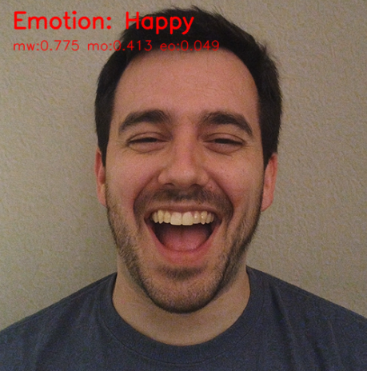

.. include:: /index.rst
   :start-after: start_hello_message
   :end-before: end_hello_message

.. _mp_face_emotion:

2. Rilevamento delle Emozioni
==========================================

-----------------------------
1. Panoramica
-----------------------------

In questa sezione, estendiamo il rilevamento Face Mesh per eseguire
il riconoscimento di base delle emozioni.

Invece di utilizzare modelli di deep learning, questo metodo usa
la geometria dei landmark facciali (rapporti occhi e bocca) per classificare
le espressioni in tempo reale.

Emozioni riconoscibili:

- 😮 Sorpreso
- 😀 Felice
- 😢 Triste
- 😠 Arrabbiato
- 😐 Neutrale

-----------------------------
2. Come Funziona
-----------------------------

Il programma segue questi passaggi:

1. Usa ``Picamera2`` + ``MediaPipe FaceMesh`` per ottenere 468 landmark.
2. Seleziona i punti caratteristici chiave intorno agli occhi e alla bocca.
3. Calcola rapporti normalizzati:

   - Apertura degli occhi
   - Larghezza della bocca
   - Apertura della bocca

4. Confronta i valori con soglie preimpostate.
5. Visualizza l'emozione rilevata usando OpenCV.

Vantaggi di questo approccio:

- Veloce e leggero (adatto per Raspberry Pi)
- Nessuna rete neurale richiesta
- Facile da regolare le soglie

------------------------
3. Eseguire il Codice
------------------------

.. important::

   Before you start, make sure:

   * The pan-tilt is assembled
   * You can access the Raspberry Pi desktop
   * The code package is installed
   * Fusion HAT+ is installed and configured
   * OpenCV is installed

   For detailed instructions, see :ref:`opencv_install`.

#. Apri il terminale e inserisci il seguente comando:

   .. code-block:: bash

        sudo python3 ~/ai-lab-kit/mediapipe/mp_face_emotion.py
#. Dopo aver eseguito il programma, si apre una finestra video che mostra il flusso video in diretta.

   .. raw:: html
   
         <video width="500" loop muted controls>
             <source src="../_static/video/Media_2.mp4" type="video/mp4">
             Your browser does not support the video tag.
         </video>

   Quando un volto appare davanti alla fotocamera, il sistema:

   - Rileva 468 landmark facciali in tempo reale
   - Calcola i rapporti di apertura degli occhi e della bocca
   - Classifica l'espressione facciale corrente

   L'etichetta dell'emozione rilevata (come ``Happy``, ``Surprised``, ``Sad``, ``Angry`` o ``Neutral``) viene visualizzata sullo schermo video.

   Mentre l'utente cambia le espressioni facciali, l'etichetta dell'emozione si aggiorna istantaneamente.

   Se non viene rilevato alcun volto, il programma continua a mostrare il normale flusso video senza etichetta dell'emozione.

   Premi ``q`` per uscire dal programma. La fotocamera si fermera e la finestra OpenCV si chiudera automaticamente.

-----------------------------
4. Codice Completo
-----------------------------

.. code-block:: python

   from picamera2 import Picamera2, Preview
   import cv2
   import mediapipe.python.solutions.face_mesh as mp_face_mesh
   import mediapipe.python.solutions.drawing_utils as drawing
   import mediapipe.python.solutions.drawing_styles as drawing_styles
   import numpy as np

   # --------- Funzione ausiliaria per il giudizio delle emozioni ---------
   def euclidean(p1, p2):
       return np.linalg.norm(np.array([p1.x, p1.y]) - np.array([p2.x, p2.y]))

   def classify_emotion(landmarks):
       """
       landmarks: results.multi_face_landmarks[0].landmark (length ~468)
       Returns (label, details_dict)
       """
       # Keypoint Index (MediaPipe 468 points)
       L_EYE_TOP, L_EYE_BOT = 159, 145
       R_EYE_TOP, R_EYE_BOT = 386, 374
       L_EYE_CENTER, R_EYE_CENTER = 33, 263
       MOUTH_LEFT, MOUTH_RIGHT = 61, 291
       LIP_UP, LIP_DOWN = 13, 14

       # Normalization scale: distance between left and right eye centers
       io = euclidean(landmarks[L_EYE_CENTER], landmarks[R_EYE_CENTER])
       if io < 1e-6:
           return "Neutral", {}

       mouth_width = euclidean(landmarks[MOUTH_LEFT], landmarks[MOUTH_RIGHT]) / io
       mouth_open  = euclidean(landmarks[LIP_UP], landmarks[LIP_DOWN]) / io
       eye_open_L  = euclidean(landmarks[L_EYE_TOP], landmarks[L_EYE_BOT]) / io
       eye_open_R  = euclidean(landmarks[R_EYE_TOP], landmarks[R_EYE_BOT]) / io
       eye_open    = 0.5 * (eye_open_L + eye_open_R)

       # --------- Simple threshold rules (adjustable) ---------
       if mouth_open > 0.08 and eye_open > 0.055:
           label = "Surprised"
       elif mouth_width > 0.48 and mouth_open > 0.035:
           label = "Happy"
       elif mouth_open < 0.018 and mouth_width < 0.36 and eye_open < 0.03:
           label = "Sad"
       elif mouth_open < 0.02 and eye_open < 0.028:
           label = "Angry"
       else:
           label = "Neutral"

       details = {
           "mouth_width": round(mouth_width, 3),
           "mouth_open": round(mouth_open, 3),
           "eye_open": round(eye_open, 3),
       }
       return label, details

   # Initialize FaceMesh
   face = mp_face_mesh.FaceMesh(
       static_image_mode=False,
       max_num_faces=1,
       refine_landmarks=True,
       min_detection_confidence=0.5
   )

   # Open camera
   picam2 = Picamera2()
   config = picam2.create_preview_configuration(
      main={"size": (640, 480), "format": "XRGB8888"} ,
   )
   picam2.configure(config)
   picam2.start()

   print("Streaming... press 'q' to quit")

   while True:
       frame_bgra = picam2.capture_array()
       frame_bgr  = cv2.cvtColor(frame_bgra, cv2.COLOR_BGRA2BGR)

       frame = cv2.cvtColor(frame_bgr, cv2.COLOR_BGR2RGB)
       results = face.process(frame)
       frame = cv2.cvtColor(frame, cv2.COLOR_RGB2BGR)

       if results.multi_face_landmarks:
           for face_landmarks in results.multi_face_landmarks:
               drawing.draw_landmarks(
                   image=frame,
                   landmark_list=face_landmarks,
                   connections=mp_face_mesh.FACEMESH_TESSELATION,
                   landmark_drawing_spec=drawing.DrawingSpec(thickness=1, circle_radius=1),
                   connection_drawing_spec=drawing_styles.get_default_face_mesh_tesselation_style()
               )

               # --------- Emotion detection ---------
               label, metrics = classify_emotion(face_landmarks.landmark)

               # Draw emotion label on the frame
               cv2.putText(frame, f"Emotion: {label}", (20, 40),
                           cv2.FONT_HERSHEY_SIMPLEX, 1.0, (0, 0, 255), 2, cv2.LINE_AA)

               # Debug information
               dbg = f"mw:{metrics.get('mouth_width',0)} mo:{metrics.get('mouth_open',0)} eo:{metrics.get('eye_open',0)}"
               cv2.putText(frame, dbg, (20, 70),
                           cv2.FONT_HERSHEY_SIMPLEX, 0.6, (0, 0, 255), 1, cv2.LINE_AA)

       cv2.imshow("Show Video", frame)
       if cv2.waitKey(1) & 0xff == ord('q'):
           break

   picam2.stop_preview()
   picam2.stop()
   cv2.destroyAllWindows()

Dopo l'esecuzione, la categoria dell'emozione riconosciuta verra visualizzata in tempo reale sul flusso video della fotocamera, insieme alle informazioni di debug che includono larghezza della bocca, apertura della bocca, apertura degli occhi, ecc.

-----------------------------
5. Spiegazione dei Passaggi Chiave
-----------------------------

#. Selezionare i punti chiave

   .. code-block:: python

      # Keypoint Index (MediaPipe 468 points)
      L_EYE_TOP, L_EYE_BOT = 159, 145
      R_EYE_TOP, R_EYE_BOT = 386, 374
      L_EYE_CENTER, R_EYE_CENTER = 33, 263
      MOUTH_LEFT, MOUTH_RIGHT = 61, 291
      LIP_UP, LIP_DOWN = 13, 14

   Questi indici corrispondono a:

   - 159, 145 → Bordi superiore e inferiore dell'occhio sinistro
   - 386, 374 → Bordi superiore e inferiore dell'occhio destro
   - 33, 263 → Centri degli occhi (usati per la normalizzazione)
   - 61, 291 → Angoli della bocca
   - 13, 14 → Punti medi del labbro superiore e inferiore

   .. image:: img/mp_face_point.jpg
      :align: center

#. Normalizzare le distanze

   Per ridurre l'influenza della distanza dalla fotocamera,
   utilizza la distanza tra i due centri degli occhi
   come scala di normalizzazione.

   .. code-block:: python

      def euclidean(p1, p2):
          return np.linalg.norm(
              np.array([p1.x, p1.y]) -
              np.array([p2.x, p2.y])
          )

      io = euclidean(
          landmarks[L_EYE_CENTER],
          landmarks[R_EYE_CENTER]
      )

#. Calcolare le caratteristiche geometriche

   .. code-block:: python

      mouth_width = euclidean(
          landmarks[MOUTH_LEFT],
          landmarks[MOUTH_RIGHT]
      ) / io

      mouth_open = euclidean(
          landmarks[LIP_UP],
          landmarks[LIP_DOWN]
      ) / io

      eye_open_L = euclidean(
          landmarks[L_EYE_TOP],
          landmarks[L_EYE_BOT]
      ) / io

      eye_open_R = euclidean(
          landmarks[R_EYE_TOP],
          landmarks[R_EYE_BOT]
      ) / io

      eye_open = 0.5 * (eye_open_L + eye_open_R)

   Caratteristiche calcolate:

   - ``mouth_width`` → Larghezza orizzontale della bocca
   - ``mouth_open`` → Apertura verticale della bocca
   - ``eye_open`` → Apertura media degli occhi

#. Classificare l'emozione usando le soglie

   .. code-block:: python

      if mouth_open > 0.08 and eye_open > 0.055:
          label = "Surprised"
      elif mouth_width > 0.48 and mouth_open > 0.035:
          label = "Happy"
      elif mouth_open < 0.018 and mouth_width < 0.36 and eye_open < 0.03:
          label = "Sad"
      elif mouth_open < 0.02 and eye_open < 0.028:
          label = "Angry"
      else:
          label = "Neutral"

   Regole delle emozioni (soglie empiriche):

   - Sorpreso → Bocca e occhi spalancati
   - Felice → Bocca larga, occhi normali
   - Triste / Arrabbiato → Bocca e occhi per lo piu chiusi
   - Neutrale → Non corrisponde ad altre condizioni

-----------------------------------------------------
6. Regolazione delle Soglie e Robustezza
-----------------------------------------------------

- Soglie come ``0.08``, ``0.035``, ``0.018`` sono basate su valori empirici con risoluzione 640×480.
- Se la fotocamera e piu vicina o la risoluzione e diversa, regola le soglie usando le informazioni di debug (mw/mo/eo).
- La logica di giudizio delle emozioni puo essere modificata per essere piu complessa o utilizzare modelli addestrati per maggiore precisione, come il calcolo della posizione relativa degli angoli della bocca, la forma della bocca e altre caratteristiche.

------------------------------------------------------------
7. Risoluzione dei Problemi
------------------------------------------------------------

- Riconoscimento delle emozioni poco sensibile

  Le soglie potrebbero non corrispondere alla distanza attuale della fotocamera.
  Regola i valori di ``mouth_open`` e ``eye_open``.

- Latenza di rilevamento

  La risoluzione potrebbe essere troppo alta.
  Riduci la risoluzione o disabilita ``refine_landmarks``.

- Impossibile riconoscere l'emozione

  L'illuminazione potrebbe essere insufficiente o l'angolo del volto inclinato.
  Migliora l'illuminazione e posiziona il viso direttamente davanti alla fotocamera.

-----------------------------
8.  Riepilogo
-----------------------------

- Questo capitolo ha implementato il riconoscimento leggero delle emozioni basato su **caratteristiche geometriche + landmark FaceMesh**.
- Offre i vantaggi di **elevate prestazioni in tempo reale** e **soglie regolabili**.
- Puo essere utilizzato in progetti come arte interattiva, HCI, rilevamento dello stato in aula/riunioni.