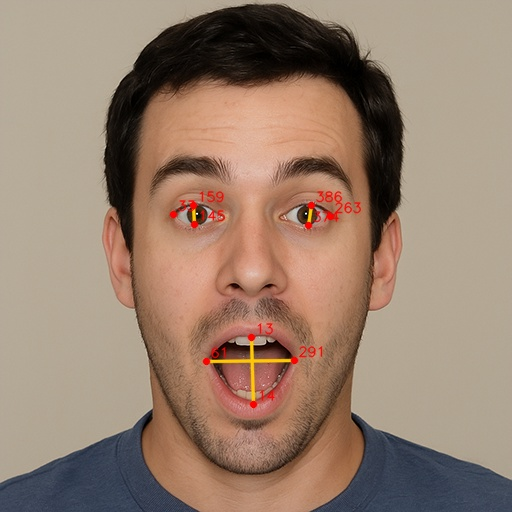

.. _mp_face_emotion:

2. Emotion Detection
==========================================

In the previous section, we implemented **Face Mesh detection** based on MediaPipe.
This section will further utilize the **468 landmark coordinates** from Face Mesh to determine the basic facial expression state by calculating the relative geometric features of the mouth and eyes.

.. image:: img/mp_face_emotion_happy.png
   :align: center

**Objective：**

- Use FaceMesh to obtain landmark positions and achieve real-time emotion recognition.
- Does not rely on deep learning models; classification is done solely through **geometric features + threshold judgment**.
- Capable of recognizing common basic emotions:

  - 😮 Surprised
  - 😀 Happy
  - 😢 Sad
  - 😠 Angry
  - 😐 Neutral

**Approach：**

1.  Use ``Picamera2`` + ``MediaPipe FaceMesh`` to obtain 468 facial landmarks.
2.  Select key **feature points in the eye and mouth regions**.
3.  Calculate eye openness, mouth width, and mouth openness ratios (normalized to avoid distance effects).
4.  Classify expressions using preset thresholds.
5.  Use OpenCV to draw the recognition results in real-time on the video feed.

This method does not rely on neural network inference, therefore:

- ✅ Fast speed, low latency (suitable for Raspberry Pi)
- ✅ Easy to adjust thresholds based on project requirements
- ⚠️ Accuracy is lower than trained deep learning emotion recognition models, but it is lightweight and efficient

------------------------
1. Run the Code
------------------------

Please make sure that:

1. You have installed OpenCV on your Raspberry Pi (see :ref:`opencv_install`);
2. You are using a display. Otherwise, please install Raspberry Pi Connect (|link_rpi_connect|) or RealVNC (:ref:`remote_desktop`) and make sure you can access the Raspberry Pi desktop through one of them;
3. You have downloaded the **ai-lab-kit** project (see :ref:`download_code`).
4. You have installed the **mediapipe** environment (see :ref:`mediapipe_install`).

Open the terminal in VNC and enter the following command:

.. code-block:: bash

   sudo ~/mediapipe_env/bin/python3 ~/ai-lab-kit/mediapipe/mp_face_emotion.py

-----------------------------
2. Code Example
-----------------------------

.. code-block:: python

   from picamera2 import Picamera2, Preview
   import cv2
   import mediapipe.python.solutions.face_mesh as mp_face_mesh
   import mediapipe.python.solutions.drawing_utils as drawing
   import mediapipe.python.solutions.drawing_styles as drawing_styles
   import numpy as np

   # --------- Emotion judgment auxiliary function ---------
   def euclidean(p1, p2):
       return np.linalg.norm(np.array([p1.x, p1.y]) - np.array([p2.x, p2.y]))

   def classify_emotion(landmarks):
       """
       landmarks: results.multi_face_landmarks[0].landmark (length ~468)
       Returns (label, details_dict)
       """
       # Keypoint Index (MediaPipe 468 points)
       L_EYE_TOP, L_EYE_BOT = 159, 145
       R_EYE_TOP, R_EYE_BOT = 386, 374
       L_EYE_CENTER, R_EYE_CENTER = 33, 263
       MOUTH_LEFT, MOUTH_RIGHT = 61, 291
       LIP_UP, LIP_DOWN = 13, 14

       # Normalization scale: distance between left and right eye centers
       io = euclidean(landmarks[L_EYE_CENTER], landmarks[R_EYE_CENTER])
       if io < 1e-6:
           return "Neutral", {}

       mouth_width = euclidean(landmarks[MOUTH_LEFT], landmarks[MOUTH_RIGHT]) / io
       mouth_open  = euclidean(landmarks[LIP_UP], landmarks[LIP_DOWN]) / io
       eye_open_L  = euclidean(landmarks[L_EYE_TOP], landmarks[L_EYE_BOT]) / io
       eye_open_R  = euclidean(landmarks[R_EYE_TOP], landmarks[R_EYE_BOT]) / io
       eye_open    = 0.5 * (eye_open_L + eye_open_R)

       # --------- Simple threshold rules (adjustable) ---------
       if mouth_open > 0.08 and eye_open > 0.055:
           label = "Surprised"
       elif mouth_width > 0.48 and mouth_open > 0.035:
           label = "Happy"
       elif mouth_open < 0.018 and mouth_width < 0.36 and eye_open < 0.03:
           label = "Sad"
       elif mouth_open < 0.02 and eye_open < 0.028:
           label = "Angry"
       else:
           label = "Neutral"

       details = {
           "mouth_width": round(mouth_width, 3),
           "mouth_open": round(mouth_open, 3),
           "eye_open": round(eye_open, 3),
       }
       return label, details

   # Initialize FaceMesh
   face = mp_face_mesh.FaceMesh(
       static_image_mode=False,
       max_num_faces=1,
       refine_landmarks=True,
       min_detection_confidence=0.5
   )

   # Open camera
   picam2 = Picamera2()
   config = picam2.create_preview_configuration(
      main={"size": (640, 480), "format": "XRGB8888"} ,
   )
   picam2.configure(config)
   picam2.start()

   print("Streaming... press 'q' to quit")

   while True:
       frame_bgra = picam2.capture_array()
       frame_bgr  = cv2.cvtColor(frame_bgra, cv2.COLOR_BGRA2BGR)

       frame = cv2.cvtColor(frame_bgr, cv2.COLOR_BGR2RGB)
       results = face.process(frame)
       frame = cv2.cvtColor(frame, cv2.COLOR_RGB2BGR)

       if results.multi_face_landmarks:
           for face_landmarks in results.multi_face_landmarks:
               drawing.draw_landmarks(
                   image=frame,
                   landmark_list=face_landmarks,
                   connections=mp_face_mesh.FACEMESH_TESSELATION,
                   landmark_drawing_spec=drawing.DrawingSpec(thickness=1, circle_radius=1),
                   connection_drawing_spec=drawing_styles.get_default_face_mesh_tesselation_style()
               )

               # --------- Emotion detection ---------
               label, metrics = classify_emotion(face_landmarks.landmark)

               # Draw emotion label on the frame
               cv2.putText(frame, f"Emotion: {label}", (20, 40),
                           cv2.FONT_HERSHEY_SIMPLEX, 1.0, (0, 0, 255), 2, cv2.LINE_AA)

               # Debug information
               dbg = f"mw:{metrics.get('mouth_width',0)} mo:{metrics.get('mouth_open',0)} eo:{metrics.get('eye_open',0)}"
               cv2.putText(frame, dbg, (20, 70),
                           cv2.FONT_HERSHEY_SIMPLEX, 0.6, (0, 0, 255), 1, cv2.LINE_AA)

       cv2.imshow("Show Video", frame)
       if cv2.waitKey(1) & 0xff == ord('q'):
           break

   picam2.stop_preview()
   picam2.stop()
   cv2.destroyAllWindows()

After running, the recognized emotion category will be displayed in real-time on the camera feed, along with debug information including mouth width, mouth openness, eye openness, etc.

-----------------------------
3. Key Steps Explanation
-----------------------------

**Select Key Points**

.. code:: python

   # Keypoint Index (MediaPipe 468 points)
   L_EYE_TOP, L_EYE_BOT = 159, 145
   R_EYE_TOP, R_EYE_BOT = 386, 374
   L_EYE_CENTER, R_EYE_CENTER = 33, 263
   MOUTH_LEFT, MOUTH_RIGHT = 61, 291
   LIP_UP, LIP_DOWN = 13, 14

- 159, 145: Upper and lower edges of the left eye
- 386, 374: Upper and lower edges of the right eye
- 33, 263: Left and right eye centers (used for normalization)
- 61, 291: Left and right corners of the mouth
- 13, 14: Midpoints of the upper and lower lips

**Normalization**

To prevent camera distance from affecting measurements, use the **distance between eye centers** as the normalization scale:

.. code-block:: python

   def euclidean(p1, p2):
       return np.linalg.norm(np.array([p1.x, p1.y]) - np.array([p2.x, p2.y]))

   io = euclidean(landmarks[L_EYE_CENTER], landmarks[R_EYE_CENTER])

**Calculate Geometric Features**

.. code-block:: python

   mouth_width = euclidean(landmarks[MOUTH_LEFT], landmarks[MOUTH_RIGHT]) / io
   mouth_open  = euclidean(landmarks[LIP_UP], landmarks[LIP_DOWN]) / io
   eye_open_L  = euclidean(landmarks[L_EYE_TOP], landmarks[L_EYE_BOT]) / io
   eye_open_R  = euclidean(landmarks[R_EYE_TOP], landmarks[R_EYE_BOT]) / io
   eye_open    = 0.5 * (eye_open_L + eye_open_R)

- Mouth width ``mouth_width``
- Mouth openness ``mouth_open``
- Average eye openness ``eye_open``

**④ Simple Threshold Classification**

.. code-block:: python

   if mouth_open > 0.08 and eye_open > 0.055:
      label = "Surprised"
   elif mouth_width > 0.48 and mouth_open > 0.035:
      label = "Happy"
   elif mouth_open < 0.018 and mouth_width < 0.36 and eye_open < 0.03:
      label = "Sad"
   elif mouth_open < 0.02 and eye_open < 0.028:
      label = "Angry"
   else:
      label = "Neutral"

Determine emotion using empirical values:

- Surprised: Mouth and eyes are wide open
- Happy: Mouth is wide open, eyes are normal
- Sad / Angry: High degree of closure for both mouth and eyes
- Neutral: Does not meet the above conditions

-----------------------------------------------------
4. Threshold and Robustness Adjustment
-----------------------------------------------------

- Thresholds like ``0.08``, ``0.035``, ``0.018`` are based on empirical values at 640×480 resolution.
- If the camera is closer or the resolution is different, adjust the thresholds using the debug information (mw/mo/eo).
- Emotion judgment logic can be modified to be more complex or use trained models for higher accuracy, such as calculating the relative position of mouth corners, mouth shape, and other features.

--------------------------------------------------------
5. Common Issue Troubleshooting
--------------------------------------------------------

.. list-table::
   :header-rows: 1

   * - Issue
     - Cause
     - Solution
   * - Emotion recognition not sensitive
     - Thresholds not suitable for current distance
     - Adjust ``mouth_open`` and ``eye_open`` thresholds
   * - Detection latency
     - Resolution too high
     - Reduce resolution or turn off refine_landmarks
   * - Cannot recognize emotion
     - Insufficient light / Face angle too skewed
     - Improve lighting, face the camera directly

-----------------------------
6. ✅ Summary
-----------------------------

- This chapter implemented lightweight emotion recognition based on **geometric features + FaceMesh landmarks**.
- Offers advantages of **high real-time performance** and **adjustable thresholds**.
- Can be used in projects like interactive art, HCI, classroom/meeting state detection.