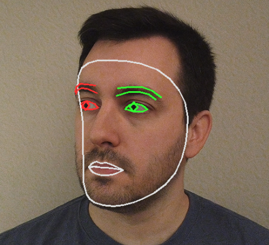

.. include:: /index.rst
   :start-after: start_hello_message
   :end-before: end_hello_message

.. _mp_face_iris:

3. Gesichtskonturen und Iriserkennung
=================================================================

------------------------------------------------------------
1. Überblick
------------------------------------------------------------

In den vorherigen Abschnitten haben wir die grundlegende Face-Mesh-Erkennung
und eine einfache Emotionserkennung implementiert.

Dieser Abschnitt konzentriert sich auf die detaillierten Verbindungsarten
für Merkmale, die von MediaPipe FaceMesh bereitgestellt werden:

- ``FACEMESH_CONTOURS`` — Zeichnet Gesichtskonturlinien
  (Gesichtsränder und äußere Begrenzungen von Gesichtsmerkmalen)

- ``FACEMESH_IRISES`` — Zeichnet die Irisbereiche beider Augen

Durch das Zeichnen nur der Konturen und Irisbereiche wird die Darstellung
übersichtlicher und ressourcenschonender. Dies ist nützlich für:

- Extraktion von Gesichtsmerkmalen
- Eye-Tracking
- Pupillenverfolgung
- Blickinteraktion

------------------------------------------------------------
2. Funktionsweise
------------------------------------------------------------

Das Programm führt die folgenden Schritte aus:

1. Initialisierung des MediaPipe-FaceMesh-Modells.
2. Erfassung von Videobildern mit der Raspberry-Pi-Kamera.
3. Konvertierung des Bildes in das RGB-Format (erforderlich für MediaPipe).
4. Zeichnen der Gesichtskonturlinien mit ``FACEMESH_CONTOURS``.
5. Zeichnen der Iris-Landmarks mit ``FACEMESH_IRISES``.
6. Anzeige nur der wichtigsten Bereiche für eine klarere Visualisierung.

------------------------
3. Code ausführen
------------------------

.. important::

   Stellen Sie vor dem Start sicher, dass:

   * das Pan-Tilt-Modul montiert ist
   * Sie Zugriff auf den Raspberry Pi Desktop haben
   * das Codepaket installiert ist
   * das Fusion HAT+ installiert und konfiguriert ist
   * OpenCV installiert ist

   Detaillierte Anweisungen finden Sie unter :ref:`opencv_install`.

#. Öffnen Sie das Terminal und geben Sie den folgenden Befehl ein:

   .. code-block:: bash

      sudo python3 ~/ai-lab-kit/mediapipe/mp_face_iris.py

#. Nach dem Start des Programms öffnet sich ein Videofenster mit dem Titel "Show Video" und zeigt den Live-Kamerastream an.

   .. raw:: html
   
         <video width="500" loop muted controls>
             <source src="../_static/video/Media_3.mp4" type="video/mp4">
             Your browser does not support the video tag.
         </video>
         
   Sobald ein Gesicht vor der Kamera erscheint:
   
   - MediaPipe erkennt die Gesichts-Landmarks in Echtzeit.
   - Es werden nur die Gesichtskonturlinien gezeichnet (Gesichtsumriss, Augenbrauen, Lippen usw.).
   - Die Irisbereiche beider Augen werden durch kreisförmige Landmark-Verbindungen hervorgehoben.
   
   Im Gegensatz zum vollständigen Face Mesh zeigt der Bildschirm nur die wichtigsten Konturen und Irismerkmale an, wodurch die Darstellung klarer und weniger überladen wirkt.
   
   Wenn der Benutzer den Kopf oder die Augen bewegt:
   
   - folgen die Konturlinien dem Gesicht flüssig.
   - verfolgen die Iris-Landmarks die Augenbewegungen in Echtzeit.
   
   Wenn kein Gesicht erkannt wird, zeigt das Fenster weiterhin den normalen Kamerastream ohne Markierungen an.
   
   Drücken Sie ``q``, um das Programm zu beenden.  
   Die Kamera stoppt und das OpenCV-Fenster wird automatisch geschlossen.

-----------------------------
4. Vollständiger Code
-----------------------------

.. code-block:: python

   from picamera2 import Picamera2, Preview
   import cv2
   import mediapipe.python.solutions.face_mesh as mp_face_mesh
   import mediapipe.python.solutions.drawing_utils as drawing
   import mediapipe.python.solutions.drawing_styles as drawing_styles

   # Initialize FaceMesh model
   face = mp_face_mesh.FaceMesh(
       static_image_mode=False,
       max_num_faces=1,
       refine_landmarks=True,
       min_detection_confidence=0.5
   )

   # Open camera
   picam2 = Picamera2()
   config = picam2.create_preview_configuration(
      main={"size": (640, 480), "format": "XRGB8888"} ,
   )
   picam2.configure(config)
   # picam2.start_preview(Preview.QTGL) # Enable if hardware preview is needed
   picam2.start()

   print("Streaming... press 'q' to quit")

   while True:
      frame_bgra = picam2.capture_array()
      frame_bgr  = cv2.cvtColor(frame_bgra, cv2.COLOR_BGRA2BGR)

      frame = cv2.cvtColor(frame_bgr, cv2.COLOR_BGR2RGB)
      results = face.process(frame)
      frame = cv2.cvtColor(frame, cv2.COLOR_RGB2BGR)

      if results.multi_face_landmarks:
         for face_landmarks in results.multi_face_landmarks:
            # Draw facial contours
            drawing.draw_landmarks(
                  image=frame,
                  landmark_list=face_landmarks,
                  connections=mp_face_mesh.FACEMESH_CONTOURS,
                  landmark_drawing_spec=None,
                  connection_drawing_spec=drawing_styles.get_default_face_mesh_contours_style()
            )
            # Draw iris features
            drawing.draw_landmarks(
                  image=frame,
                  landmark_list=face_landmarks,
                  connections=mp_face_mesh.FACEMESH_IRISES,
                  landmark_drawing_spec=None,
                  connection_drawing_spec=drawing_styles.get_default_face_mesh_iris_connections_style()
            )

      cv2.imshow("Show Video", frame)
      if cv2.waitKey(1) & 0xff == ord('q'):
         break

   picam2.stop_preview()
   picam2.stop()
   cv2.destroyAllWindows()

Nach dem Ausführen des Programms werden auf dem Bildschirm nur die Gesichtskonturen und die Irisbereiche beider Augen angezeigt.

-----------------------------

5. Erklärung der wichtigsten Schritte
--------------------------------------------------------------

Der Code in diesem Abschnitt ist nahezu identisch mit
:ref:`mp_face`.

Der Hauptunterschied liegt in der verwendeten Zeichenmethode
innerhalb der Hauptschleife. Die Funktion ``draw_landmarks()``
wird zweimal aufgerufen:

- Einmal mit ``FACEMESH_CONTOURS``
- Einmal mit ``FACEMESH_IRISES``

Sie können einen der beiden Zeichenblöcke auskommentieren,
um den Unterschied in der visuellen Darstellung zu beobachten.

------------------------------------------------------------

``FACEMESH_CONTOURS``

- Ein von MediaPipe bereitgestelltes Verbindungsset.
- Zeichnet hauptsächlich:

  - Äußere Gesichtskontur
  - Ränder der Augen
  - Nasenkontur
  - Lippenkonturen

Diese Methode erzeugt eine vereinfachte Visualisierung,
wodurch Veränderungen der Gesichtskonturen leichter zu erkennen sind.

------------------------------------------------------------

``FACEMESH_IRISES``

- Zeichnet die Irisbereiche beider Augen.
- Enthält Iris-Schlüsselpunkte und kreisförmige Verbindungslinien.
- Nützlich für:

  - Eye-Tracking
  - Pupillenverfolgung
  - Blickerkennung

------------------------------------------------------------

``landmark_drawing_spec=None``

- Deaktiviert das Zeichnen einzelner Landmark-Punkte.
- Es werden nur Verbindungslinien angezeigt,
  was zu einer übersichtlicheren Darstellung führt.

Wenn Sie sowohl Punkte als auch Linien anzeigen möchten,
definieren Sie eine benutzerdefinierte ``DrawingSpec``.

------------------------------------------------------------

``drawing_styles.get_default_face_mesh_contours_style()``

- Gibt den Standard-Zeichenstil für Gesichtskonturen zurück.

``drawing_styles.get_default_face_mesh_iris_connections_style()``

- Gibt den Standard-Zeichenstil für Iris-Verbindungslinien zurück.

------------------------------------------------------------
6. Fehlerbehebung
------------------------------------------------------------

- Iris wird nicht erkannt

  Wenn die Iris nicht erkannt wird, kann dies an unzureichender Beleuchtung liegen,
  daran, dass sich das Gesicht zu weit von der Kamera entfernt befindet,
  oder daran, dass ``refine_landmarks`` nicht aktiviert ist.

  Verbessern Sie die Beleuchtung, bewegen Sie sich näher zur Kamera
  und stellen Sie sicher, dass beim Initialisieren von FaceMesh
  ``refine_landmarks=True`` gesetzt ist.

- Konturlinien zittern

  Wenn die Konturlinien instabil erscheinen,
  ist möglicherweise die Erkennungszuverlässigkeit zu niedrig,
  oder Beleuchtung und Kopfbewegungen beeinträchtigen das Tracking.

  Versuchen Sie, ``min_detection_confidence`` zu erhöhen,
  die Beleuchtung zu verbessern und Kopfbewegungen langsamer und gleichmäßiger auszuführen.

- Hohe Latenz

  Wenn die Videoreaktion verzögert wirkt,
  ist möglicherweise die Auflösung zu hoch
  oder ``refine_landmarks`` verbraucht zusätzliche Ressourcen.

  Reduzieren Sie die Auflösung (z. B. 320×240),
  oder deaktivieren Sie ``refine_landmarks``, wenn keine Iris-Erkennung benötigt wird.
  
-----------------------------
7. Zusammenfassung
-----------------------------

- ``FACEMESH_CONTOURS`` und ``FACEMESH_IRISES`` sind zwei wichtige Verbindungsarten, die von MediaPipe bereitgestellt werden.
- Im Vergleich zur vollständigen Mesh-Darstellung sind sie leichtergewichtig und übersichtlicher und eignen sich gut für praktische Interaktionsszenarien.
- Im nächsten Kapitel wird erläutert, wie diese Funktionen für Blickverfolgung und Blinzelerkennung genutzt werden können.