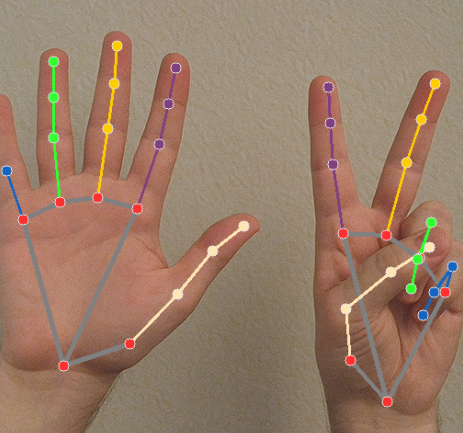
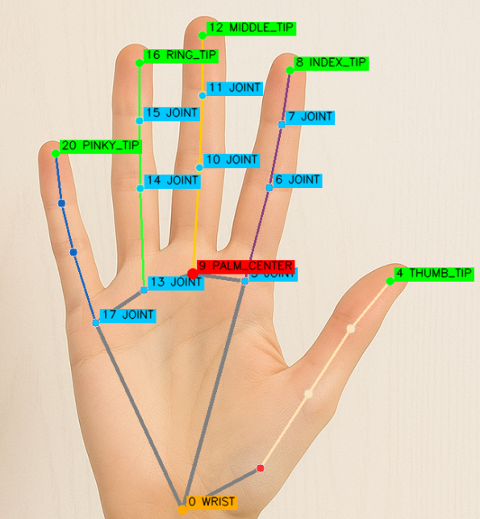

.. include:: /index.rst
   :start-after: start_hello_message
   :end-before: end_hello_message

.. _mp_hand:

4. Rilevamento delle Mani
===============================

------------------------------------------------------------
1. Panoramica
------------------------------------------------------------

Nella sezione precedente, abbiamo implementato il rilevamento facciale
e il tracciamento dei landmark utilizzando MediaPipe.

Questa sezione introduce **MediaPipe Hands** —
un modulo leggero e stabile per il rilevamento in tempo reale dei landmark delle mani.

Utilizzando questo modulo, possiamo:

- Rilevare fino a due mani contemporaneamente
- Identificare 21 landmark per mano
- Visualizzare le connessioni dello scheletro della mano in tempo reale

------------------------------------------------------------
2. Come Funziona
------------------------------------------------------------

Il programma segue questi passaggi:

1. Inizializza il modello MediaPipe Hands.
2. Acquisisce i fotogrammi dalla fotocamera del Raspberry Pi.
3. Converte l'immagine in formato RGB (richiesto da MediaPipe).
4. Rileva i landmark delle mani usando il modulo Hands.
5. Disegna i 21 landmark e le loro linee di connessione.
6. Visualizza il flusso video annotato in tempo reale.

Questo modulo funge da base per:

- Riconoscimento dei gesti
- Conteggio delle dita
- Sistemi di controllo interattivi
- Interazione uomo-macchina senza contatto

------------------------
3. Eseguire il Codice
------------------------

.. important::

   Before you start, make sure:

   * The pan-tilt is assembled
   * You can access the Raspberry Pi desktop
   * The code package is installed
   * Fusion HAT+ is installed and configured
   * OpenCV is installed

   For detailed instructions, see :ref:`opencv_install`.

#. Apri il terminale e inserisci il seguente comando:

   .. code-block:: bash

      sudo python3 ~/ai-lab-kit/mediapipe/mp_hand.py

#. Dopo aver eseguito il programma, si apre una finestra intitolata "Show Video" che mostra il flusso video in diretta.

   .. raw:: html
   
         <video width="500" loop muted controls>
             <source src="../_static/video/Media_4.mp4" type="video/mp4">
             Your browser does not support the video tag.
         </video>
   
   Quando una o due mani appaiono davanti alla fotocamera:

   - MediaPipe rileva ogni mano in tempo reale.
   - Su ogni mano vengono identificati 21 punti landmark.
   - I landmark vengono collegati con linee per formare uno scheletro della mano.

   Se sono visibili due mani, entrambe vengono tracciate e
   annotate simultaneamente.

   Mentre l'utente muove le mani o le dita:

   - I punti landmark seguono il movimento in modo fluido.
   - Lo scheletro della mano si aggiorna in tempo reale.

   Se non viene rilevata alcuna mano, il programma mostra semplicemente
   il normale flusso video senza annotazioni.

   Premi ``q`` per uscire dal programma.
   La fotocamera si ferma e la finestra OpenCV si chiude automaticamente.

-----------------------------
4. Codice Completo
-----------------------------

Il codice di esempio completo e il seguente:

.. code-block:: python

   from picamera2 import Picamera2, Preview
   import cv2
   import mediapipe.python.solutions.hands as mp_hands
   import mediapipe.python.solutions.drawing_utils as drawing
   import mediapipe.python.solutions.drawing_styles as drawing_styles

   # Initialize Hands model
   hands = mp_hands.Hands(
       static_image_mode=False,    # Process real-time video frames
       max_num_hands=2,            # Maximum number of hands to detect
       min_detection_confidence=0.5
   )

   # Open camera
   picam2 = Picamera2()
   config = picam2.create_preview_configuration(
      main={"size": (640, 480), "format": "XRGB8888"} ,
   )
   picam2.configure(config)
   # picam2.start_preview(Preview.QTGL) # Optional hardware preview
   picam2.start()

   print("Streaming... press 'q' to quit")

   while True:
      frame_bgra = picam2.capture_array()
      frame_bgr  = cv2.cvtColor(frame_bgra, cv2.COLOR_BGRA2BGR)

      # Convert BGR to RGB
      frame_rgb = cv2.cvtColor(frame_bgr, cv2.COLOR_BGR2RGB)

      # Detect hands
      hands_detected = hands.process(frame_rgb)

      # Convert RGB back to BGR for display
      frame = cv2.cvtColor(frame_rgb, cv2.COLOR_RGB2BGR)

      # If hands are detected, draw landmarks and connections
      if hands_detected.multi_hand_landmarks:
         for hand_landmarks in hands_detected.multi_hand_landmarks:
            drawing.draw_landmarks(
                  frame,
                  hand_landmarks,
                  mp_hands.HAND_CONNECTIONS,
                  drawing_styles.get_default_hand_landmarks_style(),
                  drawing_styles.get_default_hand_connections_style(),
            )

      cv2.imshow("Show Video", frame)

      if cv2.waitKey(1) & 0xff == ord('q'):
         break

   picam2.stop_preview()
   picam2.stop()
   cv2.destroyAllWindows()

Dopo aver eseguito il codice, vedrai nel flusso video:

- Se vengono rilevate una o due mani, verranno mostrati:

  - 21 landmark della mano
  - Scheletro di connessione blu
- Quando la mano si muove, il rilevamento la seguira in tempo reale.

--------------------------------------------------------
5. Descrizione dei Landmark di MediaPipe Hands
--------------------------------------------------------

MediaPipe Hands restituisce **21 landmark** per ogni mano, incluse posizioni come polso, palmo e punta delle dita.

I landmark comuni includono:

.. list-table::
   :header-rows: 1

   * - Indice
     - Nome
     - Posizione
   * - 0
     - WRIST
     - Polso
   * - 4 / 8 / 12 / 16 / 20
     - THUMB_TIP / INDEX_FINGER_TIP / MIDDLE_FINGER_TIP / RING_FINGER_TIP / PINKY_TIP
     - Punta delle rispettive dita
   * - 5~17
     - Joints
     - Articolazioni mediane delle rispettive dita
   * - 9
     - PALM_CENTER (approssimativo)
     - Area del palmo

.. note::
   Queste coordinate sono **coordinate normalizzate** e possono essere convertite in posizioni pixel effettive in base alla risoluzione dell'immagine.
   Possono essere utilizzate per calcolare angoli e distanze, consentendo il riconoscimento dei gesti.

------------------------------------------------------------
6. Risoluzione dei Problemi
------------------------------------------------------------

- Rilevamento instabile delle mani

  Il rilevamento delle mani potrebbe diventare instabile se l'illuminazione e troppo fioca, lo sfondo e disordinato o la mano si muove troppo velocemente.

  Prova a migliorare l'illuminazione, utilizzare uno sfondo semplice e muovere le mani piu lentamente e costantemente.

- Nessuna mano rilevata

  Se non viene rilevata alcuna mano, l'angolazione della fotocamera potrebbe non essere adatta, la mano potrebbe essere troppo lontana dalla fotocamera o la risoluzione potrebbe essere troppo bassa.

  Regola la posizione della fotocamera, avvicinati e assicurati che la risoluzione sia almeno 640×480.

- Latenza elevata

  Se la risposta video e lenta, il Raspberry Pi potrebbe essere sotto carico elevato o la risoluzione potrebbe essere impostata troppo alta.

  Riduci la risoluzione (per esempio, 320×240) e chiudi i processi di background non necessari.

-----------------------------
7.  Riepilogo
-----------------------------

- MediaPipe Hands consente un **rilevamento delle mani in tempo reale** stabile su Raspberry Pi.
- Fornisce 21 landmark per mano, adatto per:

  - Riconoscimento dei gesti
  - Controllo virtuale
  - Controllo UI interattivo

- Successivamente, implementeremo il **riconoscimento personalizzato dei gesti** basato su questi landmark.