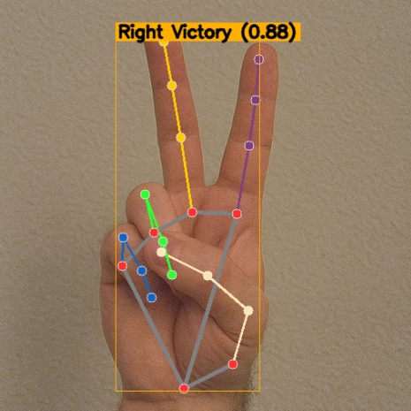

.. include:: /index.rst
   :start-after: start_hello_message
   :end-before: end_hello_message

.. _mp_hand_gesture:

6. Riconoscitore di Gesti della Mano
==================================================

------------------------------------------------------------
1. Panoramica
------------------------------------------------------------

Nel capitolo precedente, abbiamo utilizzato MediaPipe Hands
per ottenere 21 landmark della mano e visualizzare lo scheletro della mano.

Questo capitolo introduce **MediaPipe Tasks – Gesture Recognizer**,
che puo restituire direttamente etichette di gesti semantici come:

- ``Thumb_Up``
- ``Open_Palm``
- ``Victory``
- ``Closed_Fist``

Combinando:

- ``Picamera2`` per l'acquisizione video
- ``MediaPipe Hands`` per la visualizzazione dei landmark
- ``Gesture Recognizer`` per la classificazione

possiamo ottenere il riconoscimento dei gesti in tempo reale
con sia il rendering dello scheletro che la visualizzazione delle etichette.

------------------------------------------------------------
2. Come Funziona
------------------------------------------------------------

Il programma esegue i seguenti passaggi:

1. Acquisisce i fotogrammi video usando ``Picamera2``.
2. (Opzionale) Usa ``MediaPipe Hands`` per disegnare i landmark.
3. Usa **MediaPipe Tasks – Gesture Recognizer** in modalita ``VIDEO``.
4. Per ogni mano rilevata, ottiene:

   - Elenco delle categorie di gesti (etichetta + confidenza)
   - Lateralita (Sinistra / Destra)
   - Landmark normalizzati

5. Seleziona il gesto top-1 e disegna
   "etichetta + punteggio di confidenza"
   sopra la mano corrispondente.

.. note::

   Questo capitolo utilizza la MediaPipe **Tasks API (0.10+)**.

------------------------------------------------------------
3. Modello
------------------------------------------------------------

Gesture Recognizer richiede un file modello:

``gesture_recognizer.task``

Il file modello e gia incluso nella directory degli esempi.
Si prega di utilizzare la versione fornita.

Il modello integrato supporta le seguenti etichette di gesti:

- 0 → ``Unknown``
- 1 → ``Closed_Fist``
- 2 → ``Open_Palm``
- 3 → ``Pointing_Up``
- 4 → ``Thumb_Down``
- 5 → ``Thumb_Up``
- 6 → ``Victory``
- 7 → ``ILoveYou``

------------------------
4. Eseguire il Codice
------------------------

.. important::

   Before you start, make sure:

   * The pan-tilt is assembled
   * You can access the Raspberry Pi desktop
   * The code package is installed
   * Fusion HAT+ is installed and configured
   * OpenCV is installed

   For detailed instructions, see :ref:`opencv_install`.

#. Apri il terminale e inserisci il seguente comando:

   .. code-block:: bash

      sudo python3 ~/ai-lab-kit/mediapipe/mp_hand_gesture.py

#. Dopo aver eseguito il programma, si apre una finestra intitolata "Show Video" che mostra il flusso video in diretta.

   .. raw:: html
   
         <video width="500" loop muted controls>
             <source src="../_static/video/Media_6.mp4" type="video/mp4">
             Your browser does not support the video tag.
         </video>
         
   Quando una o due mani appaiono davanti alla fotocamera, il programma:

   - Rileva e disegna i 21 landmark della mano e le linee di connessione (scheletro della mano) in tempo reale.
   - Esegue il modello Gesture Recognizer su ogni fotogramma per classificare il gesto.

   Se un gesto viene riconosciuto con un punteggio superiore a ``SCORE_THRESHOLD`` (default 0.5), il programma mostra un'etichetta vicino alla mano corrispondente, includendo:

   - Lateralita (Sinistra/Destra)
   - Nome del gesto (per esempio, ``Thumb_Up``, ``Open_Palm``, ``Victory``)
   - Punteggio di confidenza (per esempio, ``0.87``)

   Viene anche disegnato un sottile riquadro intorno all'area della mano per rendere il posizionamento dell'etichetta piu chiaro.

   Mentre cambi le pose della mano, l'etichetta del gesto e il punteggio si aggiornano continuamente in tempo reale.

   Se non viene rilevata alcuna mano, o la confidenza del gesto e inferiore alla soglia, viene mostrato solo lo scheletro della mano (o il flusso video grezzo) senza etichette dei gesti.

   Premi ``q`` per uscire dal programma. La fotocamera si ferma e la finestra OpenCV si chiude automaticamente.

-----------------------------
5. Codice Completo
-----------------------------

.. code-block:: python

   from picamera2 import Picamera2, Preview
   import cv2
   import numpy as np
   import mediapipe.python.solutions.hands as mp_hands
   import mediapipe.python.solutions.drawing_utils as drawing
   import mediapipe.python.solutions.drawing_styles as drawing_styles

   # Import MediaPipe Tasks (Gesture Recognizer)
   import mediapipe as mp
   from mediapipe.tasks import python
   from mediapipe.tasks.python import vision

   from pathlib import Path

   # --------------------- Settings ---------------------
   BASE_DIR = Path(__file__).resolve().parent
   GESTURE_MODEL_PATH = str(BASE_DIR / "gesture_recognizer.task")  # Path to the gesture model
   SCORE_THRESHOLD = 0.5                           # Show gestures above this score
   # ---------------------------------------------------

   # Initialize the Hands model (kept for landmark drawing)
   hands = mp_hands.Hands(
       static_image_mode=False,
       max_num_hands=2,
       min_detection_confidence=0.5
   )

   # Initialize Gesture Recognizer (VIDEO mode for streaming)
   BaseOptions = python.BaseOptions
   GestureRecognizerOptions = vision.GestureRecognizerOptions
   RunningMode = vision.RunningMode

   base_options = BaseOptions(model_asset_path=GESTURE_MODEL_PATH)
   gr_options = GestureRecognizerOptions(
       base_options=base_options,
       running_mode=RunningMode.VIDEO
   )
   recognizer = vision.GestureRecognizer.create_from_options(gr_options)

   # Open the camera
   picam2 = Picamera2()
   config = picam2.create_preview_configuration(
      main={"size": (640, 480), "format": "XRGB8888"} ,
   )

   picam2.configure(config)
   picam2.start()

   print("Streaming... press 'q' to quit")

   # (Optional) helper to draw a label near a hand bounding box computed from landmarks
   def draw_gesture_label(frame_bgr, norm_landmarks, text, color=(0, 175, 255)):
       """
       norm_landmarks: list of 21 normalized landmarks (x,y in [0,1]).
       We compute a tight bbox to place the gesture text.
       """
       if not norm_landmarks:
           return
       h, w = frame_bgr.shape[:2]
       xs = [int(lm.x * w) for lm in norm_landmarks]
       ys = [int(lm.y * h) for lm in norm_landmarks]
       x1, y1 = max(0, min(xs)), max(0, min(ys))
       x2, y2 = min(w-1, max(xs)), min(h-1, max(ys))
       cv2.rectangle(frame_bgr, (x1, y1), (x2, y2), color, 1)
       (tw, th), _ = cv2.getTextSize(text, cv2.FONT_HERSHEY_SIMPLEX, 0.7, 2)
       y_text = max(0, y1 - th - 6)
       cv2.rectangle(frame_bgr, (x1, y_text), (x1 + tw + 6, y_text + th + 6), color, -1)
       cv2.putText(frame_bgr, text, (x1 + 3, y_text + th + 2),
                   cv2.FONT_HERSHEY_SIMPLEX, 0.7, (0,0,0), 2, cv2.LINE_AA)

   while True:
       frame_bgra = picam2.capture_array()               # XRGB8888 to BGRA
       frame_bgr  = cv2.cvtColor(frame_bgra, cv2.COLOR_BGRA2BGR)

       # Convert the frame from BGR to RGB (required by MediaPipe)
       frame_rgb = cv2.cvtColor(frame_bgr, cv2.COLOR_BGR2RGB)

       # ---- A) Run legacy Hands (for landmark drawing you already have) ----
       hands_detected = hands.process(frame_rgb)

       # ---- B) Run Gesture Recognizer (direct gesture labels) ----
       mp_image = mp.Image(image_format=mp.ImageFormat.SRGB, data=frame_rgb)
       ts_ms = int((cv2.getTickCount() / cv2.getTickFrequency()) * 1000)
       gesture_result = recognizer.recognize_for_video(mp_image, ts_ms)

       # Convert the frame back from RGB to BGR (required by OpenCV)
       frame = cv2.cvtColor(frame_rgb, cv2.COLOR_RGB2BGR)

       # If hands are detected, draw landmarks and connections on the frame
       if hands_detected.multi_hand_landmarks:
           for hand_landmarks in hands_detected.multi_hand_landmarks:
               drawing.draw_landmarks(
                   frame,
                   hand_landmarks,
                   mp_hands.HAND_CONNECTIONS,
                   drawing_styles.get_default_hand_landmarks_style(),
                   drawing_styles.get_default_hand_connections_style(),
               )

       # ---- C) Overlay gesture names on top of each detected hand ----
       if gesture_result and getattr(gesture_result, "gestures", None):
           for i, gesture_list in enumerate(gesture_result.gestures):
               if not gesture_list:
                   continue
               top = gesture_list[0]
               label = top.category_name  # e.g., "Thumb_Up"
               score = top.score or 0.0
               if score < SCORE_THRESHOLD:
                   continue

               hand_label = ""
               if gesture_result.handedness and i < len(gesture_result.handedness):
                   if gesture_result.handedness[i]:
                       hand_label = gesture_result.handedness[i][0].category_name or ""

               text = f"{hand_label} {label} ({score:.2f})".strip()

               hand_lms = None
               if gesture_result.hand_landmarks and i < len(gesture_result.hand_landmarks):
                   hand_lms = gesture_result.hand_landmarks[i]

               if hand_lms:
                   draw_gesture_label(frame, hand_lms, text)
               else:
                   cv2.putText(frame, text, (20, 40 + 30*i),
                               cv2.FONT_HERSHEY_SIMPLEX, 0.8, (0, 175, 255), 2, cv2.LINE_AA)

       # Display the frame with annotations
       cv2.imshow("Show Video", frame)
       if cv2.waitKey(1) & 0xff == ord('q'):
           break

   # Release the camera
   try:
       picam2.stop_preview()
   except Exception:
       pass
   picam2.stop()
   cv2.destroyAllWindows()

Dopo aver eseguito lo script, la finestra mostrera lo scheletro della mano (opzionale) e i riquadri di testo dei gesti. Quando viene riconosciuto un gesto che corrisponde alle categorie del modello, verra visualizzato sopra il riquadro della mano corrispondente:

- Mano sinistra/destra (lateralita)
- Nome del gesto (es., ``Thumb_Up``)
- Punteggio di confidenza (0~1)

-----------------------------
6. Spiegazione del Codice
-----------------------------

Questo esempio combina due parti:

- **Hands (Solutions API)**: utilizzato per disegnare lo scheletro della mano (21 landmark + connessioni).
- **Gesture Recognizer (Tasks API)**: utilizzato per prevedere un'etichetta di gesto come ``Thumb_Up`` o ``Open_Palm``.

**Flusso ad alto livello**

#. Inizializza Hands per il disegno dei landmark (opzionale ma utile per la visualizzazione).
#. Carica il modello Gesture Recognizer (``gesture_recognizer.task``) e abilita la modalita ``VIDEO``.
#. Avvia la fotocamera ed elabora i fotogrammi in un ciclo:

   - Converti il fotogramma in RGB (MediaPipe richiede RGB).
   - Esegui Hands per disegnare lo scheletro.
   - Esegui Gesture Recognizer per ottenere ``etichetta + punteggio`` per ogni mano.
   - Disegna l'etichetta vicino alla mano corrispondente.

#. Premi ``q`` per uscire e rilasciare le risorse.

**Punti chiave da comprendere**

- File del modello

  Gesture Recognizer richiede ``gesture_recognizer.task``. Assicurati che il file del modello sia posizionato nella stessa cartella dello script (o aggiorna il percorso).

- La modalita VIDEO richiede timestamp

  ``recognize_for_video()`` necessita di un timestamp in millisecondi che aumenti continuamente. In questo esempio, lo generiamo usando il tempo di tick di OpenCV.

- Mostra etichette con una soglia di confidenza

  Vengono visualizzati solo i gesti con punteggio >= ``SCORE_THRESHOLD``. Questo evita di mostrare previsioni instabili.

-----------------------------
7. Parametri e Regolazione
-----------------------------

.. list-table::
   :header-rows: 1

   * - Parametro
     - Descrizione
     - Suggerimento
   * - ``SCORE_THRESHOLD``
     - I gesti con punteggio inferiore vengono ignorati
     - Aumentare per ridurre i falsi positivi; diminuire per migliorare il richiamo
   * - ``max_num_hands``
     - Numero di mani da rilevare simultaneamente
     - 2 e sufficiente per la maggior parte degli scenari
   * - ``running_mode=VIDEO``
     - Modalita flusso video, richiede timestamp
     - Continuare a usare (il riconoscimento in streaming e piu stabile)
   * - Risoluzione
     - Influisce su velocita e precisione
     - Raccomandato 640×480 o inferiore su Raspberry Pi per migliori FPS

-------------------------------------------------------
8. Risoluzione dei Problemi
-------------------------------------------------------

- ``FileNotFoundError: gesture_recognizer.task``

  Questo di solito significa che il percorso del file modello e errato.
  Assicurati che il file modello sia posizionato nella stessa directory dello script,
  o aggiorna ``GESTURE_MODEL_PATH`` di conseguenza.

- ``ImportError: cannot import name 'vision'``

  Questo errore indica che la versione di MediaPipe e obsoleta.
  Aggiorna MediaPipe alla versione 0.10 o successiva usando:

  ``pip install --upgrade mediapipe``

- La categoria riconosciuta differisce dalle aspettative

  Il set di categorie del modello potrebbe differire, o le condizioni di illuminazione potrebbero influenzare il riconoscimento.
  Prova a migliorare l'illuminazione, semplificare lo sfondo,
  o passare a una versione diversa del modello.

- Basso frame rate

  Le prestazioni del Raspberry Pi potrebbero essere limitate.
  Riduci la risoluzione, disabilita il disegno dello scheletro,
  o chiudi i processi di background non necessari.

-----------------------------
9. Riepilogo
-----------------------------

- **Gesture Recognizer** consente il riconoscimento semantico dei gesti in tempo reale su Raspberry Pi;
- Combinato con il rendering dello scheletro **Hands**, e sia intuitivo che facile da debuggare;
- Regolando soglie e risoluzione, si puo ottenere un equilibrio tra "stabilita / velocita";
- Possibilita future:

  - Mappare diversi gesti a comandi specifici (scorciatoie, controllo GPIO, ecc.);
  - Addestrare modelli di gesti personalizzati per scenari specifici.