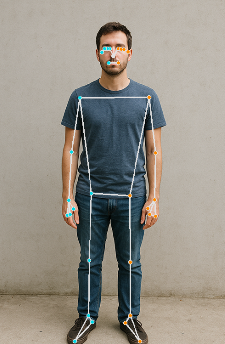

.. include:: /index.rst
   :start-after: start_hello_message
   :end-before: end_hello_message

.. _mp_pose:

7. 人体姿勢推定
================================

------------------------------------------------------------
1. 概要
------------------------------------------------------------

手やジェスチャー認識の実装に続いて、  
この章では **MediaPipe Pose** を紹介します。  
これは軽量でありながら強力な、リアルタイム人体姿勢推定モジュールです。

MediaPipe Pose を使用すると、 **33 個の身体ランドマーク** を  
リアルタイムで検出し、動画映像上に全身の骨格を描画できます。

このモジュールは次のような用途に活用できます：

- 動作認識
- 姿勢矯正
- フィットネスモニタリング
- 動作解析

------------------------------------------------------------
2. 動作の仕組み
------------------------------------------------------------

プログラムは次の手順で処理を行います：

1. MediaPipe Pose モデルを初期化する  
   （モデルの複雑度やオプションのセグメンテーションを設定）
2. ``Picamera2`` を使用して動画フレームを取得する
3. フレームを RGB 形式に変換する（MediaPipe の要件）
4. Pose モデルを実行して 33 個の身体キーポイントを取得する
5. OpenCV を使用してキーポイントと骨格接続を描画する
6. 注釈付きの動画ストリームをリアルタイムで表示する

この章は、より高度な  
ヒューマンコンピュータインタラクションや身体動作解析の基礎になります。

------------------------
3. コードの実行
------------------------

.. important::

   開始する前に、次の項目を確認してください：

   * パンチルトが組み立てられている
   * Raspberry Pi のデスクトップにアクセスできる
   * コードパッケージがインストールされている
   * Fusion HAT+ がインストールおよび設定されている
   * OpenCV がインストールされている

   詳細な手順については :ref:`opencv_install` を参照してください。

#. ターミナルを開き、次のコマンドを入力します：

   .. code-block:: bash

      sudo python3 ~/ai-lab-kit/mediapipe/mp_pose.py

   録画済み動画に対して MediaPipe Pose を使用したい場合は、次のコマンドを実行してください：

   .. code-block:: bash
   
      sudo python3 ~/ai-lab-kit/mediapipe/mp_pose_video.py

#. プログラムを実行すると、「Show Video」というタイトルのウィンドウが開き、ライブカメラ映像が表示されます。

   .. raw:: html
   
         <video width="500" loop muted controls>
             <source src="../_static/video/Media_7.mp4" type="video/mp4">
             Your browser does not support the video tag.
         </video>
         
   カメラの前に人が現れると：
   
   - MediaPipe Pose が 33 個の身体ランドマークをリアルタイムで検出します。
   - 動画フレーム上に全身骨格が描画されます。
   - 肩、肘、手首、腰、膝、足首などの主要な関節が線で接続されます。
   
   人が動くと：
   
   - 骨格キーポイントが身体の動きに滑らかに追従します。
   - 骨格表示がリアルタイムで継続的に更新されます。
   
   背景セグメンテーションが有効（ ``enable_segmentation=True`` ）な場合、  
   モデル内部ではセグメンテーションマスクも計算されますが、  
   このサンプルでは骨格のみを表示します。
   
   人が検出されない場合、プログラムは注釈なしの通常のカメラ映像のみを表示します。
   
   ``q`` を押すとプログラムを終了できます。  
   カメラは停止し、OpenCV ウィンドウは自動的に閉じます。

-----------------------------
4. 完全なコード
-----------------------------

以下は基本的な人体姿勢検出プログラムです：

.. code-block:: python

   from picamera2 import Picamera2, Preview
   import cv2
   import mediapipe.python.solutions.pose as mp_pose
   import mediapipe.python.solutions.drawing_utils as drawing
   import mediapipe.python.solutions.drawing_styles as drawing_styles

   # Initialize the Pose model
   pose = mp_pose.Pose(
       static_image_mode=False,  # False for processing video streams
       model_complexity=2,       # 0~2, higher is more accurate
       enable_segmentation=True, # Enable background segmentation (optional)
   )

   # Open the camera
   picam2 = Picamera2()
   config = picam2.create_preview_configuration(
      main={"size": (640, 480), "format": "XRGB8888"} ,
   )
   picam2.configure(config)
   picam2.start()

   print("Streaming... press 'q' to quit")

   while True:
      frame_bgra = picam2.capture_array()
      frame_bgr  = cv2.cvtColor(frame_bgra, cv2.COLOR_BGRA2BGR)

      # Convert BGR to RGB (required by MediaPipe)
      frame_rgb = cv2.cvtColor(frame_bgr, cv2.COLOR_BGR2RGB)

      # Pose detection
      results = pose.process(frame_rgb)

      # Convert RGB back to BGR (required by OpenCV)
      frame = cv2.cvtColor(frame_rgb, cv2.COLOR_RGB2BGR)

      # If human body is detected, draw skeleton
      if results.pose_landmarks:
         drawing.draw_landmarks(
            frame,
            results.pose_landmarks,
            mp_pose.POSE_CONNECTIONS,
            landmark_drawing_spec=drawing_styles.get_default_pose_landmarks_style(),
         )

      cv2.imshow("Show Video", frame)

      if cv2.waitKey(1) & 0xff == ord('q'):
         break

   picam2.stop_preview()
   picam2.stop()
   cv2.destroyAllWindows()

プログラムを実行すると、カメラ映像には次の内容を含むリアルタイム人体骨格が表示されます：

- 33 個のキーポイント
- 骨格の接続線
- 人が動くと、それに追従して骨格も動く

-----------------------------
5. コードの説明
-----------------------------

**1. ライブラリのインポート**

.. code-block:: python

  from picamera2 import Picamera2, Preview
  import cv2
  import mediapipe.python.solutions.pose as mp_pose
  import mediapipe.python.solutions.drawing_utils as drawing
  import mediapipe.python.solutions.drawing_styles as drawing_styles

* **Picamera2**  
  libcamera ベースで Raspberry Pi カメラを制御します。

* **cv2 (OpenCV)**  
  画像の色空間変換（BGR↔RGB）、ウィンドウ表示、図形描画に使用します。

* **mediapipe.python.solutions.pose**  
  MediaPipe の **Pose モデル** です。  
  **33 個の全身キーポイント** （頭、肩、肘、膝など）を検出でき、  
  セグメンテーションマスク（人物と背景の分離）も返すことができます。

* **drawing_utils / drawing_styles**  
  MediaPipe 組み込みの描画ツールとスタイル定義で、  
  キーポイントや骨格線の描画に使用します。

**2. Pose モデルの初期化**

.. code-block:: python

  pose = mp_pose.Pose(
      static_image_mode=False,  # Continuous video mode
      model_complexity=1,
      enable_segmentation=True,
  )

* ``static_image_mode=False``：入力が単一画像ではなく連続した動画ストリームであることを示します。初回検出後は追跡モードに入り、処理速度が向上します。通常は False に設定します。

* ``model_complexity=1``：モデル複雑度です。0=軽量、1=中程度、2=高精度（ただし遅い）を意味します。Raspberry Pi の性能に余裕があれば 1 または 2 を使用します。

* ``enable_segmentation=True``：人物セグメンテーションマスクを出力し、前景の人物と背景を区別できます。True にすると背景置換やクロマキーなどの用途に使えます。この使用方法は後続のドキュメント :ref:`mp_pose_segmentation` で説明します。

MediaPipe Pose が返す結果には、次のような構造が含まれます：

* ``pose_landmarks`` ：33 個のキーポイント  
* ``pose_world_landmarks`` ：3D ワールド座標  
* ``segmentation_mask`` ：人物セグメンテーションマップ  

**3. カメラを開く**

.. code-block:: python

   picam2 = Picamera2()
   config = picam2.create_preview_configuration(
      main={"size": (640, 480), "format": "XRGB8888"} ,
   )

   picam2.configure(config)
   #picam2.start_preview(Preview.QTGL)
   picam2.start()

* カメラオブジェクト ``Picamera2()`` を作成します
* 解像度を **640x480** 、ピクセル形式を ``"XRGB8888"`` （4 チャンネル BGRA）に設定します。  
  この形式は OpenCV との互換性が高く、追加のデコード処理をほとんど必要としません。
* カメラを起動します。

任意設定：  
``picam2.start_preview(Preview.QTGL)`` を使うと GPU 上で直接プレビュー表示が可能です。ここではコメントアウトし、代わりに OpenCV の ``imshow()`` を使用しています。

**4. メインループ：各フレームを処理**

.. code-block:: python

   while True:
      frame_bgra = picam2.capture_array()               # Capture a frame from the camera (BGRA format)
      frame_bgr  = cv2.cvtColor(frame_bgra, cv2.COLOR_BGRA2BGR)

1. 現在のフレームを取得します。Picamera2 はデフォルトで **BGRA** （Blue Green Red + Alpha）形式の画像を返します。  
2. その後の OpenCV 処理のために **BGR** に変換します。

.. code-block:: python

   # Convert to RGB for MediaPipe
   frame = cv2.cvtColor(frame_bgr, cv2.COLOR_BGR2RGB)
   results = pose.process(frame)

MediaPipe モデルは **RGB** 形式を前提としています。

* ``pose.process()`` を呼び出してキーポイント検出を実行します。
* ``results`` は複合オブジェクトで、次を含む可能性があります：

  * ``results.pose_landmarks``：キーポイント（33 点）
  * ``results.pose_world_landmarks``：3D 座標
  * ``results.segmentation_mask``：セグメンテーションマスク

.. code-block:: python

   # Convert back to BGR for OpenCV display
   frame = cv2.cvtColor(frame, cv2.COLOR_RGB2BGR)

OpenCV の ``imshow()`` は BGR 順を前提としているため、再び BGR に戻します。

**5. 姿勢キーポイントの描画**

.. code-block:: python

   if results.pose_landmarks:
      drawing.draw_landmarks(
         frame,
         results.pose_landmarks,
         mp_pose.POSE_CONNECTIONS,
         landmark_drawing_spec=drawing_styles.get_default_pose_landmarks_style(),
      )

人物が検出された場合：

* ``results.pose_landmarks`` には各キーポイントの ``(x, y, z, visibility)`` が含まれます。

  * ``x, y``：正規化座標（0～1）
  * ``z``：相対的な奥行き
  * ``visibility``：キーポイントの信頼度（0～1）

* ``draw_landmarks`` のパラメータ説明：

   * ``frame``：描画先画像（BGR 形式）
   * ``results.pose_landmarks``：現在のフレームの人体キーポイント
   * ``mp_pose.POSE_CONNECTIONS``：どの点同士を線で結ぶかを定義する接続ルール
   * ``landmark_drawing_spec``：点の描画スタイル
   * ``connection_drawing_spec``：線の描画スタイル（省略時はデフォルトスタイル）

効果：  
頭部、腕、脚などの骨格線と関節位置を画像上に描画します。

**6. フレーム表示と終了処理**

.. code-block:: python

   cv2.imshow("Show Video", frame)

   if cv2.waitKey(1) & 0xff == ord('q'):
      break

各フレームを ``"Show Video"`` ウィンドウに表示します。  
'q' キーが押されるとループを終了します。

**7. リソースの解放**

.. code-block:: python

   picam2.stop_preview()
   picam2.stop()
   cv2.destroyAllWindows()

プレビューを停止し、カメラを解放し、すべての OpenCV ウィンドウを閉じます。

-----------------------------
6. Pose モデルの紹介
-----------------------------

MediaPipe Pose モジュールは **33 個のキーポイント** を返し、頭部、胴体、腕、脚などをカバーします：

.. list-table::
   :header-rows: 1

   * - Body Part
     - Index
   * - Nose
     - 0
   * - Left/Right Shoulder
     - 11 / 12
   * - Left/Right Elbow
     - 13 / 14
   * - Left/Right Wrist
     - 15 / 16
   * - Left/Right Hip
     - 23 / 24
   * - Left/Right Knee
     - 25 / 26
   * - Left/Right Ankle
     - 27 / 28
   * - Left/Right Foot Index
     - 31 / 32

これらの点は **姿勢判定** 、 **動作回数カウント** （スクワット、腕立て伏せ、ヨガポーズ検出など）に利用できます。

-----------------------------
7. パフォーマンスと調整
-----------------------------

.. list-table::
   :header-rows: 1

   * - Item
     - Impact
     - Optimization Suggestion
   * - Resolution
     - 解像度が高いほど精度は上がるが遅延も増える
     - パフォーマンスと速度のバランスのため 640x480 を使用
   * - model_complexity
     - 認識精度は向上するが計算速度は低下する
     - Raspberry Pi では 1～2 を推奨
   * - segmentation
     - GPU/CPU 負荷が増加する
     - 背景置換が不要なら無効化を推奨

------------------------------------------------------------
8. トラブルシューティング
------------------------------------------------------------

- 人物が検出されない

  プログラムは動作しているのに人物が検出されない場合は、全身がカメラフレーム内に収まっているか確認してください。強い逆光は避け、照明条件を改善してください。最適な結果を得るには、カメラから約 1～2 メートル離れてください。

- 動画が遅い・カクつく

  フレームレートが低い場合は、解像度を 640×480 以下に下げてください。  
  ``model_complexity = 1`` に設定すると、より良いパフォーマンスが得られます。  
  セグメンテーションが不要であれば無効にし、他のバックグラウンドプログラムを終了してシステムリソースを確保してください。

- Segmentation fault が発生する

  Segmentation fault の多くは、システムアーキテクチャとインストールされた MediaPipe wheel の不一致が原因です。

  システムアーキテクチャを確認してください：

  .. code-block:: bash

     uname -m

  出力は ``aarch64`` である必要があります。

  ``armv7l`` または ``armhf`` と表示される場合、32-bit Raspberry Pi OS を使用しており、公式 MediaPipe wheel とは互換性がありません。

  Python からも確認できます：

  .. code-block:: python

     import platform
     print(platform.machine())

  この結果も ``aarch64`` である必要があります。

- aarch64 なのに still getting segmentation fault

  これは、一部の TensorFlow Lite XNNPACK カーネルが使用中の MediaPipe ビルドと完全には互換性がない場合に発生することがあります。

  考えられる対処法：

  - ``model_complexity = 1`` を使用する（このチュートリアルでも推奨）
  - MediaPipe が正しい仮想環境にインストールされていることを確認する
  - ``mediapipe-bin`` （PINTO0309 版）など、Raspberry Pi 最適化済み wheel をインストールする

- ``model_complexity = 2`` ではクラッシュするが ``1`` では動作する

  complexity 2 はより大きなモデルを読み込み、高度な CPU 最適化を使用する場合があります。Raspberry Pi では、一部の最適化された TensorFlow Lite カーネルが完全にはサポートされていないことがあります。complexity 1 はそれらのカーネルを回避するため、一般的に Raspberry Pi ではより安定かつ高速です。

-----------------------------
9. まとめ
-----------------------------

- この章では MediaPipe Pose を用いた **リアルタイム人体骨格検出** を実装しました
- Pose は 33 個のキーポイントを提供し、フィットネス、姿勢解析、動作認識などの分野で活用できます
- 解像度とモデル複雑度を調整することで、Raspberry Pi 上でもスムーズに動作させることができます
- これらのキーポイントを基に、今後さらに次のような機能を開発できます：

  - 動作認識（例：「手を挙げる」「しゃがむ」）
  - 姿勢評価（例：「座り姿勢は正しいか？」）
  - 人体インタラクティブ制御