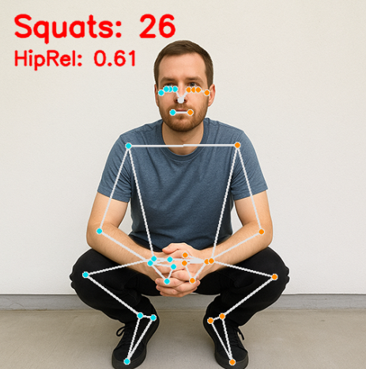
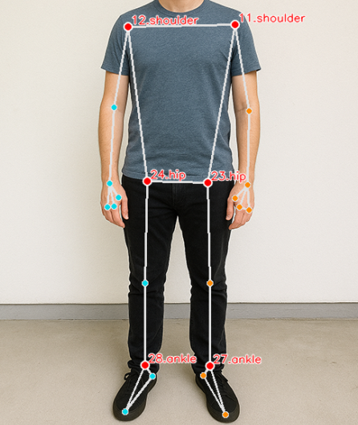

.. include:: /index.rst
   :start-after: start_hello_message
   :end-before: end_hello_message

.. _mp_pose_squat:

8. Contatore di Squat
==========================================

------------------------------------------------------------
1. Panoramica
------------------------------------------------------------

Nel capitolo precedente, abbiamo implementato la stima di base della posizione umana.
Questo capitolo si basa su quel fondamento per implementare un semplice
**Contatore di Squat** usando MediaPipe Pose.

Questo e un esempio pratico che combina:

- Rilevamento della posa
- Riconoscimento delle azioni
- Conteggio in tempo reale

Puo essere utilizzato in sistemi di fitness intelligenti,
assistenti per allenamenti domestici o applicazioni di analisi del movimento.

------------------------------------------------------------
2. Come Funziona
------------------------------------------------------------

Il contatore di squat e implementato usando la seguente logica:

1. Usa MediaPipe Pose per rilevare 33 punti chiave del corpo.
2. Seleziona le articolazioni chiave (Spalla, Anca, Caviglia).
3. Usa le coordinate y normalizzate per stimare l'altezza dell'anca.
4. Definisci soglie superiore e inferiore (es., 0.55 e 0.45).
5. Usa una semplice macchina a stati per rilevare la transizione:
   "in piedi → accovacciato → in piedi".
6. Aumenta il contatore quando un ciclo completo di squat e completato.
7. Visualizza il conteggio degli squat e il valore corrente dell'anca sullo schermo.

.. note::

   - Questo esempio non utilizza il calcolo dell'angolo dell'articolazione.
   - Si basa su coordinate normalizzate per ridurre il calcolo.
   - Il metodo e leggero e adatto per Raspberry Pi.

------------------------
3. Eseguire il Codice
------------------------

.. important::

   Before you start, make sure:

   * The pan-tilt is assembled
   * You can access the Raspberry Pi desktop
   * The code package is installed
   * Fusion HAT+ is installed and configured
   * OpenCV is installed

   For detailed instructions, see :ref:`opencv_install`.

#. Apri il terminale e inserisci il seguente comando:

   .. code-block:: bash

      sudo python3 ~/ai-lab-kit/mediapipe/mp_pose_squat.py

#. Dopo aver eseguito il programma, si apre una finestra intitolata "Show Video" che mostra il flusso video in diretta.

   .. raw:: html

         <video width="500" loop muted controls>
             <source src="../_static/video/Media_8.mp4" type="video/mp4">
             Your browser does not support the video tag.
         </video>

   Quando una persona sta in piedi davanti alla fotocamera:

   - MediaPipe Pose rileva 33 landmark del corpo in tempo reale.
   - Viene disegnato uno scheletro completo sullo schermo.
   - Il sistema calcola continuamente la posizione relativa dell'anca (HipRel).

   Mentre esegui gli squat:

   - Quando ti abbassi e la tua anca supera la soglia inferiore (DOWN_TH),
     il sistema segna che sei nella posizione "in basso".
   - Quando ti rialzi e l'anca supera la soglia superiore (UP_TH),
     il contatore degli squat aumenta di 1.

   Lo schermo mostra:

   - ``Squats: N`` — il numero totale di squat completati.
   - ``HipRel: value`` — la posizione normalizzata corrente dell'anca utilizzata per il rilevamento.

   Il contatore aumenta solo dopo un ciclo di movimento completo
   (in piedi → squat → in piedi), prevenendo il conteggio duplicato.

   Premi ``q`` per uscire dal programma.
   La fotocamera si ferma e la finestra OpenCV si chiude automaticamente.

-----------------------------
4. Codice Completo
-----------------------------

Ecco l'implementazione completa del contatore di squat:

.. code-block:: python

   from picamera2 import Picamera2, Preview
   import cv2
   import mediapipe.python.solutions.pose as mp_pose
   import mediapipe.python.solutions.drawing_utils as drawing
   import mediapipe.python.solutions.drawing_styles as drawing_styles

   # Initialize the Pose model
   pose = mp_pose.Pose(
      static_image_mode=False,
      model_complexity=1,
      enable_segmentation=True,
   )

   # ---- Count and threshold ----
   squat_count = 0
   in_bottom = False
   DOWN_TH = 0.55   # Hip relative position > 0.55 is considered "full squat"
   UP_TH   = 0.45   # Hip relative position < 0.45 is considered "stand up"

   # Open the camera
   picam2 = Picamera2()
   config = picam2.create_preview_configuration(
      main={"size": (640, 480), "format": "XRGB8888"} ,
   )
   picam2.configure(config)
   picam2.start()

   print("Streaming... press 'q' to quit")

   while True:
      frame_bgra = picam2.capture_array()               # XRGB8888 to BGRA
      frame_bgr  = cv2.cvtColor(frame_bgra, cv2.COLOR_BGRA2BGR)

      # Convert the frame from BGR to RGB (required by MediaPipe)
      frame_rgb = cv2.cvtColor(frame_bgr, cv2.COLOR_BGR2RGB)

      # Process the frame for pose detection and tracking
      results = pose.process(frame_rgb)

      # Convert the frame back from RGB to BGR (required by OpenCV)
      frame = cv2.cvtColor(frame_rgb, cv2.COLOR_RGB2BGR)

      # If pose is detected, draw landmarks and connections on the frame
      if results.pose_landmarks:
         drawing.draw_landmarks(
               frame,
               results.pose_landmarks,
               mp_pose.POSE_CONNECTIONS,
               landmark_drawing_spec=drawing_styles.get_default_pose_landmarks_style(),
         )

         # Count squat without using hip angle
         lms = results.pose_landmarks.landmark
         # left 11-23-27 (shoulder, hip, ankle)
         # right 12-24-28 (shoulder, hip, ankle)
         idx_sets = [(11,23,27), (12,24,28)]
         hip_rel_list = []

         for sh, hp, an in idx_sets:
               try:
                  y_sh, y_hp, y_an = lms[sh].y, lms[hp].y, lms[an].y
                  base = abs(y_an - y_sh)  # Distance between shoulder and ankle
                  if base > 1e-6:
                     hip_rel = (y_hp - y_sh) / base  # Position of hip relative to shoulder, 0.5 means hip is in the middle, 0 means hip is at the top, 1 means hip is at the bottom
                     hip_rel_list.append(hip_rel)
               except IndexError:
                  pass

         if hip_rel_list:
               hip_rel = min(hip_rel_list)  # Choose the smaller one, which is more stable
               # State machine:
               # from low -> mark "in_bottom";
               # from back to high -> count +1
               if not in_bottom and hip_rel >= DOWN_TH:
                  in_bottom = True
               elif in_bottom and hip_rel <= UP_TH:
                  squat_count += 1
                  in_bottom = False

               # Display
               cv2.putText(frame, f"Squats: {squat_count}", (20, 50),
                           cv2.FONT_HERSHEY_SIMPLEX, 1.3, (0, 0, 255), 3, cv2.LINE_AA)
               cv2.putText(frame, f"HipRel: {hip_rel:.2f}", (20, 90),
                           cv2.FONT_HERSHEY_SIMPLEX, 0.9, (0, 0, 255), 2, cv2.LINE_AA)

      # Display the frame with annotations
      cv2.imshow("Show Video", frame)

      # Exit the loop if 'q' key is pressed
      if cv2.waitKey(1) & 0xff == ord('q'):
         break

   # Release the camera
   picam2.stop_preview()
   picam2.stop()
   cv2.destroyAllWindows()

Dopo aver eseguito lo script, il sistema:

- Rilevera lo scheletro umano;
- Calcolera la posizione relativa dell'anca;
- Contera +1 quando un ciclo completo da "accovacciato" a "in piedi" e terminato;
- Mostrera **Squats: N** e il valore corrente di HipRel sullo schermo in tempo reale.

-----------------------------------------------
5. Coordinate e Progettazione dello Stato
-----------------------------------------------

Utilizziamo i seguenti 6 punti chiave (3 per lato):

.. list-table::
   :header-rows: 1

   * - Punto Chiave
     - Indice
     - Descrizione
   * - Spalla
     - 11 (Sinistra) / 12 (Destra)
     - Riferimento superiore
   * - Anca
     - 23 (Sinistra) / 24 (Destra)
     - Centrale per il calcolo della posizione dello squat
   * - Caviglia
     - 27 (Sinistra) / 28 (Destra)
     - Riferimento inferiore

Formula di calcolo del **valore relativo dell'anca**:

.. math::

   hip\_rel = \frac{hip_y - shoulder_y}{ankle_y - shoulder_y}

- Un hip_rel piu grande significa piu vicino al suolo (cioè accovacciato).
- Un hip_rel piu piccolo significa in posizione eretta.

Definiamo due soglie:

- **DOWN_TH = 0.55**: Considerato come ingresso nella posizione bassa dello squat
- **UP_TH = 0.45**: Considerato come ritorno in posizione eretta

Usiamo una semplice macchina a stati per un conteggio affidabile:

.. code-block:: python

   if hip_rel >= DOWN_TH:
       in_bottom = True
   if in_bottom and hip_rel <= UP_TH:
       squat_count += 1
       in_bottom = False

----------------------------------------------------
6. Regolazione dei Parametri e Ottimizzazione
----------------------------------------------------

.. list-table::
   :header-rows: 1

   * - Parametro
     - Descrizione
     - Suggerimento di Regolazione
   * - DOWN_TH
     - Soglia dell'azione di squat
     - Valore piu alto richiede uno squat piu profondo per contare
   * - UP_TH
     - Soglia dell'azione di alzata
     - Valore piu basso richiede di stare piu eretti
   * - model_complexity
     - Complessita del modello Pose
     - Usa 1 per maggiore velocita
   * - Risoluzione
     - Influisce su frame rate e precisione
     - Raccomandato 640×480

.. tip::
   Per persone di diverse altezze, si possono utilizzare soglie adattive o calibrazione personalizzata per un conteggio piu accurato.

---------------------------------------------------------
7. Risoluzione dei Problemi
---------------------------------------------------------

- Conteggio impreciso

  Se il conteggio degli squat non e accurato, i valori di soglia potrebbero non corrispondere alla posizione del tuo corpo o all'angolazione della fotocamera.

  Prova a stampare ``hip_rel`` in tempo reale e regola ``DOWN_TH`` e ``UP_TH`` di conseguenza.
  Assicurati anche che la forma dello squat sia coerente e chiaramente visibile.

- Persona non rilevata

  Se il corpo non viene rilevato, migliora le condizioni di illuminazione ed evita sfondi complessi.

  Assicurati di stare completamente all'interno del fotogramma e di essere rivolto direttamente verso la fotocamera.

- Latenza elevata

  Se la risposta video e lenta, riduci ``model_complexity`` a 1 e abbassa la risoluzione della fotocamera (per esempio, 640×480 o 320×240).

  Chiudi i programmi di background non necessari per migliorare le prestazioni.

-----------------------------
8.  Riepilogo
-----------------------------

- Implementato un **contatore di squat in tempo reale** usando punti chiave Pose + macchina a stati;
- Nessun calcolo complesso di angoli richiesto, elevata efficienza operativa;
- Adatto per Raspberry Pi o altre applicazioni su dispositivi edge;
- Possibili estensioni future:

  - Rilevamento di flessioni/addominali
  - Registrazione e visualizzazione dei dati
  - Guida automatica del ritmo e feedback sull'allenamento