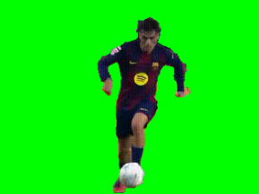

.. include:: /index.rst
   :start-after: start_hello_message
   :end-before: end_hello_message

.. _mp_pose_segmentation:

9. 绿幕效果
====================================

------------------------------------------------------------
1. 概述
------------------------------------------------------------

本章使用 MediaPipe Pose 的**人物分割**能力
来实现简单的**绿幕效果**。

通过将人物与背景分离，
我们可以将原始背景替换为纯绿色。
这使得以下应用成为可能：

- 虚拟背景应用
- 抠像合成（OBS / 非线性编辑）
- 直播特效
- AR 风格场景替换

------------------------------------------------------------
2. 工作原理
------------------------------------------------------------

绿幕效果通过以下步骤实现：

1. 使用 ``enable_segmentation=True`` 初始化 Pose 模型。
2. 对每一帧，获取 ``results.segmentation_mask``。
3. 遮罩是单通道概率图（范围 0–1）。
4. 应用阈值（例如 0.5）分离前景和背景。
5. 将背景像素替换为纯绿色。
6. 可选地应用模糊或形态学滤波以平滑边缘。

这种方法轻量高效，可在 Raspberry Pi 上实时运行，
同时提供了一个实用的人体分割示例。

------------------------
3. 运行代码
------------------------

.. important::

   开始之前，请确保：

   * 云台已组装完成
   * 可以访问 Raspberry Pi 桌面
   * 代码包已安装
   * Fusion HAT+ 已安装并配置
   * OpenCV 已安装

   详细说明请参见 :ref:`opencv_install`。

#. 打开终端并输入以下命令：

   .. code-block:: bash

      sudo python3 ~/ai-lab-kit/mediapipe/mp_pose_segmentation.py

   如果您想将 MediaPipe Pose 应用于录制视频，可以运行以下命令：

   .. code-block:: bash

      sudo python3 ~/ai-lab-kit/mediapipe/mp_pose_segmentation_video.py

#. 运行程序后，一个标题为"Show Video"的窗口将打开并显示实时摄像头画面。

   .. raw:: html

         <video width="500" loop muted controls>
             <source src="../_static/video/Media_9.mp4" type="video/mp4">
             Your browser does not support the video tag.
         </video>

   同一窗口中会出现一个名为 ``Mask`` 的滑动条。它控制分割阈值（0–100），默认值设为 50（0.5）。

   当人出现在摄像头前时：

   - MediaPipe Pose 会为每帧生成 ``segmentation_mask``。
   - 遮罩值高于阈值的像素被视为前景（人物）。
   - 所有其他像素被替换为纯绿色背景（绿幕效果）。

   当您移动 ``Mask`` 滑动条时：

   - 提高阈值只保留最确信的前景区域（背景泄漏更少，但可能切割掉部分身体）。
   - 降低阈值将更多像素包含为前景（轮廓更完整，但可能包含背景噪声）。

   如果没有分割遮罩可用，程序将仅显示正常的摄像头画面，不进行背景替换。

   按 ``q`` 键退出程序。
   摄像头将停止，OpenCV 窗口将自动关闭。

-----------------------------
4. 完整代码
-----------------------------

.. code-block:: python

   from picamera2 import Picamera2, Preview
   import cv2
   import mediapipe.python.solutions.pose as mp_pose
   import mediapipe.python.solutions.drawing_utils as drawing
   import mediapipe.python.solutions.drawing_styles as drawing_styles

   import numpy as np
   GREEN = (0, 255, 0)  # Green color (BGR)

   # Initialize the Pose model
   pose = mp_pose.Pose(
      static_image_mode=False,  # Set to False for processing video frames
      model_complexity=1,
      enable_segmentation=True,
   )

   # Open the camera
   picam2 = Picamera2()
   config = picam2.create_preview_configuration(
      main={"size": (640, 480), "format": "XRGB8888"} ,
   )

   picam2.configure(config)
   #picam2.start_preview(Preview.QTGL)
   picam2.start()

   print("Streaming... press 'q' to quit")

   # --- Utility: empty callback for trackbars ---
   def _noop(x):
      pass

   # Create Window
   cv2.namedWindow('Show Video')
   # Create a trackbar for threshold, default value is 50
   cv2.createTrackbar('Mask', 'Show Video', 50, 100, _noop)

   while True:
      frame_bgra = picam2.capture_array()               # XRGB8888 to BGRA
      frame_bgr  = cv2.cvtColor(frame_bgra, cv2.COLOR_BGRA2BGR)

      # Convert the frame from BGR to RGB (required by MediaPipe)
      frame = cv2.cvtColor(frame_bgr, cv2.COLOR_BGR2RGB)

      # Process the frame for pose detection and tracking
      results = pose.process(frame)

      # Convert the frame back from RGB to BGR (required by OpenCV)
      frame = cv2.cvtColor(frame, cv2.COLOR_RGB2BGR)

      # Read the trackbar value
      threshold = cv2.getTrackbarPos('Mask', 'Show Video')

      # Cutout the green background
      if results.segmentation_mask is not None:
         # segmentation_mask is a single-channel [H, W] probability map.
         mask = results.segmentation_mask
         # Use 0.5 as the hard threshold; you can adjust it to 0.3-0.7 based on the effect.
         condition = (mask > threshold/100.0)[..., None]  # [H, W, 1]

         # Create a green background
         bg = np.full_like(frame, GREEN, dtype=np.uint8)

         # Use mask to keep the character and replace the background with green
         frame = np.where(condition, frame, bg)

      # Display the frame with annotations
      cv2.imshow("Show Video", frame)

      # Exit the loop if 'q' key is pressed
      if cv2.waitKey(1) & 0xff == ord('q'):
         break

   # Release the camera
   picam2.stop_preview()
   picam2.stop()
   cv2.destroyAllWindows()

运行脚本后，人物（前景）被保留，背景被替换为纯绿色。
可直接用于后续在 **OBS、Premiere、DaVinci Resolve** 等软件中使用**色度键**进行抠像。

-------------------------------------
5. 关键点说明
-------------------------------------

``segmentation_mask`` 是一个**单通道浮点图像**（范围 0~1），大小与输入帧相同：

- 值**接近 1**：很可能是**前景（人物）**；
- 值**接近 0**：很可能是**背景**。

通常的做法是设置一个阈值 **T**\ （例如 0.5）并创建条件遮罩：

.. code-block:: python

   condition = (mask > T)[..., None]

这里我们设置了一个滑动条，用于实时调整阈值：

.. code-block:: python

   # Create a trackbar for threshold, default value is 50
   cv2.createTrackbar('Mask', 'Show Video', 50, 100, _noop)

   while True:

      ...
      # Read the trackbar value
      threshold = cv2.getTrackbarPos('Mask', 'Show Video')

      # Create a condition mask
      condition = (mask > threshold/100.0)[..., None]  # [H, W, 1]

然后使用 ``np.where(condition, frame, background)`` 替换背景，此处替换为绿色：

.. code-block:: python

   # Create a green background
   bg = np.full_like(frame, GREEN, dtype=np.uint8)

   # Use mask to keep the character and replace the background with green
   frame = np.where(condition, frame, bg)

----------------------------------------------------
6. 效果与边缘优化
----------------------------------------------------

直接二值化可能导致头发和衣物边缘出现锯齿或小孔。
**轻量后处理**\ 可以改善边缘：

.. code-block:: python

   # Slight blur (soften edges)
   mask_blur = cv2.GaussianBlur(mask, (5, 5), 0)

   # Re-threshold (smoother foreground boundary)
   condition = (mask_blur > 0.5)[..., None]

   # Or perform morphological closing to fill small holes
   bin_mask = (mask > 0.5).astype(np.uint8) * 255
   kernel = cv2.getStructuringElement(cv2.MORPH_ELLIPSE, (3,3))
   bin_mask = cv2.morphologyEx(bin_mask, cv2.MORPH_CLOSE, kernel, iterations=1)
   condition = (bin_mask > 127)[..., None]

.. tip::

   - **推荐 T 值范围 0.3~0.7**：暗光环境/保守模型可适当降低；噪声较多时可提高。
   - 模糊核不要太大，否则人物边界会"泛绿"。

----------------------------------------------------
7. 使用自定义背景（图片/视频）
----------------------------------------------------

将纯绿色替换为自定义背景图片：

.. code-block:: python

   bg_img = cv2.imread("background.jpg")
   bg_img = cv2.resize(bg_img, (frame.shape[1], frame.shape[0]))
   frame = np.where(condition, frame, bg_img)

或者使用另一个视频作为背景（读取下一帧 ``bg_frame``，调整到相同尺寸，然后替换）。

----------------------------------------------------
8. 性能与质量平衡
----------------------------------------------------

.. list-table::
   :header-rows: 1

   * - 项目
     - 影响
     - 建议
   * - 分辨率
     - 越高边缘越精细但速度越慢
     - 从 640×480 开始；需要更清晰图像时再提高
   * - model_complexity
     - 越高越精确但越慢
     - Raspberry Pi 推荐 1~2
   * - 后处理强度
     - 过多模糊/形态学操作会"吞没边缘/泛绿"
     - 小核 + 少迭代，观察边缘效果

------------------------------------------------------------
9. 故障排除
------------------------------------------------------------

- 人物周围出现锯齿边缘或可见接缝

  这通常是因为遮罩使用了硬阈值，产生了尖锐的边界。

  尝试使用 ``Mask`` 滑动条调整阈值。为了获得更平滑的边缘，可以对分割遮罩进行少量模糊处理，或在合成前使用简单的形态学闭合操作。

- 人物部分缺失

  如果部分身体被切割掉，可能是光照太弱，或衣服颜色与背景融合。

  改善光照条件，调整阈值，并尝试使用与主体对比度更高的简单背景。

- 帧率低

  如果视频感觉卡顿，可能是分辨率太高或模型太复杂。

  降低摄像头分辨率（例如 640×480 或 320×240），并将 ``model_complexity`` 保持为 1 以获得更好的性能。

- 绿色溢出到人物身上

  如果绿色背景出现在人物身上，可能是分割边界不准确，或者人物颜色引起了视觉混淆。

  尝试切换到不同的替换颜色（蓝色或灰色），或使用图片替换背景而不是纯色，以获得更自然的效果。

-----------------------------
10. 总结
-----------------------------

- 使用 ``segmentation_mask``，我们可以快速实现"人物抠图 + 背景替换"；
- 通过阈值和轻量后处理获得更自然的边缘；
- 适用于虚拟背景、直播抠像、远程教学等场景；
- 下一步可结合**姿态骨骼**和**分割**实现更丰富的交互效果（例如仅替换背景，不替换前景叠加的骨骼）。
