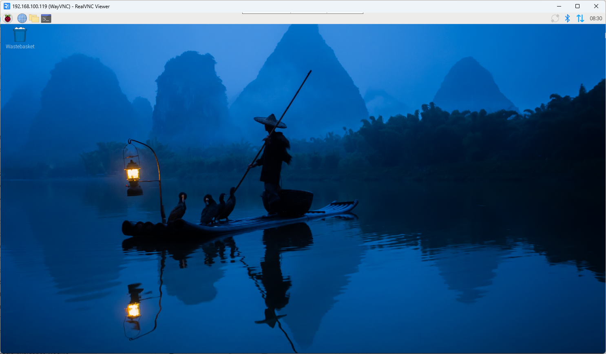

.. _opencv_vnc:

0. Setup OpenCV
=========================================================================

This tutorial will guide you through installing OpenCV on a Raspberry Pi and connecting to it remotely using VNC.

To play with OpenCV:

   - Please connect the camera to the Raspberry Pi and make sure the camera is working properly.
   - To use camera module conveniently, :ref:`assemble_fusion_hat_gimbal` is recommended.

.. _opencv_install:

1. Installing OpenCV
--------------------------------------

1. **Update Software Sources**

   First, update the Raspberry Pi software sources to ensure you get the latest packages:

   .. code-block:: bash

      sudo apt update

2. **Install OpenCV**

   Use the following command to install the Python 3 version of OpenCV:

   .. code-block:: bash

      sudo apt install python3-opencv

3. **Verify Installation**

   Run the command below to verify that OpenCV has been installed successfully:

   .. code-block:: bash

      python3 -c "import cv2; print(cv2.__version__)"

   If the OpenCV version number is displayed, the installation was successful.

   .. image:: img/install_opencv_check_version.png
      :alt: OpenCV installation terminal example
      :align: center

2. Enabling VNC on Raspberry Pi
------------------------------------------------

1. **Enable VNC**

   Open the Raspberry Pi configuration tool:

   .. code-block:: bash

      sudo raspi-config

   Then navigate through:

   ::

      Interface Options → VNC → Enable

3. Download RealVNC on Your Computer
------------------------------------------------------

1. **Visit the RealVNC Website**

   Open your browser and go to:

   ::

      https://www.realvnc.com/en/connect/download/

2. **Download and Install**

   Choose the version that matches your operating system (Windows / macOS / Linux), download it, and complete the installation.

   .. image:: img/download_realvnc.png
      :alt: RealVNC download page
      :align: center

4. Connect to Raspberry Pi via RealVNC
--------------------------------------------------------------------------

1. **Obtain the Raspberry Pi IP Address**

   On the Raspberry Pi terminal, run:

   .. code-block:: bash

      hostname -I

   Make a note of the IP address output.

2. **Enter the IP in RealVNC Viewer**

   Open RealVNC Viewer, then click *File → New Connection* (or press **Ctrl+N**).  
   Enter the Raspberry Pi IP address and click “OK.”

   .. image:: img/login_realvnc.png
      :alt: RealVNC connection interface
      :align: center

3. **Log in with Your Credentials**

   Click on the newly created connection. Log in using the Raspberry Pi username and password to access the remote desktop.

   .. image:: img/login_realvnc_2.png
      :alt: RealVNC remote desktop connection
      :align: center

5. Configuration Complete
-------------------------------------------

At this point, you have successfully:

- Installed OpenCV on Raspberry Pi  
- Enabled VNC remote access  
- Connected to Raspberry Pi via RealVNC from your computer

You can now perform GUI-based operations and development on the Raspberry Pi directly from your PC.

.. note::

   If the connection fails, check the firewall settings, verify the IP address, and ensure both the Raspberry Pi and your computer are on the same local network.
