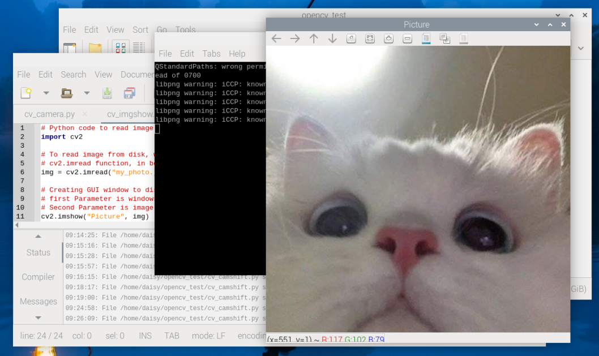

.. include:: /index.rst
   :start-after: start_hello_message
   :end-before: end_hello_message

1. Afficher une Image
=================================================

Dans ce chapitre, nous allons explorer un exemple simple pour vous aider à découvrir rapidement l'utilisation de base d'OpenCV : **lire et afficher une image**.

Dans le dossier du projet d'exemple, nous avons déjà préparé une photo d'exemple nommée ``my_photo.jpg``.
Vous pouvez également utiliser l'exemple :ref:`py_photograph` pour prendre une photo et l'enregistrer dans le dossier courant.

1. Aperçu du Projet
-------------------

Dans cette section, nous allons accomplir les tâches suivantes :

- Utiliser ``cv2.imread`` pour lire une image locale
- Utiliser ``cv2.imshow`` pour afficher l'image
- Utiliser ``cv2.waitKey`` pour contrôler le comportement de la fenêtre
- Utiliser ``cv2.destroyAllWindows`` pour fermer la fenêtre

Après avoir exécuté ce code avec succès, une fenêtre d'image s'ouvrira sur votre écran.

2. Exécuter le Code
------------------------

.. important::

   Avant de commencer, assurez-vous :

   * Que le support motorisé est assemblé
   * Que vous pouvez accéder au bureau du Raspberry Pi
   * Que le package de code est installé
   * Que Fusion HAT+ est installé et configuré
   * Qu'OpenCV est installé

   Pour les instructions détaillées, voir :ref:`opencv_install`.

#. Ouvrez le terminal et entrez la commande suivante :

   .. code-block:: bash

      cd ~/ai-lab-kit/opencv_python
      python3 cv_1_imgshow.py

#. Après avoir exécuté le script, OpenCV ouvre une fenêtre intitulée ``Picture`` et affiche l'image chargée depuis ``my_photo.jpg``.

   La fenêtre reste ouverte jusqu'à ce que l'utilisateur quitte le programme.

   Pour quitter le programme, vous pouvez :

   * Appuyer sur **q** au clavier
   * Fermer la fenêtre en cliquant sur le bouton de fermeture

   Une fois la fenêtre fermée, toutes les ressources OpenCV sont libérées et le programme se termine.

3. Code Complet
-------------------

.. code-block:: python

   # Python code to read and display an image using OpenCV
   import cv2
   from pathlib import Path

   # Get the directory of the current Python file
   BASE_DIR = Path(__file__).resolve().parent

   # Read image from disk
   # cv2.imread loads the image as a NumPy array
   img = cv2.imread(str(BASE_DIR / "my_photo.jpg"), cv2.IMREAD_COLOR)

   # Create a GUI window to display the image
   # First parameter: window title
   # Second parameter: image array
   cv2.imshow("Picture", img)

   # Keep the window open until the user closes it or presses 'q'
   # cv2.waitKey only listens for keyboard events, not the close button
   # Therefore, we use a loop to detect both window close and key press
   while True:
      # Check if the window has been closed
      if cv2.getWindowProperty("Picture", cv2.WND_PROP_VISIBLE) < 1:
         break

      # Wait for 1 ms and check for key press
      # Press 'q' to exit the program
      if cv2.waitKey(1) & 0xFF == ord("q"):
         break

   # Destroy all OpenCV windows and release memory
   cv2.destroyAllWindows()

4. Explication du Code
----------------------

- ``cv2.imread("my_photo.jpg", cv2.IMREAD_COLOR)``

  Lit l'image nommée ``my_photo.jpg`` et la charge en mode couleur.

- ``cv2.imshow("Picture", img)``

  Crée une fenêtre intitulée « Picture » et affiche l'image.

- ``cv2.waitKey(0)``

  Lorsque le paramètre est ``0``, le programme attend indéfiniment jusqu'à ce que vous fermiez la fenêtre ou appuyiez sur une touche.

- ``cv2.getWindowProperty()``

  Obtient une valeur de propriété de la fenêtre spécifiée (par exemple, si la fenêtre est toujours visible).

- ``cv2.destroyAllWindows()``

  Ferme toutes les fenêtres OpenCV et libère les ressources.

5. Exercices Complémentaires
-------------------------------

- Essayez de changer le titre de la fenêtre dans ``imshow`` par « My First OpenCV Window ».
- Remplacez l'image par une autre et observez le résultat.
- Modifiez le paramètre ``waitKey`` à ``3000`` pour que le programme ferme automatiquement la fenêtre après 3 secondes.