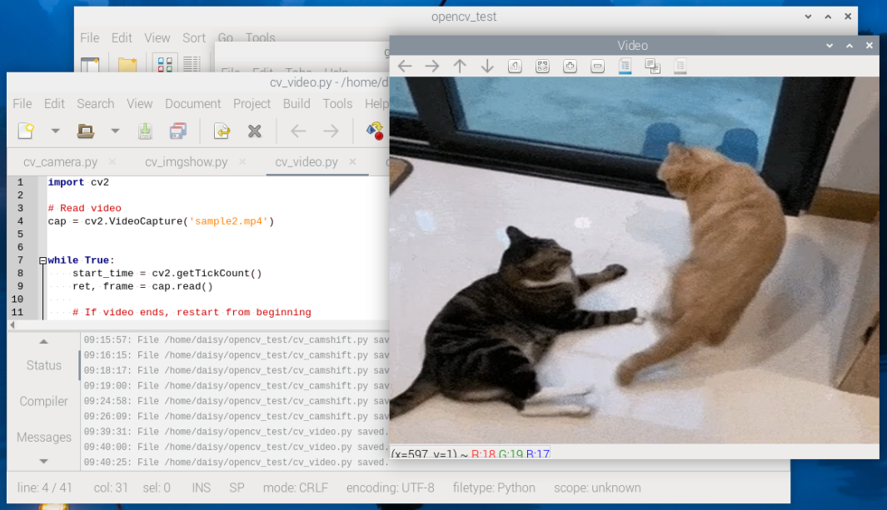

.. include:: /index.rst
   :start-after: start_hello_message
   :end-before: end_hello_message

2. Lire une Vidéo
===========================================

Dans ce chapitre, vous apprendrez à lire et à lire des flux vidéo dans OpenCV, et à contrôler la vitesse de lecture en calculant le temps de traitement des images.

1. Aperçu du Projet
-------------------

Dans cette section, nous allons atteindre les objectifs suivants :

- Utiliser ``cv2.VideoCapture`` pour ouvrir un fichier vidéo
- Lire et afficher la vidéo image par image
- Redémarrer automatiquement la vidéo après sa fin
- Contrôler la fréquence d'images à l'aide de calculs de temps de traitement
- Appuyer sur la touche ``q`` pour quitter la lecture

2. Exécuter le Code
------------------------

.. important::

   Avant de commencer, assurez-vous :

   * Que le support motorisé est assemblé
   * Que vous pouvez accéder au bureau du Raspberry Pi
   * Que le package de code est installé
   * Que Fusion HAT+ est installé et configuré
   * Qu'OpenCV est installé

   Pour les instructions détaillées, voir :ref:`opencv_install`.

#. Ouvrez le terminal et entrez la commande suivante :

   .. code-block:: bash

      cd ~/ai-lab-kit/opencv_python
      python3 cv_2_video.py

#. Après avoir exécuté le script, OpenCV ouvre une fenêtre intitulée **Video** et affiche les images vidéo en temps réel.

   Si la vidéo atteint la fin, elle redémarre automatiquement depuis le début.

   Pour arrêter le programme, vous pouvez :

   * Appuyer sur **q** au clavier pour quitter la lecture
   * Fermer la fenêtre en cliquant sur le bouton de fermeture

   Une fois la fenêtre fermée, toutes les ressources OpenCV sont libérées et le programme se termine.

3. Code Complet
--------------

.. code-block:: python

  import cv2

  # Open the video file
  cap = cv2.VideoCapture("sample2.mp4")

  while True:
      # Read one frame from the video
      ret, frame = cap.read()

      # If the video ends, restart from the beginning
      if not ret:
          cap.set(cv2.CAP_PROP_POS_FRAMES, 0)
          continue

      # Resize the frame for better display performance
      frame = cv2.resize(frame, (640, 480))

      # Display the frame in a window named "Video"
      cv2.imshow("Video", frame)

      # Wait 30 ms between frames (~30 FPS)
      # This also processes GUI events (keyboard and window events)
      key = cv2.waitKey(30) & 0xFF

      # Press 'q' to exit the program
      if key == ord("q"):
          break

      # Exit if the user closes the window (click the close button)
      if cv2.getWindowProperty("Video", cv2.WND_PROP_VISIBLE) < 1:
          break

  # Release the video capture object
  cap.release()

  # Close all OpenCV windows
  cv2.destroyAllWindows()

4. Explication du Code
-----------------------

#. Ouvrir le fichier vidéo :

   .. code-block:: python

      cap = cv2.VideoCapture("sample2.mp4")

   Cela ouvre le fichier vidéo et crée un objet ``VideoCapture`` pour lire les images.

#. Lire une image de la vidéo :

   .. code-block:: python

      ret, frame = cap.read()

   - ``ret`` vaut ``True`` si l'image est lue avec succès.
   - ``ret`` devient ``False`` lorsque la vidéo se termine ou que la lecture échoue.
   - ``frame`` est la donnée d'image (un tableau NumPy).

#. Boucler la vidéo à la fin :

   .. code-block:: python

      if not ret:
          cap.set(cv2.CAP_PROP_POS_FRAMES, 0)
          continue

   Lorsque la vidéo se termine, cela réinitialise la position de lecture à la première image pour que la vidéo redémarre.

#. Redimensionner l'image :

   .. code-block:: python

      frame = cv2.resize(frame, (640, 480))

   Cela redimensionne chaque image en 640x480 pour un affichage plus fluide et une utilisation moindre du CPU sur le Raspberry Pi.

#. Afficher l'image :

   .. code-block:: python

      cv2.imshow("Video", frame)

   Cela affiche l'image actuelle dans une fenêtre nommée ``Video``.

#. Contrôler la vitesse de lecture et lire l'entrée clavier :

   .. code-block:: python

      key = cv2.waitKey(30) & 0xFF

   Cela attend environ 30 ms entre les images (environ 30 FPS) et traite les événements GUI.

#. Quitter en appuyant sur ``q`` :

   .. code-block:: python

      if key == ord("q"):
          break

   Appuyez sur ``q`` pour arrêter le programme.

#. Quitter lorsque la fenêtre est fermée :

   .. code-block:: python

      if cv2.getWindowProperty("Video", cv2.WND_PROP_VISIBLE) < 1:
          break

   Cela vérifie si la fenêtre est toujours visible.
   Si l'utilisateur ferme la fenêtre, le programme se termine en toute sécurité.

#. Libérer l'objet de capture vidéo :

   .. code-block:: python

      cap.release()

   Cela libère la ressource du fichier vidéo.

#. Fermer toutes les fenêtres OpenCV :

   .. code-block:: python

      cv2.destroyAllWindows()

   Cela ferme toutes les fenêtres OpenCV et libère les ressources GUI.

5. Exercices Complémentaires
-------------------

- Essayez de modifier la taille de la fenêtre pour voir l'effet sur la netteté de l'image.
- Remplacez le fichier vidéo par différents fichiers pour tester la compatibilité.
- Affichez le temps de traitement par image pour mieux comprendre la relation entre les FPS et le délai de lecture.