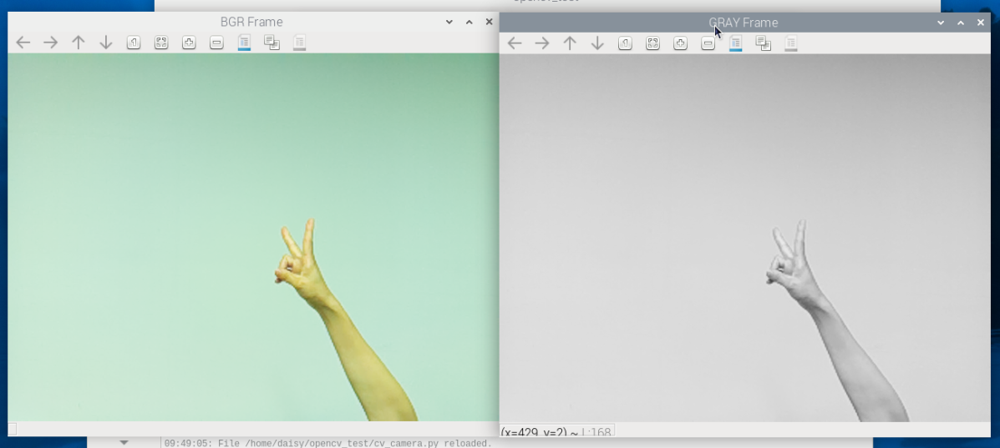

3. Real-Time Camera Capture
================================================================

In the previous chapters, we learned how to read and play local video files.  
In this chapter, we will take it a step further by using the **Raspberry Pi camera** for real-time video capture and applying **color space conversion** with OpenCV.

- Please connect the camera to the Raspberry Pi and make sure the camera is working properly.
- To use camera module conveniently, :ref:`assemble_fusion_hat_pan_tilt` is recommended.

1. Project Objectives
---------------------

- Use **Picamera2** to capture real-time camera frames  
- Convert the camera output from BGRA format to BGR format  
- Use OpenCV for real-time preview  
- Understand the characteristics and use cases of different color spaces

2. Run the Code
------------------------

Please make sure that:

1. You have installed OpenCV on your Raspberry Pi (see :ref:`opencv_install`);
2. You are using a display. Otherwise, please install Raspberry Pi Connect (|link_rpi_connect|) or RealVNC (:ref:`remote_desktop`) and make sure you can access the Raspberry Pi desktop through one of them;
3. You have downloaded the **ai-lab-kit** project (see :ref:`download_code`).

Open the terminal in VNC and enter the following command:

.. code-block:: bash

   cd ~/ai-lab-kit/opencv_python
   python3 cv_camera.py

3. Example Code
---------------

Below is the complete Python example for this chapter (``cv_camera.py``):

.. code-block:: python

   from picamera2 import Picamera2, Preview
   import cv2

   picam2 = Picamera2()
   config = picam2.create_preview_configuration(
      main={"size": (640, 480), "format": "XRGB8888"} ,
   )

   picam2.configure(config)
   #picam2.start_preview(Preview.QTGL) 
   picam2.start()

   print("Streaming... press 'q' to quit")
   while True:
      frame_bgra = picam2.capture_array()               # XRGB8888 to BGRA
      frame_bgr  = cv2.cvtColor(frame_bgra, cv2.COLOR_BGRA2BGR)
      frame_gray = cv2.cvtColor(frame_bgr, cv2.COLOR_BGR2GRAY)
      cv2.imshow("BGR Frame", frame_bgr)
      cv2.imshow("GRAY Frame", frame_gray)
      if cv2.waitKey(1) & 0xFF == ord('q'):
         break

   picam2.stop_preview()
   picam2.stop()
   cv2.destroyAllWindows()

4. Execution Result
-------------------

When you run the code successfully, the program will:

- Open a real-time camera preview window  
- Display the image after BGRA→BGR conversion  
- Display the grayscale version after BGR→GRAY conversion  
- Allow you to press `q` to safely exit the program

5. Code Explanation
-------------------

1. **Import Libraries**

   .. code-block:: python

      from picamera2 import Picamera2, Preview
      import cv2

2. **Initialize the Camera**

   .. code-block:: python

      picam2 = Picamera2()
      config = picam2.create_preview_configuration(main={"size": (640, 480), "format": "XRGB8888"} )
      picam2.configure(config)
      picam2.start_preview(Preview.QTGL)
      picam2.start()

3. **Read Camera Frames in a Loop**

   .. code-block:: python

      print("Streaming... press 'q' to quit")
      while True:
         frame_bgra = picam2.capture_array()               # XRGB8888 to BGRA
         frame_bgr  = cv2.cvtColor(frame_bgra, cv2.COLOR_BGRA2BGR)
         frame_gray = cv2.cvtColor(frame_bgr, cv2.COLOR_BGR2GRAY)
         cv2.imshow("BGR Frame", frame_bgr)
         cv2.imshow("GRAY Frame", frame_gray)
         if cv2.waitKey(1) & 0xFF == ord('q'):
            break

4. **Stop the Camera**

   .. code-block:: python

      picam2.stop_preview()
      picam2.stop()
      cv2.destroyAllWindows()

6. The Importance of Color Space Conversion
-------------------------------------------

The raw image format output from the camera may not always match the format OpenCV requires for processing.  
In this example, Picamera2 outputs images in **XRGB8888 (BGRA)** format, while OpenCV primarily uses **BGR** format.

Therefore, we need to convert the image as follows:

.. code-block:: python

   frame_bgr = cv2.cvtColor(frame_bgra, cv2.COLOR_BGRA2BGR)

This ensures that the image is arranged in the standard BGR channel order used by OpenCV, making it display and process correctly.

We can then convert the BGR image to grayscale for further processing:

.. code-block:: python

   frame_gray = cv2.cvtColor(frame_bgr, cv2.COLOR_BGR2GRAY)

This allows us to transform camera-captured images into a format suitable for OpenCV image processing workflows.

**Common Color Spaces and Use Cases**

.. list-table::
   :header-rows: 1
   :widths: 15 25 60

   * - Color Space
     - Characteristics
     - Typical Use Cases
   * - **BGR**
     - OpenCV default format
     - Image display, basic processing, edge detection
   * - **RGB**
     - Intuitive for human perception
     - Visualization, deep learning image input
   * - **GRAY**
     - Single-channel grayscale image
     - Object detection, edge detection, performance optimization
   * - **HSV**
     - Separates color and brightness
     - Color detection, object tracking, segmentation
   * - **YCrCb**
     - Separates luminance and chrominance
     - Face detection, video compression, illumination robustness

For example, **HSV** is often better for **color detection and object tracking**,  
while **YCrCb** is more robust in **face recognition** or **scenes with varying lighting**.

7. Extensions and Practice
--------------------------

- Try converting from BGR to GRAY or HSV and observe the results.

   For example, use:

   - ``cv2.cvtColor(frame_bgr, cv2.COLOR_BGR2RGB)``
   - ``cv2.cvtColor(frame_bgr, cv2.COLOR_BGR2HSV)``
   - and others

- Test different resolutions (e.g., 1280×720) and observe the effect on latency and frame rate.  
- Combine this code with the previous video playback example to implement switching between a camera stream and a video source.
