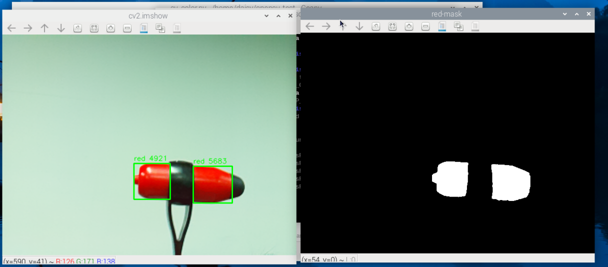
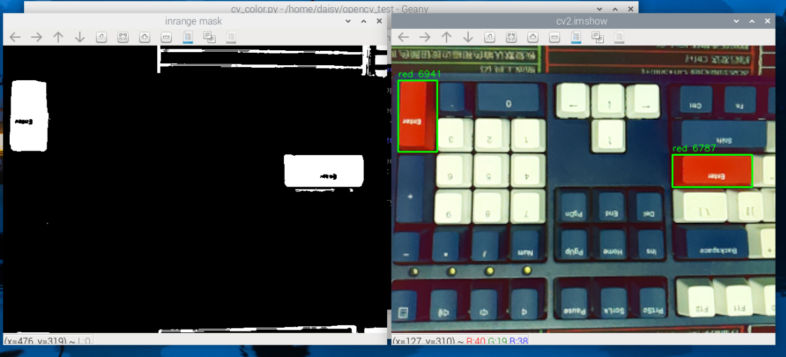
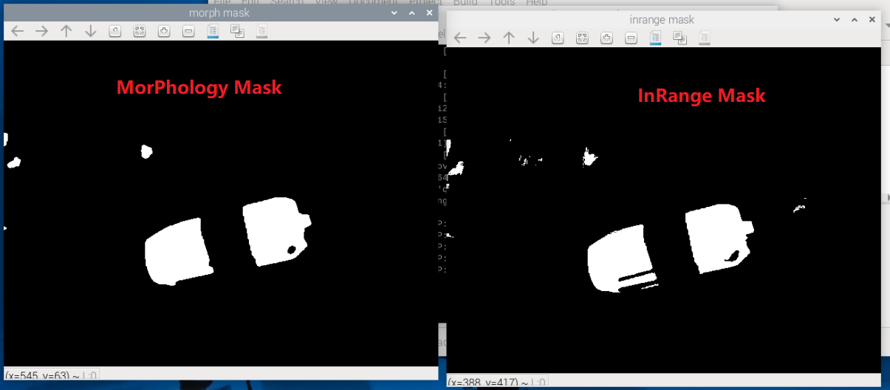

4. Color Detection
===========================================

Color detection is one of the most fundamental and practical functions in computer vision.  
In this chapter, we will use step-by-step code and explanations to **detect red objects using the HSV color space** and **draw bounding boxes** around them.

This forms the foundation for more advanced object tracking techniques (e.g., CAMShift).

1. Objective and Approach
-------------------------

- Use **Picamera2** to capture real-time camera frames  
- Convert the image from BGR to HSV color space  
- Use ``cv2.inRange`` to extract the red regions  
- Use morphological filtering to remove noise  
- Use ``cv2.findContours`` to find red object contours  
- Draw bounding boxes around the detected red regions

2. Run the Code
------------------------

Please make sure that:

1. You have installed OpenCV on your Raspberry Pi (see :ref:`opencv_install`);
2. You are using a display. Otherwise, please install Raspberry Pi Connect (|link_rpi_connect|) or RealVNC (:ref:`remote_desktop`) and make sure you can access the Raspberry Pi desktop through one of them;
3. You have downloaded the **ai-lab-kit** project (see :ref:`download_code`).

Open the terminal in VNC and enter the following command:

.. code-block:: bash

   cd ~/ai-lab-kit/opencv_python
   python3 cv_color.py

3. Complete Code
----------------

Below is the complete Python example for this chapter (``cv_color.py``):

.. code-block:: python

   from picamera2 import Picamera2, Preview
   import cv2
   import numpy as np

   picam2 = Picamera2()
   config = picam2.create_preview_configuration(
      main={"size": (640, 480), "format": "XRGB8888"}  
   )
   picam2.configure(config)
   picam2.start_preview(Preview.QTGL)
   picam2.start()

   print("Streaming... press 'q' to quit")

   LOWER_RED1 = np.array([0,   100, 80])
   UPPER_RED1 = np.array([10,  255, 255])
   LOWER_RED2 = np.array([170, 100, 80])
   UPPER_RED2 = np.array([180, 255, 255])

   KERNEL = cv2.getStructuringElement(cv2.MORPH_ELLIPSE, (5, 5))
   MIN_AREA = 800   

   while True:
      # Capture camera frame-by-frame as BGR
      frame_bgra = picam2.capture_array()
      frame_bgr  = cv2.cvtColor(frame_bgra, cv2.COLOR_BGRA2BGR)

      # Convert BGR to HSV
      hsv = cv2.cvtColor(frame_bgr, cv2.COLOR_BGR2HSV)

      # Use inRange to get mask
      mask1 = cv2.inRange(hsv, LOWER_RED1, UPPER_RED1)
      mask2 = cv2.inRange(hsv, LOWER_RED2, UPPER_RED2)
      mask = cv2.bitwise_or(mask1, mask2)

      # Morphological operations
      mask = cv2.morphologyEx(mask, cv2.MORPH_OPEN, KERNEL, iterations=1)
      mask = cv2.morphologyEx(mask, cv2.MORPH_CLOSE, KERNEL, iterations=2)

      # Find contours
      contours, _ = cv2.findContours(mask, cv2.RETR_EXTERNAL, cv2.CHAIN_APPROX_SIMPLE)
      for cnt in contours:
         area = cv2.contourArea(cnt)
         if area < MIN_AREA:
               continue
         x, y, w, h = cv2.boundingRect(cnt)
         
         cv2.rectangle(frame_bgr, (x, y), (x+w, y+h), (0, 255, 0), 2)
         cv2.putText(frame_bgr, f"red {int(area)}", (x, y-6),
                     cv2.FONT_HERSHEY_SIMPLEX, 0.5, (0,255,0), 1, cv2.LINE_AA)

      # Show the frame
      cv2.imshow("red-mask", mask)
      cv2.imshow("cv2.imshow", frame_bgr)

      if cv2.waitKey(1) & 0xFF == ord('q'):
         break

   picam2.stop_preview()
   picam2.stop()
   cv2.destroyAllWindows()

4. Execution Result
-------------------

- Red areas in the camera preview will be outlined with green rectangles.  
- The ``mask`` window will display only the red parts (white).  
- Press ``q`` to quit the program.

5. Code Explanation
--------------------------------

1. **Capture Camera Frame**

.. code-block:: python

   frame_bgra = picam2.capture_array()
   frame_bgr  = cv2.cvtColor(frame_bgra, cv2.COLOR_BGRA2BGR)

``picamera2`` outputs BGRA images, so we need to convert them to BGR to match OpenCV’s default format.  
This is the starting point of color detection.

2. **Convert to HSV**

.. code-block:: python

   hsv = cv2.cvtColor(frame_bgr, cv2.COLOR_BGR2HSV)

HSV is the preferred color space for color detection because it separates color (H) from brightness (V),  
making the detection more stable under varying lighting conditions.

For example:

- Red → H close to 0 or 180  
- Green → H close to 60  
- Blue → H close to 120

3. **Filter Red Using ``cv2.inRange``**

.. code-block:: python

   mask1 = cv2.inRange(hsv, LOWER_RED1, UPPER_RED1)
   mask2 = cv2.inRange(hsv, LOWER_RED2, UPPER_RED2)
   mask = cv2.bitwise_or(mask1, mask2)

**Core Logic:**

The relationship between ``cv2.inRange`` input and output:

.. list-table::
   :widths: 30 30 30
   :header-rows: 1

   * - Input: HSV image
     - inRange parameters
     - Output: mask (single channel)
   * - Each pixel's (H,S,V)
     - [lower bound, upper bound]
     - In range → 255 (white), otherwise 0 (black)

Since red is near both 0 and 180 in HSV,  
we use two separate ranges and combine the results with ``bitwise_or``.

The output ``mask`` is a binary image:  
white = red region, black = background.

4. **Morphological Filtering**

.. code-block:: python

   mask = cv2.morphologyEx(mask, cv2.MORPH_OPEN, KERNEL, iterations=1)
   mask = cv2.morphologyEx(mask, cv2.MORPH_CLOSE, KERNEL, iterations=2)

The ``inRange`` result may contain small noise (white dots) or holes in the target.  
**Morphological operations** make the mask cleaner:

- ``MORPH_OPEN`` (erosion → dilation): removes small noise  
- ``MORPH_CLOSE`` (dilation → erosion): fills small holes

The KERNEL here is a 5×5 elliptical structuring element.

5. **Contour Detection and Annotation**

.. code-block:: python

   contours, _ = cv2.findContours(mask, cv2.RETR_EXTERNAL, cv2.CHAIN_APPROX_SIMPLE)

- ``cv2.findContours`` locates all white regions (i.e., red objects).  
- ``cv2.contourArea(cnt)`` computes contour area.  
- ``cv2.boundingRect(cnt)`` gets the bounding rectangle.

We use ``MIN_AREA`` to filter out tiny, meaningless contours and only draw boxes around real targets.

.. code-block:: python

   if area < MIN_AREA:
       continue
   cv2.rectangle(frame_bgr, (x, y), (x+w, y+h), (0, 255, 0), 2)

6. **Display the Results**

.. code-block:: python

   cv2.imshow("red-mask", mask)
   cv2.imshow("cv2.imshow", frame_bgr)

We display two windows:

- ``red-mask``: the binary mask after HSV filtering and morphology  
- ``cv2.imshow``: the original image with green bounding boxes drawn on detected red areas

6. Parameter Tuning Tips
------------------------

- ``LOWER_RED1 / UPPER_RED1``: adjust this range to detect other colors.  
  For example, green ≈ ``[35, 50, 50]`` to ``[85, 255, 255]``.

- ``KERNEL``: larger kernels give stronger filtering but may remove small objects.

- ``MIN_AREA``: increasing this value filters out small noisy contours; decreasing it makes detection more sensitive.

.. note::
   You can start by only displaying the ``mask`` and tuning the thresholds until the target region looks clear, then proceed with the rest of the pipeline.

7. Extensions and Practice
--------------------------

- Modify the HSV threshold to detect other colors (e.g., blue or green).  
- Experiment with different morphological parameters in more complex backgrounds.  
