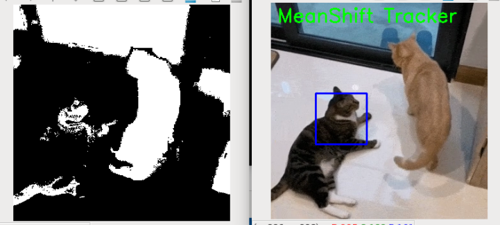
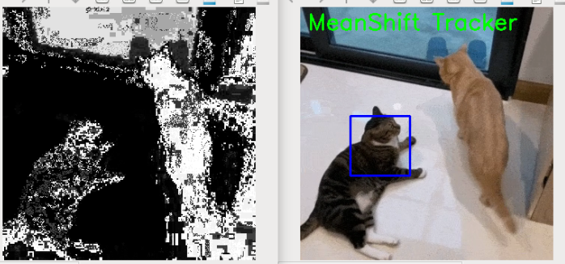

5. MeanShift Object Tracking
===============================

MeanShift is a classic histogram-based object tracking algorithm.  
In this lesson, we’ll not only implement a complete **MeanShift tracking** example, but also explain **why** each step is taken and **what’s happening under the hood**.

1. What is MeanShift?
---------------------

MeanShift iteratively shifts a window according to probability density to **find the most likely location of the target**.

In plain words:  
You first give the algorithm an “initial target region.” It computes the color features of this region (e.g., the target’s color histogram), and then in each subsequent frame finds the area most similar to that color and moves the rectangle there.

This process doesn’t rely on deep learning and requires no pre-training—it’s very lightweight.

.. image:: img/opencv_meanshift.png
   :alt: MeanShift tracking
   :align: center

2. Run the Code
------------------------

Please make sure that:

1. You have installed OpenCV on your Raspberry Pi (see :ref:`opencv_install`);
2. You are using a display. Otherwise, please install Raspberry Pi Connect (|link_rpi_connect|) or RealVNC (:ref:`remote_desktop`) and make sure you can access the Raspberry Pi desktop through one of them;
3. You have downloaded the **ai-lab-kit** project (see :ref:`download_code`).

Open the terminal in VNC and enter the following command:

.. code-block:: bash

   cd ~/ai-lab-kit/opencv_python
   python3 cv_meanshift.py

3. Complete Code
----------------

Below is the full MeanShift tracking script (``cv_meanshift.py``):

.. code-block:: python

   # Python program to demonstrate
   # meanshift 

   import numpy as np
   import cv2

   # read video
   cap = cv2.VideoCapture('sample2.mp4')
   
   # Retrieve the first frame from the video
   ret, frame = cap.read()

   # Set the initial region for tracking window (x, y, width, height)
   # Adjust these values according to your needs
   x, y, w, h = 80,100, 80, 80 
   track_window = (x, y, w, h)

   # Create the region of interest
   roi = frame[y:y+h, x:x+w]

   # converting BGR to HSV format
   hsv = cv2.cvtColor(frame, cv2.COLOR_BGR2HSV)
   
   # apply mask on the HSV frame
   mask = cv2.inRange(hsv, np.array((0., 61., 33.)), np.array((180., 255., 255.)))

   # get histogram for hsv channel
   roi = cv2.calcHist([hsv], [0], mask, [180], [0, 180])

   # normalize the retrieved values
   cv2.normalize(roi, roi, 0, 255, cv2.NORM_MINMAX)
   
   # termination criteria, either 15 
   # iteration or by at least 2 pt
   termination = (cv2.TERM_CRITERIA_EPS | cv2.TERM_CRITERIA_COUNT, 15, 2 )
   
   while(True):
      start_time = cv2.getTickCount()
      ret, frame = cap.read()
      
      if not ret:
         cap.set(cv2.CAP_PROP_POS_FRAMES,0)
         continue

      # convert BGR to HSV format
      hsv = cv2.cvtColor(frame, cv2.COLOR_BGR2HSV)
      
      bp = cv2.calcBackProject([hsv], [0], roi, [0, 180], 1)
   
      # applying meanshift to get the new region
      ret, track_window = cv2.meanShift(bp, track_window, termination)
   
      # Draw track window on the frame
      x, y, w, h = track_window
      frame = cv2.rectangle(frame, (x, y), (x + w, y + h), 255, 2)
      
      # Display tracking information
      cv2.putText(frame, 'MeanShift Tracker', (10, 30), cv2.FONT_HERSHEY_SIMPLEX, 1, (0, 255, 0), 2)
      
      # show results
      cv2.imshow('MeanShift Tracker', frame)
   
      # Calculate delay to maintain desired FPS
      expected_delay = max(1, int(1000 / cap.get(cv2.CAP_PROP_FPS)))
      process_time = (cv2.getTickCount() - start_time) / cv2.getTickFrequency()
      delay = int(expected_delay - process_time)
      
      # Ensure delay is non-negative
      delay = max(0, delay)

      # Wait for the next frame
      k = cv2.waitKey(delay) & 0xff
      if k == ord('q'):
         break
         
   # release cap object
   cap.release()

   # destroy all opened windows
   cv2.destroyAllWindows()

4. Results
-----------------------------

When you run the program, you’ll see:

- A rectangle locked on the target region  
- The rectangle moves as the target moves  
- The algorithm estimates the target location via color probability distribution  
- Press ``q`` to quit

5. Explanation
---------------------------

1. Define the initial tracking region

.. code-block:: python

   x, y, w, h = 215, 295, 20, 20
   track_window = (x, y, w, h)
   roi = frame[y:y+h, x:x+w]

This tells the algorithm the **initial target location**.  
MeanShift doesn’t “auto-detect” the target—it relies on an **initial window** you provide (e.g., a ball, an object, or a face).

2. Convert to HSV color space

.. code-block:: python

   hsv = cv2.cvtColor(frame, cv2.COLOR_BGR2HSV)

HSV is well-suited for color-based tasks because the Hue (H) component is relatively stable under lighting changes.  

Examples: Red ≈ 0, Green ≈ 60, Blue ≈ 120.

3. Filter colors with ``cv2.inRange``

.. code-block:: python

   mask = cv2.inRange(hsv, np.array((0., 61., 33.)), np.array((180., 255., 255.)))

**This is a key step!**

What ``cv2.inRange`` does:

- Iterate over every pixel in the HSV image  
- Check whether each pixel’s HSV value lies within the given range  
- If yes → the corresponding pixel in the mask is **white (255)**  
- If no → it’s **black (0)**

This is essentially “color filtering.”

The HSV range here is:

* H 0–180 → covers the entire hue range: effectively no hue restriction; any color can be selected.
* S 61–255 → removes very low-saturation colors (near gray/white): keeps vivid colors (red/green/blue/yellow, etc.).
* V 33–255 → removes very dark pixels: excludes near-black regions.

So it selects regions that are colorful and sufficiently bright, excluding dark and grayish parts.

If you want to track a specific color or exclude certain colors, adjust the HSV range, e.g.:

.. code-block:: python

   # Red
   lower = np.array([0, 120, 70])
   upper = np.array([10, 255, 255])
   mask = cv2.inRange(hsv, lower, upper)

.. code-block:: python

   # Green
   lower = np.array([50, 100, 100])
   upper = np.array([70, 255, 255])
   mask = cv2.inRange(hsv, lower, upper)

.. code-block:: python

   # Blue
   lower = np.array([110, 50, 50])
   upper = np.array([130, 255, 255])
   mask = cv2.inRange(hsv, lower, upper)

4. Compute the ROI color histogram

.. code-block:: python

   roi_hist = cv2.calcHist([hsv], [0], mask, [180], [0, 180])

We need to tell MeanShift “what the target looks like.”  
Here we extract the target’s color features by computing the **Hue-channel histogram** over the target region.

The mask also matters here: it ensures the histogram is computed only from the color of interest, not the entire image.

5. Normalize the histogram

.. code-block:: python

   cv2.normalize(roi_hist, roi_hist, 0, 255, cv2.NORM_MINMAX)

Normalization scales histogram values into a consistent range (0–255), improving robustness against lighting or size changes and stabilizing the subsequent matching.

6. Back projection

.. code-block:: python

   back_proj = cv2.calcBackProject([hsv], [0], roi_hist, [0, 180], 1)

This is the heart of MeanShift.  
It produces a “probability map”:

- White → pixel color is very similar to the target  
- Black → not similar

Think of it as: “On this map, the target is most likely where it’s white.”

7. Run MeanShift

.. code-block:: python

   ret, track_window = cv2.meanShift(back_proj, track_window, termination)

On this probability map, MeanShift starts from the initial ``track_window``,  
continually computes the “center of mass” of colors within the window, and moves the window there,  
eventually converging on the target area.

That’s how it “follows the color.”

8. Draw the rectangle

.. code-block:: python

   x, y, w, h = track_window
   cv2.rectangle(frame, (x, y), (x+w, y+h), (0, 255, 0), 2)

This visualizes the tracking result with a rectangle that moves with the target.

6. MeanShift vs. CAMShift
-------------------------

.. list-table::
   :header-rows: 1
   :widths: 20 40 40

   * - Feature
     - MeanShift
     - CAMShift
   * - Window size
     - Fixed
     - Auto-adjusts (adapts to target scale)
   * - Rotating target
     - Not supported
     - Supported
   * - Suitable scenarios
     - Target size relatively stable
     - Target may scale/rotate
   * - Applications
     - Simple tracking, balls, markers
     - Practical tracking, surveillance, recognition

7. Extensions and Practice
--------------------------

- Change the thresholds in ``cv2.inRange`` to track different colors  
- Combine with color detection to automatically determine the initial tracking window  

8. Advanced: Select ROI with the Mouse
--------------------------------------

Previously, we used fixed values:

.. code-block:: python

   x, y, w, h = 150, 200, 80, 80

That’s simple but not flexible.  
If you switch videos or the target starts elsewhere, you’d have to change the code.

OpenCV provides ``cv2.selectROI`` so you can **select the target region interactively on the first frame** with the mouse, and the program will obtain ``(x, y, w, h)`` automatically.

**Modified initialization code**

Run ``cv_meanshift_auto.py`` for the modified code.

.. code-block:: bash

   cd ~/ai-lab-kit/opencv_python
   python3 cv_meanshift_auto.py

.. code-block:: python
   :emphasize-lines: 10-12

   import numpy as np
   import cv2

   cap = cv2.VideoCapture('sample2.mp4')
   ret, frame = cap.read()

   ##### Select the region of interest (ROI) with mouse ####
   # Press Enter or Space to confirm the selection
   # Press Esc to exit the selection
   roi_box = cv2.selectROI("Select ROI", frame, fromCenter=False, showCrosshair=True)
   cv2.destroyWindow("Select ROI")
   x, y, w, h = roi_box
   track_window = (x, y, w, h)

   hsv = cv2.cvtColor(frame, cv2.COLOR_BGR2HSV)
   ...

The program pauses at the first frame and opens a selection window:

- Drag a box with the mouse around the target you want to track (e.g., a red ball or a person).  
- Press ``Enter`` or ``Space`` to confirm, or ``Esc`` to cancel.  
- The algorithm then starts tracking that region.

.. image:: img/opencv_meanshift_mouse.png
   :alt: Interactive ROI selection window
   :align: center

**Notes**

``cv2.selectROI`` is OpenCV’s built-in interactive ROI selector—great for manual initialization.  
It returns ``(x, y, w, h)``, which is fully compatible with ``track_window``, so you don’t need to change the main CAMShift/MeanShift logic.  
This lets you reuse the same program on different videos and targets.

9. Advanced II: Dynamically Compute HSV Thresholds for the ROI
--------------------------------------------------------------

The original ``cv_meanshift.py`` uses manually set HSV thresholds, suitable when the target color is fixed and lighting is stable.

.. code-block:: python

   # apply mask on the HSV frame
   mask = cv2.inRange(hsv, np.array((0., 61., 33.)), np.array((180., 255., 255.)))

If lighting varies significantly or the target color isn’t fixed, hard-coded ``inRange`` bounds may be suboptimal.  
A smarter approach is to **automatically compute the HSV lower/upper bounds from the selected ROI**.

**Example: Auto-computing HSV thresholds**

Run ``cv_meanshift_auto.py`` for the modified code.

.. code-block:: bash

   cd ~/ai-lab-kit/opencv_python
   python3 cv_meanshift_auto.py

.. code-block:: python

   # Extract ROI HSV channels
   h_roi = hsv[y:y+h, x:x+w, 0]
   s_roi = hsv[y:y+h, x:x+w, 1]
   v_roi = hsv[y:y+h, x:x+w, 2]

   # Compute lower & upper bounds using percentile
   h_low,  h_high = np.percentile(h_roi, [5, 95])
   s_low,  s_high = np.percentile(s_roi, [5, 95])
   v_low,  v_high = np.percentile(v_roi, [5, 95])

   pad_h, pad_s, pad_v = 10, 20, 20
   lower = np.array([max(h_low - pad_h, 0),
                     max(s_low - pad_s, 0),
                     max(v_low - pad_v, 0)], dtype=np.uint8)
   upper = np.array([min(h_high + pad_h, 180),
                     min(s_high + pad_s, 255),
                     min(v_high + pad_v, 255)], dtype=np.uint8)

   # Create mask for the selected region
   mask = cv2.inRange(hsv, lower, upper)

When selecting very dark or very bright targets, you no longer need to tweak thresholds manually; it also adapts quickly to different lighting and colors.

.. note::

   - ``np.percentile`` (5%–95%) trims extremes (edges, shadows, highlights, etc.) within the ROI, improving robustness.  
   - ``pad_h``, ``pad_s``, ``pad_v`` provide tolerance so mild color shifts are still captured.  
   - ``lower`` and ``upper`` are the dynamic HSV bounds used directly with ``cv2.inRange``.

**Summary**

- Use ``cv2.selectROI`` for flexible target initialization.  
- Use ``np.percentile`` to auto-compute HSV bounds for adaptability.  
- Combined with ``cv2.inRange`` and CAMShift/MeanShift, this approach remains stable under challenging lighting and target variations.
