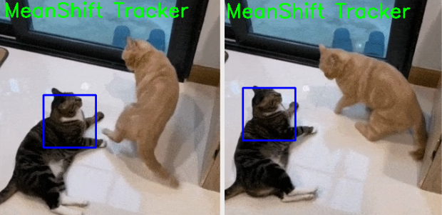
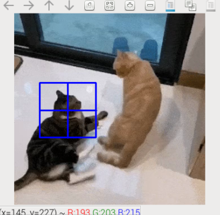

.. include:: /index.rst
   :start-after: start_hello_message
   :end-before: end_hello_message

5. MeanShift Object Tracking
===============================

MeanShift is a classic histogram-based object tracking algorithm.  
In this lesson, we’ll not only implement a complete **MeanShift tracking** example, but also explain **why** each step is taken and **what’s happening under the hood**.

1. What is MeanShift?
-------------------------

MeanShift iteratively shifts a window according to probability density to **find the most likely location of the target**.

In plain words:  
You first give the algorithm an “initial target region.” It computes the color features of this region (e.g., the target’s color histogram), and then in each subsequent frame finds the area most similar to that color and moves the rectangle there.

This process doesn’t rely on deep learning and requires no pre-training—it’s very lightweight.

2. Run the Code
------------------------

.. important::

   Before you start, make sure:

   * The pan-tilt is assembled
   * You can access the Raspberry Pi desktop
   * The code package is installed
   * Fusion HAT+ is installed and configured
   * OpenCV is installed

   For detailed instructions, see :ref:`opencv_install`.

#. Open the terminal and enter the following command:

   .. code-block:: bash

      cd ~/ai-lab-kit/opencv_python
      python3 cv_5_meanshift.py

#. When you run the program, an OpenCV window named **MeanShift Tracker** will appear and start playing the video file ``sample2.mp4``.  

   A green rectangle will be drawn around the target object and updated in real time using the MeanShift tracking algorithm.
   
   The tracking window will move as the object moves in the video.
   
   You can exit the program in two ways:
   
   * Press the **q** key on the keyboard  
   * Close the window by clicking the close button (X)  
   
   After exiting, the video playback stops and all OpenCV windows are closed.

3. Complete Code
-----------------------

Below is the full MeanShift tracking script (``cv_5_meanshift.py``):

.. code-block:: python

   import numpy as np
   import cv2

   cap = cv2.VideoCapture("sample2.mp4")

   # Read the first frame
   ret, frame = cap.read()
   if not ret:
      raise RuntimeError("Cannot read the video file.")

   # Initial tracking window (x, y, w, h)
   x, y, w, h = 80, 100, 80, 80
   track_window = (x, y, w, h)

   # Convert the first frame to HSV
   hsv_frame = cv2.cvtColor(frame, cv2.COLOR_BGR2HSV)

   # Extract ROI in HSV (ONLY the selected area)
   roi_hsv = hsv_frame[y:y+h, x:x+w]

   # Create a mask for ROI (filter out low saturation/value pixels)
   roi_mask = cv2.inRange(
      roi_hsv,
      np.array((0, 61, 33), dtype=np.uint8),
      np.array((180, 255, 255), dtype=np.uint8)
   )

   # Compute histogram of ROI (Hue channel)
   roi_hist = cv2.calcHist([roi_hsv], [0], roi_mask, [180], [0, 180])

   # Normalize histogram for better tracking
   cv2.normalize(roi_hist, roi_hist, 0, 255, cv2.NORM_MINMAX)

   # Termination criteria: max 15 iterations or move by at least 2 pixels
   termination = (cv2.TERM_CRITERIA_EPS | cv2.TERM_CRITERIA_COUNT, 15, 2)

   # FPS settings (fallback if FPS is unavailable)
   fps = cap.get(cv2.CAP_PROP_FPS)
   if not fps or fps <= 1e-3:
      fps = 30.0
   delay_ms = int(1000 / fps)

   WINDOW_NAME = "MeanShift Tracker"

   while True:
      ret, frame = cap.read()

      # Loop video
      if not ret:
         cap.set(cv2.CAP_PROP_POS_FRAMES, 0)
         continue

      # Convert frame to HSV
      hsv = cv2.cvtColor(frame, cv2.COLOR_BGR2HSV)

      # Back projection: probability map of where the ROI histogram appears in the frame
      bp = cv2.calcBackProject([hsv], [0], roi_hist, [0, 180], scale=1)

      # Apply meanShift to update tracking window
      _, track_window = cv2.meanShift(bp, track_window, termination)

      # Draw tracking window
      x, y, w, h = track_window
      cv2.rectangle(frame, (x, y), (x + w, y + h), (0, 255, 0), 2)
      cv2.putText(frame, "MeanShift Tracker", (10, 30),
                  cv2.FONT_HERSHEY_SIMPLEX, 1, (0, 255, 0), 2)

      cv2.imshow(WINDOW_NAME, frame)

      # Handle keyboard input and GUI events
      key = cv2.waitKey(delay_ms) & 0xFF
      if key == ord("q"):
         break

      # Exit if window is closed
      if cv2.getWindowProperty(WINDOW_NAME, cv2.WND_PROP_VISIBLE) < 1:
         break

   cap.release()
   cv2.destroyAllWindows()

4. Explanation
---------------------------

#. Open the video file:

   .. code-block:: python

      cap = cv2.VideoCapture("sample2.mp4")

   This creates a video capture object so OpenCV can read frames from the file.

#. Read the first frame and make sure it works:

   .. code-block:: python

      ret, frame = cap.read()
      if not ret:
          raise RuntimeError("Cannot read the video file.")

   MeanShift tracking needs an initial frame to learn what to track.

#. Set the initial tracking window (the object you want to track):

   .. code-block:: python

      x, y, w, h = 80, 100, 80, 80
      track_window = (x, y, w, h)

   This rectangle is the starting position of the target (ROI).  
   You usually adjust these values to match the object in the first frame.

#. Convert the first frame to HSV and extract the ROI:

   .. code-block:: python

      hsv_frame = cv2.cvtColor(frame, cv2.COLOR_BGR2HSV)
      roi_hsv = hsv_frame[y:y+h, x:x+w]

   HSV is commonly used for tracking because the Hue channel describes color more consistently than RGB/BGR.

#. Build a mask to ignore weak/invalid pixels in the ROI:

   .. code-block:: python

      roi_mask = cv2.inRange(
          roi_hsv,
          np.array((0, 61, 33), dtype=np.uint8),
          np.array((180, 255, 255), dtype=np.uint8)
      )

   This filters out pixels with very low saturation/value (often shadows or noise), improving tracking stability.

#. Compute and normalize the ROI histogram (Hue channel):

   .. code-block:: python

      roi_hist = cv2.calcHist([roi_hsv], [0], roi_mask, [180], [0, 180])
      cv2.normalize(roi_hist, roi_hist, 0, 255, cv2.NORM_MINMAX)

   - The histogram describes the target’s color distribution (Hue).
   - Normalization makes the histogram scale consistent across different lighting or ROI sizes.

#. Define termination criteria for MeanShift:

   .. code-block:: python

      termination = (cv2.TERM_CRITERIA_EPS | cv2.TERM_CRITERIA_COUNT, 15, 2)

   MeanShift will stop when either:
   - it runs 15 iterations, or
   - the window movement is smaller than 2 pixels.

#. Set a playback delay based on the video FPS:

   .. code-block:: python

      fps = cap.get(cv2.CAP_PROP_FPS)
      if not fps or fps <= 1e-3:
          fps = 30.0
      delay_ms = int(1000 / fps)

   This keeps playback close to the original video speed.  
   If FPS cannot be read, it falls back to 30 FPS.

#. Convert each frame to HSV (for tracking):

   .. code-block:: python

      hsv = cv2.cvtColor(frame, cv2.COLOR_BGR2HSV)

   Tracking is performed in HSV so we can match the target’s Hue histogram.

#. Back projection (find where the target color is likely to be):

   .. code-block:: python

      bp = cv2.calcBackProject([hsv], [0], roi_hist, [0, 180], scale=1)

   Back projection produces a probability map: bright areas are more likely to match the ROI histogram.

#. Update the tracking window using MeanShift:

   .. code-block:: python

      _, track_window = cv2.meanShift(bp, track_window, termination)

   MeanShift moves the tracking window toward the highest-density area in the probability map, updating the target position frame by frame.

#. Draw the tracking result:

   .. code-block:: python

      x, y, w, h = track_window
      cv2.rectangle(frame, (x, y), (x + w, y + h), (0, 255, 0), 2)

   This draws the current tracking rectangle on the video frame.

#. Display the window and exit conditions:

   .. code-block:: python

      key = cv2.waitKey(delay_ms) & 0xFF
      if key == ord("q"):
          break

      if cv2.getWindowProperty(WINDOW_NAME, cv2.WND_PROP_VISIBLE) < 1:
          break

   - Press ``q`` to quit.
   - Closing the window also exits safely.

#. Release resources:

   .. code-block:: python

      cap.release()
      cv2.destroyAllWindows()

   Always release the video and close windows to free system resources.

5. MeanShift vs. CAMShift
----------------------------

.. list-table::
   :header-rows: 1
   :widths: 20 40 40

   * - Feature
     - MeanShift
     - CAMShift
   * - Window size
     - Fixed
     - Auto-adjusts (adapts to target scale)
   * - Rotating target
     - Not supported
     - Supported
   * - Suitable scenarios
     - Target size relatively stable
     - Target may scale/rotate
   * - Applications
     - Simple tracking, balls, markers
     - Practical tracking, surveillance, recognition

6. Advanced: Select ROI with the Mouse
--------------------------------------

Previously, we used fixed values:

.. code-block:: python

   x, y, w, h = 150, 200, 80, 80

That’s simple but not flexible.  
If you switch videos or the target starts elsewhere, you’d have to change the code.

OpenCV provides ``cv2.selectROI`` so you can **select the target region interactively on the first frame** with the mouse, and the program will obtain ``(x, y, w, h)`` automatically.

**Modified initialization code**

Run ``cv_5_meanshift_auto.py`` for the modified code.

.. code-block:: bash

   cd ~/ai-lab-kit/opencv_python
   python3 cv_5_meanshift_auto.py

.. code-block:: python
   :emphasize-lines: 24,25

   import numpy as np
   import cv2
   from pathlib import Path

   # -----------------------------
   # Load video
   # -----------------------------
   BASE_DIR = Path(__file__).resolve().parent
   video_path = str(BASE_DIR / "sample3.mp4")

   cap = cv2.VideoCapture(video_path)
   if not cap.isOpened():
      raise RuntimeError("Error opening video file")

   # Read the first frame (needed for ROI selection and building the target model)
   ret, frame = cap.read()
   if not ret:
      raise RuntimeError("Cannot read the first frame from the video")

   # -----------------------------
   # Select ROI with mouse
   # -----------------------------
   # Press Enter/Space to confirm, press Esc to cancel
   roi_box = cv2.selectROI("Select ROI", frame, fromCenter=False, showCrosshair=True)
   cv2.destroyWindow("Select ROI")
   ...

When you run the program, the first frame of the video will be displayed and you will be asked to select a Region of Interest (ROI) using the mouse.

Drag the mouse to draw a rectangle around the target object, then press **Enter** or **Space** to confirm the selection.  
Press **Esc** to cancel the selection.

After confirming the ROI, a window named **MeanShift Tracker** will appear.  
The selected object will be tracked with a green bounding box, and the box will move as the object moves in the video.

To stop the program:

* Press the **q** key on the keyboard  
* Or close the display window using the close button (X)  

After exiting, the video playback stops and all OpenCV windows are closed.

**Notes**

``cv2.selectROI`` is OpenCV’s built-in interactive ROI selector—great for manual initialization.  
It returns ``(x, y, w, h)``, which is fully compatible with ``track_window``, so you don’t need to change the main CAMShift/MeanShift logic.  
This lets you reuse the same program on different videos and targets.

7. Advanced II: Dynamically Compute HSV Thresholds for the ROI
--------------------------------------------------------------

The original ``cv_5_meanshift.py`` uses manually set HSV thresholds, suitable when the target color is fixed and lighting is stable.

.. code-block:: python

   # apply mask on the HSV frame
   roi_mask = cv2.inRange(roi_hsv, lower, upper)

If lighting varies significantly or the target color isn’t fixed, hard-coded ``inRange`` bounds may be suboptimal.  
A smarter approach is to **automatically compute the HSV lower/upper bounds from the selected ROI**.

**Example: Auto-computing HSV thresholds**

Run ``cv_5_meanshift_auto.py`` for the modified code.

.. code-block:: bash

   cd ~/ai-lab-kit/opencv_python
   python3 cv_5_meanshift_auto.py

.. code-block:: python

   hsv0 = cv2.cvtColor(frame, cv2.COLOR_BGR2HSV)
   roi_hsv = hsv0[y:y + h, x:x + w]

   # Split ROI HSV channels
   h_roi = roi_hsv[:, :, 0]
   s_roi = roi_hsv[:, :, 1]
   v_roi = roi_hsv[:, :, 2]

   # Use percentiles to get robust ranges (ignore outliers)
   h_low, h_high = np.percentile(h_roi, [5, 95])
   s_low, s_high = np.percentile(s_roi, [5, 95])
   v_low, v_high = np.percentile(v_roi, [5, 95])

   # Add padding so the range is not too tight
   pad_h, pad_s, pad_v = 10, 20, 20

   lower = np.array([
      max(int(h_low) - pad_h, 0),
      max(int(s_low) - pad_s, 0),
      max(int(v_low) - pad_v, 0)
   ], dtype=np.uint8)

   upper = np.array([
      min(int(h_high) + pad_h, 180),
      min(int(s_high) + pad_s, 255),
      min(int(v_high) + pad_v, 255)
   ], dtype=np.uint8)

   # Mask ONLY the ROI (do not use the whole frame mask)
   roi_mask = cv2.inRange(roi_hsv, lower, upper)

When selecting very dark or very bright targets, you no longer need to tweak thresholds manually; it also adapts quickly to different lighting and colors.

.. note::

   - ``np.percentile`` (5%–95%) trims extremes (edges, shadows, highlights, etc.) within the ROI, improving robustness.  
   - ``pad_h``, ``pad_s``, ``pad_v`` provide tolerance so mild color shifts are still captured.  
   - ``lower`` and ``upper`` are the dynamic HSV bounds used directly with ``cv2.inRange``.

**Summary**

- Use ``cv2.selectROI`` for flexible target initialization.  
- Use ``np.percentile`` to auto-compute HSV bounds for adaptability.  
- Combined with ``cv2.inRange`` and CAMShift/MeanShift, this approach remains stable under challenging lighting and target variations.
