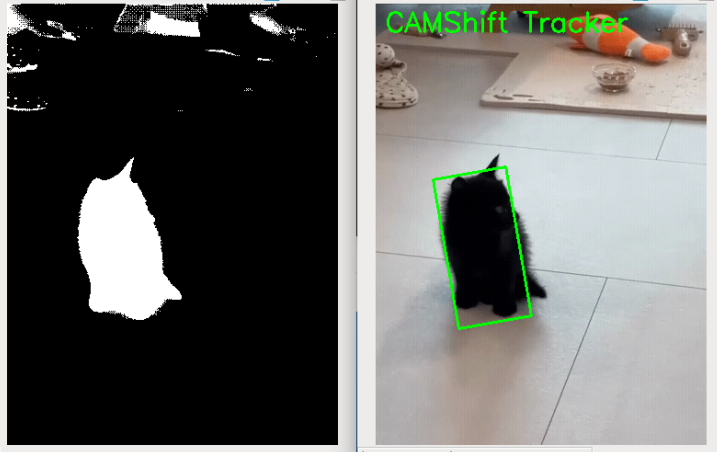
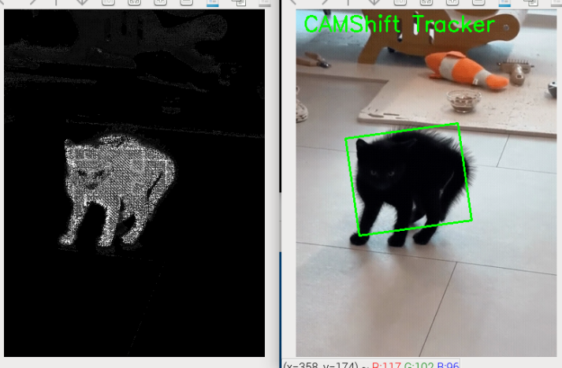

.. include:: /index.rst
   :start-after: start_hello_message
   :end-before: end_hello_message

6. CAMShift Object Tracking
==============================

In the previous chapter, we learned the MeanShift algorithm, which can continuously track a target in a video based on its color histogram.  
In this section, we introduce **CAMShift (Continuously Adaptive Mean Shift)**,  
which extends MeanShift by **automatically adapting the window size and orientation**, making it more practical for real-world applications.  
Additionally, in this example we’ll track a target **based on brightness rather than color**, which is also very common in practice.

1. Algorithm Features
---------------------

**MeanShift** can only track target position and uses a fixed-size window.  
**CAMShift** tracks position **and** automatically adjusts window size and angle.

For example, when the target approaches the camera, the tracking box grows; when the target moves away, it shrinks; when the target rotates, the box rotates accordingly.

.. image:: img/opencv_camshift.png
   :alt: CAMShift tracking illustration
   :align: center

2. Run the Code
------------------------

Please make sure that:

1. You have installed OpenCV on your Raspberry Pi (see :ref:`opencv_install`);
2. You are using a display. Otherwise, please install Raspberry Pi Connect (|link_rpi_connect|) or RealVNC (:ref:`remote_desktop`) and make sure you can access the Raspberry Pi desktop through one of them;
3. You have downloaded the **ai-lab-kit** project (see :ref:`download_code`).

Open the terminal in VNC and enter the following command:

.. code-block:: bash

   cd ~/ai-lab-kit/opencv_python
   python3 cv_camshift.py

3. Complete Code
----------------

Open ``cv_camshift.py`` to view the full code.

.. code-block:: python

   # Python program to demonstrate CAMShift (Continuously Adaptive Mean Shift)
   import numpy as np
   import cv2

   # Read video
   cap = cv2.VideoCapture('sample3.mp4')

   # Retrieve the first frame from the video
   ret, frame = cap.read()

   # Set the initial region for tracking window (x, y, width, height)
   # Adjust these values according to your needs
   x, y, w, h = 100,200, 40, 40 
   track_window = (x, y, w, h)

   # Convert BGR to HSV format
   hsv = cv2.cvtColor(frame, cv2.COLOR_BGR2HSV)

   # Apply mask on the HSV frame
   mask = cv2.inRange(hsv, np.array([0, 0, 0]), np.array([180, 255, 80])) 

   # Calculate histogram for HSV channel
   roi_hist = cv2.calcHist([hsv], [2], mask, [180], [0, 180])

   # Normalize the histogram values
   cv2.normalize(roi_hist, roi_hist, 0, 255, cv2.NORM_MINMAX)

   # Termination criteria for CAMShift
   termination_criteria = (cv2.TERM_CRITERIA_EPS | cv2.TERM_CRITERIA_COUNT, 10, 1)

   while True:
      start_time = cv2.getTickCount()
      ret, frame = cap.read()
      
      # If video ends, restart from beginning
      if not ret:
         cap.set(cv2.CAP_PROP_POS_FRAMES, 0)
         continue

      # Convert BGR to HSV format
      hsv = cv2.cvtColor(frame, cv2.COLOR_BGR2HSV)
      
      # Calculate back projection based on histogram
      back_proj = cv2.calcBackProject([hsv], [2], roi_hist, [0, 256], 1)

      # Apply CAMShift to get the new rotated rectangle and track window
      ret, track_window = cv2.CamShift(back_proj, track_window, termination_criteria)
      
      # Draw tracking results on the frame
      # CAMShift returns a rotated rectangle, so we can draw it as an ellipse or polygon
      pts = cv2.boxPoints(ret)
      pts = np.int0(pts)
      
      # Draw rotated rectangle
      frame = cv2.polylines(frame, [pts], True, (0, 255, 0), 2)

      # Display tracking information
      cv2.putText(frame, 'CAMShift Tracker', (10, 30), cv2.FONT_HERSHEY_SIMPLEX, 1, (0, 255, 0), 2)
      
      # Show results
      cv2.imshow('CAMShift Tracker', frame)

      # Calculate delay to maintain desired FPS
      expected_delay = max(1, int(1000 / cap.get(cv2.CAP_PROP_FPS)))
      process_time = (cv2.getTickCount() - start_time) / cv2.getTickFrequency()
      delay = int(expected_delay - process_time)
      
      # Ensure delay is non-negative
      delay = max(0, delay)
      
      # Wait for the next frame
      k = cv2.waitKey(delay) & 0xff
      if k == ord('q'):
         break
         
   # Release video capture object
   cap.release()

   # Destroy all opened windows
   cv2.destroyAllWindows()

4. Results
----------

After running the program, you’ll see:

- The initial rectangle automatically follows the moving target  
- The box grows when the target approaches and shrinks when it moves away  
- The box rotates as the target rotates  
- Press ``q`` to exit

5. Code Explanation
---------------------------

1. Initial Window and ROI

.. code-block:: python

   x, y, w, h = 150, 200, 80, 80
   track_window = (x, y, w, h)

- Like MeanShift, CAMShift requires an **initial tracking window**.  

This initial region defines the target appearance we want to “remember.”

2. Convert Color Space

.. code-block:: python

   hsv = cv2.cvtColor(frame, cv2.COLOR_BGR2HSV)

HSV makes color recognition less sensitive to lighting changes.  
H (Hue) represents color, S (Saturation) indicates purity, and V (Value) describes brightness.

3. Generate a Mask with ``cv2.inRange``

.. code-block:: python

   mask = cv2.inRange(hsv, np.array([0, 0, 0]), np.array([180, 255, 80])) 

``inRange`` labels pixels within the specified range as white (255) and others as black (0).

Here we set a range to filter the target. The output is a binary image (mask).

.. tip::

   Note that the target in this video is a pure black cat, so this ``inRange`` selects the darker regions in the frame.

   * H passes through all → no hue restriction  
   * S passes through all → no saturation restriction  
   * V limited to 0–80 → selects low-brightness pixels, e.g., black cat, black clothes, shadows, etc.

4. Compute and Normalize the Histogram

.. code-block:: python

   roi_hist = cv2.calcHist([hsv], [2], mask, [180], [0, 180])
   cv2.normalize(roi_hist, roi_hist, 0, 255, cv2.NORM_MINMAX)

- ``calcHist``: counts the color distribution within the ROI  
- ``normalize``: standardizes value ranges to reduce the impact of brightness variations

This step essentially **teaches CAMShift what our target looks like**.

.. tip::

   Here we use the V channel (brightness). To track a colorful object, you typically use the H or S channel.  
   You can change the second argument to ``[0]`` for H or ``[1]`` for S.

5. Back Projection

.. code-block:: python

   back_proj = cv2.calcBackProject([hsv], [2], roi_hist, [0, 256], 1)

- “Maps” the histogram back onto the entire image  
- Whiter areas → more likely where the target appears

This is like creating a “heatmap” over the frame.

6. CAMShift Tracking

.. code-block:: python

   ret, track_window = cv2.CamShift(back_proj, track_window, termination_criteria)

Compared with MeanShift, CAMShift adds:

- **Adaptive window size** → grows/shrinks with target scale  
- **Orientation** → rotates with the target  
- Returns a rotated bounding box

7. Draw the Rotated Rectangle

.. code-block:: python

   pts = cv2.boxPoints(ret)
   pts = np.intp(pts)
   frame = cv2.polylines(frame, [pts], True, (0, 255, 0), 2)

``cv2.boxPoints`` extracts the four vertices of the rotated rectangle from ``CamShift``’s return value.  
Connecting them with ``polylines`` gives a rotated box that follows the target.

6. CAMShift vs. MeanShift
-------------------------

.. list-table::
   :header-rows: 1
   :widths: 20 40 40

   * - Feature
     - MeanShift
     - CAMShift
   * - Window size
     - Fixed
     - Adaptive
   * - Angle
     - Not supported
     - Supports rotation
   * - Tracking accuracy
     - Moderate
     - Higher, more adaptive
   * - Applications
     - Static targets
     - Complex motion, rotating targets

CAMShift is an upgrade over MeanShift,  
better handling target deformation, rotation, and distance changes—well-suited for real-world scenarios.

7. Extensions and Practice
--------------------------

- Adjust the ``inRange`` thresholds to track green or blue targets  
- Combine with live camera input to build a real-time color-based tracking system

8. Advanced: Interactive ROI Selection and Auto-Adjusting HSV Thresholds
-------------------------------------------------------------------------

As in the previous section, this project can also use mouse interaction to select the ROI and automatically adjust HSV thresholds.

Run ``cv_camshift_auto.py`` for the modified code.

.. code-block:: bash

   cd ~/ai-lab-kit/opencv_python
   python3 cv_camshift_auto.py

.. code-block:: python

   #### Select the region of interest (ROI) with mouse ####
   # Press Enter or Space to confirm the selection
   # Press Esc to exit the selection
   roi_box = cv2.selectROI("Select ROI", frame, fromCenter=False, showCrosshair=True)
   cv2.destroyWindow("Select ROI")
   x, y, w, h = roi_box
   track_window = (x, y, w, h)

   # Convert BGR to HSV format
   hsv = cv2.cvtColor(frame, cv2.COLOR_BGR2HSV)

   #### automatically select the HSV of the ROI####
   h_roi = hsv[y:y+h, x:x+w, 0]
   s_roi = hsv[y:y+h, x:x+w, 1]
   v_roi = hsv[y:y+h, x:x+w, 2]

   h_low,  h_high  = np.percentile(h_roi, [5, 95])
   s_low,  s_high  = np.percentile(s_roi, [5, 95])
   v_low,  v_med   = np.percentile(v_roi, [5, 95])

   pad_h, pad_s, pad_v = 10, 20, 20
   lower = np.array([max(h_low - pad_h, 0),
                     max(s_low - pad_s, 0),
                     max(v_low - pad_v, 0)], dtype=np.uint8)
   upper = np.array([min(h_high + pad_h, 180),
                     min(s_high + pad_s, 255),
                     min(v_med  + pad_v,  255)], dtype=np.uint8)

   # create a mask for the selected region
   mask = cv2.inRange(hsv, lower, upper)

   ...

