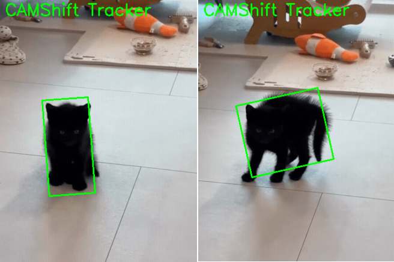

.. include:: /index.rst
   :start-after: start_hello_message
   :end-before: end_hello_message

6. Suivi d’Objets avec CAMShift
=========================================

Dans le chapitre précédent, nous avons appris l’algorithme MeanShift, qui peut suivre en continu une cible dans une vidéo en fonction de son histogramme de couleur.
Dans cette section, nous présentons **CAMShift (Continuously Adaptive Mean Shift)**,
qui étend MeanShift en **adaptant automatiquement la taille et l’orientation de la fenêtre**, le rendant plus pratique pour les applications réelles.
De plus, dans cet exemple, nous allons suivre une cible **basée sur la luminosité plutôt que sur la couleur**, ce qui est également très courant en pratique.

.. raw:: html

      <video width="400" loop muted controls>
          <source src="../_static/video/Opencv_6.mp4" type="video/mp4">
          Votre navigateur ne supporte pas la balise vidéo.
      </video>

1. Caractéristiques de l’Algorithme
---------------------

**MeanShift** ne peut suivre que la position de la cible et utilise une fenêtre de taille fixe.
**CAMShift** suit la position **et** ajuste automatiquement la taille et l’angle de la fenêtre.

Par exemple, lorsque la cible s’approche de la caméra, la boîte de suivi s’agrandit ; lorsqu’elle s’éloigne, elle rétrécit ; lorsque la cible tourne, la boîte tourne en conséquence.

2. Exécuter le Code
------------------------

.. important::

   Avant de commencer, assurez-vous :

   * Que le support motorisé est assemblé
   * Que vous pouvez accéder au bureau du Raspberry Pi
   * Que le package de code est installé
   * Que Fusion HAT+ est installé et configuré
   * Qu’OpenCV est installé

   Pour les instructions détaillées, voir :ref:`opencv_install`.

#. Ouvrez le terminal et entrez la commande suivante :

   .. code-block:: bash

      cd ~/ai-lab-kit/opencv_python
      python3 cv_6_camshift.py

#. Lorsque vous exécutez le programme, une fenêtre OpenCV nommée **CAMShift Tracker** apparaît et commence à lire le fichier vidéo *sample3.mp4*.

   Le programme suit le chat noir en utilisant l’algorithme CAMShift (Continuously Adaptive Mean Shift).

   Une boîte englobante rotative verte sera dessinée autour de l’objet suivi.
   Au fur et à mesure que le chat se déplace ou change de taille et d’orientation, la fenêtre de suivi s’adaptera automatiquement en position, taille et angle.

   Vous pouvez quitter le programme de deux manières :

   * Appuyer sur la touche **q** du clavier
   * Fermer la fenêtre en cliquant sur le bouton de fermeture (X)

   Après la sortie, la lecture vidéo s’arrête et toutes les fenêtres OpenCV sont fermées.

3. Code Complet
---------------------

Ouvrez ``cv_6_camshift.py`` pour voir le code complet.

.. code-block:: python

   # Python program to demonstrate CAMShift (tracking a dark object)
   import numpy as np
   import cv2

   # Read video
   cap = cv2.VideoCapture("sample3.mp4")

   # Retrieve the first frame from the video
   ret, frame = cap.read()
   if not ret:
      raise RuntimeError("Cannot read the video file.")

   # Set the initial region for tracking window (x, y, width, height)
   x, y, w, h = 100, 200, 40, 40
   track_window = (x, y, w, h)

   # Convert first frame to HSV
   hsv = cv2.cvtColor(frame, cv2.COLOR_BGR2HSV)

   # Extract ROI (only the target area) in HSV
   hsv_roi = hsv[y:y+h, x:x+w]

   # For tracking a black object, we keep dark pixels (low V) inside ROI
   # V channel is hsv[..., 2], so we build a mask based on V <= 80
   roi_mask = cv2.inRange(hsv_roi, np.array((0, 0, 0)), np.array((180, 255, 80)))

   # Build histogram on V channel (channel index 2) within ROI
   # Use 256 bins for V (0~256) to match back projection range
   roi_hist = cv2.calcHist([hsv_roi], [2], roi_mask, [256], [0, 256])
   cv2.normalize(roi_hist, roi_hist, 0, 255, cv2.NORM_MINMAX)

   # Termination criteria for CAMShift
   term_crit = (cv2.TERM_CRITERIA_EPS | cv2.TERM_CRITERIA_COUNT, 10, 1)

   # FPS delay (fallback if FPS is unavailable)
   fps = cap.get(cv2.CAP_PROP_FPS)
   if not fps or fps <= 1e-3:
      fps = 30.0
   delay_ms = int(1000 / fps)

   WINDOW_NAME = "CAMShift Tracker"

   while True:
      ret, frame = cap.read()

      # If video ends, restart from beginning
      if not ret:
         cap.set(cv2.CAP_PROP_POS_FRAMES, 0)
         continue

      # Convert frame to HSV
      hsv = cv2.cvtColor(frame, cv2.COLOR_BGR2HSV)

      # Back projection on V channel using ROI histogram (range 0~256)
      back_proj = cv2.calcBackProject([hsv], [2], roi_hist, [0, 256], 1)

      # Apply CAMShift
      rot_rect, track_window = cv2.CamShift(back_proj, track_window, term_crit)

      # Draw rotated rectangle
      pts = cv2.boxPoints(rot_rect).astype(np.int32)
      cv2.polylines(frame, [pts], True, (0, 255, 0), 2)

      cv2.putText(frame, "CAMShift Tracker", (10, 30),
                  cv2.FONT_HERSHEY_SIMPLEX, 1, (0, 255, 0), 2)

      cv2.imshow(WINDOW_NAME, frame)

      # Keyboard + GUI events
      key = cv2.waitKey(delay_ms) & 0xFF
      if key == ord("q"):
         break

      # Exit if user closes the window (click X)
      if cv2.getWindowProperty(WINDOW_NAME, cv2.WND_PROP_VISIBLE) < 1:
         break

   cap.release()
   cv2.destroyAllWindows()

4. Explication du Code
---------------------------

#. Ouvrir le fichier vidéo et lire la première image :

   .. code-block:: python

      cap = cv2.VideoCapture(“sample3.mp4”)
      ret, frame = cap.read()
      if not ret:
          raise RuntimeError(“Cannot read the video file.”)

   CAMShift a besoin d'une image initiale pour apprendre ce qu'il doit suivre.

#. Définir la fenêtre de suivi initiale (ROI) :

   .. code-block:: python

      x, y, w, h = 100, 200, 40, 40
      track_window = (x, y, w, h)

   Ce rectangle doit couvrir l'objet cible dans la première image.
   CAMShift mettra à jour cette fenêtre automatiquement pendant le suivi.

#. Convertir la première image en HSV et extraire la ROI :

   .. code-block:: python

      hsv = cv2.cvtColor(frame, cv2.COLOR_BGR2HSV)
      hsv_roi = hsv[y:y+h, x:x+w]

   HSV est pratique pour le suivi car vous pouvez choisir des canaux spécifiques (comme V pour la luminosité).

#. Construire un masque pour un objet sombre (faibles valeurs V) :

   .. code-block:: python

      roi_mask = cv2.inRange(hsv_roi, np.array((0, 0, 0)), np.array((180, 255, 80)))

   Cela ne conserve que les pixels « sombres » dans la ROI.
   Pour les objets noirs/sombres, la luminosité (V) est généralement la caractéristique la plus utile.

#. Calculer et normaliser un histogramme du canal V :

   .. code-block:: python

      roi_hist = cv2.calcHist([hsv_roi], [2], roi_mask, [256], [0, 256])
      cv2.normalize(roi_hist, roi_hist, 0, 255, cv2.NORM_MINMAX)

   - Le canal ``2`` correspond au canal **V (Value/luminosité)** dans HSV.
   - L'histogramme décrit à quel point la ROI cible est « sombre/lumineuse ».
   - La normalisation rend le suivi plus stable.

#. Définir les critères de terminaison pour CAMShift :

   .. code-block:: python

      term_crit = (cv2.TERM_CRITERIA_EPS | cv2.TERM_CRITERIA_COUNT, 10, 1)

   CAMShift arrête la mise à jour lorsqu'il atteint 10 itérations ou que le mouvement est inférieur à 1 pixel.

#. Définir la vitesse de lecture en utilisant les FPS :

   .. code-block:: python

      fps = cap.get(cv2.CAP_PROP_FPS)
      if not fps or fps <= 1e-3:
          fps = 30.0
      delay_ms = int(1000 / fps)

   Cela définit un délai pour que la vidéo soit lue proche de ses FPS d'origine.

#. Créer une carte de probabilité en utilisant la rétroprojection (canal V) :

   .. code-block:: python

      back_proj = cv2.calcBackProject([hsv], [2], roi_hist, [0, 256], 1)

   La rétroprojection met en évidence les pixels de l'image dont les valeurs V correspondent à l'histogramme de la ROI.
   Des valeurs plus claires dans ``back_proj`` signifient « plus probablement la cible ».

#. Suivre avec CAMShift et mettre à jour la fenêtre :

   .. code-block:: python

      rot_rect, track_window = cv2.CamShift(back_proj, track_window, term_crit)

   CAMShift est basé sur MeanShift, mais il peut aussi adapter la **taille et la rotation** de la fenêtre de suivi.

   - ``track_window`` est mis à jour à chaque image.
   - ``rot_rect`` contient un rectangle rotatif (centre, taille, angle).

#. Dessiner la boîte de suivi rotative :

   .. code-block:: python

      pts = cv2.boxPoints(rot_rect).astype(np.int32)
      cv2.polylines(frame, [pts], True, (0, 255, 0), 2)

   Cela convertit le rectangle rotatif en quatre points de coin et le dessine sur l'image.

#. Conditions de sortie (clavier + fermeture de fenêtre) :

   .. code-block:: python

      key = cv2.waitKey(delay_ms) & 0xFF
      if key == ord(“q”):
          break

      if cv2.getWindowProperty(WINDOW_NAME, cv2.WND_PROP_VISIBLE) < 1:
          break

   Appuyez sur ``q`` pour quitter, ou fermez la fenêtre pour arrêter en toute sécurité.

#. Libérer les ressources :

   .. code-block:: python

      cap.release()
      cv2.destroyAllWindows()

   Libérez toujours le fichier vidéo et fermez les fenêtres à la fin.

5. CAMShift vs. MeanShift
--------------------------------------

.. list-table::
   :header-rows: 1
   :widths: 20 40 40

   * - Caractéristique
     - MeanShift
     - CAMShift
   * - Taille de fenêtre
     - Fixe
     - Adaptative
   * - Angle
     - Non supporté
     - Supporte la rotation
   * - Précision du suivi
     - Modérée
     - Plus élevée, plus adaptative
   * - Applications
     - Cibles statiques
     - Mouvements complexes, cibles en rotation

CAMShift est une amélioration par rapport à MeanShift,
gérant mieux la déformation de la cible, la rotation et les changements de distance — bien adapté aux scénarios réels.

6. Extensions et Exercices
-------------------------------------------

- Ajustez les seuils ``inRange`` pour suivre des cibles vertes ou bleues
- Combinez avec une entrée caméra en direct pour construire un système de suivi basé sur la couleur en temps réel

7. Avancé : Sélection Interactive de la ROI et Ajustement Automatique des Seuils HSV
-------------------------------------------------------------------------

Comme dans la section précédente, ce projet peut également utiliser l'interaction souris pour sélectionner la ROI et ajuster automatiquement les seuils HSV.

Exécutez ``cv_6_camshift_auto.py`` pour le code modifié.

.. code-block:: bash

   cd ~/ai-lab-kit/opencv_python
   python3 cv_6_camshift_auto.py

Lorsque vous exécutez le programme, la première image de la vidéo sera affichée et vous serez invité à sélectionner une région d'intérêt (ROI) avec la souris.

Faites glisser la souris pour dessiner un rectangle autour de l'objet cible, puis appuyez sur **Entrée** ou **Espace** pour confirmer la sélection.
Appuyez sur **Esc** pour annuler la sélection.

Après avoir sélectionné la ROI, une fenêtre nommée **CAMShift Tracker** apparaîtra.
L'objet sélectionné sera suivi avec un rectangle rotatif vert, et la fenêtre de suivi s'adaptera automatiquement en position, taille et orientation au fur et à mesure que l'objet se déplace.

Pour arrêter le programme :

* Appuyez sur la touche **q** du clavier
* Ou fermez la fenêtre d'affichage avec le bouton de fermeture (X)

Après la sortie, la lecture vidéo s'arrête et toutes les fenêtres OpenCV sont fermées.

.. code-block:: python

   hsv0 = cv2.cvtColor(frame, cv2.COLOR_BGR2HSV)
   roi_hsv = hsv0[y:y + h, x:x + w]

   # Split ROI HSV channels
   h_roi = roi_hsv[:, :, 0]
   s_roi = roi_hsv[:, :, 1]
   v_roi = roi_hsv[:, :, 2]

   # Use percentiles to get robust ranges (ignore outliers)
   h_low, h_high = np.percentile(h_roi, [5, 95])
   s_low, s_high = np.percentile(s_roi, [5, 95])
   v_low, v_high = np.percentile(v_roi, [5, 95])

   # Add padding so the range is not too tight
   pad_h, pad_s, pad_v = 10, 20, 20

   lower = np.array([
      max(int(h_low) - pad_h, 0),
      max(int(s_low) - pad_s, 0),
      max(int(v_low) - pad_v, 0)
   ], dtype=np.uint8)

   upper = np.array([
      min(int(h_high) + pad_h, 180),
      min(int(s_high) + pad_s, 255),
      min(int(v_high) + pad_v, 255)
   ], dtype=np.uint8)

   # Mask ONLY the ROI (do not use the whole frame mask)
   roi_mask = cv2.inRange(roi_hsv, lower, upper)

   ...

