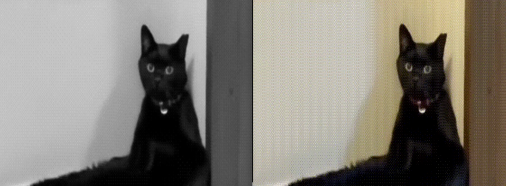
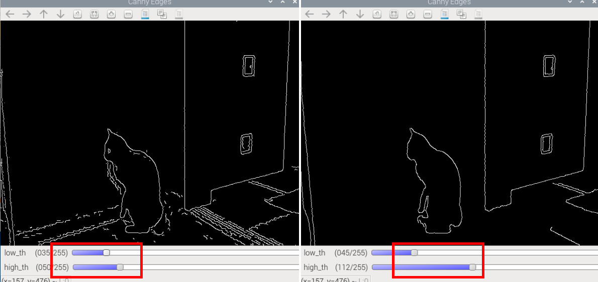
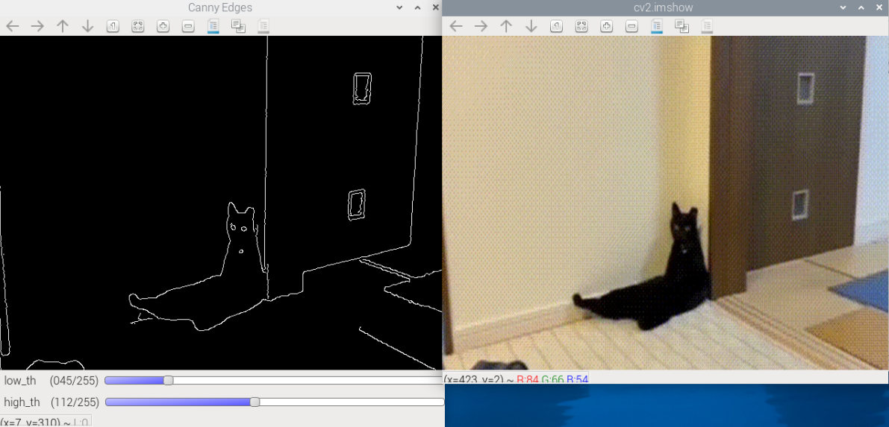

7. Canny Edge Detection
=========================================

In this chapter, we will capture real-time video using Raspberry Pi + Picamera2 and perform edge detection with OpenCV’s **Canny algorithm**.  
Edge detection is a fundamental part of computer vision, and the Canny algorithm is widely regarded as one of the most stable and noise-robust methods.

1. What Does the Canny Algorithm Do?
------------------------------------

In images, **edges** usually correspond to locations with strong intensity (grayscale) changes, such as:

- Object outlines
- Boundaries between bright and dark regions
- Structural edge lines

The purpose of Canny edge detection is to:

- **Accurately extract edge information** while reducing unnecessary interference;
- Provide a reliable foundation for subsequent **contour detection**, **object segmentation**, and **geometric recognition** (e.g., circles, rectangles);
- In robot vision, it’s often used for **path detection** and **obstacle recognition**.

.. image:: img/opencv_canny.png
   :alt: Illustration of Canny edge detection
   :align: center

2. Run the Code
------------------------

Please make sure that:

1. You have installed OpenCV on your Raspberry Pi (see :ref:`opencv_install`);
2. You are using a display. Otherwise, please install Raspberry Pi Connect (|link_rpi_connect|) or RealVNC (:ref:`remote_desktop`) and make sure you can access the Raspberry Pi desktop through one of them;
3. You have downloaded the **ai-lab-kit** project (see :ref:`download_code`).

Open the terminal in VNC and enter the following command:

.. code-block:: bash

   cd ~/ai-lab-kit/opencv_python
   python3 cv_canny.py

.. tip::

   We also provide ``cv_canny_video.py`` to process video files, and ``cv_canny_conbine.py`` to combine real-time capture with video (combined view).

3. Complete Code
----------------

.. code-block:: python

   from picamera2 import Picamera2, Preview
   import cv2

   # --- Utility: empty callback for trackbars ---
   def _noop(x):
      pass

   picam2 = Picamera2()
   config = picam2.create_preview_configuration(
      main={"size": (640, 480), "format": "XRGB8888"}  # XRGB8888 -> BGRA frames
   )
   picam2.configure(config)

   # Start preview from Picamera2 (optional GUI preview)
   picam2.start_preview(Preview.QTGL)
   picam2.start()

   # Create OpenCV windows
   cv2.namedWindow("cv2.imshow")         # original view
   cv2.namedWindow("Canny Edges")        # edge view

   # Create trackbars to tune Canny thresholds in real time
   # Typical ranges: low (0-255), high (0-255); start with common defaults
   cv2.createTrackbar("low_th",  "Canny Edges", 50, 255, _noop)
   cv2.createTrackbar("high_th", "Canny Edges", 150, 255, _noop)

   print("Streaming... press 'q' to quit")
   try:
      while True:
         # Capture frame as BGRA due to XRGB8888 format
         frame_bgra = picam2.capture_array()
         # Convert BGRA -> BGR for OpenCV processing
         frame_bgr  = cv2.cvtColor(frame_bgra, cv2.COLOR_BGRA2BGR)

         # --- Canny edge detection pipeline ---
         # 1) Convert to grayscale for edge detection
         gray = cv2.cvtColor(frame_bgr, cv2.COLOR_BGR2GRAY)
         # 2) Optional denoising to reduce false edges
         #    Gaussian blur helps Canny be less sensitive to noise
         blurred = cv2.GaussianBlur(gray, (5, 5), 0)

         # Read current thresholds from trackbars
         low_th  = cv2.getTrackbarPos("low_th",  "Canny Edges")
         high_th = cv2.getTrackbarPos("high_th", "Canny Edges")

         # Ensure high threshold is at least low threshold + 1 to avoid errors
         if high_th <= low_th:
               high_th = low_th + 1
               cv2.setTrackbarPos("high_th", "Canny Edges", high_th)

         # 3) Run Canny
         edges = cv2.Canny(blurred, threshold1=low_th, threshold2=high_th, L2gradient=True)

         # Show original and edges
         cv2.imshow("cv2.imshow", frame_bgr)
         cv2.imshow("Canny Edges", edges)

         # Exit on 'q'
         if cv2.waitKey(1) & 0xFF == ord('q'):
               break
   finally:
      # Always clean up devices and windows
      picam2.stop_preview()
      picam2.stop()
      cv2.destroyAllWindows()

4. Results
---------------

- After running, two windows appear:

  - Left: original image captured from the camera  
  - Right: edge-detected image

- Move the threshold trackbars to observe changes in real time  
- Press ``q`` to quit

5. Code Explanation
---------------------------------

1. Grayscale Conversion

.. code-block:: python

   gray = cv2.cvtColor(frame_bgr, cv2.COLOR_BGR2GRAY)

- Canny uses only grayscale information to detect where intensity “jumps.”
- Color (RGB) channels add complexity; converting to grayscale reduces interference.

Goal: convert the color image to a single-channel grayscale image to prepare for edge detection.

2. Gaussian Blur

.. code-block:: python

   blurred = cv2.GaussianBlur(gray, (5, 5), 0)

- Images contain noise (glare, speckles). Running Canny directly may yield many false edges.
- Gaussian blur “smooths” the image and produces cleaner edge maps.
- ``(5, 5)`` is the kernel size; larger values increase smoothing but may lose detail.

3. Thresholds (Low / High)

.. code-block:: python

   low_th  = cv2.getTrackbarPos("low_th", "Canny Edges")
   high_th = cv2.getTrackbarPos("high_th", "Canny Edges")

- Canny uses **dual-threshold detection**:

  - High threshold: classify **strong edges**  
  - Low threshold: classify **weak edges**; only keep those connected to strong edges

- This design:

   Preserves clear, main edges  
   Filters out isolated noise

That’s why we use trackbars to tune thresholds interactively to find suitable edge strength.

4. Core of the Canny Algorithm

.. code-block:: python

   edges = cv2.Canny(blurred, threshold1=low_th, threshold2=high_th, L2gradient=True)

Canny actually includes four stages:

1. **Gradient computation**: use Sobel operators to compute gradient magnitude and direction.  
2. **Non-maximum suppression**: keep only true edge pixels (local maxima).  
3. **Double thresholding**: classify strong and weak edges.  
4. **Hysteresis (edge tracking)**: keep weak edges if they connect to strong edges; otherwise discard.

This approach is more robust than a single threshold and better handles lighting changes.

5. Display Results

.. code-block:: python

   cv2.imshow("cv2.imshow", frame_bgr)
   cv2.imshow("Canny Edges", edges)

- Right window: original image  
- Left window: edge map (white = edges)  
- Adjust the trackbars to immediately see how the edges change

6. Why is Canny Useful?
-----------------------

Canny output is well-suited for subsequent vision tasks:

.. list-table::
   :header-rows: 1
   :widths: 30 70

   * - Application
     - Description
   * - Contour detection
     - Use ``cv2.findContours`` on Canny output to obtain object shapes
   * - Object segmentation
     - Use edges as a basis to separate target from background
   * - Shape recognition
     - Combine with Hough transforms to detect circles, lines, etc.
   * - Robot navigation
     - Detect ground, roads, obstacle outlines to assist planning
   * - OCR / Target localization
     - Text regions, QR codes, markers often have clear edge features

Canny isn’t just “cool-looking”—it’s the **entry point** to a broader CV pipeline.

7. Threshold Selection Tips
---------------------------

.. list-table::
   :header-rows: 1
   :widths: 70 30 30 70
   
   * - Scenario
     - low_th
     - high_th
     - Notes
   * - Stable indoor lighting
     - 50
     - 150
     - General case, stable results
   * - Strong lighting & high contrast
     - 100
     - 200
     - Increase thresholds to reduce false edges
   * - Low light, noisy
     - 30
     - 100
     - Lower thresholds to keep more details
   * - Very blurry edges
     - 20
     - 80
     - Lower thresholds further to make edges more sensitive

Use the trackbars to quickly tune an appropriate range, then hardcode it into your program.

8. Extended Exercises
---------------------

- Use ``cv2.findContours`` on the Canny output to draw object boundaries.  
- Change the Gaussian kernel size and observe how edge accuracy changes.  
- Try different thresholds in low/high light to understand double-threshold effects.  
- Use the edge map for shape detection with ``cv2.HoughLines`` (lines) or ``cv2.HoughCircles`` (circles).
