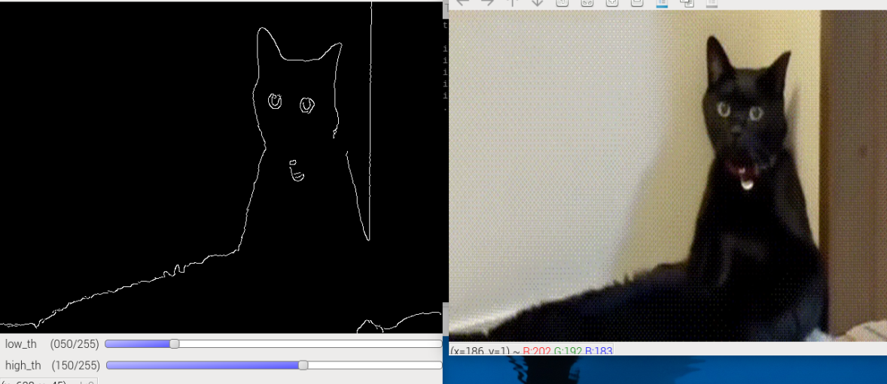

.. include:: /index.rst
   :start-after: start_hello_message
   :end-before: end_hello_message

7. Rilevamento Bordi con Canny
==============================

In questo capitolo, acquisiremo video in tempo reale usando Raspberry Pi + Picamera2 e eseguiremo il rilevamento dei bordi con l’**algoritmo Canny** di OpenCV.
Il rilevamento dei bordi e’ una parte fondamentale della computer vision, e l’algoritmo Canny e’ ampiamente considerato uno dei metodi piu’ stabili e robusti al rumore.

.. raw:: html

      <video width="700" loop muted controls>
          <source src="../_static/video/Opencv_7.mp4" type="video/mp4">
          Your browser does not support the video tag.
      </video>

1. Cosa Fa l'Algoritmo Canny?
-----------------------------

Nelle immagini, i **bordi** corrispondono solitamente a posizioni con forti cambiamenti di intensita’ (scala di grigi), come:

- Contorni degli oggetti
- Confini tra regioni chiare e scure
- Linee di bordo strutturali

Lo scopo del rilevamento bordi Canny e’:

- **Estrarre accuratamente le informazioni sui bordi** riducendo al contempo le interferenze non necessarie;
- Fornire una base affidabile per il successivo **rilevamento dei contorni**, **segmentazione degli oggetti** e **riconoscimento geometrico** (es. cerchi, rettangoli);
- Nella visione robotica, e’ spesso utilizzato per **rilevamento del percorso** e **riconoscimento degli ostacoli**.

2. Eseguire il Codice
---------------------

.. important::

   Prima di iniziare, assicurati:

   * Il pan-tilt sia assemblato
   * Di poter accedere al desktop di Raspberry Pi
   * Il pacchetto di codice sia installato
   * Fusion HAT+ sia installato e configurato
   * OpenCV sia installato

   Per istruzioni dettagliate, consulta :ref:`opencv_install`.

#. Apri il terminale e inserisci il seguente comando:

   .. code-block:: bash

      cd ~/ai-lab-kit/opencv_python
      python3 cv_7_canny.py

   .. tip::

      Forniamo anche ``cv_7_canny_video.py`` per elaborare file video e ``cv_7_canny_conbine.py`` per combinare l'acquisizione in tempo reale con il video (vista combinata).

#. Quando esegui il programma, appariranno due finestre OpenCV:

   * **Camera** – mostra l'immagine in diretta dalla fotocamera
   * **Canny Edges** – mostra i bordi rilevati in tempo reale

   Puoi regolare le soglie di rilevamento dei bordi usando i trackbar.
   Premi **q** o chiudi una qualsiasi finestra per uscire dal programma.

3. Codice Completo
------------------

.. code-block:: python

   from picamera2 import Picamera2
   import cv2

   # Empty callback function for trackbars (required by OpenCV API)
   def _noop(x):
      pass

   # -----------------------------
   # Camera setup
   # -----------------------------
   picam2 = Picamera2()

   # Create a preview configuration:
   # size: resolution of the camera image
   # format: XRGB8888 (4-channel image, similar to BGRA)
   picam2.configure(
      picam2.create_preview_configuration(
         main={"size": (640, 480), "format": "XRGB8888"}
      )
   )

   # Start the camera
   picam2.start()

   # -----------------------------
   # Create OpenCV windows
   # -----------------------------
   WIN_CAM = "Camera"        # window for original image
   WIN_EDGE = "Canny Edges"  # window for edge detection result

   cv2.namedWindow(WIN_CAM)
   cv2.namedWindow(WIN_EDGE)

   # -----------------------------
   # Create trackbars to tune Canny thresholds
   # -----------------------------
   # low_th: lower threshold for Canny
   # high_th: higher threshold for Canny
   cv2.createTrackbar("low_th",  WIN_EDGE, 50, 255, _noop)
   cv2.createTrackbar("high_th", WIN_EDGE, 150, 255, _noop)

   print("Press 'q' to exit")

   # -----------------------------
   # Main loop
   # -----------------------------
   while True:
      # Capture one frame from the camera (BGRA format)
      frame_bgra = picam2.capture_array()

      # Convert BGRA to BGR for OpenCV processing
      frame_bgr = cv2.cvtColor(frame_bgra, cv2.COLOR_BGRA2BGR)

      # Convert the frame to grayscale
      gray = cv2.cvtColor(frame_bgr, cv2.COLOR_BGR2GRAY)

      # Apply Gaussian blur to reduce noise
      blurred = cv2.GaussianBlur(gray, (5, 5), 0)

      # Read current threshold values from trackbars
      low_th = cv2.getTrackbarPos("low_th", WIN_EDGE)
      high_th = cv2.getTrackbarPos("high_th", WIN_EDGE)

      # Ensure high_th is always larger than low_th
      if high_th <= low_th:
         high_th = low_th + 1
         cv2.setTrackbarPos("high_th", WIN_EDGE, high_th)

      # Perform Canny edge detection
      edges = cv2.Canny(blurred, low_th, high_th)

      # Show original camera image
      cv2.imshow(WIN_CAM, frame_bgr)

      # Show edge detection result
      cv2.imshow(WIN_EDGE, edges)

      # Process GUI events and keyboard input
      key = cv2.waitKey(1) & 0xFF

      # Press 'q' to exit the program
      if key == ord("q"):
         break

      # Exit if the user closes any OpenCV window
      if (cv2.getWindowProperty(WIN_CAM, cv2.WND_PROP_VISIBLE) < 1 or
         cv2.getWindowProperty(WIN_EDGE, cv2.WND_PROP_VISIBLE) < 1):
         break

   # -----------------------------
   # Cleanup
   # -----------------------------
   picam2.stop()             # Stop the camera
   cv2.destroyAllWindows()   # Close all OpenCV windows

4. Spiegazione del Codice
-------------------------
#. Definire una funzione di callback per i trackbar:

   .. code-block:: python

      def _noop(x):
          pass

   I trackbar di OpenCV richiedono una funzione di callback.
   Non e' necessario fare nulla al suo interno, quindi una funzione vuota e' sufficiente.

#. Inizializzare Picamera2 e impostare il formato di anteprima:

   .. code-block:: python

      picam2 = Picamera2()
      picam2.configure(
          picam2.create_preview_configuration(
              main={"size": (640, 480), "format": "XRGB8888"}
          )
      )
      picam2.start()

   Questo avvia la fotocamera Raspberry Pi a 640×480.
   ``XRGB8888`` e' un formato a 4 canali, quindi i frame sono di tipo BGRA.

#. Creare due finestre OpenCV:

   .. code-block:: python

      WIN_CAM = "Camera"
      WIN_EDGE = "Canny Edges"

      cv2.namedWindow(WIN_CAM)
      cv2.namedWindow(WIN_EDGE)

   Una finestra mostra l'immagine originale della fotocamera, l'altra mostra il risultato dei bordi Canny.

#. Creare trackbar per regolare le soglie Canny in tempo reale:

   .. code-block:: python

      cv2.createTrackbar("low_th",  WIN_EDGE, 50, 255, _noop)
      cv2.createTrackbar("high_th", WIN_EDGE, 150, 255, _noop)

   - ``low_th``: soglia inferiore per Canny.
   - ``high_th``: soglia superiore per Canny.

   Puoi trascinare questi cursori per cambiare la sensibilita' del rilevamento bordi.

#. Capture a frame and convert it for OpenCV processing:

   .. code-block:: python

      frame_bgra = picam2.capture_array()
      frame_bgr = cv2.cvtColor(frame_bgra, cv2.COLOR_BGRA2BGR)

   L'output della fotocamera e' a 4 canali, quindi lo convertiamo in BGR standard a 3 canali.

#. Convertire in scala di grigi e sfocare l'immagine:

   .. code-block:: python

      gray = cv2.cvtColor(frame_bgr, cv2.COLOR_BGR2GRAY)
      blurred = cv2.GaussianBlur(gray, (5, 5), 0)

   - Canny funziona su immagini in scala di grigi.
   - La sfocatura Gaussiana riduce il rumore, aiutando a evitare il rilevamento di troppi falsi bordi.

#. Leggere i valori dei trackbar e mantenerli validi:

   .. code-block:: python

      low_th = cv2.getTrackbarPos("low_th", WIN_EDGE)
      high_th = cv2.getTrackbarPos("high_th", WIN_EDGE)

      if high_th <= low_th:
          high_th = low_th + 1
          cv2.setTrackbarPos("high_th", WIN_EDGE, high_th)

   Canny si aspetta che ``high_th`` sia maggiore di ``low_th``.
   Questo blocco corregge automaticamente i valori se l'utente li trascina troppo vicini.

#. Eseguire il rilevamento bordi Canny:

   .. code-block:: python

      edges = cv2.Canny(blurred, low_th, high_th)

   Canny evidenzia i bordi forti nell'immagine.
   Soglie piu' basse di solito rilevano piu' bordi, ma anche piu' rumore.

#. Visualizzare entrambe le finestre:

   .. code-block:: python

      cv2.imshow(WIN_CAM, frame_bgr)
      cv2.imshow(WIN_EDGE, edges)

   La finestra di sinistra mostra il feed in diretta della fotocamera, l'altra mostra i bordi rilevati.

#. Condizioni di uscita (premere ``q`` o chiudere la finestra):

   .. code-block:: python

      key = cv2.waitKey(1) & 0xFF
      if key == ord("q"):
          break

      if (cv2.getWindowProperty(WIN_CAM, cv2.WND_PROP_VISIBLE) < 1 or
          cv2.getWindowProperty(WIN_EDGE, cv2.WND_PROP_VISIBLE) < 1):
          break

   Questo permette ai principianti di fermare il programma in due modi: tramite tastiera o chiudendo la finestra.

#. Pulizia:

   .. code-block:: python

      picam2.stop()
      cv2.destroyAllWindows()

   Ferma sempre la fotocamera e chiudi tutte le finestre OpenCV per rilasciare le risorse.

5. Perche' Canny e' Utile?
--------------------------

L’output di Canny e’ adatto per compiti di visione successivi:

.. list-table::
   :header-rows: 1
   :widths: 30 70

   * - Applicazione
     - Descrizione
   * - Rilevamento contorni
     - Usa ``cv2.findContours`` sull’output Canny per ottenere le forme degli oggetti
   * - Segmentazione oggetti
     - Usa i bordi come base per separare il bersaglio dallo sfondo
   * - Riconoscimento forme
     - Combina con le trasformate di Hough per rilevare cerchi, linee, ecc.
   * - Navigazione robotica
     - Rileva terreno, strade, contorni ostacoli per assistere la pianificazione
   * - OCR / Localizzazione bersagli
     - Regioni di testo, QR code, marcatori hanno spesso chiare caratteristiche di bordo

Canny non e’ solo “bello da vedere” — e’ il **punto di ingresso** per un pipeline CV piu’ ampio.

6. Suggerimenti per la Selezione delle Soglie
----------------------------------------------

.. list-table::
   :header-rows: 1
   :widths: 70 30 30 70

   * - Scenario
     - low_th
     - high_th
     - Note
   * - Illuminazione interna stabile
     - 50
     - 150
     - Caso generale, risultati stabili
   * - Illuminazione forte e alto contrasto
     - 100
     - 200
     - Aumentare le soglie per ridurre i falsi bordi
   * - Poca luce, rumoroso
     - 30
     - 100
     - Soglie piu' basse per mantenere piu' dettagli
   * - Bordi molto sfocati
     - 20
     - 80
     - Soglie ancora piu' basse per rendere i bordi piu' sensibili

Usa i trackbar per regolare rapidamente un intervallo appropriato, poi inseriscilo direttamente nel tuo programma.

7. Esercizi Avanzati
--------------------

- Usa ``cv2.findContours`` sull'output Canny per disegnare i confini degli oggetti.
- Cambia la dimensione del kernel Gaussiano e osserva come cambia la precisione dei bordi.
- Prova diverse soglie in condizioni di luce bassa/alta per comprendere gli effetti della doppia soglia.
- Usa la mappa dei bordi per il rilevamento di forme con ``cv2.HoughLines`` (linee) o ``cv2.HoughCircles`` (cerchi).
