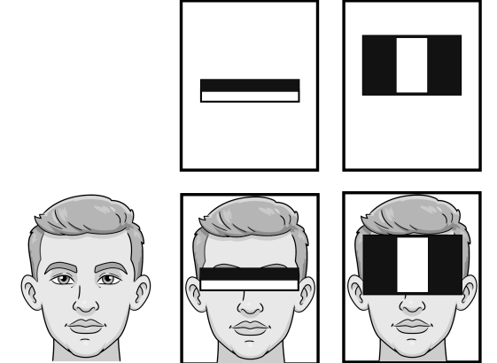
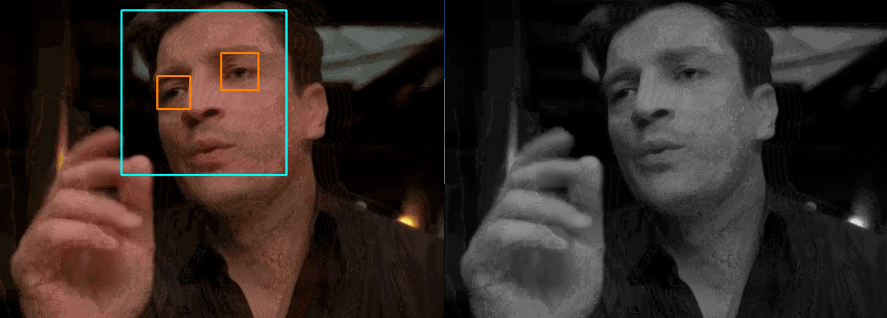

.. include:: /index.rst
   :start-after: start_hello_message
   :end-before: end_hello_message

8. Rilevamento di Volti e Occhi
===============================

In questo capitolo, utilizzeremo Picamera2 del Raspberry Pi per acquisire video e applicheremo i classificatori di feature Haar di OpenCV per il **rilevamento in tempo reale di volti e occhi**.
Questo approccio e’ leggero e altamente pratico, ideale per principianti che lavorano su un Raspberry Pi.

.. raw:: html

      <video width="400" loop muted controls>
          <source src="../_static/video/Opencv_8.mp4" type="video/mp4">
          Your browser does not support the video tag.
      </video>

1. Feature Haar e Principi di Rilevamento
-----------------------------------------

1. Essenza delle Feature Haar

Le feature Haar sono un metodo classico per il rilevamento di oggetti. Codificano **pattern di differenze di luminosita'** all'interno delle regioni dell'immagine per determinare se una regione contiene probabilmente un volto, occhi e cosi' via.

Esempi tipici di feature Haar:

- Le regioni degli occhi sono solitamente piu' scure della fronte sopra
- La luminosita' e' simmetrica su entrambi i lati del ponte nasale
- L'area sotto la bocca mostra spesso un pattern di bordo chiaro

OpenCV richiede classificatori Haar pre-addestrati (file ``.xml``). Sono gia' inclusi nella directory degli esempi: basta caricarli e usarli.

2. Pipeline di Rilevamento

   1. Caricare il modello Haar addestrato usando ``CascadeClassifier``
   2. Convertire il video in tempo reale in scala di grigi (per migliorare l'efficienza)
   3. Usare ``detectMultiScale`` per rilevare le regioni di volti/occhi
   4. Disegnare rettangoli attorno ai bersagli rilevati

2. Eseguire il Codice
---------------------

.. important::

   Prima di iniziare, assicurati:

   * Il pan-tilt sia assemblato
   * Di poter accedere al desktop di Raspberry Pi
   * Il pacchetto di codice sia installato
   * Fusion HAT+ sia installato e configurato
   * OpenCV sia installato

   Per istruzioni dettagliate, consulta :ref:`opencv_install`.

#. Apri il terminale e inserisci il seguente comando:

   .. code-block:: bash

      cd ~/ai-lab-kit/opencv_python
      python3 cv_8_haarcascade.py

   .. tip::

      Forniamo anche ``cv_8_haarcascade_video.py`` per rilevare volti e occhi da un file video.

#. Quando esegui il programma, apparir'a una finestra chiamata **Raspberry Pi Camera - Face Detection** che mostrer'a l'immagine in diretta dalla fotocamera Raspberry Pi.

   I volti rilevati nel flusso video vengono evidenziati con **rettangoli gialli**, e ogni volto rilevato viene etichettato (Face 1, Face 2, ...).
   All'interno di ogni regione facciale rilevata, il programma rileva anche gli occhi e li contrassegna con **rettangoli arancioni**.

   Il rilevamento funziona in tempo reale e i rettangoli si sposteranno mentre la persona si muove davanti alla fotocamera.

   Per fermare il programma:

   * Premi il tasto **q** sulla tastiera
   * Oppure chiudi la finestra usando il pulsante di chiusura (X)

   Dopo l'uscita, la fotocamera si fermer'a e tutte le finestre OpenCV verranno chiuse.

3. Codice Completo
------------------

.. code-block:: python

   # Face and eye detection using Raspberry Pi Camera (Picamera2 + OpenCV Haar Cascades)
   import cv2
   from picamera2 import Picamera2
   from pathlib import Path

   # -----------------------------
   # Load Haar cascade classifiers
   # -----------------------------
   BASE_DIR = Path(__file__).resolve().parent

   face_cascade = cv2.CascadeClassifier(str(BASE_DIR / "haarcascade_frontalface_default.xml"))
   eye_cascade  = cv2.CascadeClassifier(str(BASE_DIR / "haarcascade_eye.xml"))

   # Check if cascade files are loaded correctly
   if face_cascade.empty():
      raise FileNotFoundError("Failed to load haarcascade_frontalface_default.xml")
   if eye_cascade.empty():
      raise FileNotFoundError("Failed to load haarcascade_eye.xml")

   # -----------------------------
   # Initialize Picamera2
   # -----------------------------
   picam2 = Picamera2()

   # Video configuration (resolution can be adjusted)
   config = picam2.create_video_configuration(main={"size": (640, 480)})
   picam2.configure(config)
   picam2.start()

   WIN = "Raspberry Pi Camera - Face Detection"
   print("Camera started. Press 'q' to quit.")

   try:
      while True:
         # Capture a frame (Picamera2 typically provides RGB)
         frame_rgb = picam2.capture_array()

         # Convert RGB -> Grayscale directly (faster than RGB->BGR->GRAY)
         gray = cv2.cvtColor(frame_rgb, cv2.COLOR_RGB2GRAY)

         # Improve contrast to make detection more stable under different lighting
         gray = cv2.equalizeHist(gray)

         # Detect faces
         faces = face_cascade.detectMultiScale(
               gray,
               scaleFactor=1.2,
               minNeighbors=5,
               minSize=(60, 60)
         )

         # Convert RGB -> BGR only for display and drawing (OpenCV imshow expects BGR)
         frame_bgr = cv2.cvtColor(frame_rgb, cv2.COLOR_RGB2BGR)

         # Draw face and eye results
         for i, (x, y, w, h) in enumerate(faces, start=1):
               # Draw face rectangle + label
               cv2.rectangle(frame_bgr, (x, y), (x + w, y + h), (255, 255, 0), 2)
               cv2.putText(frame_bgr, f"Face {i}", (x, max(0, y - 10)),
                           cv2.FONT_HERSHEY_SIMPLEX, 0.5, (255, 255, 0), 2)

               # ROI for eye detection (search eyes only inside the detected face area)
               roi_gray = gray[y:y + h, x:x + w]
               roi_color = frame_bgr[y:y + h, x:x + w]

               eyes = eye_cascade.detectMultiScale(
                  roi_gray,
                  scaleFactor=1.2,
                  minNeighbors=8,
                  minSize=(20, 20)
               )

               # Draw up to 2 eyes (typical for a face)
               for (ex, ey, ew, eh) in eyes[:2]:
                  cv2.rectangle(roi_color, (ex, ey), (ex + ew, ey + eh), (0, 127, 255), 2)

         # Show the frame
         cv2.imshow(WIN, frame_bgr)

         # Handle keyboard input
         key = cv2.waitKey(1) & 0xFF
         if key == ord("q"):
               break

         # Exit if the user closes the window (click X)
         if cv2.getWindowProperty(WIN, cv2.WND_PROP_VISIBLE) < 1:
               break

   finally:
      picam2.stop()
      cv2.destroyAllWindows()
      print("Camera stopped.")

4. Spiegazione del Codice
-------------------------

#. Importare le librerie necessarie:

   .. code-block:: python

      import cv2
      from picamera2 import Picamera2
      from pathlib import Path

   OpenCV e' utilizzato per il rilevamento e il disegno, Picamera2 e' utilizzato per acquisire i frame dalla fotocamera Raspberry Pi.

#. Ottenere la directory dello script corrente:

   .. code-block:: python

      BASE_DIR = Path(__file__).resolve().parent

   Questo permette di caricare i file XML delle cascade dalla stessa cartella dello script Python.

#. Caricare i classificatori Haar cascade (volto e occhi):

   .. code-block:: python

      face_cascade = cv2.CascadeClassifier(str(BASE_DIR / "haarcascade_frontalface_default.xml"))
      eye_cascade  = cv2.CascadeClassifier(str(BASE_DIR / "haarcascade_eye.xml"))

   Le Haar cascade sono modelli pre-addestrati che possono rilevare volti e occhi.

#. Verificare che i file cascade siano caricati correttamente:

   .. code-block:: python

      if face_cascade.empty():
          raise FileNotFoundError("Failed to load haarcascade_frontalface_default.xml")
      if eye_cascade.empty():
          raise FileNotFoundError("Failed to load haarcascade_eye.xml")

   Se il percorso del file e' sbagliato o il file manca, ``CascadeClassifier`` sara' vuoto.
   Questi controlli aiutano a trovare il problema in anticipo.

#. Initialize the camera and set the resolution:

   .. code-block:: python

      picam2 = Picamera2()
      config = picam2.create_video_configuration(main={"size": (640, 480)})
      picam2.configure(config)
      picam2.start()

   Questo avvia la fotocamera in modalita' video a 640×480.

#. Acquisire frame continuamente:

   .. code-block:: python

      frame_rgb = picam2.capture_array()

   Ogni ciclo acquisisce un frame. Picamera2 restituisce tipicamente frame in formato RGB.

#. Convertire in scala di grigi (piu' veloce per il rilevamento):

   .. code-block:: python

      gray = cv2.cvtColor(frame_rgb, cv2.COLOR_RGB2GRAY)

   Il rilevamento di volti/occhi funziona su immagini in scala di grigi ed e' piu' veloce rispetto all'uso di immagini a colori.

#. Migliorare il contrasto per un rilevamento piu' stabile:

   .. code-block:: python

      gray = cv2.equalizeHist(gray)

   L'equalizzazione dell'istogramma puo' migliorare i risultati di rilevamento in diverse condizioni di illuminazione.

#. Rilevare i volti nel frame:

   .. code-block:: python

      faces = face_cascade.detectMultiScale(
          gray,
          scaleFactor=1.2,
          minNeighbors=5,
          minSize=(60, 60)
      )

   Questo restituisce un elenco di rettangoli ``(x, y, w, h)`` per tutti i volti rilevati.

   - ``scaleFactor`` controlla il passo di scala dell'immagine (piu' piccolo puo' essere piu' accurato ma piu' lento).
   - ``minNeighbors`` riduce i falsi positivi (piu' alto = piu' severo).
   - ``minSize`` ignora rilevamenti molto piccoli.

#. Convert RGB to BGR for drawing and display:

   .. code-block:: python

      frame_bgr = cv2.cvtColor(frame_rgb, cv2.COLOR_RGB2BGR)

   Le funzioni di disegno di OpenCV e ``imshow`` si aspettano BGR per le immagini a colori.

#. Disegnare rettangoli dei volti ed etichette:

   .. code-block:: python

      cv2.rectangle(frame_bgr, (x, y), (x + w, y + h), (255, 255, 0), 2)
      cv2.putText(frame_bgr, f"Face {i}", (x, max(0, y - 10)),
                  cv2.FONT_HERSHEY_SIMPLEX, 0.5, (255, 255, 0), 2)

   Questo disegna un riquadro attorno a ogni volto rilevato e aggiunge un'etichetta come “Face 1”.

#. Rilevare gli occhi all'interno di ogni volto (ROI):

   .. code-block:: python

      roi_gray = gray[y:y + h, x:x + w]
      roi_color = frame_bgr[y:y + h, x:x + w]

      eyes = eye_cascade.detectMultiScale(
          roi_gray,
          scaleFactor=1.2,
          minNeighbors=8,
          minSize=(20, 20)
      )

   ROI significa “Region of Interest”. Rilevare gli occhi solo all'interno dell'area del volto e' piu' veloce e riduce i falsi rilevamenti.

#. Draw up to two eyes:

   .. code-block:: python

      for (ex, ey, ew, eh) in eyes[:2]:
          cv2.rectangle(roi_color, (ex, ey), (ex + ew, ey + eh), (0, 127, 255), 2)

   Questo disegna rettangoli attorno ai primi due occhi rilevati.

#. Mostrare il risultato e gestire l'uscita:

   .. code-block:: python

      cv2.imshow(WIN, frame_bgr)

      key = cv2.waitKey(1) & 0xFF
      if key == ord("q"):
          break

      if cv2.getWindowProperty(WIN, cv2.WND_PROP_VISIBLE) < 1:
          break

   Premi ``q`` per uscire o chiudi la finestra per uscire in modo sicuro.

#. Pulizia (viene sempre eseguita):

   .. code-block:: python

      picam2.stop()
      cv2.destroyAllWindows()

   La fotocamera viene fermata e tutte le finestre OpenCV vengono chiuse anche se si verifica un errore.

5. Pro e Contro del Rilevamento Haar
-------------------------------------

.. list-table::
   :header-rows: 1
   :widths: 30 35 35

   * - Aspetto
     - Vantaggi
     - Svantaggi
   * - Velocita’
     - Molto veloce; adatto per Raspberry Pi
     - -
   * - Precisione
     - Funziona bene per volti frontali
     - Sensibile a rotazione e viste di profilo
   * - Illuminazione
     - Buona con illuminazione uniforme
     - Le prestazioni calano se troppo chiaro/scuro
   * - Modello
     - Dimensioni ridotte; facile da distribuire
     - Meno accurato dei metodi di deep learning

Poiche’ e’ leggero e veloce, le feature Haar sono ancora molto pratiche su dispositivi embedded.

6. Miglioramenti Comuni
-----------------------

1. **Pre-elaborazione dell'Illuminazione**: Applica l'equalizzazione dell'istogramma o CLAHE prima del rilevamento per migliorare le prestazioni in condizioni di scarsa luce.
2. **Rilevamento Multi-Angolo**: Carica sia i classificatori frontali che di profilo per rilevare piu' pose.
3. **Piu' Caratteristiche Facciali**: Aggiungi classificatori Haar per occhi/bocca/naso per arricchire il rilevamento.
4. **Usa DNN Invece di Haar**: OpenCV DNN + ResNet/MobileNet possono fornire una precisione maggiore (ma richiedono piu' potenza di calcolo).

7. Esercizi Avanzati
---------------------

- Usa ``cv2.equalizeHist`` sull'immagine in scala di grigi per migliorare il rilevamento in condizioni di scarsa luce.
- Aggiungi classificatori Haar per bocca o naso per rilevare piu' caratteristiche facciali.
- Registra il processo di rilevamento con ``cv2.VideoWriter``.
- Combina con l'output GPIO per creare un progetto Raspberry Pi: “accendi un LED quando viene rilevato un volto.”
