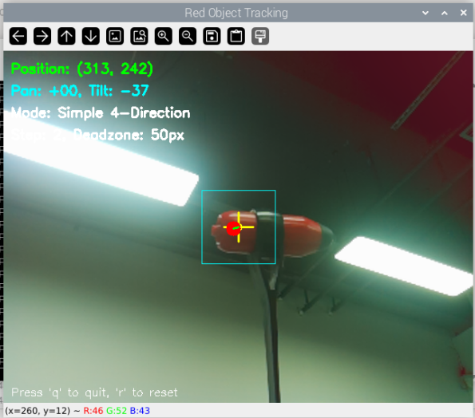

.. include:: /index.rst
   :start-after: start_hello_message
   :end-before: end_hello_message

9. Red Object Tracking with Pan-Tilt Camera
=============================================

Object tracking combined with mechanical control forms the foundation of many robotics and computer vision applications.  
In this chapter, we will create a system that **detects red objects in real-time and controls pan-tilt servos** to keep the object centered in the camera view.

.. raw:: html

      <video width="400" loop muted controls>
          <source src="../_static/video/Opencv_9.mp4" type="video/mp4">
          Your browser does not support the video tag.
      </video>

This extends basic color detection into an active tracking system that can follow moving objects autonomously.

1. Objective and Approach
-------------------------

- Use **Picamera2** to capture real-time video frames
- Detect red objects using **HSV color space** and morphological filtering
- Implement **simple 4-direction tracking** algorithm based on object position
- Control **pan and tilt servos** to keep the object centered
- Display **real-time debugging information** and tracking status
- Provide **adjustable parameters** for fine-tuning tracking behavior

2. Run the Code
--------------------

.. important::

   Before you start, make sure:

   * The pan-tilt is assembled
   * You can access the Raspberry Pi desktop
   * The code package is installed
   * Fusion HAT+ is installed and configured
   * OpenCV is installed

   For detailed instructions, see :ref:`opencv_install`.

#. Open the terminal and enter the following command:

   .. code-block:: bash

        cd ~/ai-lab-kit/opencv_python
        python3 cv_9_track_color.py

3. Execution Result
---------------------------------

When running successfully, you should see:

**1. OpenCV Window:**

- "Red Object Tracking": Shows the camera feed with tracking overlay

**2. Visual elements in the tracking window:**

- Yellow crosshair at frame center
- Blue rectangle showing the deadzone (no-movement zone)
- Red circle marking the detected object center
- Green line connecting object to frame center
- Real-time information overlay:

  - Object position coordinates
  - Current servo angles
  - Tracking mode (Simple 4-Direction)
  - Movement step and deadzone settings

**3. Console output:**

- FPS (frames per second)
- Current servo positions
- Object detection status
- Movement step adjustments

**4. Servo behavior:**

- Servos will move in fixed steps to keep red objects centered
- No movement when object is within the deadzone
- Servos return to center position when 'r' key is pressed

**Controls:**

- Press **'q'** to quit the program
- Press **'r'** to reset servos to center position
- Press **'+'** to increase movement speed
- Press **'-'** to decrease movement speed

4. Complete Code
-------------------------------

Below is the complete Python program for red object tracking:

.. code-block:: python

   #!/usr/bin/env python3
   """
   Red Object Tracking with Pan-Tilt Camera
   """
   
   import cv2
   import numpy as np
   import time
   from fusion_hat.servo import Servo
   from picamera2 import Picamera2
   
   # ========== SERVO SETTINGS ==========
   # Servo channels
   PAN_CHANNEL = 2    # Horizontal servo
   TILT_CHANNEL = 3   # Vertical servo
   
   # Servo angle limits (adjust according to your hardware)
   PAN_MIN = -90      # Maximum left rotation
   PAN_MAX = 90       # Maximum right rotation
   TILT_MIN = -45     # Maximum down rotation
   TILT_MAX = 45      # Maximum up rotation
   
   # Initial position (center)
   PAN_CENTER = 0
   TILT_CENTER = 0
   
   # ========== CAMERA SETTINGS ==========
   FRAME_WIDTH = 640
   FRAME_HEIGHT = 480
   CENTER_X = FRAME_WIDTH // 2
   CENTER_Y = FRAME_HEIGHT // 2
   
   # ========== COLOR DETECTION SETTINGS ==========
   # Red color range in HSV (two ranges for red)
   LOWER_RED1 = np.array([0, 100, 80])     # Lower range for red
   UPPER_RED1 = np.array([10, 255, 255])   # Upper range for red
   LOWER_RED2 = np.array([170, 100, 80])   # Lower range for red (wrap-around)
   UPPER_RED2 = np.array([180, 255, 255])  # Upper range for red (wrap-around)
   
   # Morphology kernel for noise removal
   KERNEL = cv2.getStructuringElement(cv2.MORPH_ELLIPSE, (5, 5))
   
   # Minimum contour area to consider (adjust based on object size)
   MIN_CONTOUR_AREA = 500
   
   # ========== TRACKING SETTINGS ==========
   # Deadzone around center (pixels) - no movement inside this zone
   DEADZONE_X = 50    # Horizontal deadzone
   DEADZONE_Y = 50    # Vertical deadzone
   
   # Movement step size in degrees (how much to move each frame)
   MOVE_STEP = 2      # Degrees to move per adjustment
   
   # ========== INITIALIZE HARDWARE ==========
   print("Initializing Red Object Tracking System...")
   
   # Initialize servos
   print("Setting up servos...")
   pan_servo = Servo(PAN_CHANNEL)
   tilt_servo = Servo(TILT_CHANNEL)
   
   # Center the servos initially
   print("Centering servos...")
   pan_servo.angle(PAN_CENTER)
   tilt_servo.angle(TILT_CENTER)
   time.sleep(1)  # Wait for servos to move to center
   
   # Current servo positions
   current_pan = PAN_CENTER
   current_tilt = TILT_CENTER
   
   # Initialize camera
   print("Setting up camera...")
   picam2 = Picamera2()
   
   # Configure camera for OpenCV
   config = picam2.create_preview_configuration(
       main={"size": (FRAME_WIDTH, FRAME_HEIGHT), "format": "XRGB8888"}
   )
   picam2.configure(config)
   picam2.start()
   
   print("Camera started. Looking for red objects...")
   print("Press 'q' to quit the program")
   print("-" * 50)
   
   def simple_tracking(x, y):
       """
       Simple 4-direction tracking algorithm
       Args:
           x: Object x-coordinate (None if not found)
           y: Object y-coordinate (None if not found)
       Returns:
           pan_move, tilt_move: Degrees to move each servo (+/-)
       """
       # If no object detected, don't move
       if x is None or y is None:
           return 0, 0
       
       pan_move = 0
       tilt_move = 0
       
       # Check if object is left of center (outside deadzone)
       if x < CENTER_X - DEADZONE_X:
           # Object is left, move camera right (positive pan)
           pan_move = MOVE_STEP
       # Check if object is right of center (outside deadzone)
       elif x > CENTER_X + DEADZONE_X:
           # Object is right, move camera left (negative pan)
           pan_move = -MOVE_STEP
       
       # Check if object is above center (outside deadzone)
       if y < CENTER_Y - DEADZONE_Y:
           # Object is up, move camera down (negative tilt)
           tilt_move = -MOVE_STEP
       # Check if object is below center (outside deadzone)
       elif y > CENTER_Y + DEADZONE_Y:
           # Object is down, move camera up (positive tilt)
           tilt_move = MOVE_STEP
       
       return pan_move, tilt_move
   
   def update_servo_position(pan_move, tilt_move):
       """
       Update servo positions with limits checking
       Args:
           pan_move: Degrees to move pan servo (+/-)
           tilt_move: Degrees to move tilt servo (+/-)
       Returns:
           current_pan, current_tilt: New servo positions
       """
       global current_pan, current_tilt
       
       # Calculate new positions
       new_pan = current_pan + pan_move
       new_tilt = current_tilt + tilt_move
       
       # Apply angle limits to prevent hardware damage
       new_pan = max(min(new_pan, PAN_MAX), PAN_MIN)
       new_tilt = max(min(new_tilt, TILT_MAX), TILT_MIN)
       
       # Move servos only if position changed
       if new_pan != current_pan:
           pan_servo.angle(new_pan)
           current_pan = new_pan
       
       if new_tilt != current_tilt:
           tilt_servo.angle(new_tilt)
           current_tilt = new_tilt
       
       return current_pan, current_tilt
   
   def find_red_object(frame):
       """
       Detect red object in frame using HSV color space
       Args:
           frame: Input BGR image frame
       Returns:
           center_x, center_y: Coordinates of largest red object, or (None, None)
           mask: Binary mask showing detected red areas
       """
       # Convert BGR to HSV color space (better for color detection)
       hsv = cv2.cvtColor(frame, cv2.COLOR_BGR2HSV)
       
       # Create masks for red color (red wraps around 0 in HSV)
       mask1 = cv2.inRange(hsv, LOWER_RED1, UPPER_RED1)   # Lower red range
       mask2 = cv2.inRange(hsv, LOWER_RED2, UPPER_RED2)   # Upper red range
       mask = cv2.bitwise_or(mask1, mask2)                # Combine both ranges
       
       # Apply morphological operations to clean up noise
       mask = cv2.morphologyEx(mask, cv2.MORPH_OPEN, KERNEL, iterations=1)
       mask = cv2.morphologyEx(mask, cv2.MORPH_CLOSE, KERNEL, iterations=2)
       
       # Find contours in the mask
       contours, _ = cv2.findContours(mask, cv2.RETR_EXTERNAL, cv2.CHAIN_APPROX_SIMPLE)
       
       # Return if no contours found
       if not contours:
           return None, None, mask
       
       # Find the largest contour (assume it's our target)
       largest_contour = max(contours, key=cv2.contourArea)
       area = cv2.contourArea(largest_contour)
       
       # Filter by minimum area to ignore small noise
       if area < MIN_CONTOUR_AREA:
           return None, None, mask
       
       # Calculate center of the contour using image moments
       M = cv2.moments(largest_contour)
       if M["m00"] == 0:  # Prevent division by zero
           return None, None, mask
       
       center_x = int(M["m10"] / M["m00"])
       center_y = int(M["m01"] / M["m00"])
       
       return center_x, center_y, mask
   
   def draw_debug_info(frame, object_x, object_y, mask, pan_angle, tilt_angle):
       """
       Draw debugging information on the frame for visualization
       Args:
           frame: Frame to draw on
           object_x, object_y: Object coordinates
           mask: Detection mask
           pan_angle, tilt_angle: Current servo angles
       Returns:
           frame: Frame with debug drawings
       """
       # Draw center crosshair
       cv2.line(frame, (CENTER_X - 20, CENTER_Y), (CENTER_X + 20, CENTER_Y), (0, 255, 255), 2)
       cv2.line(frame, (CENTER_X, CENTER_Y - 20), (CENTER_X, CENTER_Y + 20), (0, 255, 255), 2)
       cv2.circle(frame, (CENTER_X, CENTER_Y), 5, (0, 255, 255), -1)
       
       # Draw deadzone rectangle
       cv2.rectangle(frame, 
                    (CENTER_X - DEADZONE_X, CENTER_Y - DEADZONE_Y),
                    (CENTER_X + DEADZONE_X, CENTER_Y + DEADZONE_Y),
                    (255, 255, 0), 1)
       
       # Draw object center if detected
       if object_x is not None and object_y is not None:
           cv2.circle(frame, (object_x, object_y), 10, (0, 0, 255), -1)
           cv2.line(frame, (CENTER_X, CENTER_Y), (object_x, object_y), (0, 255, 0), 2)
           
           # Display position information
           pos_text = f"Position: ({object_x}, {object_y})"
           cv2.putText(frame, pos_text, (10, 30), 
                      cv2.FONT_HERSHEY_SIMPLEX, 0.6, (0, 255, 0), 2)
       
       # Display servo angles
       angle_text = f"Pan: {pan_angle:+03.0f}, Tilt: {tilt_angle:+03.0f}"
       cv2.putText(frame, angle_text, (10, 60), 
                  cv2.FONT_HERSHEY_SIMPLEX, 0.6, (255, 255, 0), 2)
       
       # Display tracking mode
       cv2.putText(frame, "Mode: Simple 4-Direction", (10, 90), 
                  cv2.FONT_HERSHEY_SIMPLEX, 0.6, (255, 255, 255), 2)
       
       # Display movement step
       step_text = f"Step: {MOVE_STEP}, Deadzone: {DEADZONE_X}px"
       cv2.putText(frame, step_text, (10, 120), 
                  cv2.FONT_HERSHEY_SIMPLEX, 0.6, (255, 255, 255), 2)
       
       # Draw quit instruction
       cv2.putText(frame, "Press 'q' to quit, 'r' to reset", (10, FRAME_HEIGHT - 10), 
                  cv2.FONT_HERSHEY_SIMPLEX, 0.5, (255, 255, 255), 1)
       
       return frame
   
   def cleanup():
       """
       Clean up resources before exiting
       """
       print("\nCleaning up...")
       
       # Center servos before stopping
       print("Centering servos...")
       pan_servo.angle(PAN_CENTER)
       tilt_servo.angle(TILT_CENTER)
       time.sleep(0.5)
       
       # Stop camera
       print("Stopping camera...")
       picam2.stop()
       
       # Close OpenCV windows
       cv2.destroyAllWindows()
       print("System shutdown complete.")
   
   # ========== MAIN LOOP ==========
   def main():
       """
       Main tracking loop
       """
       frame_count = 0
       start_time = time.time()
       global MOVE_STEP
       global current_pan, current_tilt
       try:
           while True:
               # Capture frame from camera
               frame_bgra = picam2.capture_array()
               frame_bgr = cv2.cvtColor(frame_bgra, cv2.COLOR_BGRA2BGR)
               
               # Find red object in frame
               obj_x, obj_y, mask = find_red_object(frame_bgr)
               
               # Use simple tracking algorithm to determine movement
               pan_move, tilt_move = simple_tracking(obj_x, obj_y)
               
               # Update servo positions
               pan_angle, tilt_angle = update_servo_position(pan_move, tilt_move)
               
               # Draw debugging information
               frame_display = draw_debug_info(frame_bgr, obj_x, obj_y, mask, pan_angle, tilt_angle)
               
               # Display frames
               cv2.imshow("Red Object Tracking", frame_display)
               
               # Calculate and display FPS every 30 frames
               frame_count += 1
               if frame_count % 30 == 0:
                   elapsed_time = time.time() - start_time
                   fps = frame_count / elapsed_time
                   print(f"FPS: {fps:.1f} | Pan: {pan_angle:+03.0f}° | Tilt: {tilt_angle:+03.0f}° | "
                         f"Object: {'Found' if obj_x else 'Not found'}")
               
               # Check for user input
               key = cv2.waitKey(1) & 0xFF
               if key == ord('q'):
                   print("\nQuit command received.")
                   break
               elif key == ord('r'):
                   # Reset to center position
                   print("Resetting to center...")
                   pan_servo.angle(PAN_CENTER)
                   tilt_servo.angle(TILT_CENTER)
                   current_pan = PAN_CENTER
                   current_tilt = TILT_CENTER
                   time.sleep(0.5)
               elif key == ord('+'):
                   # Increase movement speed
                   MOVE_STEP = min(MOVE_STEP + 0.5, 5)
                   print(f"Movement step increased to {MOVE_STEP}°")
               elif key == ord('-'):
                   # Decrease movement speed
                   MOVE_STEP = max(MOVE_STEP - 0.5, 0.5)
                   print(f"Movement step decreased to {MOVE_STEP}°")
       
       except KeyboardInterrupt:
           print("\nProgram interrupted.")
       
       finally:
           cleanup()
   
   # ========== PROGRAM START ==========
   if __name__ == "__main__":
       print("=" * 60)
       print("RED OBJECT TRACKING WITH PAN-TILT CAMERA")
       print("=" * 60)
       print("System will:")
       print("1. Detect red objects using OpenCV")
       print("2. Move servos in 4 directions to keep object centered")
       print("3. Display tracking information")
       print("\nControls:")
       print("  Press 'q' to quit")
       print("  Press 'r' to reset servos to center")
       print("  Press '+' to increase movement speed")
       print("  Press '-' to decrease movement speed")
       print("\nTracking Logic:")
       print(f"  Deadzone: {DEADZONE_X}px around center (no movement)")
       print(f"  Movement: {MOVE_STEP}° per adjustment")
       print("  Left object → Move right (+pan)")
       print("  Right object → Move left (-pan)")
       print("  Up object → Move down (-tilt)")
       print("  Down object → Move up (+tilt)")
       print("=" * 60)
       
       main()

5. Code Explanation
----------------------------------

#. ``simple_tracking(x, y)``

   This function decides how the servos should move based on the detected object position.

   - If no object is detected (``x`` or ``y`` is ``None``), it returns ``(0, 0)`` (no movement).
   - If the object is outside the deadzone, it returns a small movement step:

     - Object left  → ``pan_move = +MOVE_STEP``
     - Object right → ``pan_move = -MOVE_STEP``
     - Object up    → ``tilt_move = -MOVE_STEP``
     - Object down  → ``tilt_move = +MOVE_STEP``

   The deadzone prevents the camera from shaking when the object is already near the center.

#. ``update_servo_position(pan_move, tilt_move)``

   This function updates the pan/tilt servo angles safely.

   - Adds the movement step to the current servo angles.
   - Clamps the angles to safe limits (``PAN_MIN/PAN_MAX`` and ``TILT_MIN/TILT_MAX``).
   - Sends servo commands only when the angle actually changes.

   This protects the hardware from over-rotation.

#. ``find_red_object(frame)``

   This function detects the largest red object in the camera frame.

   Main steps:

   - Converts the frame from BGR to HSV.
   - Creates a binary mask for red pixels using two HSV ranges.
   - Cleans the mask using morphology (OPEN + CLOSE).
   - Finds contours and selects the largest one.
   - Filters out small blobs using ``MIN_CONTOUR_AREA``.
   - Uses image moments to compute the object center.

   It returns:

   - ``center_x, center_y``: the object center position (or ``None, None``)
   - ``mask``: the binary mask showing red areas

#. ``draw_debug_info(frame, object_x, object_y, mask, pan_angle, tilt_angle)``

   This function draws helpful tracking information on the video frame, including:

   - Center crosshair
   - Deadzone rectangle
   - Detected object position
   - Servo angles (pan and tilt)
   - Tracking mode and step size
   - Key instructions

   This makes it easy to see how the tracker is working.

#. ``cleanup()``

   This function safely shuts down the system before exiting.

   - Moves servos back to the center position.
   - Stops the camera.
   - Closes all OpenCV windows.

   This prevents the camera from being left in a strange position.

#. ``main()``

   This is the main tracking loop.

   Each iteration does:

   - Capture a camera frame.
   - Detect the red object.
   - Decide how to move the servos.
   - Update servo angles.
   - Draw debug information.
   - Display the result window.

   It also supports runtime controls:

   - ``q`` to quit
   - ``r`` to reset servos
   - ``+`` / ``-`` to adjust tracking speed

   The program always calls ``cleanup()`` in the ``finally`` block to ensure safe shutdown.

6. Key Parameters and Tuning
----------------------------

#. Color Detection Parameters

   .. code-block:: python
   
      # HSV thresholds for red detection
      LOWER_RED1 = np.array([0, 100, 80])     # [Hue, Saturation, Value]
      UPPER_RED1 = np.array([10, 255, 255])
      LOWER_RED2 = np.array([170, 100, 80])
      UPPER_RED2 = np.array([180, 255, 255])
   
      # Minimum object size
      MIN_CONTOUR_AREA = 500
   
   Tuning tips:
   
   - Adjust Hue values for different colors
   - Increase Saturation/Value minimums in bright environments
   - Adjust ``MIN_CONTOUR_AREA`` based on expected object size

#. Tracking Parameters

   .. code-block:: python
   
      # Deadzone size (pixels)
      DEADZONE_X = 50    # Larger = less jitter, but less precision
      DEADZONE_Y = 50
   
      # Movement step size (degrees)
      MOVE_STEP = 2      # Larger = faster tracking, but may overshoot
   
   Tuning tips:
   
   - Start with larger deadzone (50-100px) for stable operation
   - Adjust MOVE_STEP based on tracking requirements (0.5-5°)
   - Use '+' and '-' keys to adjust speed during runtime

#. Servo Parameters

   .. code-block:: python
   
      # Servo limits (calibrate for your hardware)
      PAN_MIN = -90   # Maximum left
      PAN_MAX = 90    # Maximum right
      TILT_MIN = -45  # Maximum down
      TILT_MAX = 45   # Maximum up
   
   .. note:: Calibrate these values for your specific hardware to prevent damage.

7. Common Issues and Troubleshooting
------------------------------------

* Servo Not Moving

  - **Cause**: Object within deadzone or MIN_CONTOUR_AREA too high
  - **Solution**: Check object position, reduce MIN_CONTOUR_AREA, or decrease deadzone

* Servo Movement Too Slow

  - **Cause**: MOVE_STEP too small
  - **Solution**: Press '+' key to increase movement speed

* Servo Movement Too Jerky

  - **Cause**: MOVE_STEP too large
  - **Solution**: Press '-' key to decrease movement speed

* False Object Detection

  - **Cause**: HSV thresholds too broad or lighting issues
  - **Solution**: Adjust HSV ranges, improve lighting, increase MIN_CONTOUR_AREA

* Low FPS (Below 10 FPS)

  - **Cause**: Processing overload or camera settings
  - **Solution**: Reduce frame resolution, simplify debug drawing

8. Extensions and Advanced Features
------------------------------------

#. Multiple Object Tracking

   .. code-block:: python
   
      # Instead of taking the largest contour:
      for contour in contours:
          if cv2.contourArea(contour) > MIN_CONTOUR_AREA:
              # Track multiple objects

#. Return to Proportional Control

   .. code-block:: python
   
      # Re-implement proportional control if desired
      KP_PAN = 0.3
      pan_move = -x_error * KP_PAN / CENTER_X

#. Object Size-Based Speed Adjustment

   .. code-block:: python
   
      # Adjust movement speed based on object size
      object_size = cv2.contourArea(largest_contour)
      if object_size > 1000:  # Large object
          adjusted_step = MOVE_STEP * 0.5  # Move slower
      else:  # Small object
          adjusted_step = MOVE_STEP * 1.5  # Move faster

#. Logging and Data Recording

   .. code-block:: python
   
      # Record tracking data for analysis
      with open('tracking_log.csv', 'a') as f:
          f.write(f"{time.time()},{obj_x},{obj_y},{pan_angle},{tilt_angle}\n")

#. Network Streaming

   .. code-block:: python
   
      # Stream video over network
      import socket
      # Add network streaming code

9. Learning Outcomes
---------------------

After completing this project, you should understand:

1. **Computer Vision**: Real-time color detection and object tracking
2. **Control Systems**: Simple 4-direction tracking algorithm implementation
3. **Hardware Integration**: Interfacing cameras and servos with Raspberry Pi
4. **Interactive Control**: Real-time parameter adjustment during operation
5. **System Design**: Simplified tracking system architecture

This project provides a foundation for more advanced applications like face tracking, autonomous navigation, and industrial automation systems. The simplified 4-direction approach makes it easier to understand and modify for different applications.