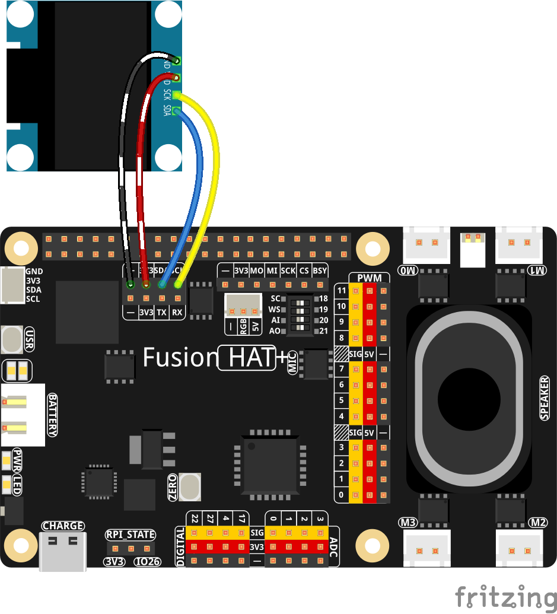

.. include:: /index.rst
   :start-after: start_hello_message
   :end-before: end_hello_message

.. _py_oled:

1.10 Ecran OLED
====================================

**Introduction**

Dans ce projet, nous allons apprendre a interfacer un ecran OLED base sur SSD1306 en utilisant la communication I2C sur un Raspberry Pi. Les ecrans OLED (diode electroluminescente organique) sont connus pour leur contraste eleve, leurs grands angles de vision et leur faible consommation d'energie. Ce projet montre comment initialiser l'ecran, dessiner des formes de base et afficher du texte.

----------------------------------------------

**Ce dont vous aurez besoin**

Pour realiser ce projet, vous aurez besoin des composants suivants :

.. list-table::
   :widths: 30 20
   :header-rows: 1

   *  - COMPOSANT
      - LIEN D'ACHAT

   *  - :ref:`cpn_oled`
      - \-
   *  - :ref:`cpn_wires`
      - |link_wires_buy|
   *  - :ref:`cpn_fusion_hat`
      - \-
   *  - Raspberry Pi
      \-

----------------------------------------------

**Schema de cablage**

Suivez ces etapes pour construire le circuit :

1. Connectez la broche VCC de l'ecran OLED au 3,3V du Fusion HAT+
2. Connectez la broche GND de l'ecran OLED au GND du Fusion HAT+
3. Connectez la broche SCL de l'ecran OLED a SCL (GPIO 3) du Fusion HAT+
4. Connectez la broche SDA de l'ecran OLED a SDA (GPIO 2) du Fusion HAT+

----------------------------------------------

**Etapes d'installation**

#. Installez la bibliotheque de pilotes SSD1306 :

   Cette bibliotheque permet la communication avec les ecrans OLED SSD1306 en utilisant Python.

   .. raw:: html

      <run></run>

   .. code-block:: shell

      sudo pip3 install adafruit-circuitpython-ssd1306 --break

#. Tous les exemples de programmes sont inclus dans le repertoire ``ai-lab-kit``. Executez l'exemple OLED comme suit :

   .. raw:: html

      <run></run>

   .. code-block:: shell

      cd ~/ai-lab-kit/python/
      sudo python3 1.10_OLED_Display.py

#. Lorsque l'exemple s'execute, l'ecran OLED affiche une boite encadree avec le texte **"Hello World!"** centre a l'interieur.

   Cela confirme que l'ecran communique avec succes via I2C et peut afficher du texte et des graphiques.

----------------------------------------------

**Code**

Le code Python suivant initialise un ecran OLED et dessine le texte "Hello World!" :

.. raw:: html

   <run></run>

.. code-block:: python

   import board
   import digitalio
   from PIL import Image, ImageDraw, ImageFont
   import adafruit_ssd1306

   # Initialize OLED display dimensions
   WIDTH = 128
   HEIGHT = 64

   # Set up I2C communication with the OLED display
   i2c = board.I2C()  # Utilizes board's SCL and SDA pins
   oled = adafruit_ssd1306.SSD1306_I2C(WIDTH, HEIGHT, i2c, addr=0x3C)

   # Clear the OLED display
   oled.fill(0)
   oled.show()

   # Create a new image with 1-bit color for drawing
   image = Image.new("1", (oled.width, oled.height))

   # Obtain a drawing object to manipulate the image
   draw = ImageDraw.Draw(image)

   # Draw a filled white rectangle as the background
   draw.rectangle((0, 0, oled.width, oled.height), outline=255, fill=255)

   # Define border size for an inner rectangle
   BORDER = 5
   # Draw a smaller black rectangle inside the larger one
   draw.rectangle(
      (BORDER, BORDER, oled.width - BORDER - 1, oled.height - BORDER - 1),
      outline=0,
      fill=0,
   )

   # Load the default font for text
   font = ImageFont.load_default()

   def getfontsize(font, text):
      # Calculate the size of the text in pixels
      left, top, right, bottom = font.getbbox(text)
      return right - left, bottom - top

   # Define the text to be displayed
   text = "Hello World!"
   # Get the width and height of the text in pixels
   (font_width, font_height) = getfontsize(font, text)
   # Draw the text, centered on the display
   draw.text(
      (oled.width // 2 - font_width // 2, oled.height // 2 - font_height // 2),
      text,
      font=font,
      fill=255,
   )

   # Send the image to the OLED display
   oled.image(image)
   oled.show()

Ce script Python cree un affichage "Hello World!" sur un ecran OLED SSD1306. Lors de l'execution :

1. Le script initialise la communication I2C avec l'ecran OLED.
2. Cree un tampon d'image noir et blanc pour le dessin.
3. Dessine un fond blanc avec un rectangle noir a bordure.
4. Calcule le positionnement du texte pour centrer "Hello World!" sur l'ecran.
5. Affiche l'image finale sur l'ecran OLED.
6. L'ecran affiche le texte jusqu'a ce qu'il soit mis hors tension ou mis a jour.

----------------------------------------------

**Comprendre le code**

1. **Importation de la bibliotheque**

   Le code importe les bibliotheques necessaires pour le controle de l'ecran et la manipulation d'images.

   .. code-block:: python

      import board
      import digitalio
      from PIL import Image, ImageDraw, ImageFont
      import adafruit_ssd1306

2. **Initialisation de l'ecran**

   L'ecran OLED est initialise avec les dimensions et l'adresse I2C specifiees.

   .. code-block:: python

      WIDTH = 128
      HEIGHT = 64
      i2c = board.I2C()
      oled = adafruit_ssd1306.SSD1306_I2C(WIDTH, HEIGHT, i2c, addr=0x3C)

3. **Effacement de l'ecran**

   L'ecran est efface en le remplissant de zeros (noir) et en le mettant a jour.

   .. code-block:: python

      oled.fill(0)
      oled.show()

4. **Creation du tampon d'image**

   Un tampon d'image couleur 1 bit est cree pour les operations de dessin.

   .. code-block:: python

      image = Image.new("1", (oled.width, oled.height))
      draw = ImageDraw.Draw(image)

5. **Operations de dessin**

   Des rectangles et du texte sont dessines sur le tampon d'image.

   .. code-block:: python

      # Background rectangle
      draw.rectangle((0, 0, oled.width, oled.height), outline=255, fill=255)
      # Inner bordered rectangle
      draw.rectangle((BORDER, BORDER, oled.width - BORDER - 1, oled.height - BORDER - 1), outline=0, fill=0)

6. **Rendu du texte**

   Le texte est centre sur l'ecran en utilisant les metriques de la police.

   .. code-block:: python

      font = ImageFont.load_default()
      (font_width, font_height) = getfontsize(font, text)
      draw.text((oled.width // 2 - font_width // 2, oled.height // 2 - font_height // 2), text, font=font, fill=255)

7. **Mise a jour de l'ecran**

   L'image finale est envoyee a l'ecran OLED.

   .. code-block:: python

      oled.image(image)
      oled.show()

----------------------------------------------

**Depannage**

1. **L'ecran n'affiche rien**

   - **Cause** : Adresse I2C incorrecte, problemes de cablage ou I2C non active.
   - **Solution** : Verifiez l'adresse I2C (essayez 0x3C ou 0x3D), verifiez toutes les connexions et activez I2C dans la configuration du Raspberry Pi (``sudo raspi-config``).

2. **Erreurs de communication I2C**

   - **Cause** : Problemes de bus I2C ou peripherique non detecte.
   - **Solution** : Verifiez si le peripherique est detecte avec la commande ``i2cdetect -y 1``. Assurez-vous qu'aucun autre peripherique n'est en conflit sur le bus I2C.

3. **Le texte ou les graphiques ne s'affichent pas correctement**

   - **Cause** : Valeurs de couleur incorrectes ou problemes de coordonnees.
   - **Solution** : Rappelez-vous que 0 = noir et 255 = blanc en mode couleur 1 bit. Verifiez que les coordonnees sont dans les limites de l'ecran (0-127 pour la largeur, 0-63 pour la hauteur).

4. **Erreurs d'importation de la bibliotheque**

   - **Cause** : Dependances manquantes ou installation incorrecte.
   - **Solution** : Assurez-vous que toutes les bibliotheques requises sont installees dans le bon environnement et essayez de les executer avec ``sudo`` si des problemes de permissions surviennent.

----------------------------------------------

**Idees d'extension**

1. **Affichage d'informations systeme**

   Creez un moniteur systeme en temps reel affichant l'utilisation du CPU, de la memoire et la temperature :

   .. code-block:: python

      import psutil
      import time

      while True:
          # Clear and redraw
          draw.rectangle((0, 0, oled.width, oled.height), fill=0)

          # Get system info
          cpu_percent = psutil.cpu_percent()
          memory = psutil.virtual_memory()
          temp = psutil.sensors_temperatures()['cpu_thermal'][0].current

          # Display info
          draw.text((0, 0), f"CPU: {cpu_percent}%", font=font, fill=255)
          draw.text((0, 16), f"RAM: {memory.percent}%", font=font, fill=255)
          draw.text((0, 32), f"Temp: {temp}C", font=font, fill=255)

          oled.image(image)
          oled.show()
          time.sleep(2)

2. **Texte defilant**

   Creez des effets de texte defilant pour des messages plus longs :

   .. code-block:: python

      text = "This is a scrolling text message!"
      text_width = getfontsize(font, text)[0]

      for x in range(oled.width, -text_width, -1):
          draw.rectangle((0, 0, oled.width, oled.height), fill=0)
          draw.text((x, oled.height//2), text, font=font, fill=255)
          oled.image(image)
          oled.show()
          time.sleep(0.05)

3. **Graphismes animes**

   Creez des animations simples en utilisant des formes de base :

   .. code-block:: python

      for i in range(0, oled.width-10, 5):
          draw.rectangle((0, 0, oled.width, oled.height), fill=0)
          draw.rectangle((i, 20, i+10, 30), fill=255)  # Moving rectangle
          oled.image(image)
          oled.show()
          time.sleep(0.1)

4. **Pages multiples**

   Creez un affichage multi-pages avec controle par bouton :

   .. code-block:: python

      pages = ["Page 1: Info", "Page 2: Stats", "Page 3: Graph"]
      current_page = 0

      # Use buttons to change pages
      def next_page():
          global current_page
          current_page = (current_page + 1) % len(pages)
          update_display()

5. **Polices personnalisees**

   Utilisez differentes polices pour un meilleur aspect visuel :

   .. code-block:: python

      # Load custom font (requires font file)
      try:
          custom_font = ImageFont.truetype("/usr/share/fonts/truetype/dejavu/DejaVuSans.ttf", 12)
      except:
          custom_font = ImageFont.load_default()

6. **Graphiques et diagrammes**

   Affichez de simples diagrammes a barres ou graphiques :

   .. code-block:: python

      data = [10, 25, 45, 30, 60, 15]
      for i, value in enumerate(data):
          x = i * 20 + 5
          height = int(value / 100 * oled.height)
          draw.rectangle((x, oled.height-height, x+15, oled.height), fill=255)

----------------------------------------------

**Conclusion**

Ce projet montre comment interfacer des ecrans OLED SSD1306 en utilisant la communication I2C sur un Raspberry Pi. Les ecrans OLED offrent une sortie visuelle nette et a contraste eleve, adaptee a diverses applications, notamment la surveillance systeme, les interfaces utilisateur et les affichages d'informations. En combinant texte, formes et graphiques, vous pouvez creer des affichages informatifs et visuellement attrayants pour vos projets. Les competences acquises ici peuvent etre etendues pour creer des interfaces utilisateur complexes, des visualisations de donnees et des systemes de surveillance en temps reel.
