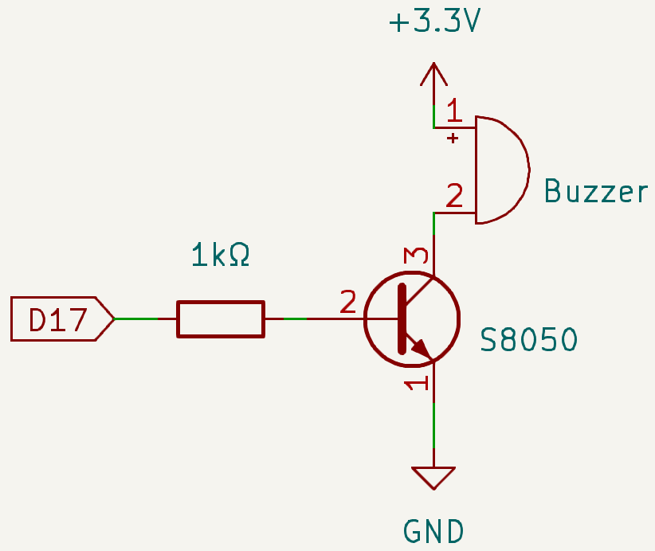

.. include:: /index.rst
   :start-after: start_hello_message
   :end-before: end_hello_message

.. _py_ac_buzzer:

1.3 Buzzer Actif
====================================

**Introduction**

Dans ce projet, nous allons apprendre a piloter un buzzer actif pour produire un son de bip en utilisant un transistor NPN. Les buzzers actifs sont des composants simples utilises dans de nombreux projets electroniques pour produire des signaux sonores.

----------------------------------------------

**Ce dont vous aurez besoin**

Pour realiser ce projet, vous aurez besoin des composants suivants :

.. list-table::
    :widths: 30 20
    :header-rows: 1

    *   - COMPOSANT
        - LIEN D'ACHAT

    *   - :ref:`cpn_wires`
        - |link_wires_buy|
    *   - :ref:`cpn_resistor`
        - |link_resistor_buy|
    *   - :ref:`cpn_buzzer`
        - \-
    *   - :ref:`cpn_transistor`
        - |link_transistor_buy|
    *   - :ref:`cpn_fusion_hat`
        \-
    *   - Raspberry Pi
        \-

----------------------------------------------

**Schema de circuit**

Le circuit utilise un buzzer actif, un transistor NPN et une resistance de 1kΩ. La resistance protege le transistor en limitant le courant de base. Lorsque GPIO17 emet un niveau haut (3,3 V), le transistor conduit, permettant au courant de traverser le buzzer, ce qui le fait biper. Lorsque GPIO17 emet un niveau bas, le transistor est bloque et le buzzer reste silencieux.

----------------------------------------------

**Schema de cablage**

Suivez ces etapes pour construire le circuit :

1. Placez le transistor NPN, le buzzer et la resistance sur la plaque d'essai.
2. Connectez la base du transistor a GPIO17 via la resistance.
3. Connectez l'emetteur du transistor a l'alimentation (+).
4. Connectez le collecteur du transistor a une borne du buzzer.
5. Connectez l'autre borne du buzzer a la masse (-).

.. image:: img/fzz/1.2.1_bb.png
   :width: 80%
   :align: center

----------------------------------------------

**Executer l'exemple**

Tous les exemples de code utilises dans ce tutoriel sont disponibles dans le repertoire ``ai-lab-kit``.
Suivez ces etapes pour executer l'exemple :

.. raw:: html

   <run></run>

.. code-block:: shell

   cd ~/ai-lab-kit/python/
   sudo python3 1.3_ActiveBuzzer.py

Ce script Python controle un buzzer connecte a la broche GPIO 17 d'un Raspberry Pi. Lors de l'execution :

1. Le buzzer alterne entre allume et eteint toutes les 0,1 secondes, produisant un son de bip.
2. Le programme affiche "Buzzer On" et "Buzzer Off" sur la console en synchronisation avec le fonctionnement du buzzer.
3. Le bip continue indefiniment jusqu'a ce que l'utilisateur interrompe le script en appuyant sur ``Ctrl+C``.

----------------------------------------------

**Code**

Le code Python suivant pilote le buzzer actif pour biper en boucle :

.. raw:: html

   <run></run>

.. code-block:: python

   #!/usr/bin/env python3
   from fusion_hat.modules import Buzzer
   from fusion_hat.pin import Pin
   from time import sleep

   # Initialize a Buzzer object on GPIO pin 17
   buzzer = Buzzer(Pin(17))

   try:
      while True:
         # Turn on the buzzer
         print('Buzzer On')
         buzzer.on()
         sleep(0.1)  # Keep the buzzer on for 0.1 seconds

         # Turn off the buzzer
         print('Buzzer Off')
         buzzer.off()
         sleep(0.1)  # Keep the buzzer off for 0.1 seconds

   except KeyboardInterrupt:
      # Handle KeyboardInterrupt (Ctrl+C) for clean script termination
      pass

Apres avoir execute le script, le buzzer connecte au Raspberry Pi emet un bip repetitif en s'allumant et s'eteignant toutes les 0,1 secondes. En meme temps, la console affiche les messages "Buzzer On" et "Buzzer Off" qui correspondent au son du buzzer. Le buzzer continue de biper jusqu'a ce que vous arretez le programme en appuyant sur Ctrl + C.

----------------------------------------------

**Comprendre le code**

1. **Importation de la bibliotheque**

   La bibliotheque ``fusion_hat`` fournit une interface facile a utiliser pour controler les broches GPIO, et ``time`` est utilise pour les pauses.

   .. code-block:: python

      from fusion_hat.modules import Buzzer
      from fusion_hat.pin import Pin
      from time import sleep

2. **Initialisation du buzzer**

   L'objet ``Buzzer`` est initialise et associe a la broche 17.

   .. code-block:: python

      buzzer = Buzzer(Pin(17))

3. **Boucle de controle**

   Le programme utilise une boucle infinie (``while True``) pour activer et desactiver le buzzer toutes les 0,1 secondes, creant un son de bip. Les instructions ``print`` fournissent un retour sur la console.

   .. code-block:: python

      while True:
         print('Buzzer On')
         buzzer.on()
         sleep(0.1)
         print('Buzzer Off')
         buzzer.off()
         sleep(0.1)

4. **Gestion des interruptions clavier**

   Le bloc ``try-except`` garantit que le programme peut etre termine proprement avec Ctrl+C sans generer d'erreurs.

   .. code-block:: python

      except KeyboardInterrupt:
         pass

----------------------------------------------

**Depannage**

1. **Aucun son du buzzer**

   - **Cause** : Connexion de broche GPIO incorrecte ou cablage du buzzer.
   - **Solution** : Assurez-vous que le buzzer est correctement connecte a la broche GPIO 17 et a la masse (GND).

2. **Buzzer toujours allume ou eteint**

   - **Cause** : Buzzer defectueux ou probleme de configuration GPIO.
   - **Solution** : Verifiez le fonctionnement du buzzer en le testant avec une tension directe.

3. **Le script ne repond pas a KeyboardInterrupt**

   - **Cause** : Le bloc ``except`` peut ne pas gerer correctement l'interruption.
   - **Solution** : Assurez-vous que le bloc ``try...except KeyboardInterrupt`` est correctement implemente et qu'aucun autre processus ne bloque la boucle principale.

4. **Le bip est trop rapide ou genant**

   - **Cause** : L'intervalle ``sleep(0.1)`` peut etre trop court.
   - **Solution** : Augmentez la duree de ``sleep()`` pour des intervalles plus longs entre les bips.

----------------------------------------------

**Idees d'extension**

1. **Motifs de bip personnalises**
   Creez des motifs de bip distincts pour differents evenements ou notifications :

   .. code-block:: python

      def beep_pattern():
         buzzer.on()
         sleep(0.3)
         buzzer.off()
         sleep(0.1)
         buzzer.on()
         sleep(0.1)
         buzzer.off()

2. **Controle du buzzer par l'utilisateur**
   Permettez a l'utilisateur de demarrer, arreter ou modifier le motif du buzzer dynamiquement :

   .. code-block:: python

      while True:
         command = input("Enter 'on', 'off', or 'pattern': ")
         if command == 'on':
            buzzer.on()
         elif command == 'off':
            buzzer.off()
         elif command == 'pattern':
            beep_pattern()

----------------------------------------------

**Conclusion**

Ce projet montre comment piloter un buzzer actif en utilisant un transistor NPN et les broches GPIO du Raspberry Pi. La simplicite du code et du montage materiel en fait un excellent point de depart pour des projets electroniques bases sur le son.
