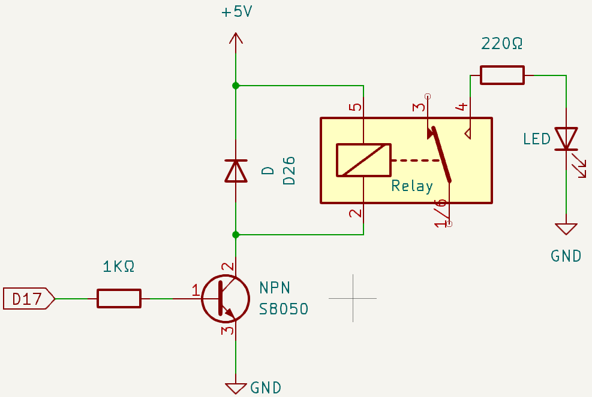
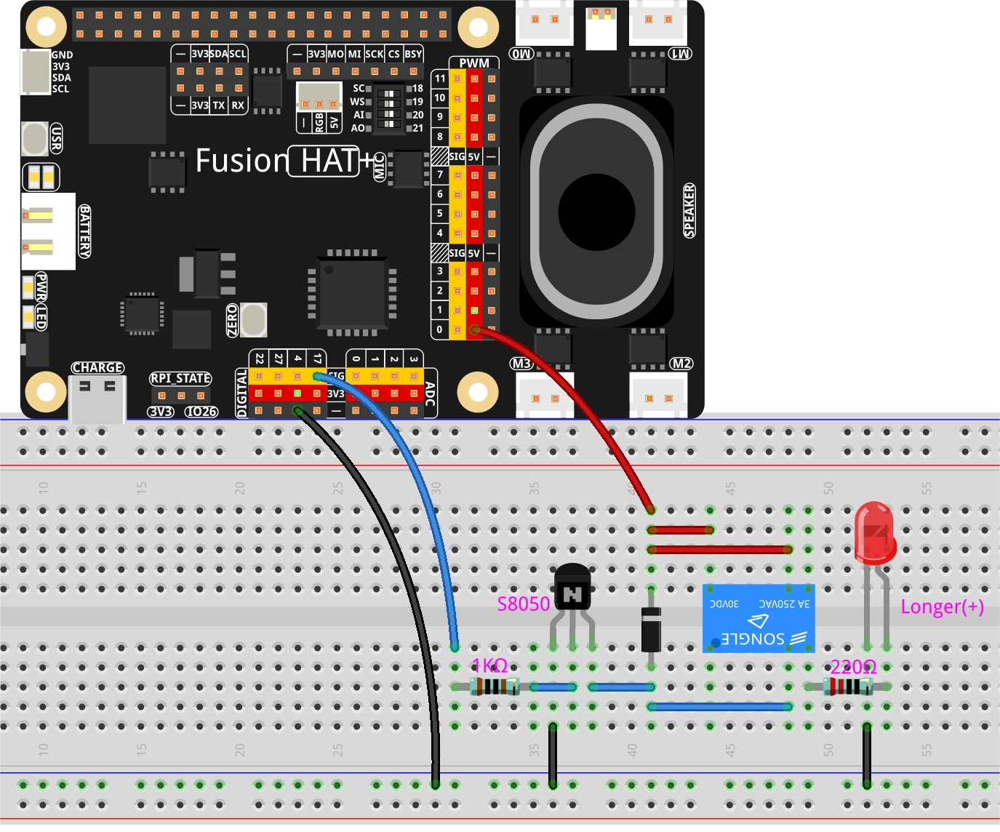

.. note::

    Hello, welcome to the SunFounder Raspberry Pi & Arduino & ESP32 Enthusiasts Community on Facebook! Dive deeper into Raspberry Pi, Arduino, and ESP32 with fellow enthusiasts.

    **Why Join?**

    - **Expert Support**: Solve post-sale issues and technical challenges with help from our community and team.
    - **Learn & Share**: Exchange tips and tutorials to enhance your skills.
    - **Exclusive Previews**: Get early access to new product announcements and sneak peeks.
    - **Special Discounts**: Enjoy exclusive discounts on our newest products.
    - **Festive Promotions and Giveaways**: Take part in giveaways and holiday promotions.

    👉 Ready to explore and create with us? Click [|link_sf_facebook|] and join today!

.. _py_relay:

1.5 Relay Control
===========================

**Introduction**

In this project, we will learn how to control a relay module using a Raspberry Pi. Relays are electrically operated switches that allow low-power circuits to control high-power devices safely. This project demonstrates how to toggle a relay on and off at regular intervals.

----------------------------------------------

**What You'll Need**

To complete this project, you will need the following components:

.. list-table::
    :widths: 30 20
    :header-rows: 1

    *   - COMPONENT
        - PURCHASE LINK
    *   - :ref:`cpn_breadboard`
        - |link_breadboard_buy|
    *   - :ref:`cpn_wires`
        - |link_wires_buy|
    *   - :ref:`cpn_resistor`
        - |link_resistor_buy|
    *   - :ref:`cpn_led`
        - |link_led_buy|
    *   - :ref:`cpn_transistor`
        - |link_transistor_buy|
    *   - :ref:`cpn_relay`
        - |link_relay_buy|
    *   - :ref:`cpn_diode`
        - |link_diode_buy|
    *   - :ref:`cpn_fusion_hat`
        - \- 
    *   - Raspberry Pi
        - \-

----------------------------------------------

**Circuit Diagram**

The GPIO signal passes through a 1 kΩ resistor to the transistor base, allowing the transistor to switch the relay coil on and off. When GPIO17 outputs HIGH, the transistor turns on, current flows through the relay coil, the relay activates, and the LED (through the 220 Ω resistor) lights up. When GPIO17 outputs LOW, the transistor turns off, the relay coil is de-energized, the relay releases, and the LED turns off. A flyback diode is placed across the relay coil to protect the circuit from voltage spikes.

----------------------------------------------

**Wiring Diagram**

Follow these steps to build the circuit:

----------------------------------------------

**Running the Example**

All example code used in this tutorial is available in the ``ai-lab-kit`` directory. 
Follow these steps to run the example:

.. raw:: html

   <run></run>

.. code-block:: shell
   
   cd ~/ai-lab-kit/python/
   sudo python3 1.5_Relay.py 

----------------------------------------------

**Code**

The following Python code controls a relay module, toggling it on and off:

.. raw:: html

   <run></run>

.. code-block:: python

    #!/usr/bin/env python3
    from fusion_hat.pin import Pin, Mode
    from time import sleep  # Import the sleep function for delay

    # Initialize the relay connected to GPIO pin 17
    relay = Pin(17,mode=Mode.OUT)

    try:
        # Loop to continuously toggle the relay's state every second
        while True:
            print('Relay open...')  # Inform that the relay is being activated
            relay.high()  # Turn on the relay 
            sleep(1)   # Maintain the relay in the on state for 1 second

            print('...Relay close')  # Inform that the relay is being deactivated
            relay.low()  # Turn off the relay
            sleep(1)   # Maintain the relay in the off state for 1 second

    except KeyboardInterrupt:
        # Handle a keyboard interrupt (Ctrl+C) to exit the loop
        relay.off()  # Ensure the relay is turned off before exiting
        pass

This Python script controls a relay module connected to GPIO pin 17. When executed:

1. The script enters an infinite loop that toggles the relay state every second
2. When the relay is activated (HIGH), "Relay open..." is printed to the console
3. When the relay is deactivated (LOW), "...Relay close" is printed to the console
4. The program can be interrupted gracefully using ``Ctrl+C``, which ensures the relay is turned off before exiting

----------------------------------------------

**Understanding the Code**

1. **Library Import**

   The ``Pin`` class from the ``fusion_hat`` library is used to control GPIO pins, and ``time.sleep`` introduces delays between state changes.

   .. code-block:: python

        from fusion_hat.pin import Pin, Mode
        from time import sleep  # Import the sleep function for delay

2. **Relay Initialization**

   The relay is initialized on GPIO pin 17 and set to output mode.

   .. code-block:: python

      # Initialize the relay connected to GPIO pin 17
      relay = Pin(17,mode=Mode.OUT)

3. **Main Control Loop**

   The ``while True`` loop continuously toggles the relay state with 1-second intervals.

   .. code-block:: python

      while True:
          print('Relay open...')  # Inform that the relay is being activated
          relay.high()  # Turn on the relay 
          sleep(1)   # Maintain the relay in the on state for 1 second

          print('...Relay close')  # Inform that the relay is being deactivated
          relay.low()  # Turn off the relay
          sleep(1)   # Maintain the relay in the off state for 1 second

4. **Keyboard Interrupt Handling**

   The ``try-except`` block ensures the program stops gracefully when interrupted (e.g., Ctrl+C), and turns off the relay before exiting.

   .. code-block:: python

      except KeyboardInterrupt:
          # Handle a keyboard interrupt (Ctrl+C) to exit the loop
          relay.off()  # Ensure the relay is turned off before exiting
          pass

----------------------------------------------

**Troubleshooting**

1. **Relay Not Responding**

   - **Cause**: Incorrect wiring or wrong GPIO pin configuration.
   - **Solution**: Verify all connections match the wiring diagram and confirm GPIO 17 is correctly specified.

2. **Relay Stays On or Off**

   - **Cause**: Logic level mismatch or power supply issues.
   - **Solution**: Ensure the relay module is compatible with 3.3V logic levels and check that the power supply is adequate.

3. **Program Doesn't Exit Cleanly**

   - **Cause**: Keyboard interrupt not properly handled.
   - **Solution**: Make sure to use ``Ctrl+C`` to terminate the program and check that the exception handling code is present.

----------------------------------------------

**Extendable Ideas**

1. **Scheduled Control**

   Modify the code to control the relay based on a schedule, turning it on and off at specific times:

   .. code-block:: python

      import datetime
      
      # Turn relay on during specific hours
      current_time = datetime.datetime.now().time()
      if datetime.time(9, 0) <= current_time <= datetime.time(17, 0):
          relay.high()
      else:
          relay.low()

2. **Sensor-Activated Control**

   Connect a sensor (like a temperature or motion sensor) and control the relay based on sensor readings:

   .. code-block:: python

      # Pseudocode for sensor-controlled relay
      if temperature_sensor.read() > 25:  # If temperature exceeds 25°C
          relay.high()  # Turn on cooling device
      else:
          relay.low()   # Turn off cooling device

3. **Multiple Relay Control**

   Expand the project to control multiple relays simultaneously:

   .. code-block:: python

      # Initialize multiple relays
      relays = {
          'light': Pin(17, Pin.OUT),
          'fan': Pin(18, Pin.OUT),
          'pump': Pin(19, Pin.OUT)
      }
      
      # Control individual relays
      relays['light'].high()
      relays['fan'].low()

----------------------------------------------

**Conclusion**

This project demonstrates how to control a relay module using a Raspberry Pi. Relays are fundamental components in home automation, industrial control systems, and IoT applications. By mastering relay control, you can interface low-voltage circuits with high-power devices safely and effectively.