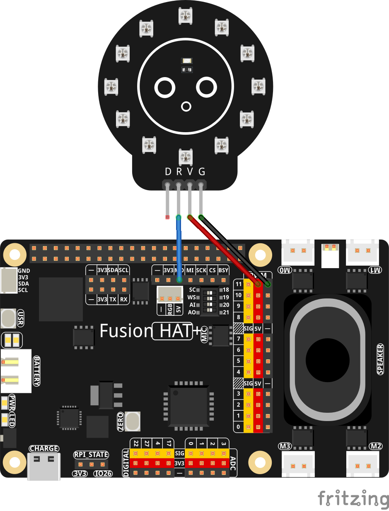

.. include:: /index.rst
   :start-after: start_hello_message
   :end-before: end_hello_message

.. _py_ws2812:

1.9 NeoPixel LED-Streifen
===========================

**Einführung**

In diesem Projekt lernen wir, wie man einen adressierbaren RGB-LED-Streifen (NeoPixel) über SPI-Kommunikation mit einem Raspberry Pi steuert. NeoPixel sind intelligente RGB-LEDs mit integrierten Treibern, sodass jede LED in einer Kette individuell gesteuert werden kann. Dieses Projekt demonstriert die grundlegende Farbsteuerung sowie das gleichzeitige Füllen des gesamten LED-Streifens mit verschiedenen Farben.

----------------------------------------------

**Benötigte Komponenten**

Um dieses Projekt durchzuführen, benötigen Sie die folgenden Komponenten:

.. list-table::
   :widths: 30 20
   :header-rows: 1

   *   - KOMPONENTE
       - KAUFLINK

   *   - :ref:`cpn_circular_ws2812_module`
       - \-
   *   - :ref:`cpn_wires`
       - |link_wires_buy|

   *   - :ref:`cpn_fusion_hat`
       - \- 
   *   - Raspberry Pi
       - \-

----------------------------------------------

**Verdrahtungsdiagramm**

----------------------------------------------

**Einrichtungsschritte**

#. Bevor Sie den Code ausführen, müssen Sie die erforderliche Bibliothek installieren:

   Diese Bibliothek stellt die notwendigen Funktionen bereit, um NeoPixel-LEDs über SPI-Kommunikation zu steuern.

   .. raw:: html
   
      <run></run>
   
   .. code-block:: shell
   
        sudo pip3 install adafruit-circuitpython-neopixel-spi --break

#. Der gesamte Beispielcode in diesem Tutorial befindet sich im Verzeichnis ``ai-lab-kit``. Führen Sie die folgenden Schritte aus, um das Beispiel zu starten:

   .. raw:: html
   
      <run></run>
   
   .. code-block:: shell
      
      cd ~/ai-lab-kit/python/
      sudo python3 1.9_NeoPixel.py

#. Wenn dieses Skript ausgeführt wird, durchläuft das WS2812-LED-Modul drei Vollfarben:

   * Alle LEDs leuchten **rot** für eine Sekunde  
   * Alle LEDs leuchten **grün** für eine Sekunde  
   * Alle LEDs leuchten **blau** für eine Sekunde  

   Nach jeder Farbe werden die LEDs kurz **ausgeschaltet**, bevor der Zyklus erneut beginnt.  
   Im Terminal wird während der Ausführung jeweils der aktuelle Farbname ausgegeben.

----------------------------------------------

**Code**

Der folgende Python-Code steuert einen NeoPixel-LED-Streifen und wechselt zyklisch zwischen verschiedenen Farben:

.. raw:: html

   <run></run>

.. code-block:: python

   import time               # Used for delays
   import board              # Provides board-specific pin definitions
   import neopixel_spi as neopixel   # NeoPixel SPI driver

   # Create an SPI object using the default SPI bus of the board
   spi = board.SPI()

   LED_COUNT = 12  # Number of LED pixels in the strip
   PIXEL_ORDER = neopixel.GRB  # Color order used by the LEDs (Green, Red, Blue)

   # Create a NeoPixel strip object over SPI
   # auto_write=False means we must call strip.show() to update the LEDs
   strip = neopixel.NeoPixel_SPI(spi, LED_COUNT, pixel_order=PIXEL_ORDER, auto_write=False)

   time.sleep(0.01)   # Short delay to ensure the strip is ready

   strip.fill(0)      # Turn all pixels off (color value 0 = off)
   strip.show()       # Send the data to the LED strip

   try:
      while True:
         print("RGB test")

         # Display red on all LEDs
         print("Red")
         strip.fill((255, 0, 0))  # Full red, no green, no blue
         strip.show()
         time.sleep(1)

         # Display green on all LEDs
         print("Green")
         strip.fill((0, 255, 0))  # Full green
         strip.show()
         time.sleep(1)

         # Display blue on all LEDs
         print("Blue")
         strip.fill((0, 0, 255))  # Full blue
         strip.show()
         time.sleep(1)
      
         # Turn all LEDs off
         # print("Off for 10 seconds")
         strip.fill((0, 0, 0))    # All channels 0 = off
         strip.show()
         time.sleep(1)

   # Gracefully handle script termination (e.g., via KeyboardInterrupt)
   except KeyboardInterrupt: 
      pass

Dieses Python-Skript demonstriert die grundlegende Steuerung eines 12-LED-WS2812-Rings mit dem NeoPixel-SPI-Treiber. Beim Ausführen passiert Folgendes:

1. Das Skript initialisiert die SPI-Schnittstelle und bereitet den WS2812-LED-Ring vor.
2. Alle LEDs wechseln im Abstand von einer Sekunde zwischen Rot, Grün und Blau.
3. Jede Farbänderung wird zu Debugzwecken in der Konsole ausgegeben.
4. Zwischen den Zyklen werden die LEDs kurz ausgeschaltet.
5. Das Programm läuft kontinuierlich weiter, bis es mit ``Ctrl+C`` unterbrochen wird.

----------------------------------------------

**Den Code verstehen**

1. **Bibliotheken importieren**

   Das Skript verwendet die Bibliothek ``neopixel_spi``, um WS2812-LEDs über die SPI-Schnittstelle des Raspberry Pi zu steuern.

   .. code-block:: python

      import time
      import board
      import neopixel_spi as neopixel

2. **SPI- und NeoPixel-Konfiguration**

   Der SPI-Bus wird initialisiert und der NeoPixel-Ring mit 12 LEDs und der erforderlichen Farbreihenfolge (GRB) konfiguriert.
   
   .. code-block:: python
   
       spi = board.SPI()
       LED_COUNT = 12
       PIXEL_ORDER = neopixel.GRB
   
       strip = neopixel.NeoPixel_SPI(
           spi,
           LED_COUNT,
           pixel_order=PIXEL_ORDER,
           auto_write=False
       )

3. **Initiales Zurücksetzen der LEDs**

   Eine kurze Verzögerung stellt sicher, dass die LEDs bereit sind, anschließend werden alle Pixel ausgeschaltet.
   
   .. code-block:: python
   
       time.sleep(0.01)
       strip.fill(0)
       strip.show()

4. **Hauptschleife für Farbwechsel**

   In der Endlosschleife wird der LED-Ring nacheinander vollständig mit Rot, Grün und Blau gefüllt. Jede Farbe wird eine Sekunde lang angezeigt.
   
   .. code-block:: python
   
       while True:
           strip.fill((255, 0, 0))  # Red
           strip.show()
           time.sleep(1)
           # Similar code for green and blue...

**5. Farbformat**

   Farben werden mit einem RGB-Tupel definiert: ``(red, green, blue)``, wobei jeder Wert zwischen 0 und 255 liegt.
   
   .. code-block:: python
   
       strip.fill((0, 255, 0))  # Example: green

----------------------------------------------

**Fehlerbehebung**

* **LED-Ring leuchtet nicht korrekt**

  - **Ursache:** Falsche Verdrahtung oder unzureichende Stromversorgung  
  - **Lösung:** Stellen Sie sicher, dass VCC mit 5V verbunden ist, GND gemeinsam genutzt wird und die Datenleitung mit DIN (manchmal als RGB bezeichnet) verbunden ist.

* **Falsche Farben**

  - **Ursache:** Falsche Farbreihenfolge der LEDs  
  - **Lösung:** Probieren Sie andere Pixelreihenfolgen wie ``neopixel.RGB`` oder ``neopixel.GRBW``.

* **SPI funktioniert nicht**

  - **Ursache:** SPI ist deaktiviert oder es liegt ein Hardwarekonflikt vor  
  - **Lösung:** Aktivieren Sie SPI über ``sudo raspi-config``.

* **Bibliothek kann nicht importiert werden**

  - **Ursache:** Fehlende Abhängigkeit  
  - **Lösung:**
  
   .. raw:: html
   
      <run></run>
   
   .. code-block:: shell

      sudo pip3 install adafruit-circuitpython-neopixel-spi --break

----------------------------------------------

**Erweiterungsideen**

* Sie können einzelne LEDs mit unterschiedlichen Farben beleuchten, um einfache Muster zu erstellen oder bestimmte Positionen auf dem Ring hervorzuheben.

  .. code-block:: python
  
      strip[0] = (255, 0, 0)
      strip.show()

* Durch zyklisches Berechnen von RGB-Werten können Sie einen fließenden Regenbogeneffekt über alle LEDs erzeugen.

  .. code-block:: python
  
      strip.fill(wheel(50))
      strip.show()

* Erstellen Sie einen Lauflichteffekt, indem immer nur eine LED eingeschaltet wird, während die anderen ausgeschaltet bleiben.

  .. code-block:: python
  
      strip[i] = (0, 255, 0)
      strip.show()

* Sie können die Helligkeit des gesamten LED-Rings anpassen, indem Sie das Attribut ``brightness`` verändern.

  .. code-block:: python
  
      strip.brightness = 0.3

----------------------------------------------

**Fazit**

Dieses Beispiel zeigt, wie ein WS2812-LED-Ring mit 12 LEDs über SPI auf einem Raspberry Pi gesteuert werden kann. Mit nur wenigen Codezeilen lassen sich Farben wechseln, Animationen erstellen und einzelne LEDs gezielt steuern. Dadurch eignen sich WS2812-Ringe hervorragend für Statusanzeigen, Robotikprojekte, dekorative Effekte und interaktive Visualisierungen.
