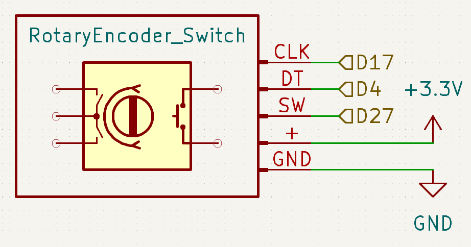
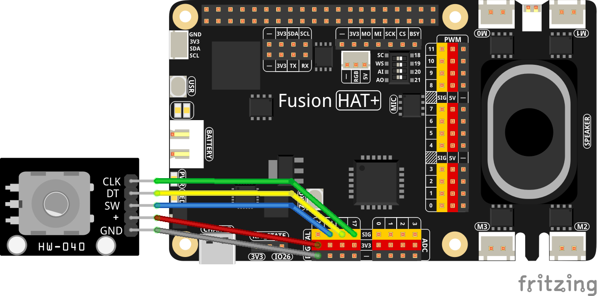

.. include:: /index.rst
   :start-after: start_hello_message
   :end-before: end_hello_message

.. _py_rotary_encoder:

2.12 Rotary Encoder
=======================

**Introduction**

A rotary encoder is an input device that converts rotational motion into digital signals. It’s commonly used for navigating menus, adjusting values, or scrolling through items. In this project, you’ll connect a rotary encoder (with an integrated push-button) to a Raspberry Pi via the Fusion HAT+, read rotation steps, and reset the counter with the encoder’s switch.

This experiment illustrates how to interface a rotary encoder using event callbacks for smooth, low-latency input handling.

----------------------------------------------

**What You’ll Need**

Here are the components required for this project:

.. list-table::
    :widths: 30 20
    :header-rows: 1

    *   - COMPONENT INTRODUCTION
        - PURCHASE LINK

    *   - :ref:`cpn_rotary_encoder`
        - |link_rotary_encoder_buy| 
    *   - :ref:`cpn_wires`
        - |link_wires_buy|
    *   - :ref:`cpn_fusion_hat`
        - \-
    *   - Raspberry Pi
        - \-

----------------------------------------------

**Circuit Diagram**

Below are the schematic diagrams for the project:

----------------------------------------------

**Wiring Diagram**

Connect the components as shown in the wiring diagram below:

**Pin Mapping Used in the Example**

- **CLK** → **GPIO 17**
- **DT** → **GPIO 4**
- **SW (button)** → **GPIO 27** (with internal pull-up)
- **+** → **3.3V**
- **GND** → **GND**

Ensure that all connections are secure. If your encoder has separate **C (COM)** and **NO/NC** for the switch, connect **C** to GND and **NO** to the SW pin (internal pull-up enabled in software).

----------------------------------------------

**Running the Example**

All example code used in this tutorial is available in the ``ai-lab-kit`` directory.
Follow these steps to run the example:

.. raw:: html

   <run></run>

.. code-block:: shell

   cd ~/ai-lab-kit/python/
   sudo python3 2.15_RotaryEncoder.py

----------------------------------------------

**Code**

Below is the Python code used for this project:

.. raw:: html

   <run></run>

.. code-block:: python

   #!/usr/bin/env python3
   from fusion_hat.modules import Rotary_Encoder
   from fusion_hat.pin import Pin, Mode, Pull
   from signal import pause  # Import pause function from signal module

   # Initialize the rotary encoder and button (sw)
   encoder = Rotary_Encoder(clk=17, dt=4)  # Rotary Encoder connected to GPIO pins 17 (CLK) and 4 (DT)
   sw = Pin(27, mode=Mode.IN, pull=Pull.UP)  # Button (sw) connected to GPIO pin 27

   def rotary_change():
      """ Update the counter based on the rotary encoder's rotation. """
      print('Counter =', encoder.steps())  # Display current counter value

   def reset_counter():
      """ Reset the counter to zero when the button (sw) is pressed. """
      encoder.reset()  # Reset the counter
      print('Counter reset')  # Indicate counter reset

   # Set up event handlers for the rotary encoder and button (sw)
   encoder.when_rotated = rotary_change
   sw.when_activated = reset_counter

   # Run an event loop that waits for button (sw) events and keeps the script running
   print("CTRL + C to exit")
   pause()

----------------------------------------------

**Understanding the Code**

1. **Imports**

   .. code-block:: python

      from fusion_hat.modules import Rotary_Encoder
      from fusion_hat.pin import Pin, Mode, Pull
      from signal import pause  # Import pause function from signal module

   - ``Rotary_Encoder`` handles quadrature decoding of the rotary signals.
   - ``Pin`` provides GPIO configuration and event support.
   - ``pause`` blocks the main thread while letting callbacks execute on events.

2. **Hardware Setup**

   .. code-block:: python

      encoder = Rotary_Encoder(clk=17, dt=4)  # Rotary Encoder connected to GPIO pins 17 (CLK) and 4 (DT)
      sw = Pin(27, mode=Mode.IN, pull=Pull.UP)  # Button (sw) connected to GPIO pin 27

   - The encoder’s two channels (CLK/DT) feed the quadrature decoder.
   - The switch uses an internal pull-up; pressing it pulls the line to GND.

3. **Callbacks**

   .. code-block:: python

      def rotary_change():
          print('Counter =', encoder.steps())

      def reset_counter():
          encoder.reset()
          print('Counter reset')

   - ``encoder.steps()`` returns the accumulated step count (positive/negative depending on direction).
   - ``encoder.reset()`` clears the count to zero.

4. **Event Binding and Loop**

   .. code-block:: python

      encoder.when_rotated = rotary_change
      sw.when_activated = reset_counter
      pause()

   - Assign functions to the event properties; no manual polling is required.
   - ``pause()`` keeps the process alive to service interrupts.

----------------------------------------------

**Troubleshooting**

1. **No Output on Rotation**

   - **Cause**: Miswired CLK/DT or poor ground connection.
   - **Solution**: Verify **CLK→GPIO17**, **DT→GPIO4**, **GND common**. Ensure 3.3V supply is correct (do **not** use 5V encoders directly on GPIO).

2. **Counter Jumps Erratically (Bounces/Noise)**

   - **Cause**: Mechanical bounce or long wires picking up noise.
   - **Solution**: Keep wires short and twisted as a pair if possible; add small capacitors (e.g., 0.01–0.1 µF) from CLK/DT to GND if needed; enable any available debounce options in your library version.

3. **Button Not Detected**

   - **Cause**: Switch contacts wired to 3.3V instead of GND or pull-up misconfiguration.
   - **Solution**: Ensure **SW** connects to **GND** when pressed; confirm ``pull=Pin.PULL_UP`` is set.

4. **Direction Reversed**

   - **Cause**: CLK and DT swapped relative to your desired direction.
   - **Solution**: Swap the **CLK** and **DT** wires or invert at the application layer (e.g., subtract steps).

----------------------------------------------

**Extendable Ideas**

1. **Adjust a Variable (e.g., Volume/Brightness) Smoothly**

   .. code-block:: python

      value = 50  # 0..100
      def rotary_change():
          global value
          value = max(0, min(100, 50 + encoder.steps()))
          print(f'Value = {value}')

2. **Use the Button to Toggle a Mode**

   .. code-block:: python

      mode = ['Fine', 'Coarse']
      idx = 0
      def reset_counter():
          global idx
          idx = 1 - idx
          encoder.reset()
          print(f'Mode switched to: {mode[idx]}')

3. **LED/Buzzer Feedback**

   .. code-block:: python

      from fusion_hat import Pin
      led = Pin(26, Pin.OUT)
      def rotary_change():
          print('Counter =', encoder.steps())
          led.on()
          # brief flash without blocking callbacks is recommended
          led.off()

4. **Long-Press to Perform a Special Action**

   - Track press duration using timestamps in ``sw.when_activated`` and (if available) ``sw.when_deactivated`` to trigger different actions for short/long presses.

----------------------------------------------

**Conclusion**

This experiment shows how to read a rotary encoder and its integrated button using event-driven callbacks on the Fusion HAT+. With this pattern, you can build responsive interfaces such as menu navigators, dial-controlled settings, and jog wheels for real-time control in your Raspberry Pi projects.
