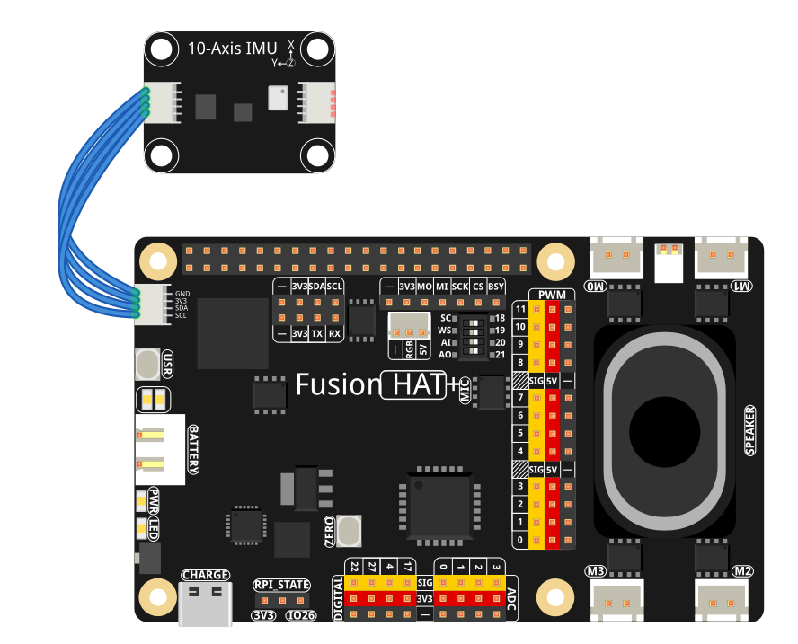

2.14 10-Axis IMU Sensor Module
===============================

**Introduction**

The 10-Axis IMU (Inertial Measurement Unit) module combines multiple sensors to provide comprehensive motion and environmental data. It integrates a barometric pressure sensor (SPL06_001) for altitude measurement, a 6-axis motion sensor (SH3001) for acceleration and rotation, and a 3-axis magnetometer (QMC6310) for compass heading. This sophisticated module is ideal for robotics, navigation systems, and motion-tracking applications.

----------------------------------------------

**What You'll Need**

Here are the components required for this project:

.. list-table::
    :widths: 30 20
    :header-rows: 1

    *   - COMPONENT INTRODUCTION
        - PURCHASE LINK

    *   - :ref:`cpn_wires`
        - |link_wires_buy|
    *   - :ref:`cpn_10axis_imu`
        - \-
    *   - Raspberry Pi
        - \-
    *   - I2C Connection Cable
        - |link_i2c_cable_buy|

.. ----------------------------------------------

.. **Circuit Diagram**

.. The 10-Axis IMU module connects via I2C interface:

.. .. image:: img/fzz/2.14_sch.png

----------------------------------------------

**Wiring Diagram**

Connect the IMU module to Raspberry Pi as shown below:

Ensure proper I2C connections:

- VCC → 3.3V
- GND → GND
- SDA → GPIO 2 (SDA)
- SCL → GPIO 3 (SCL)

----------------------------------------------

**Install the library**

Install the 10-Axis library:
   

.. raw:: html

   <run></run>

.. code-block:: shell

   sudo pip install git+https://github.com/sunfounder/sunfounder-imu-python.git --break-system-packages   

-------------------------------------------------------

**Calibrate the IMU**

Run the calibration script to calibrate the IMU:

.. raw:: html

   <run></run>

.. code-block:: shell

   sudo python3 -m sunfounder_imu.calibrate

Then follow the instructions in the script to calibrate the IMU.

--------------------------------------------------------

**Run the example**

All example code used in this tutorial is available in the ``ai-lab-kit`` directory. 
Follow these steps to run the example:

.. raw:: html

   <run></run>

.. code-block:: shell
   
   cd ~/ai-lab-kit/python/
   sudo python3 2.15_10axis_imu.py

----------------------------------------------

**Code**

Below is the Python code for reading data from the 10-Axis IMU module:

.. raw:: html

   <run></run>

.. code-block:: python

   #!/usr/bin/env python3
   """
   Read data from all three sensors on the 10 Axis IMU module:
   - SPL06_001: temperature, pressure, altitude
   - SH3001: temperature, accelerometer, gyroscope
   - QMC6310: compass heading

   Gracefully exits when Ctrl+C is pressed.
   """

   from time import sleep

   # Import Sunfounder sensor modules
   from sunfounder_imu import IMU

   def main():
       imu = IMU()
       sensors = imu.find_sensor()
       if len(sensors) == 0:
           print("No sensor found.")
           return
       for address, class_type in sensors.items():
           name = class_type.__name__
           print(f"Found sensor {name} at address 0x{address:02X}")
       sleep(3)
       
       try:
           while True:
               data = imu.read()
               
               print(f"Altitude={data['altitude']:7.2f} m")
               print(f"Azimuth={data['azimuth']:7.2f} °")
               print(f"Acceleration:")
               print(f"  X={data['acceleration'].x:7.2f} m/s²")
               print(f"  Y={data['acceleration'].y:7.2f} m/s²")
               print(f"  Z={data['acceleration'].z:7.2f} m/s²")
               print(f"Gyroscrope:")
               print(f"  X={data['gyroscrope'].x:7.2f} °/s")
               print(f"  Y={data['gyroscrope'].y:7.2f} °/s")
               print(f"  Z={data['gyroscrope'].z:7.2f} °/s")
               print(f"Magenatic:")
               print(f"  X={data['magenatic'].x:7.2f} μT")
               print(f"  Y={data['magenatic'].y:7.2f} μT")
               print(f"  Z={data['magenatic'].z:7.2f} μT")
               print(f"Temperature={data['temperature']:7.2f} °C")
               print(f"Pressure={data['pressure']:7.2f} hPa")

               sleep(0.5)

       except KeyboardInterrupt:
           print("\nExiting program...")

   if __name__ == "__main__":
       main()

This Python script reads comprehensive motion and environmental data from the 10-Axis IMU module. When executed:

1. The script initializes communication with all three integrated sensors via I2C.
2. Each sensor is detected and its I2C address is displayed for verification.
3. The main loop continuously reads and displays data including:

   - Altitude (from barometric pressure)
   - Compass heading (azimuth)
   - 3-axis acceleration
   - 3-axis angular velocity (gyroscope)
   - 3-axis magnetic field strength
   - Temperature and atmospheric pressure

4. Data updates every 0.5 seconds, providing real-time motion tracking.
5. The program runs until interrupted with ``Ctrl+C``, then exits gracefully.

----------------------------------------------

**Understanding the Code**

1. **Imports and Setup:**

   .. code-block:: python

      from time import sleep
      from sunfounder_imu import IMU

   The script imports the necessary modules: ``sleep`` for timing delays and ``IMU`` class from the Sunfounder library to communicate with the sensor module.

2. **Sensor Initialization:**

   .. code-block:: python

      imu = IMU()
      sensors = imu.find_sensor()
      if len(sensors) == 0:
          print("No sensor found.")
          return

   Creates an IMU object and scans for connected sensors on the I2C bus. If no sensors are found, the program exits.

3. **Sensor Detection:**

   .. code-block:: python

      for address, class_type in sensors.items():
          name = class_type.__name__
          print(f"Found sensor {name} at address 0x{address:02X}")

   Displays information about each detected sensor, including its type and I2C address for debugging purposes.

4. **Main Data Reading Loop:**

   .. code-block:: python

      while True:
          data = imu.read()
          # Display all sensor readings with formatted output
          sleep(0.5)

   - Calls ``imu.read()`` to get all sensor data in a single dictionary
   - Formats and displays each parameter with consistent decimal precision
   - Includes a 0.5-second delay to balance update rate and readability

5. **Graceful Exit:**

   .. code-block:: python

      except KeyboardInterrupt:
          print("\nExiting program...")

   Catches the KeyboardInterrupt exception to allow clean program termination when ``Ctrl+C`` is pressed.

----------------------------------------------

**Troubleshooting**

1. **No Sensors Found**:

   - **Cause**: Incorrect wiring or I2C communication issues.
   - **Solution**:

      - Verify all connections: VCC, GND, SDA, SCL
      - Check if I2C is enabled on Raspberry Pi: ``sudo raspi-config`` → Interface Options → I2C
      - Run ``i2cdetect -y 1`` to see if the sensors appear at their addresses

2. **Inconsistent or Erratic Readings**:

   - **Cause**: Electrical interference or sensor calibration issues.
   - **Solution**:

      - Keep the module away from strong magnetic fields or motors
      - Ensure stable power supply with proper decoupling capacitors
      - Place the module on a stable surface during measurement

3. **Altitude Readings Incorrect**:

   - **Cause**: Uncalibrated barometric pressure reference.
   - **Solution**: The altitude is calculated relative to sea level pressure. For accurate readings, calibrate with known altitude or update sea level pressure reference.

4. **Compass Heading Inaccurate**:

   - **Cause**: Local magnetic interference or improper calibration.
   - **Solution**:

      - Perform magnetometer calibration by rotating the module in a figure-8 pattern
      - Keep away from metal objects, computers, and other magnetic sources

----------------------------------------------

**Extendable Ideas**

1. **Motion Detection Alert**: Trigger an alert when acceleration exceeds a threshold:

   .. code-block:: python

      acceleration_magnitude = (data['acceleration'].x**2 + 
                                data['acceleration'].y**2 + 
                                data['acceleration'].z**2)**0.5
      if acceleration_magnitude > 2.0:  # 2G threshold
          print("Motion detected!")

2. **Orientation Detection**: Determine device orientation using combined sensor data:

   .. code-block:: python

      # Simple orientation detection using accelerometer
      if abs(data['acceleration'].z) > 9.0:
          print("Device is flat")
      elif data['acceleration'].y > 8.0:
          print("Device is upright")

3. **Data Logging**: Record sensor data to a file for analysis:

   .. code-block:: python

      import csv
      with open('imu_data.csv', 'a') as f:
          writer = csv.writer(f)
          writer.writerow([data['temperature'], data['pressure'], 
                          data['altitude'], data['azimuth']])

4. **Tilt-Compensated Compass**: Improve heading accuracy using accelerometer data:

   .. code-block:: python

      # Basic tilt compensation (simplified)
      pitch = math.asin(-data['acceleration'].x / 9.81)
      roll = math.asin(data['acceleration'].y / (9.81 * math.cos(pitch)))
      # Apply compensation to magnetometer readings

----------------------------------------------

**Conclusion**

This project demonstrates how to use a 10-Axis IMU module to obtain comprehensive motion and environmental data with a Raspberry Pi. By integrating pressure, acceleration, rotation, and magnetic field sensors, this module provides a complete inertial measurement solution suitable for advanced applications like drone stabilization, robotics navigation, and motion tracking systems. The foundation established here enables further exploration into sensor fusion algorithms and complex motion analysis.