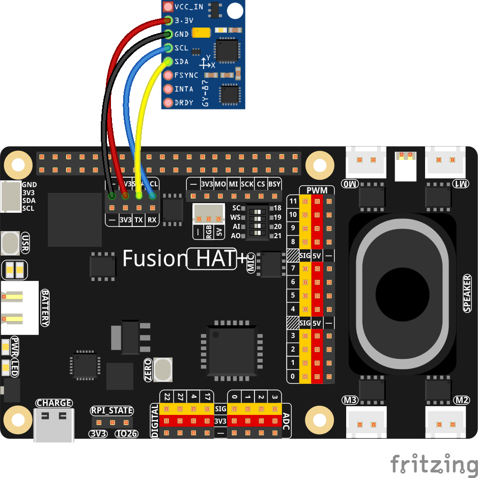

.. note::

    Hello, welcome to the SunFounder Raspberry Pi & Arduino & ESP32 Enthusiasts Community on Facebook! Dive deeper into Raspberry Pi, Arduino, and ESP32 with fellow enthusiasts.

    **Why Join?**

    - **Expert Support**: Solve post-sale issues and technical challenges with help from our community and team.
    - **Learn & Share**: Exchange tips and tutorials to enhance your skills.
    - **Exclusive Previews**: Get early access to new product announcements and sneak peeks.
    - **Special Discounts**: Enjoy exclusive discounts on our newest products.
    - **Festive Promotions and Giveaways**: Take part in giveaways and holiday promotions.

    👉 Ready to explore and create with us? Click [|link_sf_facebook|] and join today!

.. _py_mpu6050:

MPU6050 Sensor
=====================================

**Introduction**

In this lesson, we focus on the MPU6050 sensor built into the GY-87 module. The MPU6050 is a 6-axis IMU that includes a 3-axis accelerometer and a 3-axis gyroscope. Using the Fusion HAT, you will learn how to read acceleration, rotation, and temperature data from the sensor. This serves as a foundation for motion-related projects such as gesture detection, balancing robots, and orientation tracking.

----------------------------------------------

**What You’ll Need**

Below are the components required for this project:

.. list-table::
    :widths: 30 20
    :header-rows: 1

    *   - COMPONENT INTRODUCTION
        - PURCHASE LINK

    *   - :ref:`cpn_gy87`
        - \-
    *   - :ref:`cpn_wires`
        - |link_wires_buy|
    *   - :ref:`cpn_fusion_hat`
        - \- 
    *   - Raspberry Pi
        - \-

----------------------------------------------

**Wiring Diagram**

Assemble the circuit as shown in the wiring diagram below:

----------------------------------------------

**Running the Example**

All example code used in this tutorial is available in the ``ai-lab-kit`` directory. 
Follow these steps to run the example:

.. raw:: html

   <run></run>

.. code-block:: shell
   
   cd ~/ai-lab-kit/python/
   sudo python3 2.15_GY87_MPU6050.py

----------------------------------------------

**Code**

Below is the Python code for this project:

.. raw:: html

   <run></run>

.. code-block:: python

   #!/usr/bin/env python3
   """
   Read temperature, accelerometer, and gyroscope data
   from the MPU6050 on the GY-87 module.
   Gracefully exits on Ctrl+C.
   """

   # Import the MPU6050 IMU module (accelerometer + gyroscope + temperature)
   from fusion_hat.modules import MPU6050
   # Import sleep for timing delays
   from time import sleep

   def main():
      # Create an MPU6050 sensor object with default settings
      mpu = MPU6050()

      # Optional: Set accelerometer and gyroscope range
      # mpu.set_accel_range(MPU6050.ACCEL_RANGE_2G)
      # mpu.set_gyro_range(MPU6050.GYRO_RANGE_250DEG)

      try:
         # Loop forever
         while True:
               # Read temperature in Celsius
               temp = mpu.get_temp()

               # Read accelerometer data (X, Y, Z axes), in units of g
               acc_x, acc_y, acc_z = mpu.get_accel_data()

               # Read gyroscope data (X, Y, Z axes), in degrees per second
               gyro_x, gyro_y, gyro_z = mpu.get_gyro_data()

               # Print temperature, acceleration, and gyroscope readings
               print(
                  f"Temp: {temp:0.2f} °C"
                  f"  |  ACC: {acc_x:8.5f}g {acc_y:8.5f}g {acc_z:8.5f}g"
                  f"  |  GYRO: {gyro_x:8.5f}deg/s {gyro_y:8.5f}deg/s {gyro_z:8.5f}deg/s"
               )

               # Wait 0.2 seconds before next read
               sleep(0.2)

      except KeyboardInterrupt:
         # Graceful exit when Ctrl+C is pressed
         print("\nKeyboard interrupt received, exiting...")

   if __name__ == "__main__":
      main()

When you run this script, the Raspberry Pi begins continuously reading motion and temperature data from the MPU6050 sensor on the GY-87 module.  
Every 0.2 seconds, it prints a new line containing:

- **Temperature** in degrees Celsius  
- **Accelerometer readings** (X, Y, Z) in units of *g*  
- **Gyroscope readings** (X, Y, Z) in degrees per second  

A typical output looks like:

.. code-block:: text

    Temp: 25.31 °C  |  ACC:  0.01230g -0.00457g  0.99876g  |  GYRO: -0.15234deg/s  0.08712deg/s  0.01345deg/s
    Temp: 25.32 °C  |  ACC:  0.01198g -0.00421g  0.99902g  |  GYRO: -0.14987deg/s  0.09045deg/s  0.01402deg/s
    Temp: 25.33 °C  |  ACC:  0.01215g -0.00398g  0.99854g  |  GYRO: -0.15042deg/s  0.08877deg/s  0.01388deg/s

As you gently move, tilt, or rotate the sensor, you will see the accelerometer and gyroscope values change in real time.  
Press ``Ctrl+C`` to stop the program, and it will exit cleanly with a message indicating that the script has been interrupted.

----------------------------------------------

**Understanding the Code**

1. **Importing Libraries**

   .. code-block:: python

      # Import the MPU6050 IMU module (accelerometer + gyroscope + temperature)
      from fusion_hat.modules import MPU6050
      # Import sleep for timing delays
      from time import sleep

   These lines import the necessary Python libraries. ``fusion_hat`` contains the ``MPU6050`` class for interfacing with the sensor. The ``sleep`` function from the ``time`` module is used to introduce a delay in the loop.

2. **Initializing the Sensor**

   .. code-block:: python

      mpu = MPU6050()

   This line creates an instance of the ``MPU6050`` class, initializing the sensor so that it's ready to gather data.

3. **Main Loop**

   .. code-block:: python

      while True:
         temp = mpu.get_temp()
         acc_x, acc_y, acc_z = mpu.get_accel_data()
         gyro_x, gyro_y, gyro_z = mpu.get_gyro_data()
         print(
            f"Temp: {temp:0.2f} 'C",
            f"  |  ACC: {acc_x:8.5f}g {acc_y:8.5f}g {acc_z:8.5f}g",
            f"  |  GYRO: {gyro_x:8.5f}deg/s {gyro_y:8.5f}deg/s {gyro_z:8.5f}deg/s"
         )
         sleep(0.2)

   - **While Loop**: The ``while True`` statement creates an infinite loop, meaning the code inside the loop runs repeatedly without stopping.

   - **Reading Sensor Data**:

     - ``temp = mpu.get_temp()``: Retrieves the current temperature from the sensor and stores it in the variable ``temp``.
     - ``acc_x, acc_y, acc_z = mpu.get_accel_data()``: Retrieves the current acceleration data in three dimensions (x, y, z) from the sensor.
     - ``gyro_x, gyro_y, gyro_z = mpu.get_gyro_data()``: Retrieves the gyroscope data, which measures angular velocity in the x, y, and z directions.

   - **Printing Data**: The ``print`` statement formats and displays the sensor data. Temperature is displayed in degrees Celsius, acceleration in g-forces, and gyroscope data in degrees per second.

   - **Sleep**: ``sleep(0.2)`` pauses the loop for 0.2 seconds before repeating. This delay helps manage the rate at which data is read and printed, preventing the script from consuming too much CPU time.

4. **Additional Comments**

   The lines to set the accelerometer and gyroscope ranges are commented out:

   .. code-block:: python

      # mpu.set_accel_range(MPU6050.ACCEL_RANGE_2G)
      # mpu.set_gyro_range(MPU6050.GYRO_RANGE_250DEG)

   Uncommenting these lines would allow you to configure the sensitivity of the accelerometer and gyroscope. For example, ``ACCEL_RANGE_2G`` configures the accelerometer to measure up to ±2g, and ``GYRO_RANGE_250DEG`` sets the gyroscope to measure up to ±250 degrees per second. By default, the MPU6050 module initializes with the default ranges of ±2g for acceleration and ±250 degrees per second for gyroscope.

   You can adjust these ranges based on your specific application requirements. The range settings are as follows:

   - **Accelerometer Ranges**:

     - ``MPU6050.ACCEL_RANGE_2G``: ±2g
     - ``MPU6050.ACCEL_RANGE_4G``: ±4g
     - ``MPU6050.ACCEL_RANGE_8G``: ±8g
     - ``MPU6050.ACCEL_RANGE_16G``: ±16g

   - **Gyroscope Ranges**:

     - ``MPU6050.GYRO_RANGE_250DEG``: ±250 degrees per second
     - ``MPU6050.GYRO_RANGE_500DEG``: ±500 degrees per second
     - ``MPU6050.GYRO_RANGE_1000DEG``: ±1000 degrees per second
     - ``MPU6050.GYRO_RANGE_2000DEG``: ±2000 degrees per second

----------------------------------------------

**Troubleshooting**

1. **No Output or Sensor Not Detected**:

   - **Cause**: Incorrect I2C setup or wiring.
   - **Solution**:

     - Ensure the MPU6050 is correctly connected to the Raspberry Pi's I2C pins (SDA, SCL, power, ground).
     - Verify the I2C address using the ``i2cdetect`` tool:

     .. raw:: html

        <run></run>

     .. code-block:: shell

        sudo i2cdetect -y 1
        
     - Confirm that the device address matches ``0x68`` in the script.

2. **Incorrect or Erratic Values**:

   - **Cause**: Sensor calibration issues or noisy environment.
   - **Solution**:

     - Place the MPU6050 on a stable surface to reduce noise.
     - Perform calibration on the gyroscope and accelerometer to ensure accurate readings.

3. **ImportError: No Module Named ``smbus``**:

   - **Cause**: The ``smbus`` library is not installed.
   - **Solution**: Install the library using:

   .. raw:: html

      <run></run>

   .. code-block:: shell

      sudo apt-get install python3-smbus

----------------------------------------------

**Extendable Ideas**

1. **Data Logging**: Save gyroscope and accelerometer readings to a file for analysis:
     
   .. code-block:: python

      with open("mpu6050_log.txt", "a") as log_file:
         log_file.write(f"{time.time():.3f}, {gyro_x}, {gyro_y}, {gyro_z}, {acc_x}, {acc_y}, {acc_z}\n")

2. **Integration with Motors**: Use the gyroscope data to stabilize a drone or robotic arm.

----------------------------------------------

**Conclusion**

This script provides a simple yet powerful way to continuously monitor and display data from the MPU6050 sensor, which could be useful in various applications requiring real-time motion tracking or environmental monitoring.
