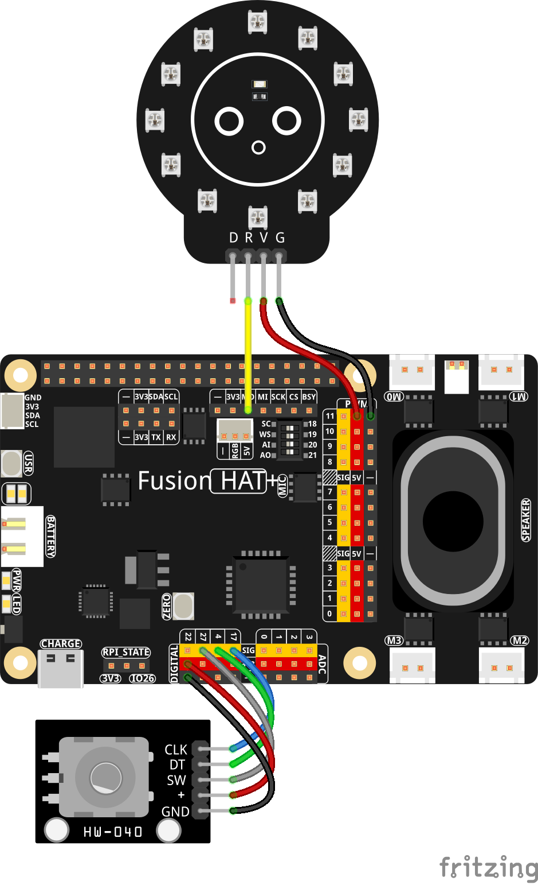

.. include:: /index.rst
   :start-after: start_hello_message
   :end-before: end_hello_message
   
.. _py_hue_knob:

4.10 Hue Knob
==============================

**Introduction**

In this lesson, you will build a **Hue Knob** — an interactive color controller that uses a rotary encoder to adjust the hue of a circular WS2812 LED module.  
This WS2812 LED module contains 12 individually addressable WS2812 RGB LEDs, driven through the Fusion HAT+’s SPI-based NeoPixel interface.  
The external rotary encoder provides real-time user input via standard GPIO pins.

As you rotate the encoder, the 12 LEDs smoothly cycle through the full RGB color spectrum.  
Pressing the encoder’s built-in button resets the hue back to the starting value.  

----------------------------------------------

**What You’ll Need**

The following components are required for this project:

.. list-table::
    :widths: 30 20
    :header-rows: 1

    *   - COMPONENT INTRODUCTION
        - PURCHASE LINK
    *   - :ref:`cpn_wires`
        - |link_wires_buy|
    *   - :ref:`cpn_rotary_encoder`
        - |link_rotary_encoder_buy| 
    *   - :ref:`cpn_circular_ws2812_module`
        - \-
    *   - :ref:`cpn_fusion_hat`
        - \- 
    *   - Raspberry Pi
        - \-

----------------------------------------------

**Wiring Diagram**

Refer to the wiring diagram for assembling the components:

----------------------------------------------

**Setup Steps**

#. Before running the code, you need to install the required library:

   This library provides the necessary functions to control NeoPixel LEDs using SPI communication.

   .. raw:: html
   
      <run></run>
   
   .. code-block:: shell
   
      sudo pip3 install adafruit-circuitpython-neopixel-spi --break

#. All example code used in this tutorial is available in the ``ai-lab-kit`` directory. Follow these steps to run the example:

   .. raw:: html
   
      <run></run>
   
   .. code-block:: shell
      
      cd ~/ai-lab-kit/python/
      sudo python3 4.10_Hue_Knob.py

#. When the script runs, the WS2812 module ring responds to the rotary encoder:

   * LEDs start in red (Hue 0°).
   * Rotate the encoder to smoothly cycle through the full RGB color wheel. Colors transition continuously (red → yellow → green → blue → purple → red). The terminal prints the current hue and RGB values.* 
   * Press the encoder button to reset the hue back to 0° (red).
   * Press Ctrl+C to exit. All LEDs turn off before the program closes.

----------------------------------------------

**Code**

Here is the Python script for the traffic light simulation:

.. code-block:: python

   import time
   import colorsys
   import board
   import neopixel_spi as neopixel
   from fusion_hat.modules import Rotary_Encoder
   from fusion_hat.pin import Pin, Mode, Pull
   from signal import pause

   # ---------------------------
   # NeoPixel (SPI) setup
   # ---------------------------
   LED_COUNT = 12
   PIXEL_ORDER = neopixel.GRB

   spi = board.SPI()
   strip = neopixel.NeoPixel_SPI(
      spi,
      LED_COUNT,
      pixel_order=PIXEL_ORDER,
      auto_write=False,
   )
   time.sleep(0.01)
   strip.fill(0)
   strip.show()

   # ---------------------------
   # Rotary Encoder
   # ---------------------------
   # CLK -> GPIO17, DT -> GPIO4, SW -> GPIO27 (pull-up)
   encoder = Rotary_Encoder(clk=17, dt=4)
   sw = Pin(27, mode=Mode.IN, pull=Pull.UP)

   # You can tweak how many encoder steps you want per full hue cycle.
   # If your encoder has 24 'detents', 24 or 48 feel good.
   STEPS_PER_CYCLE = 120  # higher = finer control

   _last_hue_idx = 0

   def hue_to_rgb(h: float):
      """h in [0.0, 1.0] -> (R, G, B) 0..255"""
      r, g, b = colorsys.hsv_to_rgb(h, 1.0, 1.0)
      return int(r * 255), int(g * 255), int(b * 255)

   def apply_color_from_steps(steps: int):
      global _last_hue_idx
      # Map steps to [0..STEPS_PER_CYCLE-1]
      hue_idx = steps % STEPS_PER_CYCLE
      if hue_idx == _last_hue_idx:
         return  # no visual update needed
      _last_hue_idx = hue_idx

      hue = hue_idx / STEPS_PER_CYCLE  # 0.0..1.0
      color = hue_to_rgb(hue)

      strip.fill(color)
      strip.show()
      print(f"Hue: {int(hue * 360)}°, Steps: {steps}, Color: {color}")

   def rotary_change():
      apply_color_from_steps(encoder.steps())

   def reset_counter():
      encoder.reset()
      apply_color_from_steps(0)
      print("Counter reset (Hue -> 0°)")

   # Event bindings
   encoder.when_rotated = rotary_change
   sw.when_activated = reset_counter

   # Initialize to 0°
   apply_color_from_steps(0)

   print("Rotate to change hue. Press button to reset. CTRL+C to exit.")
   try:
      pause()
   except KeyboardInterrupt:
      pass
   finally:
      # Turn off LEDs on exit
      strip.fill(0)
      strip.show()
      print("Exited and cleared LEDs.")

-------------------------

**Understanding the Code**

1. **Imports**

   The script uses several modules:

   - ``colorsys`` for converting hue values into RGB colors  
   - ``neopixel_spi`` to drive WS2812 LEDs via SPI  
   - ``Rotary_Encoder`` and ``Pin`` for reading encoder rotation and button presses  
   - ``pause()`` to keep the script running  

   These modules together allow real-time LED control based on encoder input.

2. **LED (WS2812) Setup**

   The DIY LED module contains 12 WS2812 RGB LEDs arranged in a ring.  
   They are controlled using the Fusion HAT+’s SPI-based NeoPixel interface.

   .. code-block:: python

      LED_COUNT = 12
      strip = neopixel.NeoPixel_SPI(spi, LED_COUNT, ...)

   - LEDs are cleared at startup  
   - ``auto_write=False`` ensures updates occur only when ``strip.show()`` is called

3. **Rotary Encoder Setup**

   The external rotary encoder is connected to GPIO:

   - ``CLK`` → GPIO17  
   - ``DT`` → GPIO4  
   - ``SW`` (button) → GPIO27  

   .. code-block:: python

      encoder = Rotary_Encoder(clk=17, dt=4)
      sw = Pin(27, Pin.IN, pull=Pin.PULL_UP)

   The encoder provides step counts, while the button triggers a reset.

4. **Hue Calculation**

   Hue values are stored in a circular range:

   .. code-block:: python

      STEPS_PER_CYCLE = 120

   - More steps = finer rotation control  
   - Hue is mapped from ``0.0`` to ``1.0`` (full color wheel)

   ``hue_to_rgb()`` converts the hue into a 0–255 RGB tuple.

5. **Updating LED Colors**

   ``apply_color_from_steps()`` maps encoder steps → hue → RGB color.

   .. code-block:: python

      hue_idx = steps % STEPS_PER_CYCLE
      hue = hue_idx / STEPS_PER_CYCLE
      color = hue_to_rgb(hue)
      strip.fill(color)

   - LEDs update only when the hue changes  
   - The ring displays the selected color instantly  
   - A message is printed in the terminal showing hue and RGB values

6. **Encoder Event Handlers**

   Two callbacks are defined:

   - ``rotary_change()`` → updates color when encoder is rotated  
   - ``reset_counter()`` → resets hue to 0° when encoder button is pressed  

   .. code-block:: python

      encoder.when_rotated = rotary_change
      sw.when_activated = reset_counter

7. **Initialization and Main Loop**

   - LEDs start at hue **0°** (pure red)  
   - ``pause()`` keeps the script alive until Ctrl+C  
   - On exit, LEDs are cleared to avoid leaving them on

   .. code-block:: python

      apply_color_from_steps(0)
      pause()

   The script gracefully handles shutdown and turns off all LEDs.

**Troubleshooting**
-------------------

- **LEDs do not light up**

  - Check wiring to the WS2812 LED module.
  - Ensure the Fusion HAT+ SPI NeoPixel interface is enabled.
  - Make sure you are using a supported WS2812/WS2812B LED module.

- **Colors change too quickly or too slowly**

  - Adjust ``STEPS_PER_CYCLE`` to refine or increase sensitivity.

- **Button press does not reset hue**

  - Verify SW is connected to GPIO27.
  - Ensure the pin is configured with ``pull=Pin.PULL_UP``.

- **Script exits immediately**

  - Confirm ``pause()`` is imported from ``signal``.
  - Make sure no other process is using SPI.

**Try It Yourself**
-------------------

Want to extend this project further? Try these ideas:

1. **Add Brightness Control**  

   Use another variable (e.g., encoder press + rotation) to adjust LED brightness from 0–255.

2. **Add Multiple Display Modes**  

   Press the encoder to cycle through modes:

   - Solid color (default)
   - Rainbow animation
   - Breathing effect
   - Color wipe

3. **Add a Power Toggle**  

   Long-press the encoder button to turn the LED ring on/off.

4. **Make Hue Change Smoother**  

   Increase ``STEPS_PER_CYCLE`` or add interpolation for buttery-smooth transitions.

5. **Show Direction Feedback**  

   Glow one LED green when rotating clockwise, red when counterclockwise.

These small extensions turn the simple “Hue Knob” into a versatile RGB control interface.

