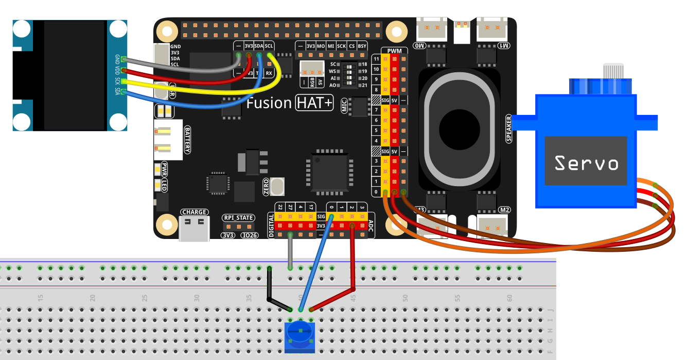

.. include:: /index.rst
   :start-after: start_hello_message
   :end-before: end_hello_message

.. _py_servo_angle_meter:

4.11 舵机角度计
================

**简介**

在本课程中，您将构建一个**舵机角度计** —— 一个使用电位器控制舵机，同时在 OLED 屏幕上显示当前角度的可视化舵机角度指示器。
电位器通过 Fusion HAT+ 的 ADC 接口提供模拟电压。
舵机根据此读数接收指令，128×64 I2C OLED 屏幕显示数值形式的舵机角度和在显示屏上平滑移动的图形条。

旋转电位器时，舵机在大约 -90° 到 +90° 之间摆动，OLED 实时更新。

----------------------------------------------

**所需材料**

本项目需要以下组件：

.. list-table::
    :widths: 30 20
    :header-rows: 1

    *   - 组件介绍
        - 购买链接
    *   - :ref:`cpn_wires`
        - |link_wires_buy|
    *   - :ref:`cpn_potentiometer`
        - |link_potentiometer_buy|
    *   - :ref:`cpn_servo`
        - |link_servo_buy|
    *   - :ref:`cpn_oled`
        - \-
    *   - :ref:`cpn_fusion_hat`
        - \-
    *   - 树莓派
        - \-

.. ----------------------------------------------

.. **电路图**

.. .. image:: img/fzz/4.11_servo_oled_sch.png
..    :width: 80%
..    :align: center

----------------------------------------------

**接线图**

参考接线图组装组件：

----------------------------------------------

**设置步骤**

#. 安装所需库：

   .. raw:: html

      <run></run>

   .. code-block:: shell

      sudo pip3 install adafruit-circuitpython-ssd1306 --break

#. 本教程中使用的所有示例代码均可在 ``ai-lab-kit`` 目录中找到：

   .. raw:: html

      <run></run>

   .. code-block:: shell

      cd ~/ai-lab-kit/python/
      sudo python3 4.11_ServoAngleMeter.py

#. 脚本运行时：

   * 旋转电位器可使舵机在 -90° 到 +90° 之间移动。
   * OLED 显示数值角度和一个移动条指针。
   * Ctrl+C 退出，将舵机重置为 0°，并清除显示。

----------------------------------------------

**代码**

以下是舵机角度计的 Python 脚本：

.. raw:: html

   <run></run>

.. code-block:: python

   from fusion_hat.adc import ADC
   from fusion_hat.servo import Servo
   from PIL import Image, ImageDraw, ImageFont
   import adafruit_ssd1306
   import board, time

   # ==== OLED setup ====
   WIDTH, HEIGHT = 128, 64
   i2c = board.I2C()
   oled = adafruit_ssd1306.SSD1306_I2C(WIDTH, HEIGHT, i2c, addr=0x3C)
   oled.fill(0)
   oled.show()

   # Framebuffer for drawing
   image = Image.new("1", (WIDTH, HEIGHT))
   draw = ImageDraw.Draw(image)
   font = ImageFont.load_default()

   def text_size(font, text):
       l, t, r, b = font.getbbox(text)
       return (r - l, b - t)

   # ==== Servo & potentiometer ====
   servo = Servo('P0')   # servo on port P0
   pot   = ADC('A0')     # potentiometer on A0 (0..4095)

   def linear_map(x, in_min, in_max, out_min, out_max):
       """Map x from one range to another."""
       return (x - in_min) * (out_max - out_min) / (in_max - in_min) + out_min

   # ---- bar layout ----
   BAR_TOP     = 40
   BAR_HEIGHT  = 10
   BAR_MARGINX = 6
   BAR_WIDTH   = WIDTH - BAR_MARGINX * 2
   BAR_CENTERX = BAR_MARGINX + BAR_WIDTH // 2

   def draw_bar(angle_deg):
       """Draw a centered horizontal bar and pointer for -90..90 degrees."""
       draw.rectangle((0, 0, WIDTH, HEIGHT), outline=0, fill=0)

       # Title
       title = "Servo Angle"
       tw, th = text_size(font, title)
       draw.text(((WIDTH - tw) // 2, 4), title, font=font, fill=255)

       # Numeric angle
       txt = f"{angle_deg:>4} deg"
       nw, nh = text_size(font, txt)
       draw.text(((WIDTH - nw) // 2, 20), txt, font=font, fill=255)

       # Bar outline
       draw.rectangle(
           (BAR_MARGINX, BAR_TOP, BAR_MARGINX + BAR_WIDTH - 1, BAR_TOP + BAR_HEIGHT),
           outline=255, fill=0
       )

       # Ticks
       for x in (BAR_MARGINX, BAR_CENTERX, BAR_MARGINX + BAR_WIDTH - 1):
           draw.line((x, BAR_TOP - 3, x, BAR_TOP + BAR_HEIGHT + 3), fill=255)

       # Map angle to pixel position
       pos = int(linear_map(angle_deg, -90, 90, BAR_MARGINX, BAR_MARGINX + BAR_WIDTH - 1))

       draw.line((pos, BAR_TOP - 2, pos, BAR_TOP + BAR_HEIGHT + 2), fill=255)

       # Fill direction highlight
       if pos >= BAR_CENTERX:
           draw.rectangle((BAR_CENTERX, BAR_TOP + 1, pos, BAR_TOP + BAR_HEIGHT - 1), fill=255)
       else:
           draw.rectangle((pos, BAR_TOP + 1, BAR_CENTERX, BAR_TOP + BAR_HEIGHT - 1), fill=255)

   try:
       while True:
           raw = pot.read()
           angle = int(linear_map(raw, 0, 4095, -90, 90))

           servo.angle(angle)

           draw_bar(angle)
           oled.image(image)
           oled.show()

           time.sleep(0.05)

   except KeyboardInterrupt:
       servo.angle(0)
       oled.fill(0)
       oled.show()
       print("\nExited.")

----------------------------------------------

**理解代码**

1. **导入**

   - ``ADC`` 从电位器读取模拟值
   - ``Servo`` 控制舵机旋转
   - ``PIL`` 处理所有 OLED 图形
   - ``adafruit_ssd1306`` 驱动 I2C OLED 显示
   - ``board`` 提供硬件 I/O
   - ``time`` 控制循环速度

2. **OLED 设置**

   初始化 128×64 SSD1306 OLED 并清除。
   离屏帧缓冲器用于在每帧推送到显示之前保存图形。

   .. code-block:: python

      # ==== OLED setup ====
      WIDTH, HEIGHT = 128, 64
      i2c = board.I2C()
      oled = adafruit_ssd1306.SSD1306_I2C(WIDTH, HEIGHT, i2c, addr=0x3C)
      oled.fill(0)
      oled.show()

      # Framebuffer for drawing
      image = Image.new("1", (WIDTH, HEIGHT))
      draw = ImageDraw.Draw(image)
      font = ImageFont.load_default()

3. **舵机和电位器**

   - 舵机连接到端口 ``P0``
   - 电位器连接到模拟输入 ``A0``
   - ADC 范围：``0..4095``

   .. code-block:: python

      # ==== Servo & potentiometer ====
      servo = Servo('P0')   # servo on port P0
      pot   = ADC('A0')     # potentiometer on A0 (0..4095)

4. **值映射**

   ``linear_map()`` 将电位器读数转换为 ``-90..90`` 范围内的舵机角度。

   .. code-block:: python

      def linear_map(x, in_min, in_max, out_min, out_max):
         """Map x from one range to another."""
         return (x - in_min) * (out_max - out_min) / (in_max - in_min) + out_min

5. **绘制 UI**

   ``draw_bar()`` 函数：

   * 清除显示
   * 绘制标题
   * 显示数值角度
   * 绘制水平条和刻度标记
   * 绘制指针和填充段，指示角度方向

   .. code-block:: python

      def draw_bar(angle_deg):
         """
         Draw a centered horizontal bar with a moving pointer.
         -90° maps to the far left, +90° to the far right.
         0° is at the bar center.
         """
         # Clear screen
         draw.rectangle((0, 0, WIDTH, HEIGHT), outline=0, fill=0)

         # Title
         title = "Servo Angle"
         tw, th = text_size(font, title)
         draw.text(((WIDTH - tw) // 2, 4), title, font=font, fill=255)

         # Numeric angle
         txt = f"{angle_deg:>4} deg"
         nw, nh = text_size(font, txt)
         draw.text(((WIDTH - nw) // 2, 20), txt, font=font, fill=255)

         # Static bar background
         draw.rectangle(
            (BAR_MARGINX, BAR_TOP, BAR_MARGINX + BAR_WIDTH - 1, BAR_TOP + BAR_HEIGHT),
            outline=255, fill=0
         )

         # Ticks: left (-90), center (0), right (+90)
         for x in (BAR_MARGINX, BAR_CENTERX, BAR_MARGINX + BAR_WIDTH - 1):
            draw.line((x, BAR_TOP - 3, x, BAR_TOP + BAR_HEIGHT + 3), fill=255)

         # Map angle (-90..90) to bar position
         pos = int(linear_map(angle_deg, -90, 90, BAR_MARGINX, BAR_MARGINX + BAR_WIDTH - 1))

         # Pointer: a solid vertical line
         draw.line((pos, BAR_TOP - 2, pos, BAR_TOP + BAR_HEIGHT + 2), fill=255)

         # Optional: filled segment from center to pointer (visualize direction)
         if pos >= BAR_CENTERX:
            draw.rectangle((BAR_CENTERX, BAR_TOP + 1, pos, BAR_TOP + BAR_HEIGHT - 1), outline=0, fill=255)
         else:
            draw.rectangle((pos, BAR_TOP + 1, BAR_CENTERX, BAR_TOP + BAR_HEIGHT - 1), outline=0, fill=255)

6. **主循环**

   脚本重复：

   * 读取 ADC
   * 计算舵机角度
   * 更新舵机
   * 绘制更新后的 UI
   * 刷新 OLED

   .. code-block:: python

      while True:
         # Read potentiometer (0..4095) and map to angle (-90..90)
         raw = pot.read()
         angle = int(linear_map(raw, 0, 4095, -90, 90))

         # Drive servo
         servo.angle(angle)

         # Draw UI and push to OLED
         draw_bar(angle)
         oled.image(image)
         oled.show()

         # Optional: print for debugging
         # print(f"pot={raw:4d} -> angle={angle:4d} deg")

         time.sleep(0.05)  # ~20 FPS

7. **优雅退出**

   Ctrl+C：

   - 舵机返回 0°
   - OLED 被清除

----------------------------------------------

**故障排除**

- **OLED 不显示任何内容**

  - 检查 I2C 接线
  - 验证设备地址是否为 ``0x3C``
  - 确保已安装所需的库

- **舵机不响应**

  - 检查舵机电源
  - 确认舵机连接到 ``P0``
  - 确保舵机信号线正确

- **运动范围不正确**

  调整：

  .. code-block:: python

     angle = int(linear_map(raw, 0, 4095, -90, 90))

- **OLED 闪烁**

  增加延时：

  .. code-block:: python

     time.sleep(0.1)

----------------------------------------------

**自己尝试**

1. **添加舵机角度限制**

   防止机械过度驱动。

2. **添加校准**

   动态检测最小/最大电位器值。

3. **平滑运动**

   应用缓动或低通滤波。

4. **更多显示信息**

   在角度旁边显示原始 ADC 值。

5. **警告**

   在极限值附近（±75°）闪烁指针。

这些补充将舵机角度计变成一个功能强大的输入可视化工具。
