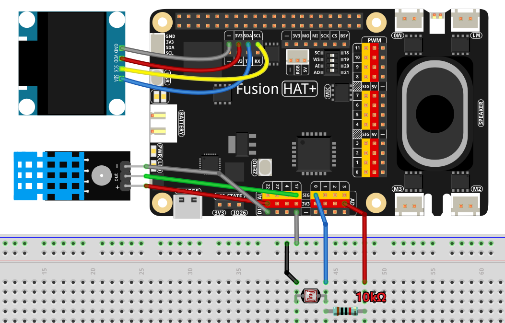

.. include:: /index.rst
   :start-after: start_hello_message
   :end-before: end_hello_message

.. _py_room_monitor:

4.12 Environment Monitor
==============================================

**Introduction**

In this lesson, you will build an **Environment Monitor Dashboard** that reads temperature, humidity, and ambient light level, and displays all values in real time on a 128×64 OLED screen.

This project uses:

- **DHT11 sensor** to measure temperature and humidity  
- **LDR (Light Dependent Resistor)** connected to the Fusion HAT+ ADC to measure light level  
- **SSD1306 OLED** to display environmental data and a dynamic light bar  

The screen updates continuously and shows a status indicator (``OK`` or ``TIMEOUT``) depending on whether the DHT11 provides a valid reading.

----------------------------------------------

**What You’ll Need**

The following components are required for this project:

.. list-table::
    :widths: 30 20
    :header-rows: 1

    *   - COMPONENT INTRODUCTION
        - PURCHASE LINK
    *   - :ref:`cpn_wires`
        - |link_wires_buy|
    *   - :ref:`cpn_humiture_sensor`
        - |link_humiture_buy|
    *   - :ref:`cpn_photoresistor`
        - |link_photoresistor_buy|
    *   - :ref:`cpn_oled`
        - \-
    *   - :ref:`cpn_fusion_hat`
        - \-
    *   - Raspberry Pi
        - \-

.. ----------------------------------------------

.. **Circuit Diagram**

.. .. image:: img/fzz/4.12_room_monitor_sch.png
..    :width: 80%
..    :align: center

----------------------------------------------

**Wiring Diagram**

Refer to the wiring diagram for assembling the components:

----------------------------------------------

**Setup Steps**

.. #. Create and activate a virtual environment for this project:

..    .. raw:: html

..       <run></run>

..    .. code-block:: shell

..       cd ~
..       python3 -m venv 4.12_room_monitor_env --system-site-packages
..       source 4.12_room_monitor_env/bin/activate

#. Install the required libraries:

   .. raw:: html

      <run></run>

   .. code-block:: shell

      sudo pip3 install adafruit-circuitpython-ssd1306 --break

#. Run the example code from the ``ai-lab-kit`` directory:

   .. raw:: html

      <run></run>

   .. code-block:: shell

      cd ~/ai-lab-kit/python/
      sudo python3 4.12_RoomMonitor.py

#. When the script runs:

   * The OLED shows temperature, humidity, and light percentage  
   * A horizontal bar graph displays the current light level  
   * “OK” or “TIMEOUT” indicates DHT11 read status  
   * Data updates every 0.5 seconds  
   * Press **Ctrl+C** to exit and clear the display

----------------------------------------------

**Code**

Here is the Python script for the environment monitor dashboard:

.. raw:: html

   <run></run>

.. code-block:: python

   import time
   from statistics import mean
   from fusion_hat.modules import DHT11
   from fusion_hat.adc import ADC
   from PIL import Image, ImageDraw, ImageFont
   import adafruit_ssd1306
   import board

   # ---------- Hardware configuration ----------
   DHT_PIN = 17          # BCM numbering for the DHT11 data pin
   LDR_CH  = 0           # ADC channel for LDR (e.g., 0,1, ...)
   I2C_ADDR = 0x3C       # OLED I2C address (commonly 0x3C)

   # ---------- OLED setup ----------
   WIDTH, HEIGHT = 128, 64
   i2c = board.I2C()
   oled = adafruit_ssd1306.SSD1306_I2C(WIDTH, HEIGHT, i2c, addr=I2C_ADDR)
   oled.fill(0)
   oled.show()

   # Framebuffer
   image = Image.new("1", (WIDTH, HEIGHT))
   draw = ImageDraw.Draw(image)
   font  = ImageFont.load_default()

   def text_size(font, text):
      l, t, r, b = font.getbbox(text)
      return (r - l, b - t)

   # ---------- Sensors ----------
   dht = DHT11(pin=DHT_PIN)
   ldr = ADC(LDR_CH)

   # ---------- Light normalization ----------
   # Map ADC raw (0..4095) to percentage (0..100). You can adjust the calibration
   # range to your circuit by putting typical min/max readings below:
   LDR_RAW_MIN = 0       # raw value in darkness  (tune if needed)
   LDR_RAW_MAX = 4095    # raw value in bright light (tune if needed)

   def clamp(v, vmin, vmax):
      return vmax if v > vmax else vmin if v < vmin else v

   def linear_map(x, in_min, in_max, out_min, out_max):
      if in_max == in_min:
         return out_min
      return (x - in_min) * (out_max - out_min) / (in_max - in_min) + out_min

   # Simple moving average for light to reduce flicker
   _light_window = []

   def light_percent(raw):
      """Convert raw ADC to smoothed light percentage."""
      global _light_window
      # Windowed average of last few samples
      _light_window.append(raw)
      if len(_light_window) > 5:
         _light_window.pop(0)
      smooth_raw = int(mean(_light_window))
      pct = linear_map(smooth_raw, LDR_RAW_MIN, LDR_RAW_MAX, 0, 100)
      return int(clamp(pct, 0, 100)), smooth_raw

   # ---------- UI drawing ----------
   BAR_W, BAR_H = WIDTH - 16, 10   # width/height for the light bar
   BAR_X, BAR_Y = 8, HEIGHT - 12   # position of the light bar

   def draw_bar(x, y, w, h, percent):
      """Draw a horizontal bar [0..100]%."""
      # Border
      draw.rectangle((x, y, x + w, y + h), outline=255, fill=0)
      # Fill
      fill_w = int((w - 2) * percent / 100.0)
      if fill_w > 0:
         draw.rectangle((x + 1, y + 1, x + 1 + fill_w, y + h - 1), outline=0, fill=255)

   def render_screen(temp_c, hum_pct, light_pct, raw_adc, status_text="OK"):
      """Render all text and graphics to the framebuffer."""
      draw.rectangle((0, 0, WIDTH, HEIGHT), outline=0, fill=0)

      # Title
      title = "Env Monitor"
      tw, th = text_size(font, title)
      draw.text(((WIDTH - tw) // 2, 0), title, font=font, fill=255)

      # Temperature & Humidity lines
      line1 = f"Temp: {temp_c:.1f} degC"
      line2 = f"Hum : {hum_pct:.1f} %"
      draw.text((2, 16), line1, font=font, fill=255)
      draw.text((2, 28), line2, font=font, fill=255)

      # Light line and bar
      line3 = f"Light: {light_pct:3d}%  (raw {raw_adc})"
      draw.text((2, 40), line3, font=font, fill=255)
      draw_bar(BAR_X, BAR_Y, BAR_W, BAR_H, light_pct)

      # Status (e.g., "OK" or "TIMEOUT")
      sw, sh = text_size(font, status_text)
      draw.text((WIDTH - sw - 2, 0), status_text, font=font, fill=255)

   # ---------- Main loop ----------
   # Keep last good readings so display stays meaningful if a DHT read times out
   last_temp = 0.0
   last_hum  = 0.0

   try:
      while True:
         # Read DHT11 (may return None / timeout)
         status = "OK"
         result = dht.read()
         if result:
               hum, temp = result  # order per your DHT11 wrapper: (humidity, temperature)
               last_temp, last_hum = float(temp), float(hum)
         else:
               status = "TIMEOUT"

         # Read LDR
         raw = ldr.read()
         light_pct, raw_smooth = light_percent(raw)

         # Draw to OLED
         render_screen(last_temp, last_hum, light_pct, raw_smooth, status_text=status)
         oled.image(image)
         oled.show()

         # Console log (optional)
         # print(f"T={last_temp:.1f}C  H={last_hum:.1f}%  Light={light_pct}% (raw {raw_smooth})  [{status}]")

         time.sleep(0.5)

   except KeyboardInterrupt:
      oled.fill(0)
      oled.show()
      print("\nExited.")

----------------------------------------------

**Understanding the Code**

1. **Imports**

   The script uses several modules:

   - ``DHT11`` for temperature/humidity sensing  
   - ``ADC`` to read LDR brightness from analog input  
   - ``PIL`` for OLED drawing  
   - ``adafruit_ssd1306`` for OLED control  
   - ``mean()`` for smoothing light readings  

2. **OLED Setup**

   A 128×64 SSD1306 OLED is initialized using I2C.  
   A framebuffer (Pillow image) is used to draw all UI elements before sending them to the display.

   .. code-block:: python

      # ---------- OLED setup ----------
      WIDTH, HEIGHT = 128, 64
      i2c = board.I2C()
      oled = adafruit_ssd1306.SSD1306_I2C(WIDTH, HEIGHT, i2c, addr=I2C_ADDR)
      oled.fill(0)
      oled.show()

      # Framebuffer
      image = Image.new("1", (WIDTH, HEIGHT))
      draw = ImageDraw.Draw(image)
      font  = ImageFont.load_default()

3. **Sensor Reading**

   - The DHT11 may occasionally fail. When this happens, the script shows ``TIMEOUT`` but retains the last valid values.  
   - The LDR raw reading (0..4095) is smoothed using a moving average to reduce flicker.

   .. code-block:: python

      # Read DHT11 (may return None / timeout)
      status = "OK"
      result = dht.read()
      if result:
         hum, temp = result  # order per your DHT11 wrapper: (humidity, temperature)
         last_temp, last_hum = float(temp), float(hum)
      else:
         status = "TIMEOUT"

      # Read LDR
      raw = ldr.read()
      light_pct, raw_smooth = light_percent(raw)

4. **Light Mapping**

   ``linear_map()`` converts the raw ADC value into a percentage (0..100%).  
   ``clamp()`` ensures the final value stays in range.

   .. code-block:: python

      def light_percent(raw):
         """Convert raw ADC to smoothed light percentage."""
         global _light_window
         # Windowed average of last few samples
         _light_window.append(raw)
         if len(_light_window) > 5:
            _light_window.pop(0)
         smooth_raw = int(mean(_light_window))
         pct = linear_map(smooth_raw, LDR_RAW_MIN, LDR_RAW_MAX, 0, 100)
         return int(clamp(pct, 0, 100)), smooth_raw

5. **Rendering the Dashboard**

   The OLED displays:

   - Title  
   - Temperature (°C)  
   - Humidity (%)  
   - Light percentage and raw ADC value  
   - A horizontal bar graph for light intensity  
   - Status text indicating sensor health  

   .. code-block:: python

      def render_screen(temp_c, hum_pct, light_pct, raw_adc, status_text="OK"):
         """Render all text and graphics to the framebuffer."""
         draw.rectangle((0, 0, WIDTH, HEIGHT), outline=0, fill=0)

         # Title
         title = "Env Monitor"
         tw, th = text_size(font, title)
         draw.text(((WIDTH - tw) // 2, 0), title, font=font, fill=255)

         # Temperature & Humidity lines
         line1 = f"Temp: {temp_c:.1f} degC"
         line2 = f"Hum : {hum_pct:.1f} %"
         draw.text((2, 16), line1, font=font, fill=255)
         draw.text((2, 28), line2, font=font, fill=255)

         # Light line and bar
         line3 = f"Light: {light_pct:3d}%  (raw {raw_adc})"
         draw.text((2, 40), line3, font=font, fill=255)
         draw_bar(BAR_X, BAR_Y, BAR_W, BAR_H, light_pct)

         # Status (e.g., "OK" or "TIMEOUT")
         sw, sh = text_size(font, status_text)
         draw.text((WIDTH - sw - 2, 0), status_text, font=font, fill=255)

6. **Main Loop**

   Every 0.5 seconds:

   - DHT11 is read  
   - LDR is read and smoothed  
   - Screen is updated  
   - Optional debug logs can be printed  

7. **Graceful Shutdown**

   Upon Ctrl+C:

   - OLED is cleared  
   - A message is printed  

----------------------------------------------

**Troubleshooting**

- **DHT11 returns TIMEOUT frequently**

  - Increase delay between reads  
  - Check wiring and signal pin  
  - Ensure pull-up resistor is used if needed  

- **OLED stays blank**

  - Verify I2C address (``0x3C``)  
  - Check SDA/SCL wiring  
  - Ensure libraries are installed correctly  

- **Light percentage seems inverted**

  - Swap ``LDR_RAW_MIN`` and ``LDR_RAW_MAX``  
  - Check LDR circuit orientation (voltage divider)  

- **Display flicker**

  - Increase light smoothing window  
  - Reduce refresh rate (use ``time.sleep(1.0)``)

----------------------------------------------

**Try It Yourself**

1. **Add Fahrenheit display (°F)**  

   Show both °C and °F on the screen.

2. **Add max/min history**  

   Track highest/lowest temperature, humidity, or brightness.

3. **Add alert system**  

   Flash the OLED border when humidity is too low or temperature too high.

4. **Add graphing mode**  

   Draw scrolling graphs for temperature and humidity trends.

5. **Add animated icons**  

   Use small bitmaps for sun, rain, thermometer, humidity droplets, etc.

These ideas turn the simple environment monitor into a feature-rich environmental dashboard.

