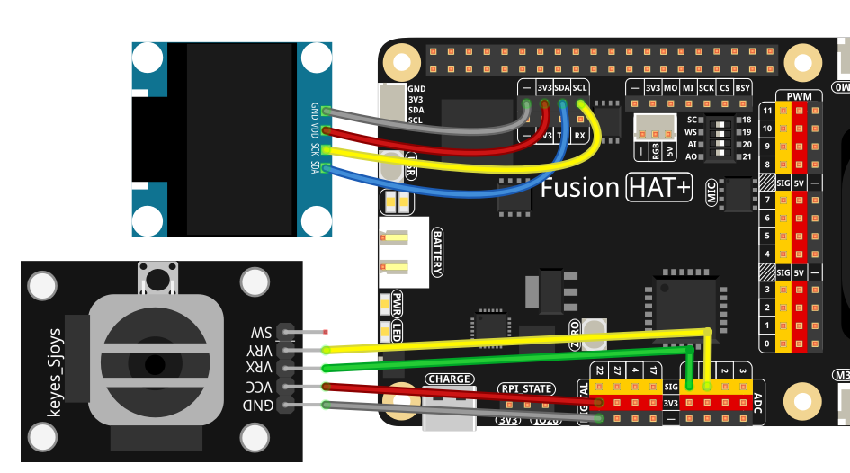

.. include:: /index.rst
   :start-after: start_hello_message
   :end-before: end_hello_message

.. _py_joystick_eye:

4.13 ジョイスティック制御アイ
=================================

**はじめに**

このレッスンでは、128×64 の SSD1306 OLED 画面に表示される **Joystick-Controlled Eye** を作成します。  
2 軸アナログジョイスティックから X/Y 方向の入力を取得し、Fusion HAT+ の ADC チャンネルを使って読み取ります。  
OLED には、ジョイスティックの方向に応じて瞳が滑らかに動くスタイライズされた「目」が表示されます。

このプロジェクトでは、以下を学べます。

- 多軸アナログ入力の読み取り  
- 滑らかな値の正規化とデッドゾーン処理  
- 楕円を用いた幾何学的な制約  
- モノクロ OLED 上でのリアルタイムグラフィック描画  

ジョイスティックを動かすと、虹彩と瞳孔は外側の強膜の境界を越えることなく、目の中を滑らかに移動します。

----------------------------------------------

**必要なもの**

このプロジェクトで必要なコンポーネントは以下のとおりです。

.. list-table::
    :widths: 30 20
    :header-rows: 1

    *   - COMPONENT INTRODUCTION
        - PURCHASE LINK
    *   - :ref:`cpn_wires`
        - |link_wires_buy|
    *   - :ref:`cpn_joystick`
        - \-
    *   - :ref:`cpn_oled`
        - \-
    *   - :ref:`cpn_fusion_hat`
        - \-
    *   - Raspberry Pi
        - \-

----------------------------------------------

**配線図**

各コンポーネントの組み立ては、以下の配線図を参照してください。

----------------------------------------------

**セットアップ手順**

#. 必要なライブラリをインストールします。

   .. raw:: html

      <run></run>

   .. code-block:: shell

      sudo pip3 install adafruit-circuitpython-ssd1306 --break

#. ``ai-lab-kit`` ディレクトリからサンプルを実行します。

   .. raw:: html

      <run></run>

   .. code-block:: shell

      cd ~/ai-lab-kit/python/
      sudo python3 4.13_JoystickEye.py

#. スクリプトを実行すると、次のように動作します。

   * ジョイスティックを左／右／上／下に動かすと、それに応じて瞳が移動します  
   * 瞳の動きは滑らかに補正され、楕円形の目の内側に制限されます  
   * 表示はおよそ **50 FPS** で更新されます  
   * **Ctrl+C** を押すと終了します  

----------------------------------------------

**コード**

以下は、Joystick-Controlled Eye の Python スクリプトです。

.. raw:: html

   <run></run>

.. code-block:: python

   #!/usr/bin/env python3
   # -*- coding: utf-8 -*-

   """
   Joystick-controlled eye on a 128x64 SSD1306 OLED.
   - Joystick X/Y on ADC A0/A1 (0..4095)
   - Pupil moves inside a drawn eye based on joystick deflection
   """

   import time
   from math import sqrt
   from fusion_hat.adc import ADC
   from PIL import Image, ImageDraw, ImageFont
   import adafruit_ssd1306
   import board

   # ===== OLED setup =====
   WIDTH, HEIGHT = 128, 64
   i2c = board.I2C()
   oled = adafruit_ssd1306.SSD1306_I2C(WIDTH, HEIGHT, i2c, addr=0x3C)
   oled.fill(0)
   oled.show()

   # Framebuffer for drawing
   image = Image.new("1", (WIDTH, HEIGHT))
   draw = ImageDraw.Draw(image)
   font = ImageFont.load_default()

   # ===== Joystick (two ADC channels) =====
   # Adjust channel names to your hardware if needed (e.g., 'A1','A2')
   joy_x = ADC('A0')  # X axis
   joy_y = ADC('A1')  # Y axis

   # ===== Mapping helpers =====
   def linear_map(x, in_min, in_max, out_min, out_max):
      """Map x from one range to another (float)."""
      return (x - in_min) * (out_max - out_min) / (in_max - in_min) + out_min

   def clamp(v, vmin, vmax):
      """Clamp v to [vmin, vmax]."""
      return vmax if v > vmax else vmin if v < vmin else v

   # ===== Eye layout (tweak to your taste) =====
   # Eye center and sizes
   EYE_CX, EYE_CY = WIDTH // 2, HEIGHT // 2
   EYE_W, EYE_H   = 90, 48          # outer ellipse width/height (sclera)
   IRIS_R         = 10              # iris radius (white ring, optional)
   PUPIL_R        = 7               # pupil radius (black)
   BORDER         = 2               # outer eye border thickness in pixels

   # Pupil movement limits (keep pupil inside sclera with some margin)
   # We'll approximate the inside of the eye as an ellipse and limit the pupil center
   PUPIL_MARGIN = PUPIL_R + 3
   MAX_X = (EYE_W // 2) - PUPIL_MARGIN
   MAX_Y = (EYE_H // 2) - PUPIL_MARGIN

   # ===== Joystick normalization settings =====
   # Joystick nominal center near 2048; define a dead zone and smoothing
   ADC_MIN, ADC_MAX = 0.0, 4095.0
   ADC_CENTER_X     = 2048.0
   ADC_CENTER_Y     = 2048.0
   DEADZONE         = 120.0     # +/- counts considered centered (no move)
   SMOOTH_ALPHA     = 0.35      # EMA smoothing factor for normalized values

   # State for smoothing
   nx_smooth, ny_smooth = 0.0, 0.0

   def read_joystick_norm():
      """
      Read joystick and produce normalized values in [-1, 1] for X and Y,
      with dead zone and smoothing. Y is inverted so up is positive.
      """
      global nx_smooth, ny_smooth

      rx = float(joy_x.read())
      ry = float(joy_y.read())

      # Raw offset from center
      dx = rx - ADC_CENTER_X
      dy = ry - ADC_CENTER_Y

      # Deadzone
      if abs(dx) < DEADZONE: dx = 0.0
      if abs(dy) < DEADZONE: dy = 0.0

      # Normalize to [-1, 1]
      # Use the larger of (center-min) / (max-center) to reduce asymmetry
      span_x_pos = ADC_MAX - ADC_CENTER_X
      span_x_neg = ADC_CENTER_X - ADC_MIN
      span_y_pos = ADC_MAX - ADC_CENTER_Y
      span_y_neg = ADC_CENTER_Y - ADC_MIN

      nx = dx / (span_x_pos if dx >= 0 else span_x_neg) if dx != 0 else 0.0
      ny = dy / (span_y_pos if dy >= 0 else span_y_neg) if dy != 0 else 0.0

      # Invert Y so pushing stick up moves pupil up
      ny = -ny

      # Clamp to [-1, 1]
      nx = clamp(nx, -1.0, 1.0)
      ny = clamp(ny, -1.0, 1.0)

      # Exponential smoothing
      nx_smooth = SMOOTH_ALPHA * nx + (1.0 - SMOOTH_ALPHA) * nx_smooth
      ny_smooth = SMOOTH_ALPHA * ny + (1.0 - SMOOTH_ALPHA) * ny_smooth

      # Re-clamp after smoothing
      nx_smooth_clamped = clamp(nx_smooth, -1.0, 1.0)
      ny_smooth_clamped = clamp(ny_smooth, -1.0, 1.0)
      return nx_smooth_clamped, ny_smooth_clamped

   def pupil_target_from_norm(nx, ny):
      """
      Map normalized joystick values [-1..1] to a legal pupil center inside the eye.
      We limit by ellipse equation (x/MAX_X)^2 + (y/MAX_Y)^2 <= 1.
      If outside, project back to the ellipse boundary.
      """
      # Proposed offsets
      px = nx * MAX_X
      py = ny * MAX_Y

      # Check ellipse boundary; if outside, project back
      if (px*px) / (MAX_X*MAX_X) + (py*py) / (MAX_Y*MAX_Y) > 1.0:
         # Normalize direction to ellipse edge
         # Scale so that (px/MAX_X, py/MAX_Y) lies on unit circle
         k = 1.0 / sqrt((px*px) / (MAX_X*MAX_X) + (py*py) / (MAX_Y*MAX_Y))
         px *= k
         py *= k

      # Final pupil center
      cx = int(EYE_CX + px)
      cy = int(EYE_CY + py)
      return cx, cy

   def draw_eye(cx, cy):
      """
      Draw the eye (sclera outline + filled sclera) and the pupil at (cx, cy).
      Monochrome: 1 = white (ON), 0 = black (OFF).
      """
      draw.rectangle((0, 0, WIDTH, HEIGHT), outline=0, fill=0)

      # Outer eye (white sclera with border)
      # Outer ellipse
      x0 = EYE_CX - EYE_W // 2
      y0 = EYE_CY - EYE_H // 2
      x1 = EYE_CX + EYE_W // 2
      y1 = EYE_CY + EYE_H // 2

      # Border: draw multiple outlines to simulate thickness
      for t in range(BORDER):
         draw.ellipse((x0 - t, y0 - t, x1 + t, y1 + t), outline=1, fill=0)
      # Filled sclera (white)
      draw.ellipse((x0 + 1, y0 + 1, x1 - 1, y1 - 1), outline=0, fill=1)

      # Optional iris ring (white ring around pupil); comment out if undesired
      if IRIS_R > PUPIL_R:
         draw.ellipse((cx - IRIS_R, cy - IRIS_R, cx + IRIS_R, cy + IRIS_R), outline=0, fill=0)
         draw.ellipse((cx - (IRIS_R - 2), cy - (IRIS_R - 2), cx + (IRIS_R - 2), cy + (IRIS_R - 2)), outline=0, fill=1)

      # Pupil (black)
      draw.ellipse((cx - PUPIL_R, cy - PUPIL_R, cx + PUPIL_R, cy + PUPIL_R), outline=0, fill=0)

      # Optional text (for debugging)
      # txt = "X/Y"
      # tw, th = font.getsize(txt)
      # draw.text((2, 2), txt, font=font, fill=1)

   def main():
      try:
         while True:
               # Read joystick → normalized [-1..1]
               nx, ny = read_joystick_norm()
               # Compute pupil center within eye bounds
               cx, cy = pupil_target_from_norm(nx, ny)
               # Draw and show
               draw_eye(cx, cy)
               oled.image(image)
               oled.show()
               time.sleep(0.02)  # ~50 FPS
      except KeyboardInterrupt:
         oled.fill(0)
         oled.show()
         print("\nExited.")

   if __name__ == "__main__":
      main()

----------------------------------------------

**コードの解説**

1. **ジョイスティックのアナログ読み取り**

   2 つの ADC チャンネルで X 軸と Y 軸の位置 ``(0..4095)`` を読み取ります。  
   スクリプトは、これらの値を ``[-1..1]`` の正規化された移動量に変換します。変換時には次の処理を行います。

   - デッドゾーン処理  
   - 方向の反転（上方向 = 正の Y）  
   - 指数移動平均（EMA）による平滑化  

   .. code-block:: python

      def read_joystick_norm():
         """
         Read joystick and produce normalized values in [-1, 1] for X and Y,
         with dead zone and smoothing. Y is inverted so up is positive.
         """
         global nx_smooth, ny_smooth

         rx = float(joy_x.read())
         ry = float(joy_y.read())

         # Raw offset from center
         dx = rx - ADC_CENTER_X
         dy = ry - ADC_CENTER_Y

      ...

2. **目の幾何形状**

   目は次の要素で描画されます。

   - 強膜（白目）を表す楕円  
   - 必要に応じた外枠  
   - 必要に応じた虹彩リング  
   - 黒い瞳孔  

   .. code-block:: python

      def draw_eye(cx, cy):
         """
         Draw the eye (sclera outline + filled sclera) and the pupil at (cx, cy).
         Monochrome: 1 = white (ON), 0 = black (OFF).
         """
         draw.rectangle((0, 0, WIDTH, HEIGHT), outline=0, fill=0)

         # Outer eye (white sclera with border)
         # Outer ellipse
         x0 = EYE_CX - EYE_W // 2
         y0 = EYE_CY - EYE_H // 2
         x1 = EYE_CX + EYE_W // 2
         y1 = EYE_CY + EYE_H // 2

         ... 

3. **瞳孔の移動制約**

   瞳孔の中心は、次の楕円方程式によって制限されます。

   ``(px/MAX_X)^2 + (py/MAX_Y)^2 <= 1``

   入力によって瞳孔が目の外へ出ようとした場合は、スクリプトが楕円境界上に投影して戻します。

   .. code-block:: python

      def pupil_target_from_norm(nx, ny):
         """
         Map normalized joystick values [-1..1] to a legal pupil center inside the eye.
         We limit by ellipse equation (x/MAX_X)^2 + (y/MAX_Y)^2 <= 1.
         If outside, project back to the ellipse boundary.
         """
         # Proposed offsets
         px = nx * MAX_X
         py = ny * MAX_Y

         # Check ellipse boundary; if outside, project back
         if (px*px) / (MAX_X*MAX_X) + (py*py) / (MAX_Y*MAX_Y) > 1.0:
         ...

4. **描画処理**

   各フレームで次の処理を行います。

   - 目の背景を再描画する  
   - 瞳孔の位置を計算する  
   - 画像バッファを OLED に送る  
   - 約 50 FPS で画面を更新する  

5. **メインループ**

   ジョイスティックを継続的に読み取り → 正規化 → 瞳孔位置を計算 → 目を再描画 → 表示を更新、という流れで動作します。

----------------------------------------------

**トラブルシューティング**

- **ジョイスティックの動きがぎこちない**

  - ``SMOOTH_ALPHA`` を大きくしてください  
  - ``DEADZONE`` を大きくしてください  

- **目が横長すぎる／小さすぎる**

  次の値を調整してください。

  .. code-block:: python

     EYE_W, EYE_H = 90, 48

- **瞳孔が目の外にはみ出す**

  次の値を大きくしてください。

  .. code-block:: python

     PUPIL_MARGIN = PUPIL_R + 3

- **ジョイスティックの軸が逆になっている**

  ADC チャンネルを入れ替えるか、符号を反転してください。

----------------------------------------------

**試してみよう**

1. **まばたきアニメーション**  

   一定時間ごとにまぶたを閉じたり開いたりする動作を追加します。

2. **怒り顔／笑顔の眉モード**  

   ジョイスティック入力に応じて、スタイライズした眉を描画します。

3. **ドット追跡ゲーム**  

   動くターゲットのドットを追加し、目でそれを「追う」ようにします。

4. **ボタンでモード切り替え**  

   ロボットアイ、カートゥーンアイ、キャットアイなど、目のスタイルを切り替えます。

5. **複数の目を表示**  

   2 つの目を同時に描画し、同じように動かしたり別々に動かしたりします。

これらの拡張により、シンプルなジョイスティック制御の目を、強力な OLED アニメーションおよびインタラクションデモへ発展させることができます。

