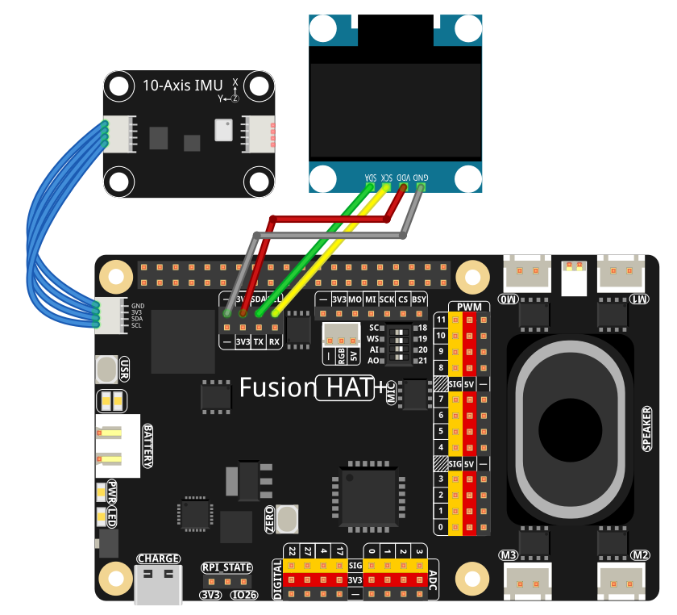

.. include:: /index.rst
   :start-after: start_hello_message
   :end-before: end_hello_message

.. _py_gravity_cube:

4.14 重力立方体
===============

**简介**

在本课程中，您将构建一个显示在 128×64 SSD1306 OLED 上的**重力参考 3D 立方体**，由 **IMU** 驱动。
立方体根据板子相对于重力的方向倾斜，使用仅基于加速度计的横滚角和俯仰角。

主要特点：

- 正交 3D 立方体渲染（无透视失真）
- 方向由加速度计相对于初始基准线的读数推导
- 一个立方体面被填充，使前后方向易于辨认
- 两个配置标志让您翻转 X/Y 方向以匹配您的物理安装

当您倾斜板子时，立方体平滑旋转，提供设备方向的可视化直观展示。

----------------------------------------------

**所需材料**

本项目需要以下组件：

.. list-table::
    :widths: 30 20
    :header-rows: 1

    *   - 组件介绍
        - 购买链接
    *   - :ref:`cpn_wires`
        - |link_wires_buy|
    *   - :ref:`cpn_10_axis_imu`
        - \-
    *   - :ref:`cpn_oled`
        - \-
    *   - :ref:`cpn_fusion_hat`
        - \-
    *   - 树莓派
        - \-

.. ----------------------------------------------

.. **电路图**

.. .. image:: img/fzz/4.14_gravity_cube_sch.png
..    :width: 80%
..    :align: center

----------------------------------------------

**接线图**

参考接线图组装组件：

----------------------------------------------

**设置步骤**

#. 安装 OLED 库：

   .. raw:: html

      <run></run>

   .. code-block:: shell

      sudo pip3 install adafruit-circuitpython-ssd1306 --break

#. 安装 IMU 库：

   .. raw:: html

      <run></run>

   .. code-block:: shell

      sudo pip install git+https://github.com/sunfounder/sunfounder-imu-python.git --break-system-packages

#. 从 ``ai-lab-kit`` 目录运行示例：

   .. raw:: html

      <run></run>

   .. code-block:: shell

      cd ~/ai-lab-kit/python/
      sudo python3 4.14_Cube.py

#. 脚本运行时：

   * 加速度计提供重力参考的 X/Y/Z 数据。
   * 代码计算相对于初始基准线的横滚角和俯仰角（当前方向变为 0°、0°）。
   * 在 OLED 上绘制一个带有**填充前面**的线框立方体。
   * 倾斜板子会使屏幕上的立方体旋转。
   * 按 **Ctrl+C** 退出；OLED 被清除。

----------------------------------------------

**代码**

以下是重力参考立方体的 Python 脚本：

.. raw:: html

   <run></run>

.. code-block:: python

   import time
   import math
   from PIL import Image, ImageDraw, ImageFont
   import adafruit_ssd1306
   import board
   from sunfounder_imu import IMU

   # ========== User-configurable axis flip ==========
   # Flip X/Y to match your physical mounting and perceived motion on the OLED.
   # If motion looks reversed on a given axis, set that axis to True.
   FLIP_X = False   # True = invert roll direction on display; False = normal
   FLIP_Y = False   # True = invert pitch direction on display; False = normal

   # ========== OLED setup ==========
   WIDTH, HEIGHT = 128, 64
   i2c = board.I2C()
   oled = adafruit_ssd1306.SSD1306_I2C(WIDTH, HEIGHT, i2c, addr=0x3C)
   oled.fill(0)
   oled.show()

   # Framebuffer
   image = Image.new("1", (WIDTH, HEIGHT))
   draw = ImageDraw.Draw(image)
   font = ImageFont.load_default()

   # ========== IMU initialization ==========
   imu = IMU()

   # ========== Cube model ==========
   CUBE_SIZE = 9  # smaller cube for 128x64 OLED

   VERTS = [
      (-1, -1, -1), (+1, -1, -1), (+1, +1, -1), (-1, +1, -1),
      (-1, -1, +1), (+1, -1, +1), (+1, +1, +1), (-1, +1, +1),
   ]
   EDGES = [
      (0,1),(1,2),(2,3),(3,0),
      (4,5),(5,6),(6,7),(7,4),
      (0,4),(1,5),(2,6),(3,7)
   ]
   FRONT_FACE = [4,5,6,7]  # +Z face gets filled

   # ========== Projection (orthographic) ==========
   def project_point(p, scale=CUBE_SIZE, cx=WIDTH//2, cy=HEIGHT//2):
      """
      Orthographic projection. We flip the screen Y here so that positive 3D Y
      appears upward on the OLED (more intuitive for tilt).
      """
      x, y, _z = p
      return int(cx + scale * x), int(cy - scale * y)

   # ========== Math / orientation helpers ==========
   def ema(prev, new, alpha):
      """Exponential smoothing to reduce jitter."""
      return alpha * new + (1.0 - alpha) * prev

   def rotate_point(p, roll, pitch, yaw=0.0):
      """Rotate p=(x,y,z) by Rx(roll)*Ry(pitch)*Rz(yaw). Yaw fixed to 0 for gravity-only."""
      x, y, z = p
      # Rx
      cr, sr = math.cos(roll), math.sin(roll)
      y, z = (y*cr - z*sr), (y*sr + z*cr)
      # Ry
      cp, sp = math.cos(pitch), math.sin(pitch)
      x, z = (x*cp + z*sp), (-x*sp + z*cp)
      # Rz (kept for completeness)
      if yaw:
         cz, sz = math.cos(yaw), math.sin(yaw)
         x, y = (x*cz - y*sz), (x*sz + y*cz)
      return (x, y, z)

   def accel_to_rp(ax, ay, az):
      """
      Convert accelerometer (m/s²) to roll/pitch in radians (gravity-referenced).
      roll  = rotation around X (right-hand rule)
      pitch = rotation around Y
      """
      # Convert from m/s² to g (9.80665 m/s² = 1g)
      ax_g = ax / 9.80665
      ay_g = ay / 9.80665
      az_g = az / 9.80665

      g = math.sqrt(ax_g*ax_g + ay_g*ay_g + az_g*az_g) + 1e-9
      axn, ayn, azn = ax_g / g, ay_g / g, az_g / g
      roll  = math.atan2(ayn, azn)
      pitch = math.atan2(-axn, math.sqrt(ayn*ayn + azn*azn))
      return roll, pitch

   def draw_cube(roll, pitch, yaw=0.0, annotate=True):
      """Render the cube with one filled face."""
      draw.rectangle((0, 0, WIDTH, HEIGHT), outline=0, fill=0)

      rverts = [rotate_point(v, roll, pitch, yaw) for v in VERTS]
      pts = [project_point(v) for v in rverts]

      # Filled front face
      face_xy = [pts[i] for i in FRONT_FACE]
      draw.polygon(face_xy, outline=255, fill=255)

      # Wireframe edges
      for a, b in EDGES:
         x0, y0 = pts[a]
         x1, y1 = pts[b]
         draw.line((x0, y0, x1, y1), fill=255)

      if annotate:
         rdeg = math.degrees(roll)
         pdeg = math.degrees(pitch)
         draw.text((2, 2), f"R:{rdeg:+.0f}  P:{pdeg:+.0f}", font=font, fill=255)

   # ========== Baseline & smoothing ==========
   baseline_set = False
   roll0 = pitch0 = 0.0

   ROLL_EMA  = 0.20
   PITCH_EMA = 0.20
   roll_disp = pitch_disp = 0.0

   try:
      while True:
         # Read IMU data
         data = imu.read()

         # Extract accelerometer data (in m/s²)
         ax = data['accel_x']
         ay = data['accel_y']
         az = data['accel_z']

         # Absolute roll/pitch from gravity
         roll_abs, pitch_abs = accel_to_rp(ax, ay, az)

         # First reading defines baseline (0°,0°)
         if not baseline_set:
               roll0, pitch0 = roll_abs, pitch_abs
               baseline_set = True

         # Relative orientation
         roll_rel  = roll_abs  - roll0
         pitch_rel = pitch_abs - pitch0

         # Apply user flips to match perceived direction on OLED
         if FLIP_X:
               roll_rel = -roll_rel
         if FLIP_Y:
               pitch_rel = -pitch_rel

         # Smooth
         roll_disp  = ema(roll_disp,  roll_rel,  ROLL_EMA)
         pitch_disp = ema(pitch_disp, pitch_rel, PITCH_EMA)

         # Render (yaw fixed to 0 in gravity-only mode)
         draw_cube(roll_disp, pitch_disp, yaw=0.0, annotate=True)

         # Show on OLED
         oled.image(image)
         oled.show()

         time.sleep(0.02)

   except KeyboardInterrupt:
      oled.fill(0)
      oled.show()
      print("\nExited.")

----------------------------------------------

**理解代码**

1. **IMU 初始化**

   脚本从 Fusion HAT+ 模块创建一个 ``IMU`` 实例。
   加速度计提供原始的 X、Y、Z 加速度值，单位为 m/s²。

2. **重力参考角度**

   ``accel_to_rp()`` 将加速度计读数转换为**横滚角**和**俯仰角**：

   - 横滚角：绕 **X** 轴旋转
   - 俯仰角：绕 **Y** 轴旋转

   仅使用重力，因此无法确定偏航角（固定为 0）。

   .. code-block:: python

      def accel_to_rp(ax, ay, az):
         """
         Convert accelerometer (m/s²) to roll/pitch in radians (gravity-referenced).
         roll  = rotation around X (right-hand rule)
         pitch = rotation around Y
         """
         # Convert from m/s² to g (9.80665 m/s² = 1g)
         ax_g = ax / 9.80665
         ay_g = ay / 9.80665
         az_g = az / 9.80665

         g = math.sqrt(ax_g*ax_g + ay_g*ay_g + az_g*az_g) + 1e-9
         axn, ayn, azn = ax_g / g, ay_g / g, az_g / g
         roll  = math.atan2(ayn, azn)
         pitch = math.atan2(-axn, math.sqrt(ayn*ayn + azn*azn))
         return roll, pitch

3. **基准线方向**

   在第一次读取时：

   - 当前的 ``roll`` 和 ``pitch`` 被存储为基准线（``roll0``、``pitch0``）。
   - 后续方向表示为**相对**角度：

     .. code-block:: python

        roll_rel  = roll_abs  - roll0
        pitch_rel = pitch_abs - pitch0

   这样，设备的初始位置变为 **0°、0°**。

4. **用户可配置的轴翻转**

   两个标志 ``FLIP_X`` 和 ``FLIP_Y`` 允许您反转每个轴上的运动：

   - 如果横滚角在显示上感觉相反，设置 ``FLIP_X = True``
   - 如果俯仰角感觉相反，设置 ``FLIP_Y = True``

   这在您的 IMU 以不同方向旋转或接线时很有帮助。

5. **平滑（EMA）**

   ``ema()`` 函数应用**指数移动平均**平滑：

   - 减少传感器噪声引起的抖动
   - 使立方体运动看起来更自然

   ``ROLL_EMA`` 和 ``PITCH_EMA`` 控制运动的响应速度与平滑程度。

   .. code-block:: python

      def ema(prev, new, alpha):
         """Exponential smoothing to reduce jitter."""
         return alpha * new + (1.0 - alpha) * prev

6. **3D 立方体旋转**

   ``rotate_point()`` 对每个立方体顶点应用旋转矩阵：

      .. code-block:: python

         def rotate_point(p, roll, pitch, yaw=0.0):
            """Rotate p=(x,y,z) by Rx(roll)*Ry(pitch)*Rz(yaw). Yaw fixed to 0 for gravity-only."""
            x, y, z = p
            # Rx
            cr, sr = math.cos(roll), math.sin(roll)
            y, z = (y*cr - z*sr), (y*sr + z*cr)
            # Ry
            cp, sp = math.cos(pitch), math.sin(pitch)
            x, z = (x*cp + z*sp), (-x*sp + z*cp)
            # Rz (kept for completeness)
            if yaw:
               cz, sz = math.cos(yaw), math.sin(yaw)
               x, y = (x*cz - y*sz), (x*sz + y*cz)
            return (x, y, z)

   - ``Rx(roll)`` 后接 ``Ry(pitch)``\ （偏航保持为 0）
   - 生成旋转后的 3D 坐标

   ``project_point()`` 然后使用**正交投影**将 3D 坐标转换为 2D OLED 位置。

      .. code-block:: python

         def project_point(p, scale=CUBE_SIZE, cx=WIDTH//2, cy=HEIGHT//2):
            """
            Orthographic projection. We flip the screen Y here so that positive 3D Y
            appears upward on the OLED (more intuitive for tilt).
            """
            x, y, _z = p
            return int(cx + scale * x), int(cy - scale * y)

7. **绘制立方体**

   ``draw_cube()``：

   - 清除屏幕
   - 旋转并投影所有 8 个立方体顶点
   - 将所有边绘制为线框
   - 填充一个面（``FRONT_FACE``），使您可以轻松看到哪一面朝向您
   - 可选地在左上角显示横滚角和俯仰角的度数

   .. code-block:: python

      def draw_cube(roll, pitch, yaw=0.0, annotate=True):
         """Render the cube with one filled face."""
         draw.rectangle((0, 0, WIDTH, HEIGHT), outline=0, fill=0)

         rverts = [rotate_point(v, roll, pitch, yaw) for v in VERTS]
         pts = [project_point(v) for v in rverts]

         # Filled front face
         face_xy = [pts[i] for i in FRONT_FACE]
         draw.polygon(face_xy, outline=255, fill=255)

         # Wireframe edges
         for a, b in EDGES:
            x0, y0 = pts[a]
            x1, y1 = pts[b]
            draw.line((x0, y0, x1, y1), fill=255)

         if annotate:
            rdeg = math.degrees(roll)
            pdeg = math.degrees(pitch)
            draw.text((2, 2), f"R:{rdeg:+.0f}  P:{pdeg:+.0f}", font=font, fill=255)

----------------------------------------------

**故障排除**

- **立方体不移动**

  - 确认树莓派上已启用 I2C。
  - 验证 IMU 驱动程序使用的 I2C 地址是否正确。

- **运动方向相反**

  - 切换 ``FLIP_X`` 或 ``FLIP_Y`` 以反转方向。
  - 尝试将板子平放，然后沿一个轴缓慢倾斜，以确定需要哪个翻转。

- **立方体抖动太厉害**

  - 通过降低 ``ROLL_EMA`` / ``PITCH_EMA``\ （例如 0.1）来增加平滑度。
  - 确保板子机械稳定，线缆不会拉扯它。

- **平放时立方体倾斜**

  - 稳住板子并重启脚本；第一次读数将成为基准线。
  - 确保程序启动时板子真正平放。

- **OLED 不显示任何内容**

  - 检查 OLED I2C 地址（通常为 ``0x3C``）。
  - 验证接线，确保显示对比度足够。
  - 确认 ``adafruit-circuitpython-ssd1306`` 已安装。

----------------------------------------------

**自己尝试**

1. **从陀螺仪添加偏航**

   结合陀螺仪积分与加速度计数据（互补滤波器），添加偏航轴并实现完整的 3D 立方体旋转。

2. **更改立方体大小或位置**

   调整 ``CUBE_SIZE`` 或投影中心来移动立方体或使其变大/变小：

   - 放大以获得更显著的效果
   - 稍微上移以为文本留出更多空间

3. **添加线框网格**

   在立方体后方绘制简单的"地面"网格，以强调 3D 运动。

4. **添加自动重新居中功能**

   长按按钮（或使用按键输入）在运行时重置基准线方向。

5. **多种显示模式**

   在以下模式之间切换：

   - 仅线框
   - 仅填充面
   - 基于倾斜角度的面着色

这些增强功能将简单的重力立方体变成一个丰富的 3D IMU 可视化工具。
