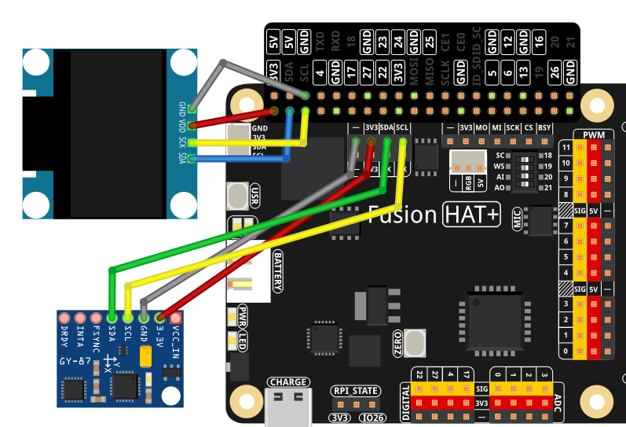

.. _py_gravity_cube:

4.14 Gravity Cube
=========================

**Introduction**

In this lesson, you will build a **gravity-referenced 3D cube** displayed on a 128×64 SSD1306 OLED, driven by an **MPU6050 (GY-87) IMU**.  
The cube tilts according to the board’s orientation relative to gravity, using accelerometer-only roll and pitch.  

Key features:

- Orthographic 3D cube rendering (no perspective distortion)  
- Orientation derived from the accelerometer relative to an initial baseline  
- One cube face is filled to make front-back orientation easy to see  
- Two configuration flags let you flip X/Y directions to match your physical mounting  

As you tilt the board, the cube rotates smoothly, giving an intuitive visualization of device orientation.

----------------------------------------------

**What You’ll Need**

The following components are required for this project:

.. list-table::
    :widths: 30 20
    :header-rows: 1

    *   - COMPONENT INTRODUCTION
        - PURCHASE LINK
    *   - :ref:`cpn_wires`
        - |link_wires_buy|
    *   - :ref:`cpn_gy87`
        - \-
    *   - :ref:`cpn_oled`
        - \-
    *   - :ref:`cpn_fusion_hat`
        - \-
    *   - Raspberry Pi
        - \-

.. ----------------------------------------------

.. **Circuit Diagram**

.. .. image:: img/fzz/4.14_gravity_cube_sch.png
..    :width: 80%
..    :align: center

----------------------------------------------

**Wiring Diagram**

Refer to the wiring diagram for assembling the components:

----------------------------------------------

**Setup Steps**

#. Create and activate a virtual environment for this project:

   .. raw:: html

      <run></run>

   .. code-block:: shell

      cd ~
      python3 -m venv 4.14_gravity_cube_env --system-site-packages
      source 4.14_gravity_cube_env/bin/activate

#. Install the required libraries:

   .. raw:: html

      <run></run>

   .. code-block:: shell

      pip3 install adafruit-circuitpython-ssd1306

#. Run the example from the ``ai-lab-kit`` directory:

   .. raw:: html

      <run></run>

   .. code-block:: shell

      cd ~/ai-lab-kit/python/
      sudo ~/4.14_gravity_cube_env/bin/python3 4.14_GravityCube.py

#. When the script runs:

   * The MPU6050 accelerometer provides gravity-referenced X/Y/Z data.  
   * The code computes roll and pitch relative to an initial baseline (current orientation becomes 0°, 0°).  
   * A wireframe cube with a **filled front face** is drawn on the OLED.  
   * Tilting the board rotates the cube on screen.  
   * Press **Ctrl+C** to exit; the OLED is cleared.

----------------------------------------------

**Code**

Here is the Python script for the gravity-referenced cube:

.. code-block:: python

   #!/usr/bin/env python3
   # -*- coding: utf-8 -*-

   """
   MPU6050(GY87) + SSD1306 OLED
   Gravity-referenced cube with one filled face and user-selectable X/Y flip.
   - Accelerometer-only tilt (roll/pitch) relative to an initial baseline
   - Orthographic projection (no perspective distortion)
   - Front face is filled for orientation feedback
   - Two flags at top let you flip X(Y) directions to match your physical setup
   """

   import time
   import math
   from fusion_hat.modules import MPU6050
   from PIL import Image, ImageDraw, ImageFont
   import adafruit_ssd1306
   import board

   # ========== User-configurable axis flip ==========
   # Flip X/Y to match your physical mounting and perceived motion on the OLED.
   # If motion looks reversed on a given axis, set that axis to True.
   FLIP_X = False   # True = invert roll direction on display; False = normal
   FLIP_Y = False   # True = invert pitch direction on display; False = normal

   # ========== OLED setup ==========
   WIDTH, HEIGHT = 128, 64
   i2c = board.I2C()
   oled = adafruit_ssd1306.SSD1306_I2C(WIDTH, HEIGHT, i2c, addr=0x3C)
   oled.fill(0)
   oled.show()

   # Framebuffer
   image = Image.new("1", (WIDTH, HEIGHT))
   draw = ImageDraw.Draw(image)
   font = ImageFont.load_default()

   # ========== IMU ==========
   mpu = MPU6050()
   # If your driver exposes range setters, you can uncomment:
   # mpu.set_accel_range(MPU6050.ACCEL_RANGE_2G)

   # ========== Cube model ==========
   CUBE_SIZE = 9  # smaller cube for 128x64 OLED

   VERTS = [
      (-1, -1, -1), (+1, -1, -1), (+1, +1, -1), (-1, +1, -1),
      (-1, -1, +1), (+1, -1, +1), (+1, +1, +1), (-1, +1, +1),
   ]
   EDGES = [
      (0,1),(1,2),(2,3),(3,0),
      (4,5),(5,6),(6,7),(7,4),
      (0,4),(1,5),(2,6),(3,7)
   ]
   FRONT_FACE = [4,5,6,7]  # +Z face gets filled

   # ========== Projection (orthographic) ==========
   def project_point(p, scale=CUBE_SIZE, cx=WIDTH//2, cy=HEIGHT//2):
      """
      Orthographic projection. We flip the screen Y here so that positive 3D Y
      appears upward on the OLED (more intuitive for tilt).
      """
      x, y, _z = p
      return int(cx + scale * x), int(cy - scale * y)

   # ========== Math / orientation helpers ==========
   def ema(prev, new, alpha):
      """Exponential smoothing to reduce jitter."""
      return alpha * new + (1.0 - alpha) * prev

   def rotate_point(p, roll, pitch, yaw=0.0):
      """Rotate p=(x,y,z) by Rx(roll)*Ry(pitch)*Rz(yaw). Yaw fixed to 0 for gravity-only."""
      x, y, z = p
      # Rx
      cr, sr = math.cos(roll), math.sin(roll)
      y, z = (y*cr - z*sr), (y*sr + z*cr)
      # Ry
      cp, sp = math.cos(pitch), math.sin(pitch)
      x, z = (x*cp + z*sp), (-x*sp + z*cp)
      # Rz (kept for completeness)
      if yaw:
         cz, sz = math.cos(yaw), math.sin(yaw)
         x, y = (x*cz - y*sz), (x*sz + y*cz)
      return (x, y, z)

   def accel_to_rp(ax, ay, az):
      """
      Convert accelerometer (g) to roll/pitch in radians (gravity-referenced).
      roll  = rotation around X (right-hand rule)
      pitch = rotation around Y
      """
      g = math.sqrt(ax*ax + ay*ay + az*az) + 1e-9
      axn, ayn, azn = ax / g, ay / g, az / g
      roll  = math.atan2(ayn, azn)
      pitch = math.atan2(-axn, math.sqrt(ayn*ayn + azn*azn))
      return roll, pitch

   def draw_cube(roll, pitch, yaw=0.0, annotate=True):
      """Render the cube with one filled face."""
      draw.rectangle((0, 0, WIDTH, HEIGHT), outline=0, fill=0)

      rverts = [rotate_point(v, roll, pitch, yaw) for v in VERTS]
      pts = [project_point(v) for v in rverts]

      # Filled front face
      face_xy = [pts[i] for i in FRONT_FACE]
      draw.polygon(face_xy, outline=255, fill=255)

      # Wireframe edges
      for a, b in EDGES:
         x0, y0 = pts[a]
         x1, y1 = pts[b]
         draw.line((x0, y0, x1, y1), fill=255)

      if annotate:
         rdeg = math.degrees(roll)
         pdeg = math.degrees(pitch)
         draw.text((2, 2), f"R:{rdeg:+.0f}  P:{pdeg:+.0f}", font=font, fill=255)
         # draw.text((2, 12), "Yaw: n/a (gravity only)", font=font, fill=255)

   # ========== Baseline & smoothing ==========
   baseline_set = False
   roll0 = pitch0 = 0.0

   ROLL_EMA  = 0.20
   PITCH_EMA = 0.20
   roll_disp = pitch_disp = 0.0

   try:
      while True:
         # Read accelerometer (in g)
         ax, ay, az = mpu.get_accel_data()

         # Absolute roll/pitch from gravity
         roll_abs, pitch_abs = accel_to_rp(ax, ay, az)

         # First reading defines baseline (0°,0°)
         if not baseline_set:
               roll0, pitch0 = roll_abs, pitch_abs
               baseline_set = True

         # Relative orientation
         roll_rel  = roll_abs  - roll0
         pitch_rel = pitch_abs - pitch0

         # Apply user flips to match perceived direction on OLED
         if FLIP_X:
               roll_rel = -roll_rel
         if FLIP_Y:
               pitch_rel = -pitch_rel

         # Smooth
         roll_disp  = ema(roll_disp,  roll_rel,  ROLL_EMA)
         pitch_disp = ema(pitch_disp, pitch_rel, PITCH_EMA)

         # Render (yaw fixed to 0 in gravity-only mode)
         draw_cube(roll_disp, pitch_disp, yaw=0.0, annotate=True)

         # Show on OLED
         oled.image(image)
         oled.show()

         time.sleep(0.02)

   except KeyboardInterrupt:
      oled.fill(0)
      oled.show()
      print("\nExited.")

----------------------------------------------

**Understanding the Code**

1. **IMU Initialization**

   The script creates an ``MPU6050`` instance from the Fusion HAT module.  
   The accelerometer provides raw X, Y, Z acceleration values in units of g.

2. **Gravity-Referenced Angles**

   ``accel_to_rp()`` converts the accelerometer readings into **roll** and **pitch**:

   - Roll: rotation around the **X** axis  
   - Pitch: rotation around the **Y** axis  

   Only gravity is used, so yaw cannot be determined (and is fixed to 0).

   .. code-block:: python

      def accel_to_rp(ax, ay, az):
         """
         Convert accelerometer (g) to roll/pitch in radians (gravity-referenced).
         roll  = rotation around X (right-hand rule)
         pitch = rotation around Y
         """
         g = math.sqrt(ax*ax + ay*ay + az*az) + 1e-9
         axn, ayn, azn = ax / g, ay / g, az / g
         roll  = math.atan2(ayn, azn)
         pitch = math.atan2(-axn, math.sqrt(ayn*ayn + azn*azn))
         return roll, pitch  

3. **Baseline Orientation**

   On the very first reading:

   - The current ``roll`` and ``pitch`` are stored as baseline (``roll0``, ``pitch0``).  
   - Subsequent orientations are expressed as **relative** angles:

     .. code-block:: python

        roll_rel  = roll_abs  - roll0
        pitch_rel = pitch_abs - pitch0

   This way, the device’s initial position becomes **0°, 0°**.

4. **User-Configurable Axis Flip**

   The two flags ``FLIP_X`` and ``FLIP_Y`` allow you to invert motion on each axis:

   - Set ``FLIP_X = True`` if roll feels reversed on the display  
   - Set ``FLIP_Y = True`` if pitch feels reversed  

   This is helpful if your MPU6050 board is rotated or wired in a different orientation.

5. **Smoothing (EMA)**

   The function ``ema()`` applies **exponential moving average** smoothing:

   - Reduces jitter caused by sensor noise  
   - Makes cube motion look more natural  

   ``ROLL_EMA`` and ``PITCH_EMA`` control how responsive vs. smooth the motion is.

   .. code-block:: python

      def ema(prev, new, alpha):
         """Exponential smoothing to reduce jitter."""
         return alpha * new + (1.0 - alpha) * prev

6. **3D Cube Rotation**

   ``rotate_point()`` applies rotation matrices to each cube vertex:

      .. code-block:: python

         def rotate_point(p, roll, pitch, yaw=0.0):
            """Rotate p=(x,y,z) by Rx(roll)*Ry(pitch)*Rz(yaw). Yaw fixed to 0 for gravity-only."""
            x, y, z = p
            # Rx
            cr, sr = math.cos(roll), math.sin(roll)
            y, z = (y*cr - z*sr), (y*sr + z*cr)
            # Ry
            cp, sp = math.cos(pitch), math.sin(pitch)
            x, z = (x*cp + z*sp), (-x*sp + z*cp)
            # Rz (kept for completeness)
            if yaw:
               cz, sz = math.cos(yaw), math.sin(yaw)
               x, y = (x*cz - y*sz), (x*sz + y*cz)
            return (x, y, z)   

   - ``Rx(roll)`` followed by ``Ry(pitch)`` (yaw kept at 0)  
   - Produces rotated 3D coordinates  

   ``project_point()`` then converts 3D coordinates to 2D OLED positions using **orthographic projection**.

      .. code-block:: python

         def project_point(p, scale=CUBE_SIZE, cx=WIDTH//2, cy=HEIGHT//2):
            """
            Orthographic projection. We flip the screen Y here so that positive 3D Y
            appears upward on the OLED (more intuitive for tilt).
            """
            x, y, _z = p
            return int(cx + scale * x), int(cy - scale * y)

7. **Drawing the Cube**

   ``draw_cube()``:

   - Clears the screen  
   - Rotates and projects all 8 cube vertices  
   - Draws all edges as a wireframe  
   - Fills one face (``FRONT_FACE``) so you can easily see which side is pointing toward you  
   - Optionally shows roll and pitch in degrees at the top left

   .. code-block:: python

      def draw_cube(roll, pitch, yaw=0.0, annotate=True):
         """Render the cube with one filled face."""
         draw.rectangle((0, 0, WIDTH, HEIGHT), outline=0, fill=0)

         rverts = [rotate_point(v, roll, pitch, yaw) for v in VERTS]
         pts = [project_point(v) for v in rverts]

         # Filled front face
         face_xy = [pts[i] for i in FRONT_FACE]
         draw.polygon(face_xy, outline=255, fill=255)

         # Wireframe edges
         for a, b in EDGES:
            x0, y0 = pts[a]
            x1, y1 = pts[b]
            draw.line((x0, y0, x1, y1), fill=255)

         if annotate:
            rdeg = math.degrees(roll)
            pdeg = math.degrees(pitch)
            draw.text((2, 2), f"R:{rdeg:+.0f}  P:{pdeg:+.0f}", font=font, fill=255)
            # draw.text((2, 12), "Yaw: n/a (gravity only)", font=font, fill=255)

----------------------------------------------

**Troubleshooting**

- **Cube does not move**

  - Check GY87 Module wiring (power, GND, SDA, SCL).  
  - Confirm I2C is enabled on Raspberry Pi.  
  - Verify the correct I2C address is used by your MPU6050 driver.

- **Motion looks reversed**

  - Toggle ``FLIP_X`` or ``FLIP_Y`` to invert directions.  
  - Try placing the board flat, then slowly tilt along one axis to identify which flip is needed.

- **Cube is too jittery**

  - Increase smoothing by lowering ``ROLL_EMA`` / ``PITCH_EMA`` (e.g., 0.1).  
  - Make sure the board is mechanically stable and cables are not tugging it.

- **Cube tilts when resting flat**

  - Hold the board steady and restart the script; the initial reading becomes the baseline.  
  - Ensure the board is truly flat when the program starts.

- **OLED shows nothing**

  - Check OLED I2C address (commonly ``0x3C``).  
  - Verify wiring and that the display contrast is adequate.  
  - Confirm that ``adafruit-circuitpython-ssd1306`` is installed.

----------------------------------------------

**Try It Yourself**

1. **Add Yaw from Gyro**

   Combine gyro integration with accelerometer data (a complementary filter) to add a yaw axis
   and allow full 3D cube rotation.

2. **Change Cube Size or Position**

   Adjust ``CUBE_SIZE`` or the projection center to move the cube or make it larger/smaller:

   - Zoom in for a more dramatic effect  
   - Shift it slightly upward to leave more room for text

3. **Add a Wireframe Grid**

   Draw a simple “floor” grid behind the cube to emphasize 3D motion.

4. **Add Auto-Recenter Function**

   Long-press a button (or use a key input) to reset the baseline orientation during runtime.

5. **Multiple Display Modes**

   Toggle between:

   - Wireframe only  
   - Filled face only  
   - Face shading based on tilt angle  

These enhancements turn the simple gravity cube into a rich 3D IMU visualization tool.

