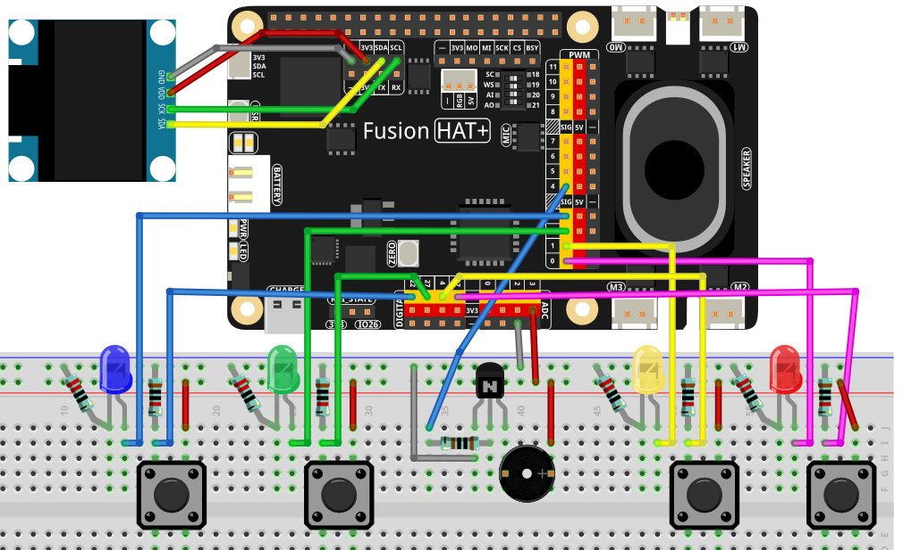

.. include:: /index.rst
   :start-after: start_hello_message
   :end-before: end_hello_message

.. _py_whack_a_mole:

4.15 打地鼠游戏
================

**简介**

在本课程中，您将使用 Fusion HAT+ 构建一个**打地鼠游戏**。
四个 PWM 驱动的 LED 充当"地鼠"，在 1 秒的周期内平滑淡入淡出。
您的目标是在对应的 LED 亮起时按下正确的按钮。蜂鸣器提供声音反馈：

- **正确的洞 → 短促的高音鸣叫**
- **错误的洞 → 游戏结束（低音鸣叫）**

SSD1306 OLED 显示屏在游戏过程中显示您的**当前得分**，并在游戏结束时显示**最终得分**。

本项目结合了 PWM 亮度塑造、按钮边沿检测、定时循环和简单的游戏状态机。

----------------------------------------------

**所需材料**

本项目需要以下组件：

.. list-table::
    :widths: 30 20
    :header-rows: 1

    *   - 组件介绍
        - 购买链接
    *   - :ref:`cpn_wires`
        - |link_wires_buy|
    *   - :ref:`cpn_led`
        - |link_led_buy|
    *   - :ref:`cpn_button`
        - |link_button_buy|
    *   - :ref:`cpn_buzzer`
        - |link_passive_buzzer_buy|
    *   - :ref:`cpn_oled`
        - \-
    *   - :ref:`cpn_fusion_hat`
        - \-
    *   - 树莓派
        - \-

----------------------------------------------

**接线图**

参考接线图组装组件：

----------------------------------------------

**设置步骤**

#. 安装所需库：

   .. raw:: html

      <run></run>

   .. code-block:: shell

      sudo pip3 install adafruit-circuitpython-ssd1306 --break

#. 从 ``ai-lab-kit`` 目录运行游戏：

   .. raw:: html

      <run></run>

   .. code-block:: shell

      cd ~/ai-lab-kit/python/
      sudo python3 4.15_WhackAMole.py

#. 脚本运行时：

   * 一个 LED 淡入淡出（三角波）。
   * 在 1 秒窗口内按下**仅亮起 LED 对应的按钮**：

     - 正确 → 得分增加，下一个地鼠出现
     - 错误 → 蜂鸣器播放错误音 → **游戏结束**
   * OLED 在游戏中仅显示当前得分
   * OLED 在失败时显示"GAME OVER" + 最终得分
   * 按 Ctrl+C 退出

----------------------------------------------

**代码**

以下是打地鼠游戏的完整 Python 脚本：

.. raw:: html

   <run></run>

.. code-block:: python

   #!/usr/bin/env python3
   # -*- coding: utf-8 -*-

   """
   Whack-a-Mole using fusion_hat:
   - 4 PWM LEDs (smooth fade in/out; whole cycle = 1.0s)
   - 4 buttons via fusion_hat.Pin (PULL_DOWN; pressed=1)
   - Buzzer via fusion_hat.Buzzer(PWM(...)) for short feedback tone
   - SSD1306 OLED shows only the current hit count during game
   - If a non-lit button is pressed -> GAME OVER with final score
   """

   import time
   import random
   from typing import List, Optional

   # ---- fusion_hat GPIO / PWM / Buzzer ----
   from fusion_hat.pwm import PWM
   from fusion_hat.pin import Pin, Mode, Pull
   from fusion_hat.modules import Buzzer

   # ---- OLED ----
   from PIL import Image, ImageDraw, ImageFont
   import adafruit_ssd1306
   import board

   # ===================== Port map (EDIT HERE) =====================
   # 4 PWM LED ports of Fusion HAT+
   LED_PORTS = ['P0', 'P1', 'P2', 'P3']

   # 4 button pins (BCM numbering). Example here uses 17/4/27/22.
   # Buttons are configured as PULL_DOWN, so pressed -> value==1
   BTN_PINS = [17, 4, 27, 22]

   # Buzzer on a PWM-capable Fusion HAT+ port
   BUZZER_PORT = 'P4'
   # ===============================================================

   # ===================== OLED setup =====================
   WIDTH, HEIGHT = 128, 64
   i2c = board.I2C()
   oled = adafruit_ssd1306.SSD1306_I2C(WIDTH, HEIGHT, i2c, addr=0x3C)
   oled.fill(0)
   oled.show()
   image = Image.new("1", (WIDTH, HEIGHT))
   draw = ImageDraw.Draw(image)
   font = ImageFont.load_default()

   def draw_score(score: int):
      """Render in-game screen: only the current score."""
      draw.rectangle((0, 0, WIDTH, HEIGHT), outline=0, fill=0)
      msg = f"Score: {score}"
      tw, th = font.getbbox(msg)[2:]
      draw.text(((WIDTH - tw) // 2, (HEIGHT - th) // 2), msg, font=font, fill=255)
      oled.image(image)
      oled.show()

   def draw_game_over(score: int):
      """Render GAME OVER screen with final score."""
      draw.rectangle((0, 0, WIDTH, HEIGHT), outline=0, fill=0)
      title = "GAME OVER"
      tw, th = font.getbbox(title)[2:]
      draw.text(((WIDTH - tw) // 2, 8), title, font=font, fill=255)
      line = f"Score: {score}"
      lw, lh = font.getbbox(line)[2:]
      draw.text(((WIDTH - lw) // 2, 8 + th + 8), line, font=font, fill=255)
      oled.image(image)
      oled.show()

   # ===================== Hardware objects =====================
   # LEDs (PWM)
   leds = [PWM(p) for p in LED_PORTS]

   def led_set(idx: int, duty_pct: float):
      """Set LED brightness (0..100%)."""
      duty = max(0.0, min(100.0, float(duty_pct)))
      leds[idx].pulse_width_percent(duty)

   def all_leds_off():
      for i in range(len(leds)):
         leds[i].pulse_width_percent(0)

   # Buttons (Pin, PULL_DOWN => pressed=1)
   buttons = [Pin(pin, mode=Mode.IN, pull=Pull.DOWN) for pin in BTN_PINS]

   def read_buttons() -> List[int]:
      """Read all buttons; return their current logic levels (0/1)."""
      return [b.value() if callable(getattr(b, "value", None)) else int(b.value) for b in buttons]

   # Buzzer (tonal)
   tb = Buzzer(PWM(BUZZER_PORT))

   def beep_hit():
      """Short bright tone for a correct hit."""
      tb.play('A5', 0.08)  # A5 ~ 880 Hz short chirp
      tb.off()

   def beep_miss():
      """Lower/longer tone for a miss (game over)."""
      tb.play('E4', 0.25)  # E4 ~ 330 Hz
      tb.off()

   # ===================== LED fade (1s total) =====================
   def triangle01(u: float) -> float:
      """
      Triangle wave in [0,1], rising 0->1 over first half, then 1->0.
      u in [0,1].
      """
      return 2*u if u < 0.5 else 2*(1.0 - u)

   def fade_led_with_button_check(active_idx: int,
                                 prev_states: List[int],
                                 duration: float = 1.0,
                                 step: float = 0.01,
                                 gamma: float = 1.8) -> (bool, Optional[List[int]]):
      """
      Fade one LED (active_idx) with triangle brightness over 'duration' seconds.
      While fading, poll buttons at 'step' interval:
         - If matching button pressed (rising edge) -> immediately turn off LED, return (True, new_states).
         - If non-matching button pressed (rising edge) -> game over: return (False, new_states) and let caller handle.
      If no press -> return (None, new_states) to continue game.
      Returns:
         (hit, states)
         hit=True  -> correct hit
         hit=False -> wrong button (game over)
         hit=None  -> no button pressed in this cycle
      """
      t0 = time.monotonic()
      states = prev_states[:]

      while True:
         t = time.monotonic() - t0
         if t > duration:
               break

         # Triangle brightness 0..1 then 1..0
         u = triangle01(t / duration)
         # Gamma correction for perceived linearity
         level = u ** gamma
         duty = 3 + 97 * level   # keep a tiny floor so LED is visible at the start

         led_set(active_idx, duty)

         # Poll buttons and detect rising edges
         curr = read_buttons()
         for i, (p, c) in enumerate(zip(states, curr)):
               if p == 0 and c == 1:  # rising edge = just pressed
                  if i == active_idx:
                     # Correct hit
                     all_leds_off()
                     beep_hit()
                     return True, curr
                  else:
                     # Wrong hole -> game over
                     all_leds_off()
                     beep_miss()
                     return False, curr
         states = curr
         time.sleep(step)

      # Finished fade with no press
      all_leds_off()
      return None, states

   # ===================== Game loop =====================
   def pick_next(prev_idx: Optional[int]) -> int:
      """Pick a random index different from prev_idx."""
      choices = list(range(4))
      if prev_idx in choices:
         choices.remove(prev_idx)
      return random.choice(choices)

   def main():
      random.seed(time.time())
      score = 0
      last_idx = None
      states = read_buttons()  # baseline for edge detection

      draw_score(score)

      while True:
         # Choose which LED lights next
         idx = pick_next(last_idx)
         last_idx = idx

         # Run a 1.0s fade cycle, checking button presses
         hit, states = fade_led_with_button_check(idx, states, duration=1.0, step=0.01, gamma=1.8)

         if hit is False:
               # Wrong button pressed -> Game Over
               draw_game_over(score)
               break
         elif hit is True:
               # Correct hit -> score++
               score += 1
               draw_score(score)
         else:
               # No press during this mole -> no score change; continue
               pass

      # stop all outputs
      all_leds_off()

   if __name__ == "__main__":
      try:
         main()
      except KeyboardInterrupt:
         all_leds_off()
         oled.fill(0)
         oled.show()
         tb.off()
         print("\nExited.")

----------------------------------------------

**理解代码**

1. **LED 淡入淡出动画**

   每个 LED 执行 1 秒的三角波淡入淡出：

   - 亮度从 0% 上升到 100%
   - 然后从 100% 下降到 0%
   - 伽马校正（``u ** gamma``）改善视觉线性度

   .. code-block:: python

      def fade_led_with_button_check(active_idx: int,
                                    prev_states: List[int],
                                    duration: float = 1.0,
                                    step: float = 0.01,
                                    gamma: float = 1.8) -> (bool, Optional[List[int]]):
         ...

2. **按钮边沿检测**

   ``read_buttons()`` 读取所有四个按钮。
   **上升沿**（``previous=0, current=1``）表示"按钮刚刚按下"。

   - 如果按下的按钮匹配亮起的 LED → **正确击中**
   - 否则 → **错误击中 → 游戏结束**

   .. code-block:: python

      def read_buttons() -> List[int]:
         """Read all buttons; return their current logic levels (0/1)."""
         return [b.value() if callable(getattr(b, "value", None)) else int(b.value) for b in buttons]

3. **蜂鸣器反馈**

   - ``A5`` 短促鸣叫 = 成功
   - ``E4`` 较长音调 = 失误 / 游戏结束

   .. code-block:: python

      # Buzzer (tonal)
      tb = Buzzer(PWM(BUZZER_PORT))

      def beep_hit():
         """Short bright tone for a correct hit."""
         tb.play('A5', 0.08)  # A5 ~ 880 Hz short chirp
         tb.off()

      def beep_miss():
         """Lower/longer tone for a miss (game over)."""
         tb.play('E4', 0.25)  # E4 ~ 330 Hz
         tb.off()

4. **游戏循环**

   - 随机选择四个 LED 中的一个（从不连续两次相同）
   - 运行淡入淡出循环，检查按钮按下
   - 更新得分或结束游戏

   .. code-block:: python

      while True:
         # Choose which LED lights next
         idx = pick_next(last_idx)
         last_idx = idx

         # Run a 1.0s fade cycle, checking button presses
         hit, states = fade_led_with_button_check(idx, states, duration=1.0, step=0.01, gamma=1.8)

         ...

5. **OLED 显示**

   - 游戏中仅显示得分
   - 游戏结束时显示 GAME OVER + 最终得分

   .. code-block:: python

      def draw_score(score: int):
         """Render in-game screen: only the current score."""
         draw.rectangle((0, 0, WIDTH, HEIGHT), outline=0, fill=0)
         msg = f"Score: {score}"
         tw, th = font.getbbox(msg)[2:]
         draw.text(((WIDTH - tw) // 2, (HEIGHT - th) // 2), msg, font=font, fill=255)
         oled.image(image)
         oled.show()

         ...

----------------------------------------------

**故障排除**

- **按钮不注册按下**

  - 确保按钮使用 BCM 引脚编号正确接线
  - 确认应用了 ``PULL_DOWN``，使得按下状态 = 1
  - 检查 GND 接线是否正确

- **LED 闪烁而不是平滑淡入淡出**

  - 减小 ``step`` 时间以实现更平滑的更新（例如 0.005）
  - 确保 PWM 端口支持适当的占空比更新

- **游戏立即结束，无需按下任何按钮**

  - 浮空的按钮引脚可能读取为 1
  - 确保下拉电阻正确配置

- **得分不增加**

  - 验证 LED 索引是否与按钮索引匹配
  - 确保 LED 端口和按钮引脚顺序正确

----------------------------------------------

**自己尝试**

1. **变速模式**

   逐渐缩短淡入淡出时长，使游戏更具挑战性。

2. **多 LED 模式**

   同时点亮两个 LED——玩家击中任意一个即可。

3. **生命值系统**

   游戏结束前允许 3 次失误。

4. **最高分存储**

   将最高分保存到文件，并在启动时显示。

5. **动画标题画面**

   在游戏开始前添加启动画面。

这些想法可以将打地鼠变成完整的街机体验！
