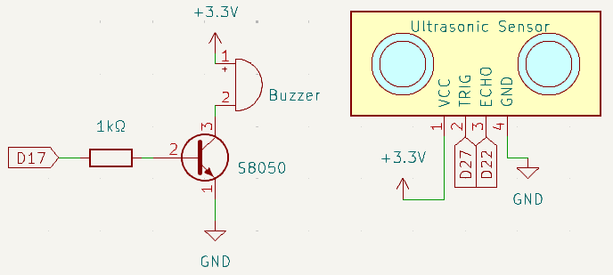
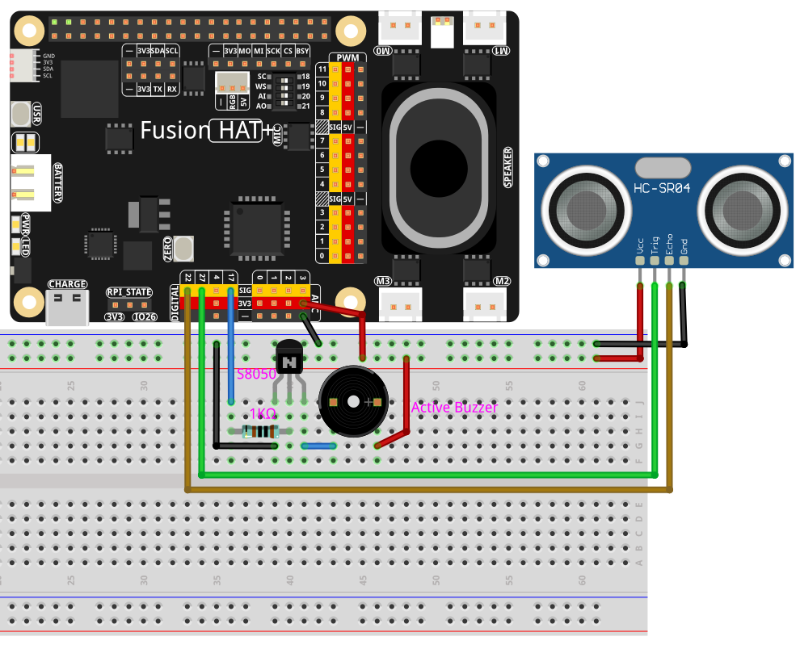

.. include:: /index.rst
   :start-after: start_hello_message
   :end-before: end_hello_message

.. _py_fun_alarm:

4.3 Rückfahrwarnsystem
==============================

**Einführung**

Das sichere Einparken eines Autos in eine Garage erfordert besonders auf engem Raum eine präzise Orientierung. In diesem Projekt erstellen Sie ein Rückfahrwarnsystem mit einem Ultraschallsensor und einem Summer. Dieses System ahmt die Funktionsweise eines echten Einparksensors nach und gibt akustisches Feedback über den Abstand zu Hindernissen.

----------------------------------------------

**Was Sie benötigen**

Nachfolgend sind die für dieses Projekt erforderlichen Komponenten aufgeführt:

.. list-table::
    :widths: 30 20
    :header-rows: 1

    *   - KOMPONENTENBESCHREIBUNG
        - KAUFLINK

    *   - :ref:`cpn_breadboard`
        - |link_breadboard_buy|
    *   - :ref:`cpn_wires`
        - |link_wires_buy|
    *   - :ref:`cpn_resistor`
        - |link_resistor_buy|
    *   - :ref:`cpn_buzzer`
        - |link_passive_buzzer_buy|
    *   - :ref:`cpn_transistor`
        - |link_transistor_buy|
    *   - :ref:`cpn_ultrasonic_sensor`
        - |link_ultrasonic_buy|
    *   - :ref:`cpn_fusion_hat`
        - \- 
    *   - Raspberry Pi
        - \-

----------------------------------------------

**Schaltplan**

Das System verwendet einen Ultraschallsensor, um den Abstand zu Hindernissen zu messen. Der Summer gibt je nach Abstand Warntöne mit unterschiedlicher Frequenz aus.

----------------------------------------------

**Verdrahtungsdiagramm**

Folgen Sie diesem Verdrahtungsdiagramm, um Ihr System aufzubauen:

----------------------------------------------

**Beispiel ausführen**

Der gesamte in diesem Tutorial verwendete Beispielcode befindet sich im Verzeichnis ``ai-lab-kit``. 
Führen Sie die folgenden Schritte aus, um das Beispiel auszuführen:

.. raw:: html

   <run></run>

.. code-block:: shell
   
   cd ~/ai-lab-kit/python/
   sudo python3 4.3_ReversingAlarm.py

Dieses Python-Skript kombiniert einen Ultraschall-Distanzsensor mit einem Summer, um ein Echtzeit-System zur Abstandüberwachung zu erstellen. Bei der Ausführung:

1. **Abstandsmessung**: Der Ultraschallsensor misst den Abstand zum nächstgelegenen Objekt vor ihm und rechnet den Wert in Zentimeter um.

2. **Summerwarnungen**: Basierend auf dem gemessenen Abstand:

     - **Mehr als 50 cm**: Kein Summerton.
     - **Zwischen 20 cm und 50 cm**: Der Summer piept zweimal mit kurzem Intervall.
     - **20 cm oder weniger**: Der Summer gibt schnelle Pieptöne aus, um die Nähe eines Hindernisses anzuzeigen.

----------------------------------------------

**Code**

Hier ist der Python-Code für dieses Projekt:

.. raw:: html

   <run></run>

.. code-block:: python

    #!/usr/bin/env python3

    import time
    from fusion_hat.modules import Ultrasonic, Buzzer
    from fusion_hat.pin import Pin

    # Ultrasonic sensor: Trig -> GPIO 27, Echo -> GPIO 22
    sensor = Ultrasonic(trig=Pin(27), echo=Pin(22))

    # Buzzer connected to GPIO 17
    buzzer = Buzzer(Pin(17))

    def get_distance():
        """
        Read distance from ultrasonic sensor and print it.
        Returns distance in centimeters.
        """
        dis = sensor.read()
        print(f"Distance: {dis:.2f} cm")
        return dis

    def beep(times, on_time, off_time):
        """
        Make the buzzer beep with given timing.
        """
        for _ in range(times):
            buzzer.on()
            time.sleep(on_time)
            buzzer.off()
            time.sleep(off_time)

    def loop():
        """
        Continuously measure distance and control buzzer frequency.
        """
        while True:
            dis = get_distance()

            if dis >= 50:
                # Far distance: buzzer silent
                time.sleep(0.5)

            elif 20 < dis < 50:
                # Medium distance: slow beeping
                beep(times=2, on_time=0.05, off_time=0.2)

            else:
                # Close distance (<= 20 cm): fast beeping
                beep(times=5, on_time=0.05, off_time=0.05)

            time.sleep(0.3)  # Measurement interval

    try:
        loop()
    except KeyboardInterrupt:
        buzzer.off()
        print("\nProgram stopped, buzzer turned off.")

----------------------------------------------

**Code verstehen**

1. **Abstandsmessung:** Der Ultraschallsensor berechnet den Abstand.

   .. code-block:: python

        def get_distance():
            """
            Read distance from ultrasonic sensor and print it.
            Returns distance in centimeters.
            """
            dis = sensor.read()
            print(f"Distance: {dis:.2f} cm")
            return dis

2. **Akustische Warnungen:** Die Frequenz des Summers ändert sich abhängig von der Entfernung zum Hindernis:

   * **>50 cm:** Kein Ton.
   * **20–50 cm:** Zwei Pieptöne mit mittlerem Abstand.
   * **≤20 cm:** Schnelle Pieptöne als dringende Warnung.

   .. code-block:: python

        def loop():
            while True:
                dis = get_distance()

                if dis >= 50:
                    # Far distance: buzzer silent
                    time.sleep(0.5)

                elif 20 < dis < 50:
                    # Medium distance: slow beeping
                    beep(times=2, on_time=0.05, off_time=0.2)

                else:
                    # Close distance (<= 20 cm): fast beeping
                    beep(times=5, on_time=0.05, off_time=0.05)

                time.sleep(0.3)  # Measurement interval

----------------------------------------------

**Fehlerbehebung**

1. **Abstand wird nicht gemessen**:

   - **Ursache**: Falsche Verdrahtung oder ein defekter Sensor.
   - **Lösung**:

     - Stellen Sie sicher, dass die ``echo``- und ``trigger``-Pins des Ultraschallsensors mit GPIO 22 bzw. GPIO 27 verbunden sind.
     - Testen Sie den Sensor separat, um sicherzustellen, dass er ordnungsgemäß funktioniert.

2. **Summer gibt keinen Ton aus**:

   - **Ursache**: Der Summer ist nicht angeschlossen oder defekt.
   - **Lösung**:

     - Überprüfen Sie, ob der Summer mit GPIO 17 und GND verbunden ist.
     - Testen Sie den Summer manuell:

       .. code-block:: python

           buzzer.on()
           time.sleep(1)
           buzzer.off()

----------------------------------------------

**Erweiterungsideen**

1. **Anpassbare Warnschwellen**: Ermöglichen Sie es dem Benutzer, eigene Abstandsschwellen für die Summerwarnungen festzulegen.

2. **Datenprotokollierung**: Speichern Sie Abstandsmessungen in einer Datei zur späteren Analyse:

   .. code-block:: python

      with open("distance_log.txt", "a") as log_file:
            log_file.write(f"{time.time():.3f}, {dis:.2f} cm\n")

3. **Visuelle Warnanzeigen**: Verwenden Sie LEDs in verschiedenen Farben, um Entfernungsstufen anzuzeigen (z. B. Grün = sicher, Gelb = Vorsicht, Rot = Gefahr).

----------------------------------------------

**Fazit**

Dieses Projekt zeigt eine praktische Anwendung von Ultraschallsensoren, bei der akustisches Feedback für ein intuitives Rückfahrwarnsystem genutzt wird. Solche Systeme sind sowohl in Fahrzeugen als auch in der Robotik nützlich und bieten einen guten Einstieg in Abstandserkennung und IoT-Integration. Sie können die Funktionalität weiter ausbauen und an Ihre eigenen Ideen anpassen!
