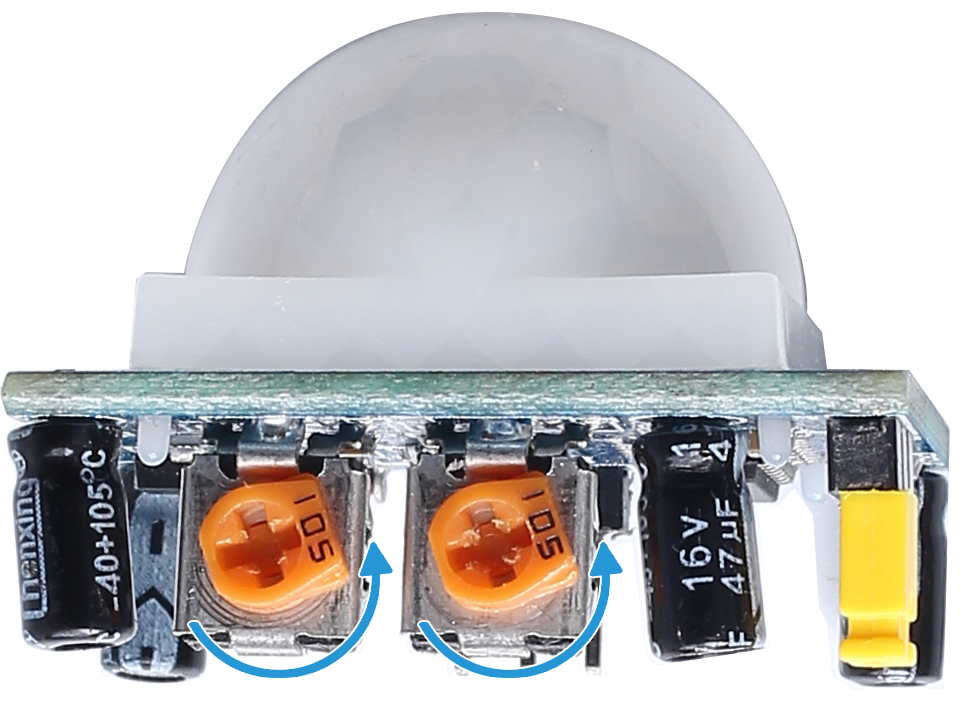

.. include:: /index.rst
   :start-after: start_hello_message
   :end-before: end_hello_message

.. _py_fun_welcome:

4.5 Willkommen
==============================

**Einführung**

Haben Sie schon einmal automatische Türen in einem Geschäft bemerkt, die sich mit einem Willkommenssignal öffnen, wenn sich jemand nähert? Dieses Projekt bildet diese Funktion im kleineren Maßstab nach. Mit einem PIR-Sensor, einem Servomotor, einer LED und einem Summer erstellen Sie ein Mini-„Automatiktür“-System. Wenn eine Bewegung erkannt wird, schaltet das System eine LED ein, „öffnet“ die Tür mit einem Servo und spielt einen Willkommensklang über den Summer ab.

----------------------------------------------

**Was Sie benötigen**

Nachfolgend sind die für dieses Projekt erforderlichen Komponenten aufgeführt:

.. list-table::
    :widths: 30 20
    :header-rows: 1

    *   - KOMPONENTENBESCHREIBUNG
        - KAUFLINK

    *   - :ref:`cpn_breadboard`
        - |link_breadboard_buy|
    *   - :ref:`cpn_wires`
        - |link_wires_buy|
    *   - :ref:`cpn_resistor`
        - |link_resistor_buy|
    *   - :ref:`cpn_pir`
        - |link_pir_buy|
    *   - :ref:`cpn_servo`
        - |link_servo_buy|
    *   - :ref:`cpn_buzzer`
        - |link_passive_buzzer_buy|
    *   - :ref:`cpn_transistor`
        - |link_transistor_buy|
    *   - :ref:`cpn_fusion_hat`
        - \- 
    *   - Raspberry Pi
        - \-

----------------------------------------------

**Schaltplan**

Nachfolgend ist der Schaltplan für dieses Projekt dargestellt:

.. image:: img/fzz/4.1.5_sch.png
   :width: 100%
   :align: center

----------------------------------------------

**Verdrahtungsdiagramm**

Folgen Sie diesem Verdrahtungsdiagramm, um die Schaltung aufzubauen:

.. image:: img/fzz/4.1.5_bb.png
   :width: 100%
   :align: center

.. note::

   Stellen Sie die Potentiometer auf dem PIR-Sensormodul ein, um Empfindlichkeit und Erkennungsreichweite zu optimieren. Drehen Sie beide Potentiometer vollständig gegen den Uhrzeigersinn, um die beste Leistung zu erzielen.

----------------------------------------------

**Beispiel ausführen**

Der gesamte in diesem Tutorial verwendete Beispielcode befindet sich im Verzeichnis ``ai-lab-kit``. 
Führen Sie die folgenden Schritte aus, um das Beispiel auszuführen:

.. raw:: html

   <run></run>

.. code-block:: shell
   
   cd ~/ai-lab-kit/python/
   sudo python3 4.5_Welcome.py

----------------------------------------------

**Code**

Nachfolgend ist das Python-Skript für dieses Projekt aufgeführt:

.. raw:: html

   <run></run>

.. code-block:: python

   from fusion_hat.pin import Pin, Mode, Pull
   from fusion_hat.servo import Servo 
   from fusion_hat.modules import Buzzer
   from fusion_hat.pwm import PWM
   import time

   # GPIO pin setup
   ledPin = Pin(17, Pin.OUT)

   # Initialize a PIR Module object on GPIO pin 17
   pirPin = Pin(22, mode=Mode.IN, pull=Pull.DOWN)

   buzPin = Buzzer(PWM('P0'))

   # Initialize servo with custom pulse widths
   servoPin = Servo('P4')

   # Musical tune for buzzer, with notes and durations
   tune = [('C#4', 0.2), ('D4', 0.2), (None, 0.2),
         ('Eb4', 0.2), ('E4', 0.2), (None, 0.6),
         ('F#4', 0.2), ('G4', 0.2), (None, 0.6),
         ('Eb4', 0.2), ('E4', 0.2), (None, 0.2),
         ('F#4', 0.2), ('G4', 0.2), (None, 0.2),
         ('C4', 0.2), ('B4', 0.2), (None, 0.2),
         ('F#4', 0.2), ('G4', 0.2), (None, 0.2),
         ('B4', 0.2), ('Bb4', 0.5), (None, 0.6),
         ('A4', 0.2), ('G4', 0.2), ('E4', 0.2),
         ('D4', 0.2), ('E4', 0.2)]

   def setAngle(angle):
      """
      Move the servo to a specified angle.
      :param angle: Angle in degrees (0-180).
      """
      servoPin.angle(angle)       # Set servo position
      time.sleep(0.001)           # Short delay for servo movement

   def doorbell():
      """
      Play a musical tune using the buzzer.
      """
      for note, duration in tune:
         buzPin.play(note,float(duration))       # Play the note
      buzPin.off()               # Stop buzzer after playing the tune

   def closedoor():
      # Turn off LED and move servo to close door
      ledPin.off()
      for i in range(180, -1, -1):
         setAngle(i)             # Move servo from 180 to 0 degrees
         time.sleep(0.001)       # Short delay for smooth movement
      time.sleep(1)               # Wait after closing door

   def opendoor():
      # Turn on LED, open door (move servo), play tune, close door
      ledPin.on()
      for i in range(0, 181):
         setAngle(i)             # Move servo from 0 to 180 degrees
         time.sleep(0.001)       # Short delay for smooth movement
      time.sleep(1)               # Wait before playing the tune
      doorbell()                  # Play the doorbell tune
      closedoor()                 # Close the door after the tune

   def loop():
      # Main loop to check for motion and operate door
      while True:
         if pirPin.value()==1:
               opendoor()               # Open door if motion detected
         time.sleep(0.1)              # Short delay in loop

   try:
      loop()
   except KeyboardInterrupt:
      # Clean up GPIO on user interrupt (e.g., Ctrl+C)
      buzPin.off()
      ledPin.off()

Dieses Python-Skript kombiniert einen PIR-Bewegungssensor, einen Servomotor, eine LED und einen Summer, um ein automatisches Willkommenssystem zu erstellen. Bei der Ausführung:

1. **Bewegungserkennung**: Ein PIR-Bewegungssensor, der mit GPIO-Pin 22 verbunden ist, erkennt Bewegungen.

2. **Türsteuerung**: Wenn eine Bewegung erkannt wird:

     - Der Servomotor (an PWM 4) öffnet die Tür, indem er sich von 0° auf 180° bewegt.
     - Die LED (an GPIO-Pin 17) wird eingeschaltet.
     - Ein Willkommenssignal wird über den Summer (an PWM 0) abgespielt.
     - Der Servomotor schließt die Tür wieder, indem er sich von 180° zurück auf 0° bewegt.
     - Die LED wird ausgeschaltet.

3. **Kontinuierliche Überwachung**: Das System überwacht kontinuierlich Bewegungen und löst die oben beschriebene Sequenz jedes Mal aus, wenn eine Bewegung erkannt wird.

4. **Sauberes Beenden**: Bei ``Ctrl+C`` werden Summer und LED ausgeschaltet, und das Skript wird ordnungsgemäß beendet.

----------------------------------------------

**Code verstehen**

1. **Bewegungserkennung:** Der PIR-Sensor erkennt Bewegungen und aktiviert das System.

2. **Servosteuerung:** Der Servomotor öffnet und schließt die Tür mithilfe von Winkeln zwischen 0° und 180°.

3. **Summerton (Melodie):** Eine Willkommensmelodie wird mithilfe des ``Buzzer`` abgespielt.

4. **Zurücksetzen:** Nach dem Abspielen der Melodie schließt das System die Tür und schaltet die LED aus, sodass es für das nächste Ereignis bereit ist.

----------------------------------------------

**Fehlerbehebung**

1. **Bewegung wird nicht erkannt**:

   - **Ursache**: Der PIR-Sensor ist falsch angeschlossen oder wird durch Umgebungsbedingungen gestört.
   - **Lösung**:

     - Stellen Sie sicher, dass der PIR-Sensor mit GPIO-Pin 22, der Stromversorgung und der Masse verbunden ist.
     - Passen Sie gegebenenfalls die Empfindlichkeits- und Verzögerungspotentiometer des Sensors an.

2. **Servo bewegt sich nicht**:

   - **Ursache**: Falsche Servokonfiguration oder Probleme mit der Stromversorgung.
   - **Lösung**:

     - Überprüfen Sie, ob der Servo korrekt mit P4 verbunden und ausreichend mit Strom versorgt ist.

3. **Willkommenssignal wird nicht abgespielt**:

   - **Ursache**: Falsche Konfiguration des Summers oder ein ungültiges Melodieformat.
   - **Lösung**:

     - Stellen Sie sicher, dass der Summer mit P0 verbunden ist.
     - Überprüfen Sie, ob die Liste ``tune`` gültige Noten-Dauer-Paare enthält.

4. **LED leuchtet nicht**:

   - **Ursache**: Fehlerhafte Verdrahtung der LED oder falsche GPIO-Konfiguration.
   - **Lösung**: Überprüfen Sie, ob die LED mit GPIO-Pin 17 über einen geeigneten Widerstand verbunden ist.

----------------------------------------------

**Erweiterungsideen**

1. **Anpassbare Melodien**: Fügen Sie weitere Melodien hinzu oder ermöglichen Sie dem Benutzer, unterschiedliche Signaltöne für verschiedene Ereignisse auszuwählen.

2. **Zeitgesteuerter Betrieb**: Deaktivieren Sie das System zu bestimmten Zeiten (z. B. nachts):

     .. code-block:: python

         from datetime import datetime
         if 8 <= datetime.now().hour < 22:  # Operate only between 8 AM and 10 PM
             opendoor()

3. **Datenprotokollierung**: Protokollieren Sie erkannte Bewegungen mit Zeitstempel in einer Datei zur späteren Analyse:

     .. code-block:: python

         with open("motion_log.txt", "a") as log_file:
             log_file.write(f"{time.strftime('%Y-%m-%d %H:%M:%S')} - Motion detected\n")

4. **Sprachbegrüßung**: Ersetzen Sie den Summerton durch eine voraufgezeichnete Sprachbegrüßung über einen Lautsprecher.

----------------------------------------------

**Fazit**

Dieses Projekt bildet die Funktion automatischer Türen auf eine unterhaltsame und lehrreiche Weise nach. Dabei werden Konzepte wie Bewegungserkennung, Servosteuerung und Tonerzeugung vermittelt – ein idealer Einstieg in IoT- und Automatisierungsprojekte. Sie können das Projekt weiter ausbauen, beispielsweise durch Fernbenachrichtigungen oder Cloud-Integration zur Echtzeitüberwachung.
